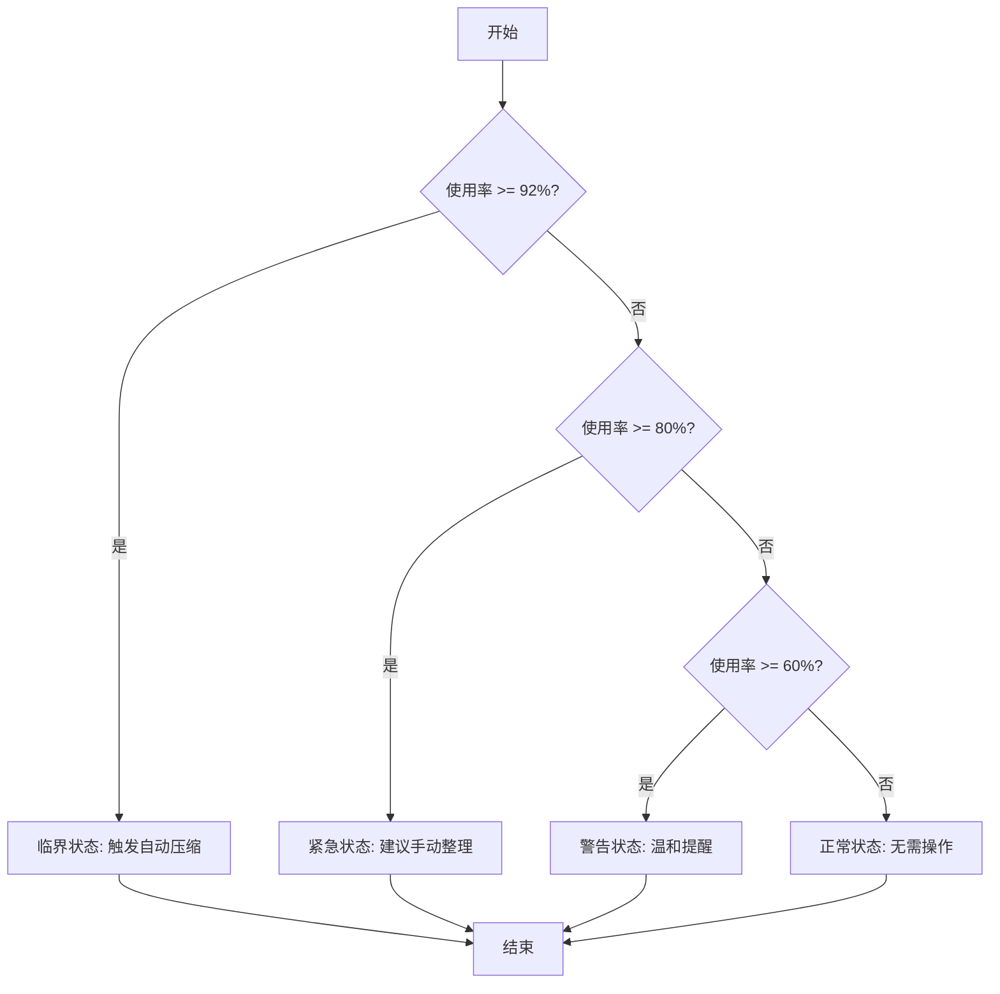
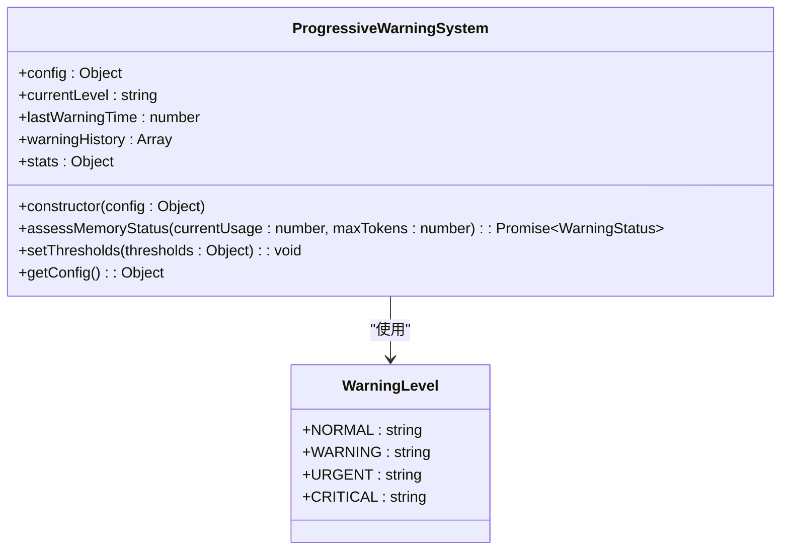
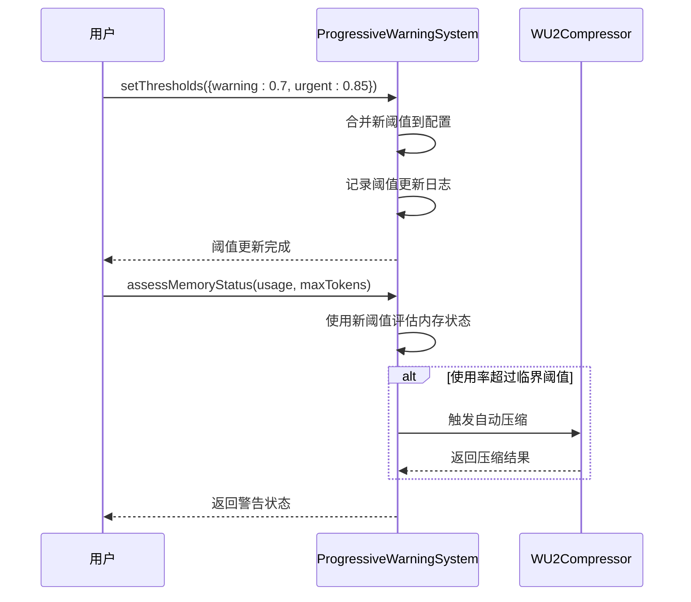
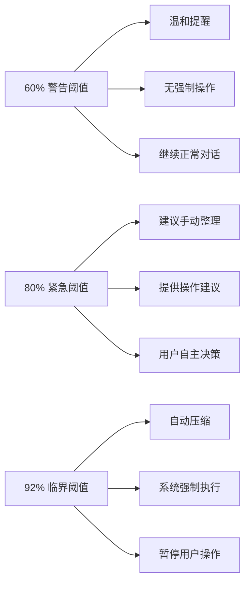

# 阈值管理

<cite>
**Referenced Files in This Document**   
- [ProgressiveWarningSystem.js](file://context-claude-code/src/warning/ProgressiveWarningSystem.js)
- [index.js](file://context-claude-code/src/types/index.js)
- [WU2Compressor.js](file://context-claude-code/src/claude-core/WU2Compressor.js)
</cite>

## 目录
1. [引言](#引言)
2. [核心阈值机制](#核心阈值机制)
3. [阈值配置与初始化](#阈值配置与初始化)
4. [动态阈值调整](#动态阈值调整)
5. [系统行为差异分析](#系统行为差异分析)
6. [应用场景与性能影响](#应用场景与性能影响)
7. [结论](#结论)

## 引言

渐进式警告系统是上下文管理的核心组件，通过三级预警机制实现对记忆空间使用的智能监控和管理。该系统基于三个关键阈值：60%的_WARNING_阈值（_W5函数）作为温和提醒，80%的紧急阈值（jW5函数）建议手动整理，92%的临界阈值（h11函数）触发自动压缩。这种分层预警机制确保了系统在不同使用阶段都能提供恰当的用户提示和操作建议，既避免了过早干预影响用户体验，又防止了内存溢出导致的系统崩溃。本文档将深入解析这一阈值管理机制的实现原理、配置方法和实际应用。

## 核心阈值机制

渐进式警告系统实现了精确的三级预警机制，每个阈值对应不同的系统行为和用户提示。系统通过`assessMemoryStatus`方法评估当前内存状态并生成相应警告，该方法根据当前使用率与预设阈值的比较结果，确定警告级别和相应操作。

**Diagram sources**
- [ProgressiveWarningSystem.js](file://context-claude-code/src/warning/ProgressiveWarningSystem.js#L55-L147)

**Section sources**
- [ProgressiveWarningSystem.js](file://context-claude-code/src/warning/ProgressiveWarningSystem.js#L11-L480)

## 阈值配置与初始化

系统的阈值配置在`ProgressiveWarningSystem`类的构造函数中完成，通过`config`对象进行初始化。默认阈值设置为：正常状态0.0、警告阈值0.6（60%）、紧急阈值0.8（80%）和临界阈值0.92（92%）。这些阈值在系统启动时被加载，并作为后续内存状态评估的基础。

**Diagram sources**
- [ProgressiveWarningSystem.js](file://context-claude-code/src/warning/ProgressiveWarningSystem.js#L11-L480)
- [index.js](file://context-claude-code/src/types/index.js#L29-L34)

**Section sources**
- [ProgressiveWarningSystem.js](file://context-claude-code/src/warning/ProgressiveWarningSystem.js#L11-L480)

## 动态阈值调整

系统提供了`setThresholds`方法，允许在运行时动态调整阈值配置。该方法接收一个包含新阈值的对象作为参数，并将其与现有配置进行合并。这种灵活性使得系统能够根据不同应用场景的需求进行个性化配置，例如在处理大型项目时可以适当提高阈值以减少警告频率，或在资源受限环境中降低阈值以更早进行内存管理。

**Diagram sources**
- [ProgressiveWarningSystem.js](file://context-claude-code/src/warning/ProgressiveWarningSystem.js#L426-L429)
- [WU2Compressor.js](file://context-claude-code/src/claude-core/WU2Compressor.js#L67-L91)

**Section sources**
- [ProgressiveWarningSystem.js](file://context-claude-code/src/warning/ProgressiveWarningSystem.js#L426-L429)

## 系统行为差异分析

不同阈值触发后，系统表现出明显的行为差异。当达到60%的_WARNING_阈值时，系统仅提供温和提醒，不影响正常操作；当达到80%的紧急阈值时，系统建议用户手动整理记忆空间；而当达到92%的临界阈值时，系统将自动触发压缩机制，确保系统稳定运行。这些差异化的响应策略通过`action`字段在警告状态对象中体现，分别为`gentle_reminder`、`suggest_manual_compress`和`auto_compress`。

**Diagram sources**
- [ProgressiveWarningSystem.js](file://context-claude-code/src/warning/ProgressiveWarningSystem.js#L55-L147)

**Section sources**
- [ProgressiveWarningSystem.js](file://context-claude-code/src/warning/ProgressiveWarningSystem.js#L55-L147)

## 应用场景与性能影响

阈值管理机制在实际应用中展现出显著的性能优势和用户体验提升。通过合理配置阈值，系统能够在保证稳定性的同时最大化资源利用率。在高负载场景下，适当的阈值设置可以减少不必要的压缩操作，提高系统响应速度；而在低负载场景下，较低的阈值可以更早发现潜在问题，防止小问题演变为系统故障。此外，动态调整阈值的能力使得系统能够适应不同的工作负载模式，实现性能和稳定性的最佳平衡。

**Section sources**
- [ProgressiveWarningSystem.js](file://context-claude-code/src/warning/ProgressiveWarningSystem.js#L11-L480)

## 结论

渐进式警告系统的阈值管理机制通过科学的三级预警设计，实现了对记忆空间使用的智能监控和管理。该机制不仅提供了灵活的配置选项，还通过差异化的响应策略确保了系统在不同使用阶段都能提供恰当的用户提示和操作建议。未来可以通过引入机器学习算法，根据用户行为模式自动优化阈值设置，进一步提升系统的智能化水平和用户体验。

**Section sources**
- [ProgressiveWarningSystem.js](file://context-claude-code/src/warning/ProgressiveWarningSystem.js#L11-L480)