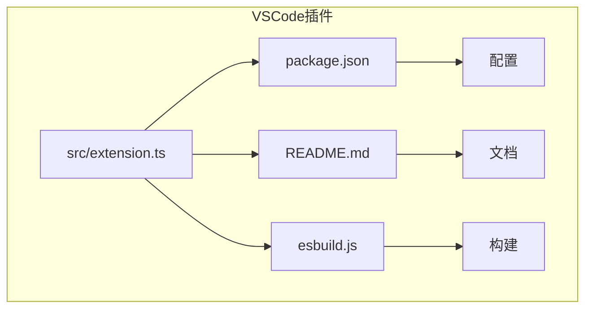
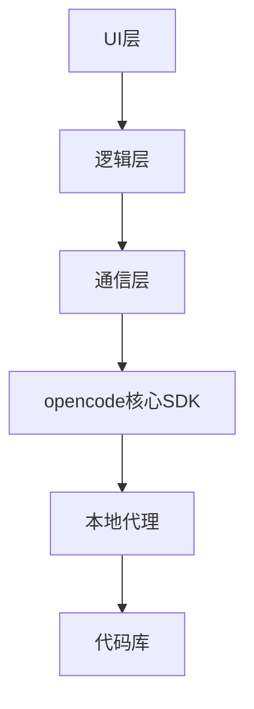
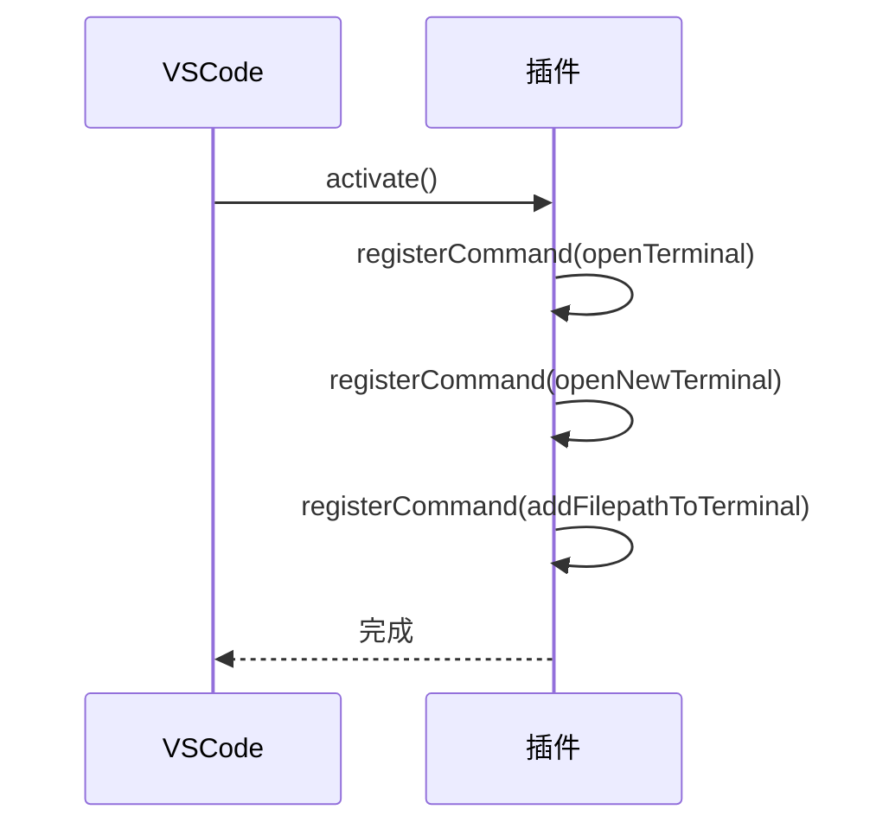
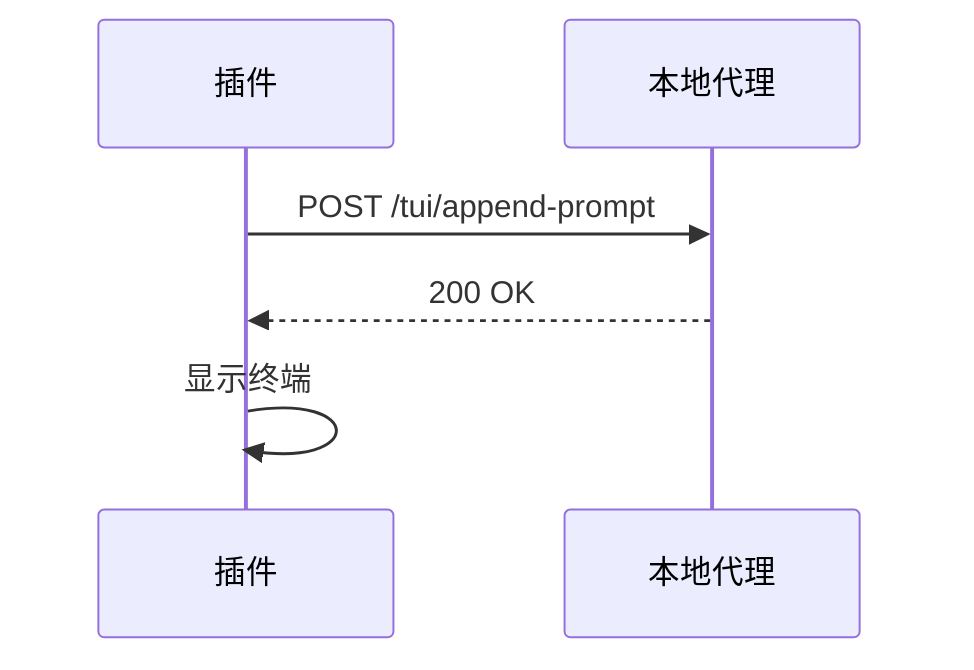
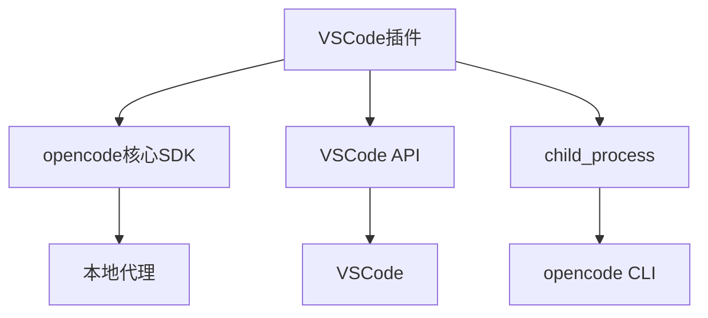

# IDE插件开发

<cite>
**Referenced Files in This Document**   
- [extension.ts](file://sdks/vscode/src/extension.ts)
- [package.json](file://sdks/vscode/package.json)
- [README.md](file://sdks/vscode/README.md)
- [client.ts](file://packages/sdk/js/src/client.ts)
- [server.ts](file://packages/sdk/js/src/server.ts)
- [index.ts](file://packages/sdk/js/src/index.ts)
</cite>

## 目录
1. [简介](#简介)
2. [项目结构](#项目结构)
3. [核心组件](#核心组件)
4. [架构概述](#架构概述)
5. [详细组件分析](#详细组件分析)
6. [依赖分析](#依赖分析)
7. [性能考虑](#性能考虑)
8. [故障排除指南](#故障排除指南)
9. [结论](#结论)

## 简介
本文档旨在为开发者提供全面的IDE插件开发指导，重点介绍VSCode插件的构建方法。文档详细说明了如何使用extension.ts入口文件初始化插件、注册命令和事件监听器，以及如何调用opencode核心SDK与本地代理通信，实现代码补全、对话交互和上下文同步功能。同时，文档还提供了插件配置、资源管理、调试技巧和发布流程的完整说明，并概述了通用插件架构，支持开发者将opencode功能嵌入其他编辑器或IDE，确保跨平台兼容性和用户体验一致性。

## 项目结构
VSCode插件项目位于`sdks/vscode`目录下，采用标准的TypeScript项目结构。项目包含源代码、配置文件和资源文件，通过esbuild进行构建。插件的核心逻辑在`src/extension.ts`文件中实现，而配置信息则在`package.json`中定义。项目还包含README.md文件，提供了开发和使用指南。

**Diagram sources**
- [extension.ts](file://sdks/vscode/src/extension.ts)
- [package.json](file://sdks/vscode/package.json)
- [README.md](file://sdks/vscode/README.md)
- [esbuild.js](file://sdks/vscode/esbuild.js)

**Section sources**
- [extension.ts](file://sdks/vscode/src/extension.ts)
- [package.json](file://sdks/vscode/package.json)
- [README.md](file://sdks/vscode/README.md)

## 核心组件
VSCode插件的核心组件包括插件激活函数、命令注册、终端管理以及与opencode核心SDK的通信机制。插件通过`activate`函数初始化，注册多个命令来控制终端的打开和文件路径的添加。插件还实现了与本地代理的通信，通过HTTP请求发送和接收数据，实现上下文同步和代码补全功能。

**Section sources**
- [extension.ts](file://sdks/vscode/src/extension.ts)
- [client.ts](file://packages/sdk/js/src/client.ts)
- [server.ts](file://packages/sdk/js/src/server.ts)

## 架构概述
VSCode插件的架构分为三层：UI层、逻辑层和通信层。UI层负责用户界面的展示和交互，逻辑层处理业务逻辑和状态管理，通信层负责与opencode核心SDK的通信。插件通过注册命令和事件监听器来响应用户操作，通过HTTP请求与本地代理通信，实现代码补全、对话交互和上下文同步功能。

**Diagram sources**
- [extension.ts](file://sdks/vscode/src/extension.ts)
- [client.ts](file://packages/sdk/js/src/client.ts)
- [server.ts](file://packages/sdk/js/src/server.ts)

## 详细组件分析

### 插件激活与命令注册
插件的激活函数`activate`在插件启动时被调用，负责注册命令和初始化状态。插件注册了三个主要命令：`opencode.openTerminal`用于打开终端，`opencode.openNewTerminal`用于在新标签页中打开终端，`opencode.addFilepathToTerminal`用于将当前文件路径添加到终端。这些命令通过`vscode.commands.registerCommand`方法注册，并在插件停用时通过`context.subscriptions`自动注销。

**Diagram sources**
- [extension.ts](file://sdks/vscode/src/extension.ts#L7-L126)

### 终端管理
插件通过`vscode.window.createTerminal`方法创建新的终端实例，并设置终端的名称、图标和位置。终端创建时会生成一个随机端口，并通过环境变量传递给opencode CLI。插件还实现了终端的焦点管理和连接状态检测，确保用户操作的流畅性。

**Section sources**
- [extension.ts](file://sdks/vscode/src/extension.ts#L7-L126)

### 与opencode核心SDK通信
插件通过HTTP请求与opencode核心SDK通信，实现上下文同步和代码补全功能。插件使用`fetch`函数发送POST请求到本地代理的特定端点，如`/tui/append-prompt`，以添加提示信息。通信过程中，插件会等待代理的响应，确保操作的可靠性。

**Diagram sources**
- [extension.ts](file://sdks/vscode/src/extension.ts#L7-L126)

## 依赖分析
VSCode插件依赖于opencode核心SDK和VSCode API。核心SDK提供了与本地代理通信的接口，而VSCode API提供了插件开发所需的各种功能，如命令注册、终端管理和文件操作。插件还依赖于Node.js的`child_process`模块来启动opencode CLI。

**Diagram sources**
- [extension.ts](file://sdks/vscode/src/extension.ts)
- [client.ts](file://packages/sdk/js/src/client.ts)
- [server.ts](file://packages/sdk/js/src/server.ts)

## 性能考虑
插件在性能方面做了多项优化。首先，插件使用随机端口避免端口冲突，提高启动速度。其次，插件通过异步操作和超时机制确保与本地代理的通信不会阻塞UI。最后，插件在发送请求前会检查终端的连接状态，避免无效请求。

## 故障排除指南
常见问题包括插件无法启动、终端无法连接和文件路径无法添加。解决方法包括检查opencode CLI是否安装、确保端口未被占用和验证文件路径格式。开发者可以通过查看VSCode的输出面板和插件的日志来诊断问题。

**Section sources**
- [README.md](file://sdks/vscode/README.md)
- [extension.ts](file://sdks/vscode/src/extension.ts)

## 结论
本文档详细介绍了VSCode插件的开发方法，包括插件激活、命令注册、终端管理和与opencode核心SDK的通信。通过遵循本文档的指导，开发者可以快速构建功能完善的IDE插件，提升开发效率和用户体验。未来的工作可以包括支持更多编辑器、优化性能和增强功能。