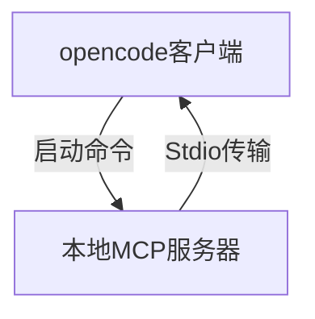
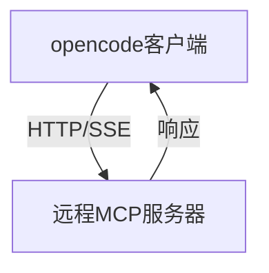
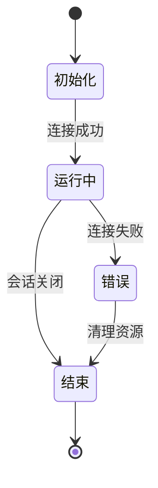
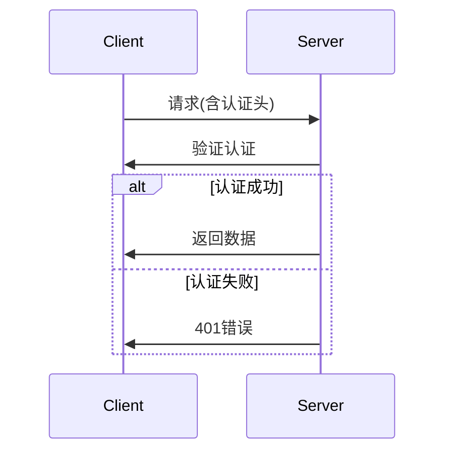
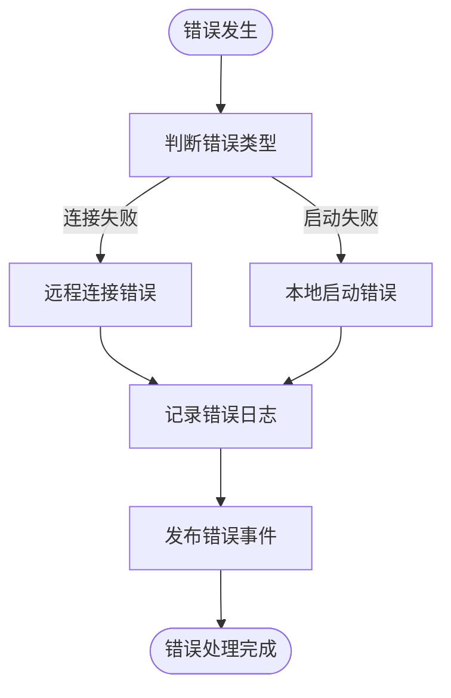
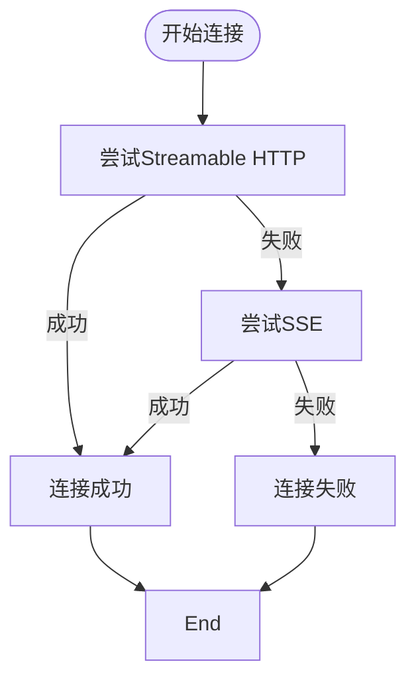
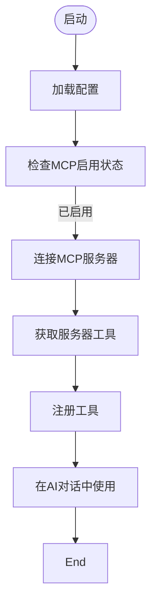
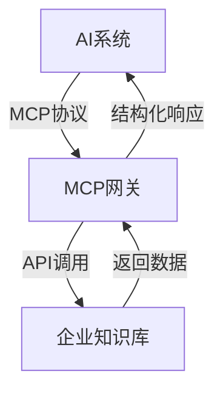
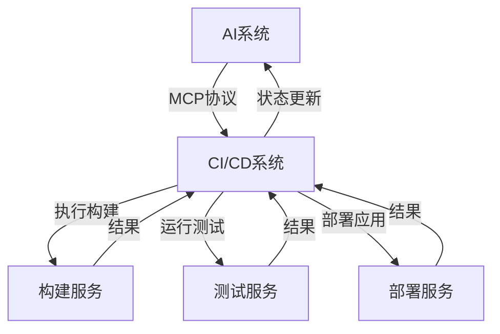
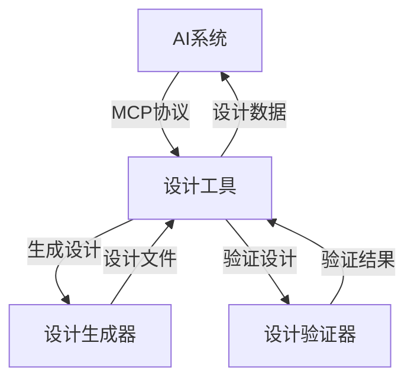

# MCP服务器集成

<cite>
**本文档引用的文件**   
- [index.ts](file://packages/opencode/src/mcp/index.ts)
- [config.ts](file://packages/opencode/src/config/config.ts)
- [mcp.ts](file://packages/opencode/src/cli/cmd/mcp.ts)
- [04-tool-integration.md](file://doc-agent-context/04-tool-integration.md)
- [prompt.ts](file://packages/opencode/src/session/prompt.ts)
- [registry.ts](file://packages/opencode/src/tool/registry.ts)
- [types.gen.ts](file://packages/sdk/js/src/gen/types.gen.ts)
- [config.go](file://packages/sdk/go/config.go)
</cite>

## 目录
1. [简介](#简介)
2. [MCP协议通信机制](#mcp协议通信机制)
3. [消息格式与JSON-RPC](#消息格式与json-rpc)
4. [会话管理](#会话管理)
5. [认证方式](#认证方式)
6. [错误码体系](#错误码体系)
7. [服务发现与连接配置](#服务发现与连接配置)
8. [超时处理](#超时处理)
9. [客户端集成示例](#客户端集成示例)
10. [常见集成场景](#常见集成场景)
11. [最佳实践](#最佳实践)

## 简介
MCP（Model Context Protocol）服务器集成指南旨在说明如何构建符合MCP规范的外部服务器，暴露标准API端点以提供上下文或执行操作。本指南详细描述了协议通信机制、消息格式（JSON-RPC）、会话管理、认证方式及错误码体系。同时提供服务发现、连接配置和超时处理的实现细节，并通过实际代码片段展示opencode如何作为客户端调用MCP服务器，并将返回结果无缝融入AI对话流程。

**Section sources**
- [04-tool-integration.md](file://doc-agent-context/04-tool-integration.md#L1-L50)

## MCP协议通信机制
MCP协议支持本地和远程两种连接方式，通过不同的传输机制实现通信。

### 本地MCP服务器
本地MCP服务器通过标准输入输出（Stdio）进行通信，启动时执行指定命令。



**Diagram sources**
- [index.ts](file://packages/opencode/src/mcp/index.ts#L90-L139)
- [config.ts](file://packages/opencode/src/config/config.ts#L247-L258)

### 远程MCP服务器
远程MCP服务器支持多种传输协议，包括Streamable HTTP和SSE（Server-Sent Events）。



**Diagram sources**
- [index.ts](file://packages/opencode/src/mcp/index.ts#L22-L60)
- [config.ts](file://packages/opencode/src/config/config.ts#L259-L278)

## 消息格式与JSON-RPC
MCP协议基于JSON-RPC 2.0规范，使用标准的请求-响应模式进行通信。

### 请求格式
```json
{
  "jsonrpc": "2.0",
  "method": "tool.call",
  "params": {
    "toolName": "read",
    "args": {
      "filePath": "/path/to/file.txt"
    }
  },
  "id": "123"
}
```

### 响应格式
```json
{
  "jsonrpc": "2.0",
  "result": {
    "content": [
      {
        "type": "text",
        "text": "文件内容..."
      }
    ]
  },
  "id": "123"
}
```

**Section sources**
- [index.ts](file://packages/opencode/src/mcp/index.ts#L22-L155)
- [types.gen.ts](file://packages/sdk/js/src/gen/types.gen.ts#L258-L298)

## 会话管理
MCP客户端通过实例状态管理会话生命周期，确保资源的正确释放。



**Diagram sources**
- [index.ts](file://packages/opencode/src/mcp/index.ts#L22-L155)

## 认证方式
远程MCP服务器支持通过HTTP头进行认证，可在配置中指定认证头信息。



**Diagram sources**
- [config.ts](file://packages/opencode/src/config/config.ts#L270-L278)
- [config.go](file://packages/sdk/go/config.go#L970-L985)

## 错误码体系
MCP协议定义了统一的错误处理机制，通过事件总线发布错误信息。



**Diagram sources**
- [index.ts](file://packages/opencode/src/mcp/index.ts#L59-L88)
- [index.ts](file://packages/opencode/src/mcp/index.ts#L90-L139)

## 服务发现与连接配置
MCP服务器配置通过JSON格式定义，支持本地和远程两种类型。

### 配置示例
```json
{
  "mcp": {
    "my-local-mcp-server": {
      "type": "local",
      "command": ["bun", "x", "my-mcp-command"],
      "enabled": true,
      "environment": {
        "MY_ENV_VAR": "my_env_var_value"
      }
    },
    "my-remote-mcp-server": {
      "type": "remote",
      "url": "https://my-mcp-server.com",
      "enabled": true,
      "headers": {
        "Authorization": "Bearer MY_API_KEY"
      }
    }
  }
}
```

**Section sources**
- [04-tool-integration.md](file://doc-agent-context/04-tool-integration.md#L801-L825)
- [config.ts](file://packages/opencode/src/config/config.ts#L247-L278)

## 超时处理
MCP客户端实现自动重试机制，当一种传输方式失败时会尝试备用传输方式。



**Diagram sources**
- [index.ts](file://packages/opencode/src/mcp/index.ts#L22-L60)

## 客户端集成示例
opencode作为MCP客户端，通过工具注册机制集成MCP服务器功能。

### 工具集成流程


**Diagram sources**
- [index.ts](file://packages/opencode/src/mcp/index.ts#L22-L155)
- [prompt.ts](file://packages/opencode/src/session/prompt.ts#L429-L429)

### 工具调用示例
```typescript
// MCP工具集成
export async function tools() {
  const result: Record<string, Tool> = {}
  for (const [clientName, client] of Object.entries(await clients())) {
    for (const [toolName, tool] of Object.entries(await client.tools())) {
      const sanitizedClientName = clientName.replace(/\s+/g, "_")
      const sanitizedToolName = toolName.replace(/[-\s]+/g, "_")
      result[sanitizedClientName + "_" + sanitizedToolName] = tool
    }
  }
  return result
}
```

**Section sources**
- [index.ts](file://packages/opencode/src/mcp/index.ts#L145-L155)
- [prompt.ts](file://packages/opencode/src/session/prompt.ts#L429-L429)

## 常见集成场景
MCP协议支持多种集成场景，可连接不同类型的外部系统。

### 企业知识库集成


### CI/CD系统集成


### 设计工具集成


**Section sources**
- [04-tool-integration.md](file://doc-agent-context/04-tool-integration.md#L509-L587)

## 最佳实践
为确保MCP服务器集成的安全性和稳定性，建议遵循以下最佳实践。

### 安全性建议
- 使用HTTPS加密通信
- 配置适当的认证机制
- 限制MCP服务器的权限范围
- 定期更新和维护MCP服务器

### 稳定性建议
- 实现连接重试机制
- 设置合理的超时时间
- 监控MCP服务器的运行状态
- 提供详细的错误日志

### 性能优化
- 使用连接池减少连接开销
- 实现结果缓存机制
- 优化数据序列化过程
- 监控和分析性能瓶颈

**Section sources**
- [04-tool-integration.md](file://doc-agent-context/04-tool-integration.md#L1-L825)
- [index.ts](file://packages/opencode/src/mcp/index.ts#L22-L155)