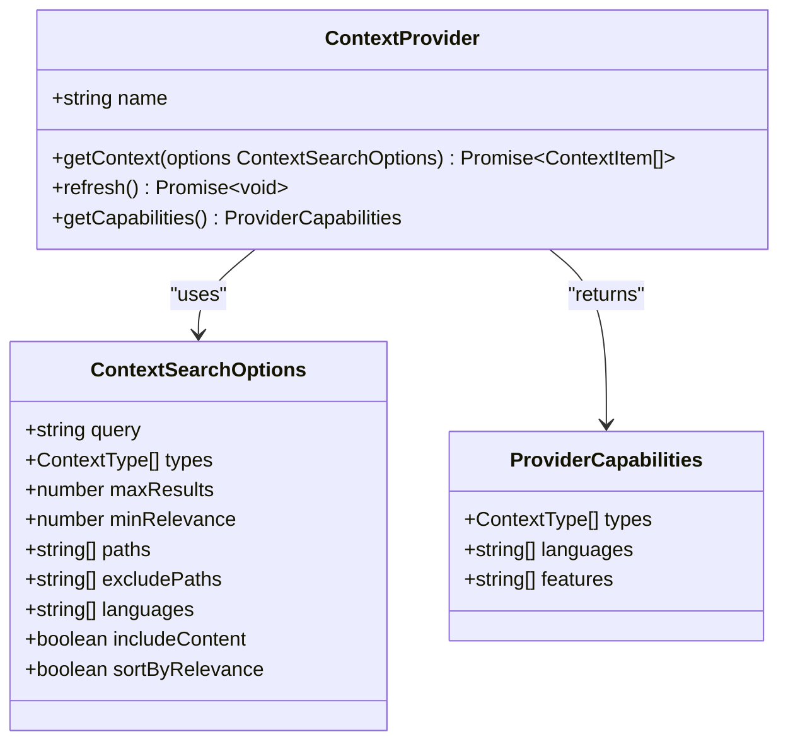
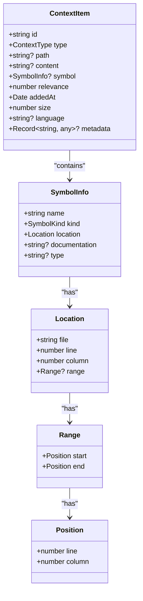
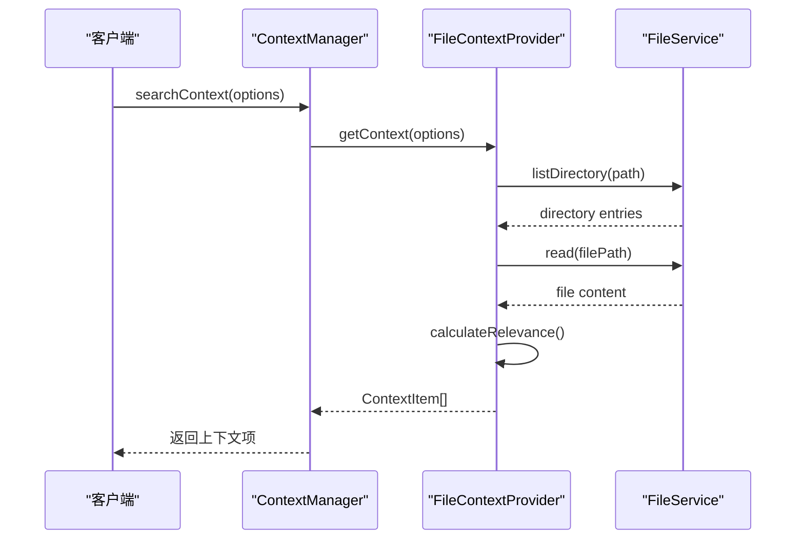
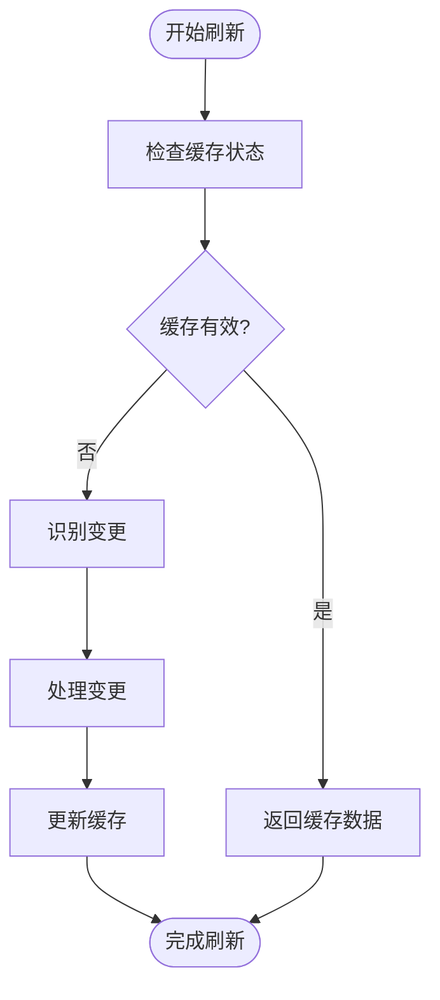
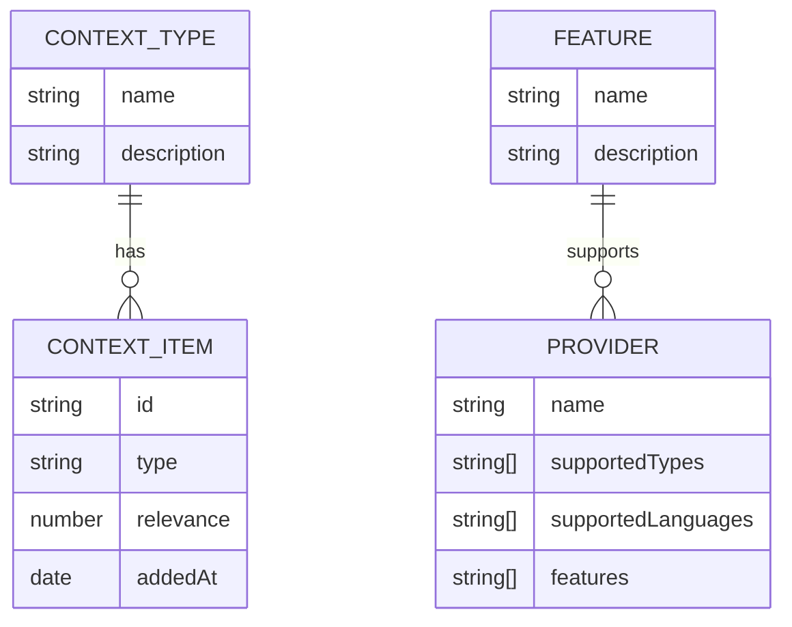
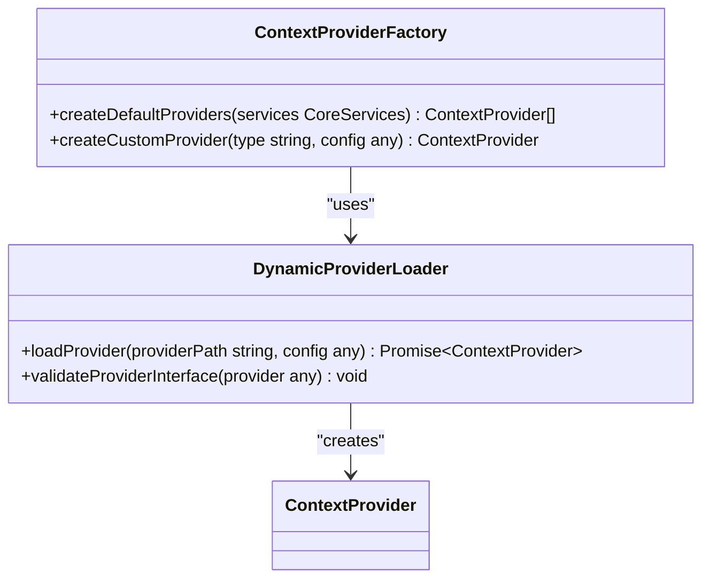
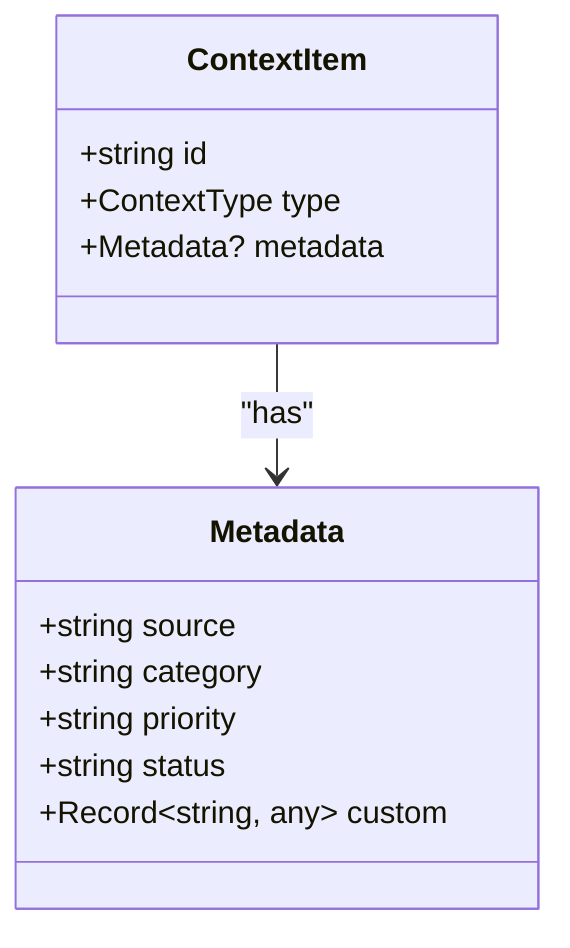
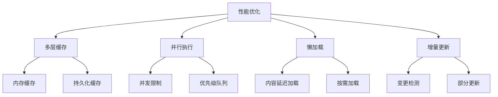
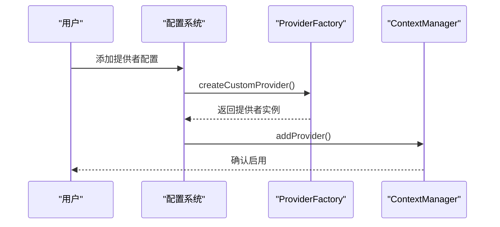

# 上下文提供者开发

<cite>
**本文档引用的文件**
- [03-context-providers.md](file://packages/sdk/node/docs/technical/03-context-providers.md)
- [types.ts](file://packages/sdk/node/src/context/types.ts)
- [manager.ts](file://packages/sdk/node/src/context/manager.ts)
- [cache.ts](file://packages/sdk/node/src/context/cache.ts)
- [context.ts](file://packages/opencode/src/util/context.ts)
- [CONTEXT_MANAGEMENT.md](file://packages/sdk/node/CONTEXT_MANAGEMENT.md)
</cite>

## 目录
1. [引言](#引言)
2. [上下文提供者接口](#上下文提供者接口)
3. [上下文项数据结构](#上下文项数据结构)
4. [提供者实现示例](#提供者实现示例)
5. [增量刷新机制](#增量刷新机制)
6. [数据类型与功能特性](#数据类型与功能特性)
7. [自定义数据源集成](#自定义数据源集成)
8. [元数据标注规范](#元数据标注规范)
9. [性能优化建议](#性能优化建议)
10. [注册与启用](#注册与启用)

## 引言

上下文提供者系统是OpenCode平台的核心组件，负责从不同数据源发现、提取和处理特定类型的上下文信息。该系统采用模块化架构，支持文件、符号、Git变更等多种上下文提供者，并提供了灵活的扩展机制。每个提供者专注于特定类型的上下文发现，确保系统的单一职责和可扩展性。

## 上下文提供者接口

上下文提供者接口定义了所有提供者必须实现的标准方法，确保了系统的统一性和可预测性。



**接口来源**
- [types.ts](file://packages/sdk/node/src/context/types.ts#L191-L204)

**接口来源**
- [types.ts](file://packages/sdk/node/src/context/types.ts#L191-L204)

### 接口方法详解

**ContextProvider接口**包含以下核心方法：

- **name**: 提供者名称，用于标识和调试
- **getContext**: 获取上下文项，根据搜索选项返回匹配的上下文项数组
- **refresh**: 刷新提供者缓存或状态，支持增量更新
- **getCapabilities**: 获取提供者能力描述，包括支持的上下文类型、语言和功能特性

## 上下文项数据结构

上下文项是系统中的基本数据单元，包含丰富的元数据以支持智能上下文管理。



**接口来源**
- [types.ts](file://packages/sdk/node/src/context/types.ts#L4-L25)

**接口来源**
- [types.ts](file://packages/sdk/node/src/context/types.ts#L4-L25)

### 数据结构详解

**ContextItem接口**包含以下关键属性：

- **id**: 上下文项的唯一标识符
- **type**: 上下文项类型，如文件、符号、函数等
- **path**: 文件路径（如果适用）
- **content**: 上下文项内容（可选，支持懒加载）
- **symbol**: 符号信息（如果适用）
- **relevance**: 相关性评分（0-100）
- **addedAt**: 添加时间
- **size**: 大小（字符数）
- **language**: 语言/文件类型
- **metadata**: 附加元数据

## 提供者实现示例

以下示例展示了如何实现一个文件上下文提供者。



**接口来源**
- [manager.ts](file://packages/sdk/node/src/context/manager.ts#L23-L590)

**接口来源**
- [manager.ts](file://packages/sdk/node/src/context/manager.ts#L23-L590)

### 文件提供者实现

文件上下文提供者负责发现和处理文件级别的上下文信息：

```typescript
class FileContextProvider implements ContextProvider {
  readonly name = 'file-provider'
  private fileService: FileService
  private indexCache: Map<string, FileIndex> = new Map()
  private contentCache: LRUCache<string, string>

  constructor(fileService: FileService, options: FileProviderOptions = {}) {
    this.fileService = fileService
    this.contentCache = new LRUCache(options.cacheSize || 1000)
  }

  async getContext(options: ContextSearchOptions): Promise<ContextItem[]> {
    // 实现文件搜索逻辑
  }

  async refresh(): Promise<void> {
    // 实现增量刷新逻辑
  }

  getCapabilities(): ProviderCapabilities {
    return {
      types: [ContextType.FILE],
      languages: ['*'],
      features: ['search', 'content-loading', 'metadata-extraction']
    }
  }
}
```

## 增量刷新机制

增量刷新机制确保上下文提供者能够高效地更新其状态，而无需完全重新加载。



**接口来源**
- [manager.ts](file://packages/sdk/node/src/context/manager.ts#L23-L590)

**接口来源**
- [manager.ts](file://packages/sdk/node/src/context/manager.ts#L23-L590)

### 刷新流程

增量刷新流程包括以下步骤：

1. **检查缓存状态**: 验证现有缓存是否仍然有效
2. **识别变更**: 检测数据源中的新增、修改或删除项
3. **处理变更**: 对变更进行分类和优先级排序
4. **更新缓存**: 只更新受影响的部分，保持未变更数据的完整性
5. **返回结果**: 完成刷新并通知相关组件

## 数据类型与功能特性

系统支持多种上下文类型和功能特性，以满足不同的使用场景。



**接口来源**
- [types.ts](file://packages/sdk/node/src/context/types.ts#L26-L130)

**接口来源**
- [types.ts](file://packages/sdk/node/src/context/types.ts#L26-L130)

### 支持的上下文类型

- **FILE**: 源代码文件
- **SYMBOL**: 代码符号（函数、类等）
- **FUNCTION**: 函数定义
- **CLASS**: 类定义
- **INTERFACE**: 接口定义
- **VARIABLE**: 变量声明
- **IMPORT**: 导入语句
- **EXPORT**: 导出语句
- **GIT_CHANGE**: Git仓库变更

### 支持的功能特性

- **search**: 支持搜索功能
- **content-loading**: 支持内容加载
- **metadata-extraction**: 支持元数据提取
- **real-time-update**: 支持实时更新
- **symbol-resolution**: 支持符号解析

## 自定义数据源集成

系统支持通过工厂模式动态加载自定义数据源提供者。



**接口来源**
- [03-context-providers.md](file://packages/sdk/node/docs/technical/03-context-providers.md#L722-L777)

**接口来源**
- [03-context-providers.md](file://packages/sdk/node/docs/technical/03-context-providers.md#L722-L777)

### 自定义提供者创建

通过`ContextProviderFactory`创建自定义提供者：

```typescript
class ContextProviderFactory {
  static createCustomProvider(
    type: string,
    config: any
  ): ContextProvider {
    switch (type) {
      case 'database':
        return new DatabaseContextProvider(config)
      case 'documentation':
        return new DocumentationContextProvider(config)
      case 'issue-tracker':
        return new IssueTrackerContextProvider(config)
      default:
        throw new Error(`Unknown provider type: ${type}`)
    }
  }
}
```

## 元数据标注规范

元数据标注规范确保上下文项包含一致和有用的信息。



**接口来源**
- [types.ts](file://packages/sdk/node/src/context/types.ts#L4-L25)

**接口来源**
- [types.ts](file://packages/sdk/node/src/context/types.ts#L4-L25)

### 元数据字段

- **source**: 数据源标识
- **category**: 分类信息
- **priority**: 优先级（高、中、低）
- **status**: 状态（活跃、归档、废弃）
- **custom**: 自定义字段

## 性能优化建议

系统提供了多种性能优化策略，确保高效运行。



**接口来源**
- [cache.ts](file://packages/sdk/node/src/context/cache.ts#L62-L136)

**接口来源**
- [cache.ts](file://packages/sdk/node/src/context/cache.ts#L62-L136)

### 优化策略

**多层缓存**: 使用内存缓存和持久化缓存相结合的策略，提高数据访问速度。

**并行执行**: 多个提供者可并行工作，提高整体效率。

**懒加载**: 内容在需要时才加载，减少初始加载时间。

**增量更新**: 只更新变更部分，避免完全重新加载。

## 注册与启用

新提供者可以通过配置文件或API注册和启用。



**接口来源**
- [manager.ts](file://packages/sdk/node/src/context/manager.ts#L23-L590)

**接口来源**
- [manager.ts](file://packages/sdk/node/src/context/manager.ts#L23-L590)

### 注册流程

1. **配置提供者**: 在配置文件中定义提供者类型和参数
2. **创建实例**: 使用工厂方法创建提供者实例
3. **注册到管理器**: 将提供者添加到上下文管理器
4. **验证功能**: 测试提供者的基本功能
5. **启用服务**: 正式启用提供者服务