# 扩展开发

<cite>
**本文档中引用的文件**  
- [tool.ts](file://packages/opencode/src/tool/tool.ts)
- [registry.ts](file://packages/opencode/src/tool/registry.ts)
- [bash.ts](file://packages/opencode/src/tool/bash.ts)
- [edit.ts](file://packages/opencode/src/tool/edit.ts)
- [provider.ts](file://packages/opencode/src/provider/provider.ts)
- [types.ts](file://packages/sdk/node/src/context/types.ts)
- [extension.ts](file://sdks/vscode/src/extension.ts)
</cite>

## 目录
1. [简介](#简介)
2. [自定义工具开发](#自定义工具开发)
3. [上下文提供者实现](#上下文提供者实现)
4. [MCP服务器集成](#mcp服务器集成)
5. [VSCode插件开发](#vscode插件开发)
6. [最佳实践](#最佳实践)

## 简介
本文档为开发者提供opencode平台的扩展开发指南。详细介绍了如何开发自定义工具、实现上下文提供者、构建MCP服务器以及开发VSCode插件。文档涵盖了工具注册机制、上下文集成、服务器扩展和IDE集成等核心扩展点，并提供了完整的代码模板和最佳实践。

## 自定义工具开发

本节详细介绍如何开发自定义工具（Tool），包括工具注册机制、签名定义、输入/输出处理以及与文件系统或外部API的交互。

### 工具定义与注册机制
opencode平台通过`ToolRegistry`管理所有工具的注册和调用。开发者可以通过两种方式注册自定义工具：在配置目录中创建工具文件，或通过插件系统注册。

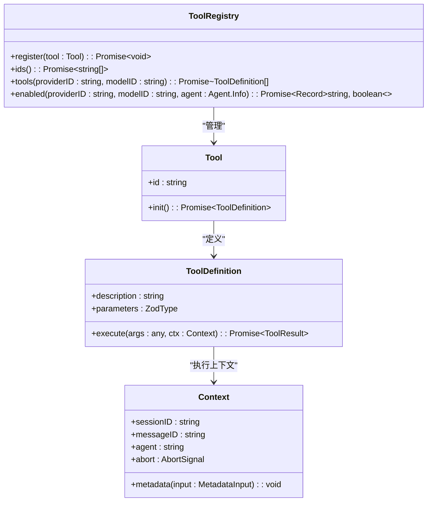

**Diagram sources**
- [tool.ts](file://packages/opencode/src/tool/tool.ts#L0-L44)
- [registry.ts](file://packages/opencode/src/tool/registry.ts#L0-L132)

### 工具签名与参数定义
使用Zod库定义工具的参数模式，确保输入验证和类型安全。每个工具必须提供描述、参数模式和执行函数。

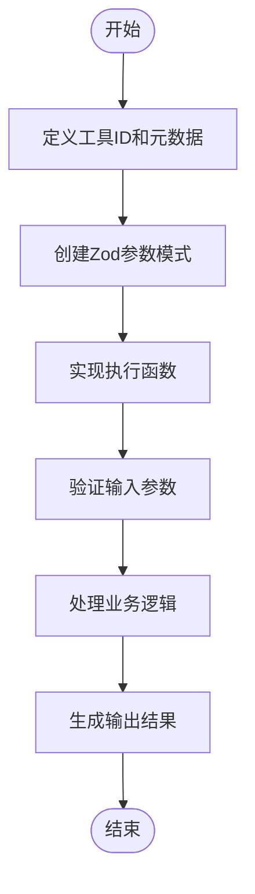

**Diagram sources**
- [tool.ts](file://packages/opencode/src/tool/tool.ts#L0-L44)

### 文件系统交互示例
以下示例展示了如何实现一个与文件系统交互的工具，包括权限检查、路径验证和文件操作。

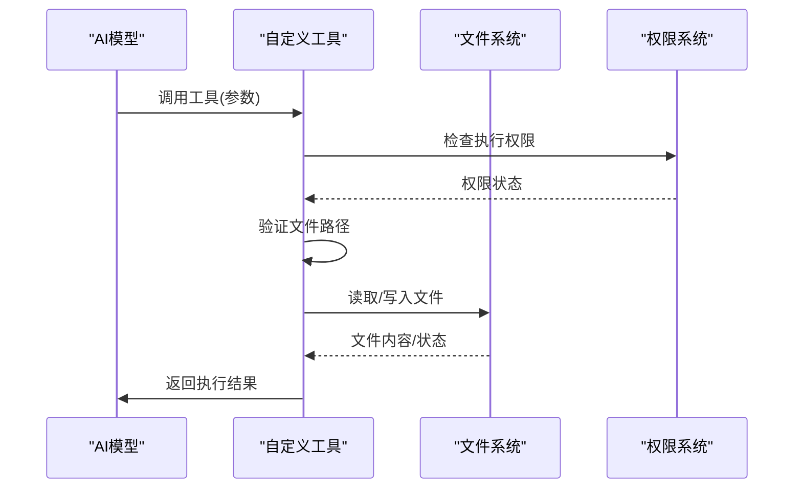

**Diagram sources**
- [edit.ts](file://packages/opencode/src/tool/edit.ts#L0-L626)

**本节内容来源**
- [tool.ts](file://packages/opencode/src/tool/tool.ts#L0-L44)
- [registry.ts](file://packages/opencode/src/tool/registry.ts#L0-L132)
- [edit.ts](file://packages/opencode/src/tool/edit.ts#L0-L626)

## 上下文提供者实现

本节介绍如何实现自定义上下文提供者（Context Provider），以将新的数据源集成到上下文收集流程中。

### 上下文提供者接口
自定义上下文提供者必须实现`ContextProvider`接口，提供名称、上下文获取、缓存刷新和能力查询功能。

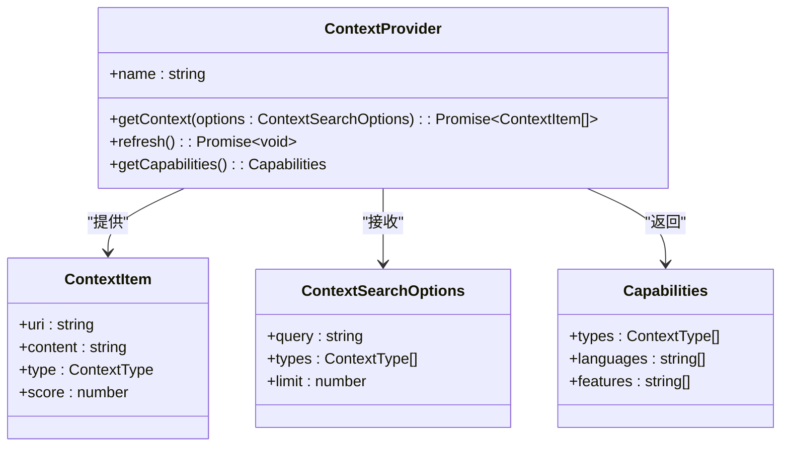

**Diagram sources**
- [types.ts](file://packages/sdk/node/src/context/types.ts#L191-L204)

### 数据库集成示例
实现一个连接特定数据库的上下文提供者，定期同步数据并提供上下文查询功能。

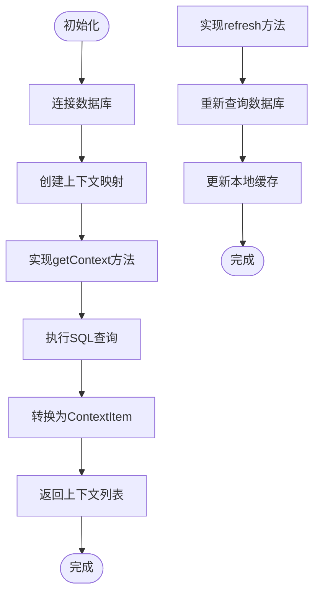

**本节内容来源**
- [types.ts](file://packages/sdk/node/src/context/types.ts#L191-L204)

## MCP服务器集成

本节阐述如何构建和集成MCP服务器，以扩展opencode的功能。

### MCP服务器架构
MCP服务器作为opencode的核心扩展点，提供模型管理、上下文处理和工具调用等服务。

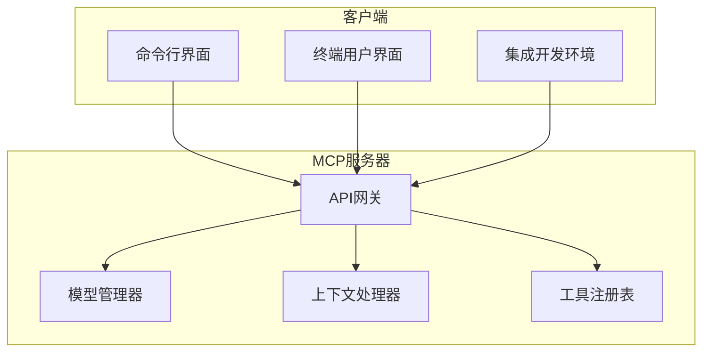

**本节内容来源**
- [provider.ts](file://packages/opencode/src/provider/provider.ts#L0-L561)

## VSCode插件开发

本节提供VSCode插件的开发示例，展示如何将opencode功能嵌入到流行的IDE中。

### 插件架构与实现
VSCode插件通过命令注册和终端集成，实现与opencode核心功能的无缝连接。

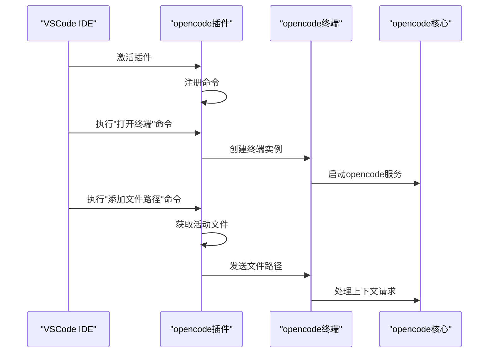

**Diagram sources**
- [extension.ts](file://sdks/vscode/src/extension.ts#L0-L127)

### 功能集成示例
插件实现的主要功能包括终端集成、文件路径添加和会话管理。

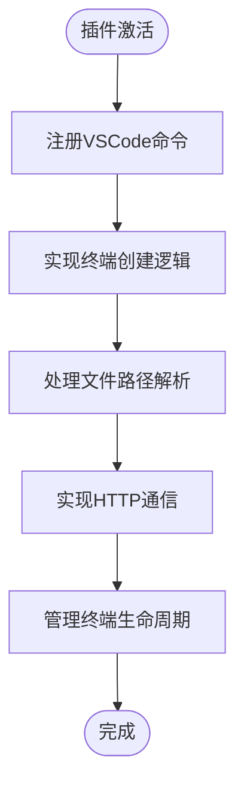

**本节内容来源**
- [extension.ts](file://sdks/vscode/src/extension.ts#L0-L127)

## 最佳实践

本节为每个扩展点提供完整的代码模板和最佳实践，包括错误处理、异步操作和资源清理。

### 错误处理模式
采用统一的错误处理机制，确保工具执行的稳定性和可预测性。

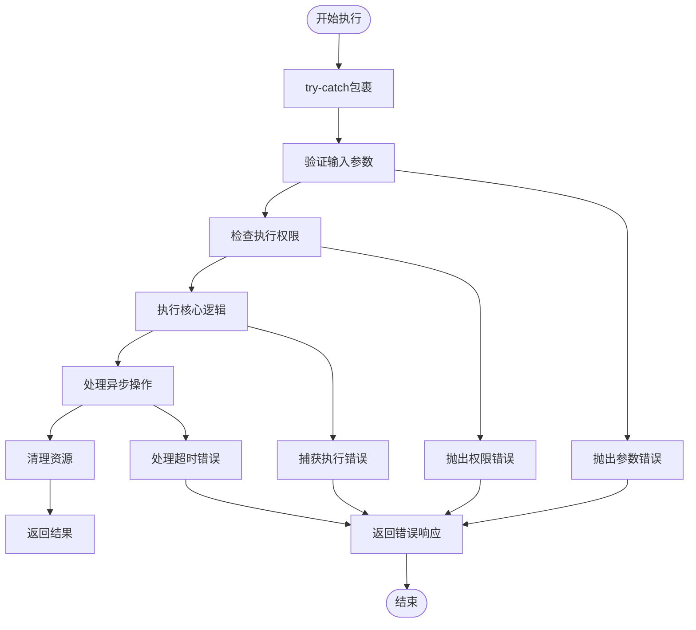

### 异步操作管理
使用AbortSignal实现操作取消，确保长时间运行的操作可以被及时终止。

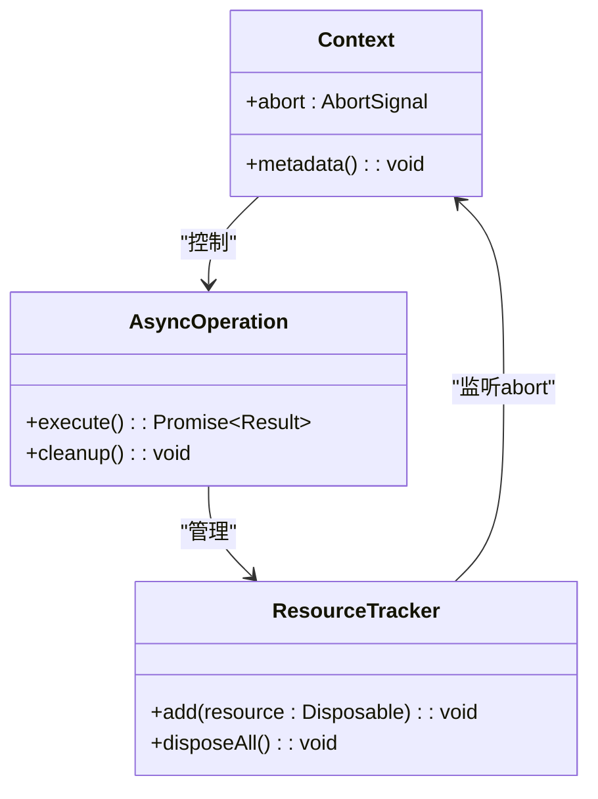

### 资源清理策略
实现资源跟踪和自动清理机制，防止内存泄漏和资源耗尽。

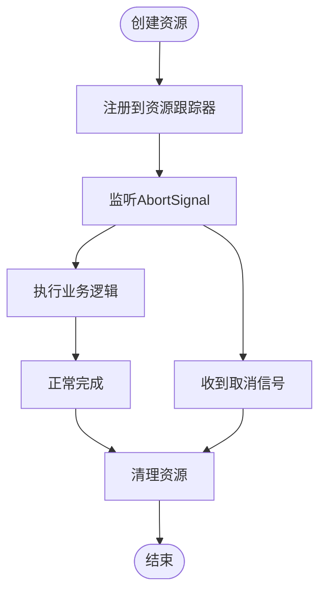

**本节内容来源**
- [tool.ts](file://packages/opencode/src/tool/tool.ts#L0-L44)
- [bash.ts](file://packages/opencode/src/tool/bash.ts#L0-L214)
- [edit.ts](file://packages/opencode/src/tool/edit.ts#L0-L626)