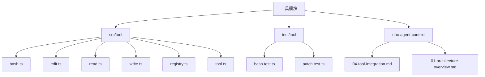
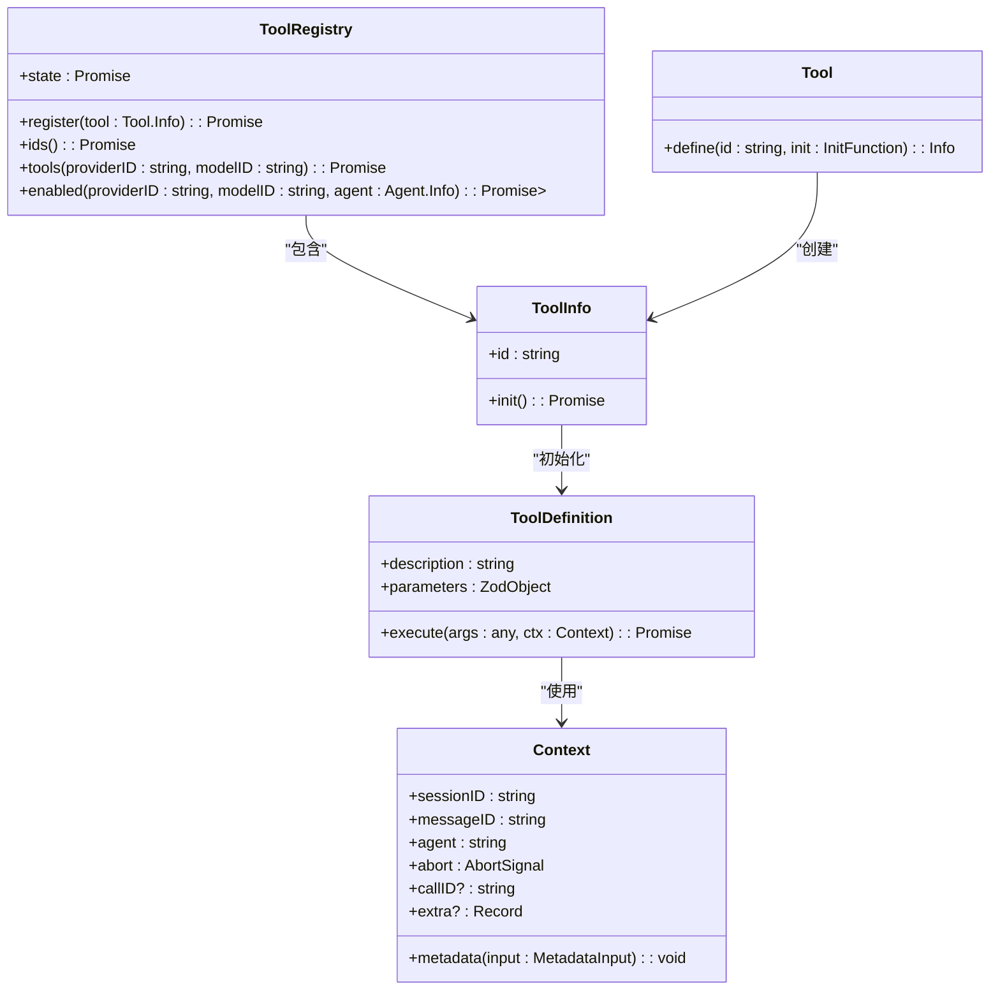
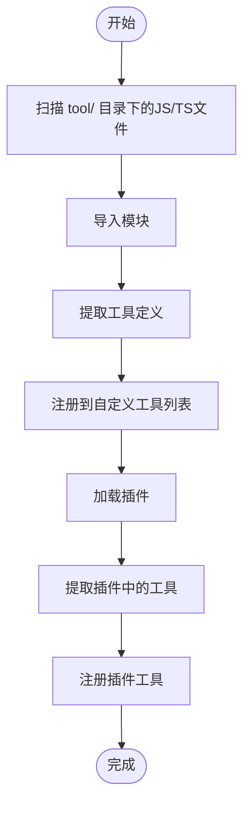
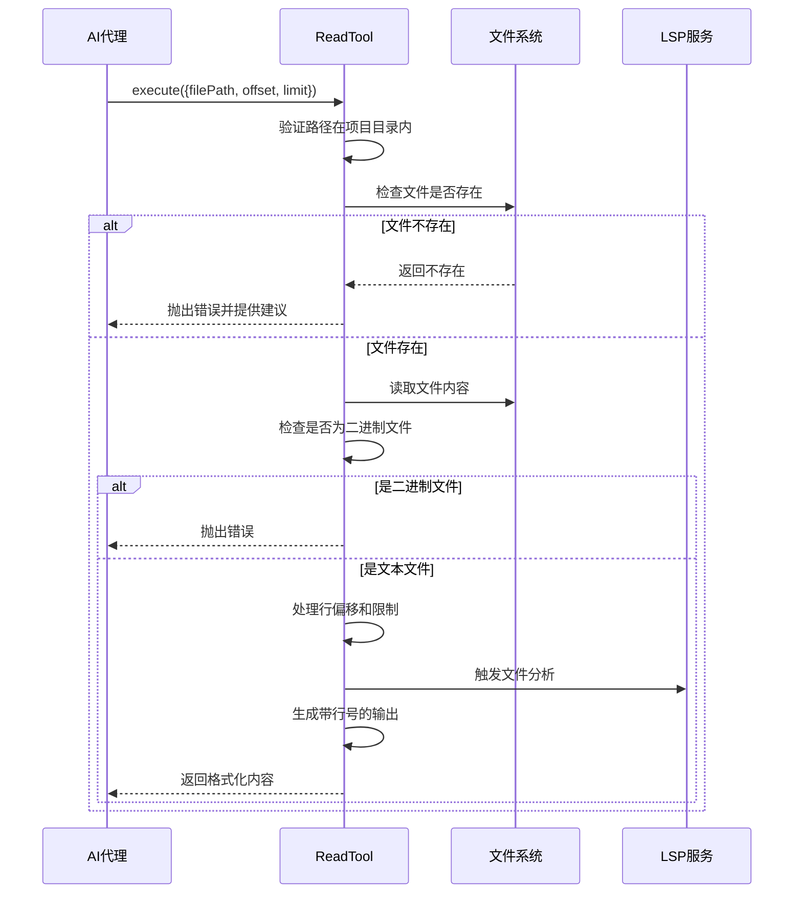
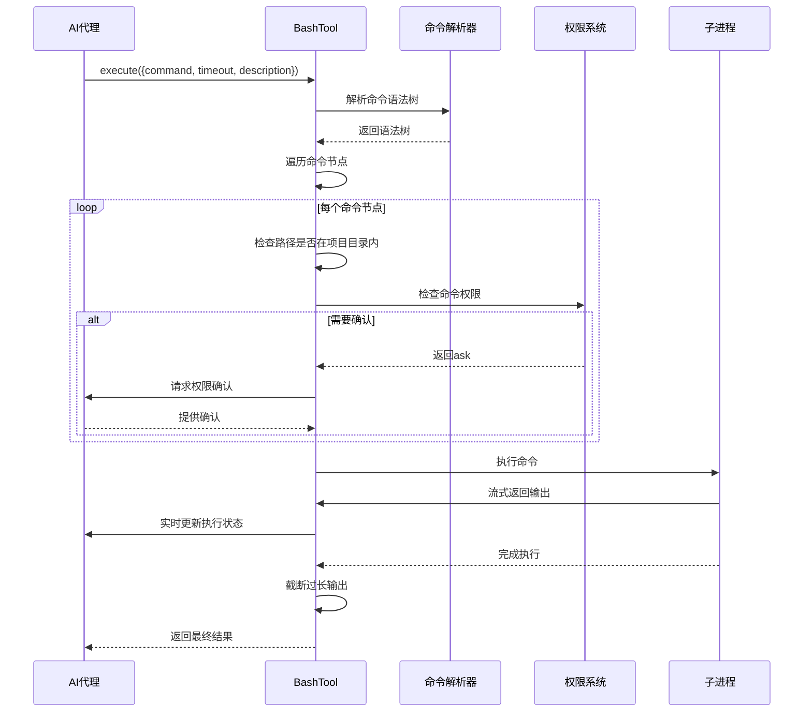
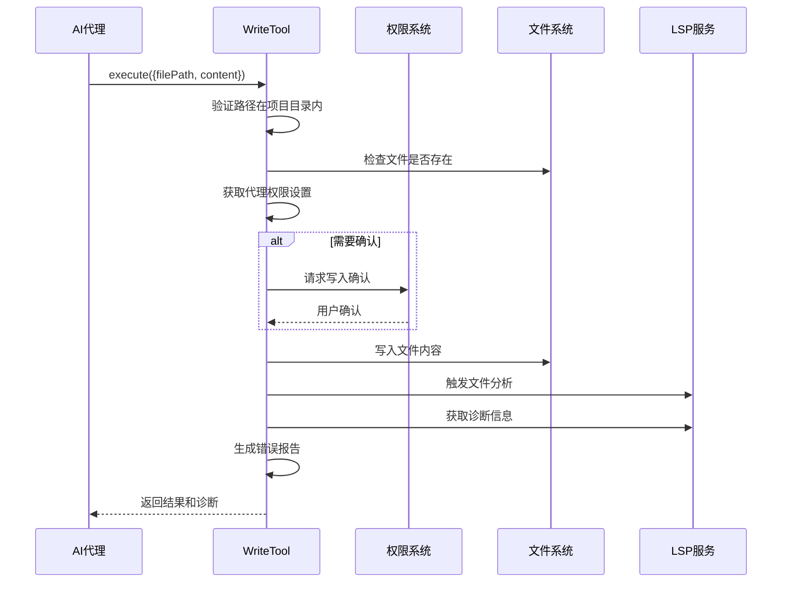
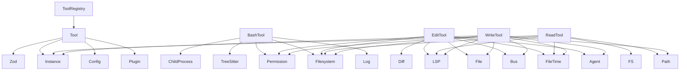

# 自定义工具开发

<cite>
**本文档中引用的文件**  
- [bash.ts](file://packages/opencode/src/tool/bash.ts)
- [edit.ts](file://packages/opencode/src/tool/edit.ts)
- [read.ts](file://packages/opencode/src/tool/read.ts)
- [write.ts](file://packages/opencode/src/tool/write.ts)
- [registry.ts](file://packages/opencode/src/tool/registry.ts)
- [tool.ts](file://packages/opencode/src/tool/tool.ts)
- [bash.test.ts](file://packages/opencode/test/tool/bash.test.ts)
- [patch.test.ts](file://packages/opencode/test/tool/patch.test.ts)
- [04-tool-integration.md](file://doc-agent-context/04-tool-integration.md)
- [01-architecture-overview.md](file://doc-agent-context/01-architecture-overview.md)
</cite>

## 目录
1. [简介](#简介)
2. [项目结构](#项目结构)
3. [核心组件](#核心组件)
4. [架构概述](#架构概述)
5. [详细组件分析](#详细组件分析)
6. [依赖分析](#依赖分析)
7. [性能考虑](#性能考虑)
8. [故障排除指南](#故障排除指南)
9. [结论](#结论)

## 简介
本文档为开发者提供自定义工具开发的完整指南。详细说明如何通过ToolRegistry注册新工具，定义工具签名（包括参数类型、描述和执行函数），实现同步与异步工具逻辑。涵盖文件系统操作（如read/write）、Shell命令执行（bash）、代码编辑（edit）等典型工具的实现示例。解释工具权限控制机制、输入验证、错误处理策略以及资源清理的最佳实践。展示如何通过测试文件（如bash.test.ts）编写单元测试以确保工具可靠性。结合代码示例说明工具如何与核心系统集成并被AI代理调用。

## 项目结构
自定义工具相关代码主要位于`packages/opencode/src/tool`目录下，包含各类内置工具实现、工具注册表和基础定义。测试文件位于`packages/opencode/test/tool`目录。工具集成文档位于`doc-agent-context`目录。



**图示来源**  
- [bash.ts](file://packages/opencode/src/tool/bash.ts)
- [edit.ts](file://packages/opencode/src/tool/edit.ts)
- [read.ts](file://packages/opencode/src/tool/read.ts)
- [write.ts](file://packages/opencode/src/tool/write.ts)
- [registry.ts](file://packages/opencode/src/tool/registry.ts)
- [tool.ts](file://packages/opencode/src/tool/tool.ts)
- [bash.test.ts](file://packages/opencode/test/tool/bash.test.ts)
- [patch.test.ts](file://packages/opencode/test/tool/patch.test.ts)
- [04-tool-integration.md](file://doc-agent-context/04-tool-integration.md)
- [01-architecture-overview.md](file://doc-agent-context/01-architecture-overview.md)

**章节来源**  
- [bash.ts](file://packages/opencode/src/tool/bash.ts)
- [edit.ts](file://packages/opencode/src/tool/edit.ts)
- [read.ts](file://packages/opencode/src/tool/read.ts)
- [write.ts](file://packages/opencode/src/tool/write.ts)
- [registry.ts](file://packages/opencode/src/tool/registry.ts)
- [tool.ts](file://packages/opencode/src/tool/tool.ts)
- [bash.test.ts](file://packages/opencode/test/tool/bash.test.ts)
- [patch.test.ts](file://packages/opencode/test/tool/patch.test.ts)
- [04-tool-integration.md](file://doc-agent-context/04-tool-integration.md)
- [01-architecture-overview.md](file://doc-agent-context/01-architecture-overview.md)

## 核心组件
核心组件包括ToolRegistry（工具注册表）、Tool定义基础类以及各类内置工具实现。ToolRegistry负责管理所有工具的注册、发现和权限控制。每个工具通过统一的接口定义，包含参数验证、描述信息和执行逻辑。

**章节来源**  
- [registry.ts](file://packages/opencode/src/tool/registry.ts#L21-L131)
- [tool.ts](file://packages/opencode/src/tool/tool.ts#L1-L44)

## 架构概述
系统采用注册表模式管理工具，支持动态注册和调用。工具注册表统一管理内置工具和自定义工具，通过权限系统控制工具访问，提供完整的错误处理和状态管理机制。



**图示来源**  
- [registry.ts](file://packages/opencode/src/tool/registry.ts#L21-L131)
- [tool.ts](file://packages/opencode/src/tool/tool.ts#L1-L44)

## 详细组件分析
### 工具注册与管理
工具注册系统支持从文件系统和插件动态加载工具，统一管理所有可用工具。

#### 工具注册流程


**图示来源**  
- [registry.ts](file://packages/opencode/src/tool/registry.ts#L21-L131)

**章节来源**  
- [registry.ts](file://packages/opencode/src/tool/registry.ts#L21-L131)

### 内置工具实现
#### 文件读取工具 (read)
实现安全的文件读取功能，包含路径验证、二进制文件检测和内容预览。



**图示来源**  
- [read.ts](file://packages/opencode/src/tool/read.ts#L1-L162)

**章节来源**  
- [read.ts](file://packages/opencode/src/tool/read.ts#L1-L162)

#### Shell命令执行工具 (bash)
实现安全的Shell命令执行，包含命令解析、路径限制和权限控制。



**图示来源**  
- [bash.ts](file://packages/opencode/src/tool/bash.ts#L1-L214)

**章节来源**  
- [bash.ts](file://packages/opencode/src/tool/bash.ts#L1-L214)

#### 代码编辑工具 (edit)
实现安全的代码编辑功能，包含多模式文本替换和语法错误检测。

```mermaid
flowchart TD
Start([开始编辑]) --> Validate["验证参数有效性"]
Validate --> CheckPath["检查文件路径"]
CheckPath --> ReadFile["读取文件内容"]
ReadFile --> FindText["查找待替换文本"]
FindText --> MultipleModes["尝试多种匹配模式"]
MultipleModes --> Simple["简单匹配"]
MultipleModes --> LineTrimmed["行修剪匹配"]
MultipleModes --> BlockAnchor["块锚点匹配"]
MultipleModes --> WhitespaceNormalized["空白归一化匹配"]
MultipleModes --> IndentationFlexible["缩进灵活匹配"]
MultipleModes --> EscapeNormalized["转义归一化匹配"]
MultipleModes --> TrimmedBoundary["修剪边界匹配"]
MultipleModes --> ContextAware["上下文感知匹配"]
MultipleModes --> MultiOccurrence["多处出现匹配"]
MultipleModes --> SelectMatch["选择最佳匹配"]
alt 找到匹配
SelectMatch --> ApplyEdit["应用编辑"]
ApplyEdit --> WriteFile["写入文件"]
WriteFile --> CheckSyntax["检查语法错误"]
CheckSyntax --> ReportError["报告诊断信息"]
ReportError --> Complete([完成])
else 未找到匹配
SelectMatch --> ThrowError["抛出未找到错误"]
ThrowError --> Complete
end
```

**图示来源**  
- [edit.ts](file://packages/opencode/src/tool/edit.ts#L1-L626)

**章节来源**  
- [edit.ts](file://packages/opencode/src/tool/edit.ts#L1-L626)

#### 文件写入工具 (write)
实现安全的文件写入功能，包含权限确认和语法检查。



**图示来源**  
- [write.ts](file://packages/opencode/src/tool/write.ts#L1-L73)

**章节来源**  
- [write.ts](file://packages/opencode/src/tool/write.ts#L1-L73)

## 依赖分析
工具系统依赖多个核心模块，包括权限系统、文件系统抽象、LSP集成和事件总线。



**图示来源**  
- [bash.ts](file://packages/opencode/src/tool/bash.ts)
- [edit.ts](file://packages/opencode/src/tool/edit.ts)
- [read.ts](file://packages/opencode/src/tool/read.ts)
- [write.ts](file://packages/opencode/src/tool/write.ts)
- [registry.ts](file://packages/opencode/src/tool/registry.ts)
- [tool.ts](file://packages/opencode/src/tool/tool.ts)

**章节来源**  
- [bash.ts](file://packages/opencode/src/tool/bash.ts)
- [edit.ts](file://packages/opencode/src/tool/edit.ts)
- [read.ts](file://packages/opencode/src/tool/read.ts)
- [write.ts](file://packages/opencode/src/tool/write.ts)
- [registry.ts](file://packages/opencode/src/tool/registry.ts)
- [tool.ts](file://packages/opencode/src/tool/tool.ts)

## 性能考虑
工具执行考虑了性能和安全限制，包括输出长度限制、执行超时控制和流式更新机制。Bash工具设置默认1分钟超时，最大10分钟；输出超过30,000字符会被截断。读取工具限制单次读取行数，避免加载过大文件。所有工具支持中止信号，可被外部中断。

## 故障排除指南
### 工具注册问题
检查工具文件是否位于正确的目录结构中，确保导出正确的工具定义格式。自定义工具应遵循`tool/*.ts`命名规范。

### 权限拒绝问题
检查代理的权限配置，确保相关工具类别（如bash、edit、webfetch）未被显式拒绝。可通过Agent配置调整权限策略。

### 文件路径错误
确保所有文件路径操作都经过项目目录边界检查，相对路径应转换为绝对路径后再验证。

### 命令执行失败
检查命令语法是否正确，确保不尝试访问项目目录外的路径。复杂命令可能需要语法树解析器支持。

**章节来源**  
- [bash.test.ts](file://packages/opencode/test/tool/bash.test.ts#L1-L54)
- [patch.test.ts](file://packages/opencode/test/tool/patch.test.ts#L1-L54)
- [04-tool-integration.md](file://doc-agent-context/04-tool-integration.md#L164-L226)

## 结论
本文档详细介绍了自定义工具开发的完整流程，从工具注册、实现到测试的各个方面。通过统一的工具接口和强大的权限控制系统，开发者可以安全地扩展系统功能。建议新工具遵循现有模式，充分利用内置的验证和错误处理机制，确保与核心系统的良好集成。