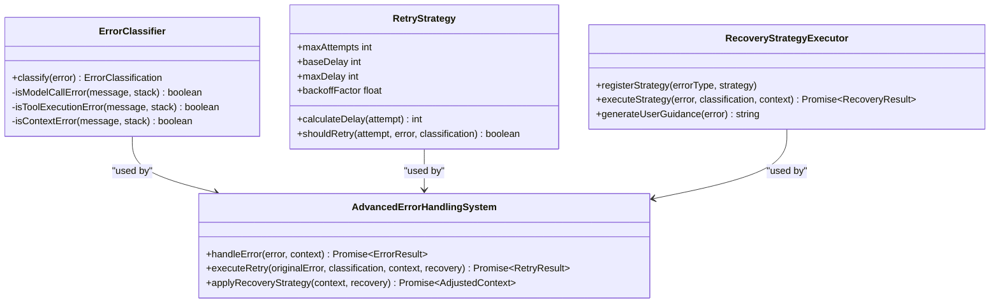

# 故障排除

<cite>
**本文档中引用的文件**   
- [ErrorHandlingSystem.js](file://context-claude-code/src/error/ErrorHandlingSystem.js)
- [log.ts](file://packages/opencode/src/util/log.ts)
- [DebugCommands.js](file://context-claude-code/src/claude-core/DebugCommands.js)
- [STATS.md](file://STATS.md)
</cite>

## 目录
1. [简介](#简介)
2. [常见错误场景及解决方案](#常见错误场景及解决方案)
3. [日志系统使用指南](#日志系统使用指南)
4. [错误处理系统详解](#错误处理系统详解)
5. [性能分析与瓶颈识别](#性能分析与瓶颈识别)
6. [问题报告最佳实践](#问题报告最佳实践)

## 简介
本文档旨在为用户提供全面的故障排除指南，帮助诊断和解决在使用系统过程中可能遇到的各种问题。文档涵盖了最常见的错误场景、日志系统的使用方法、错误处理机制的工作原理以及性能分析技巧。通过本指南，用户将能够有效地收集诊断信息，理解错误信息，并采取适当的措施解决问题。

## 常见错误场景及解决方案

### 连接失败
当系统无法建立网络连接时，通常会触发网络错误。这类问题可能由多种因素引起，包括网络配置不当、服务器不可达或防火墙限制等。

**诊断步骤：**
1. 检查本地网络连接是否正常。
2. 验证目标服务器地址和端口是否正确。
3. 确认防火墙设置没有阻止必要的通信。

**解决方案：**
- 重启网络设备以刷新连接状态。
- 使用`ping`命令测试与目标服务器的连通性。
- 如果问题持续存在，请联系网络管理员检查防火墙规则。

**Section sources**
- [ErrorHandlingSystem.js](file://context-claude-code/src/error/ErrorHandlingSystem.js#L1-L708)

### 上下文加载缓慢
上下文加载缓慢可能是由于数据量过大或系统资源不足导致的。这种情况下，用户可能会注意到响应时间显著增加。

**诊断步骤：**
1. 检查当前会话的数据大小。
2. 监控系统资源使用情况，特别是内存和CPU。
3. 查看是否有其他高负载进程正在运行。

**解决方案：**
- 优化数据结构，减少不必要的信息存储。
- 增加系统资源，如扩展内存或升级处理器。
- 调整系统配置，提高处理效率。

**Section sources**
- [DebugCommands.js](file://context-claude-code/src/claude-core/DebugCommands.js#L1-L848)

### AI响应超时
AI响应超时通常发生在模型调用过程中，可能是由于模型服务器过载或请求过于复杂所致。

**诊断步骤：**
1. 检查模型服务器的状态和负载。
2. 分析请求内容，确认是否存在异常复杂的查询。
3. 审查系统日志，查找相关错误信息。

**解决方案：**
- 简化请求内容，避免过于复杂的查询。
- 在非高峰时段重试请求。
- 考虑使用备用模型或降级策略。

**Section sources**
- [ErrorHandlingSystem.js](file://context-claude-code/src/error/ErrorHandlingSystem.js#L1-L708)

### 工具执行错误
工具执行错误可能源于权限不足、文件不存在或命令格式不正确等问题。

**诊断步骤：**
1. 确认执行工具所需的权限是否已授予。
2. 验证目标文件路径是否存在且可访问。
3. 检查命令语法是否符合要求。

**解决方案：**
- 调整文件或目录的权限设置。
- 确保所有依赖项都已正确安装。
- 参考文档修正命令格式。

**Section sources**
- [ErrorHandlingSystem.js](file://context-claude-code/src/error/ErrorHandlingSystem.js#L1-L708)

## 日志系统使用指南
日志系统是诊断问题的关键工具，它记录了系统运行过程中的各种事件和状态变化。通过分析日志，可以快速定位问题根源。

### 启用调试日志
要启用详细的调试日志输出，可以通过以下方式配置：
```typescript
import { Log } from "../src/util/log"

Log.init({
  print: false,
  dev: true,
  level: "DEBUG",
})
```

### 日志级别
日志系统支持多个级别，从低到高分别为`DEBUG`、`INFO`、`WARN`和`ERROR`。不同级别的日志适用于不同的场景：
- `DEBUG`：用于开发和调试，包含详细的信息。
- `INFO`：记录常规操作和重要事件。
- `WARN`：指示潜在的问题，但不影响系统运行。
- `ERROR`：记录导致功能失败的严重问题。

### 收集诊断信息
使用调试命令可以获取系统的实时状态信息。例如，`/context`命令显示当前上下文状态和内存使用情况；`/memory`命令提供内存统计和压缩历史。

**Section sources**
- [log.ts](file://packages/opencode/src/util/log.ts#L1-L177)
- [DebugCommands.js](file://context-claude-code/src/claude-core/DebugCommands.js#L1-L848)

## 错误处理系统详解
错误处理系统负责分类、记录和响应各种错误，确保系统能够在出现问题时优雅地恢复。

### 错误分类
系统根据错误的性质将其分为多个类型，包括模型调用、工具执行、上下文管理等。每种类型的错误都有相应的严重级别和处理策略。

### 错误码和堆栈跟踪
错误码提供了对特定错误类型的快速识别，而堆栈跟踪则帮助开发者追踪错误发生的具体位置。理解这些信息对于修复问题是至关重要的。

### 恢复策略
对于可恢复的错误，系统会尝试自动重试或应用降级策略。例如，在模型调用失败时，可以选择切换到备用模型或简化请求内容。



**Diagram sources **
- [ErrorHandlingSystem.js](file://context-claude-code/src/error/ErrorHandlingSystem.js#L1-L708)

**Section sources**
- [ErrorHandlingSystem.js](file://context-claude-code/src/error/ErrorHandlingSystem.js#L1-L708)

## 性能分析与瓶颈识别
性能问题是影响用户体验的重要因素。通过分析系统指标，可以识别出性能瓶颈并采取相应措施进行优化。

### 使用STATS.md进行性能分析
`STATS.md`文件记录了系统的下载统计信息，这些数据可用于评估系统性能随时间的变化趋势。通过分析这些统计数据，可以发现潜在的性能问题。

| 日期 | GitHub下载量 | npm下载量 | 总计 |
| ---- | ------------ | --------- | ---- |
| 2025-06-29 | 18,789 (+0) | 39,420 (+0) | 58,209 (+0) |
| 2025-06-30 | 20,127 (+1,338) | 41,059 (+1,639) | 61,186 (+2,977) |
| 2025-07-01 | 22,108 (+1,981) | 43,745 (+2,686) | 65,853 (+4,667) |

### 识别瓶颈
通过监控关键性能指标，如响应时间、吞吐量和错误率，可以识别出系统中的瓶颈。例如，如果发现响应时间持续上升，可能需要优化查询算法或增加缓存大小。

**Section sources**
- [STATS.md](file://STATS.md#L1-L103)

## 问题报告最佳实践
为了更有效地解决用户遇到的问题，建议在报告问题时提供足够的上下文信息。这包括但不限于：
- 详细的错误描述和重现步骤。
- 相关的日志片段和堆栈跟踪。
- 系统配置和环境信息。
- 任何相关的截图或视频。

提供完整的信息有助于技术支持团队更快地定位和解决问题。

**Section sources**
- [ErrorHandlingSystem.js](file://context-claude-code/src/error/ErrorHandlingSystem.js#L1-L708)
- [log.ts](file://packages/opencode/src/util/log.ts#L1-L177)