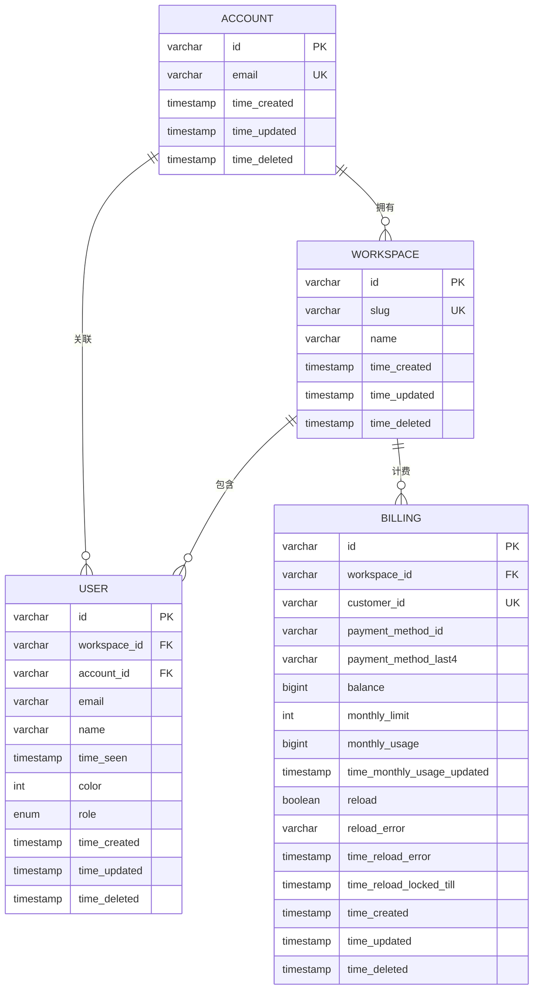

# 数据库Schema

<cite>
**本文档中引用的文件**  
- [user.sql.ts](file://packages/console/core/src/schema/user.sql.ts)
- [workspace.sql.ts](file://packages/console/core/src/schema/workspace.sql.ts)
- [account.sql.ts](file://packages/console/core/src/schema/account.sql.ts)
- [billing.sql.ts](file://packages/console/core/src/schema/billing.sql.ts)
- [types.ts](file://packages/console/core/src/drizzle/types.ts)
</cite>

## 目录
1. [简介](#简介)
2. [核心表结构](#核心表结构)
3. [表间关系与ER图](#表间关系与er图)
4. [设计意图与业务逻辑](#设计意图与业务逻辑)
5. [数据生命周期管理策略](#数据生命周期管理策略)
6. [数据库迁移与版本控制](#数据库迁移与版本控制)

## 简介
本文档详细描述基于Drizzle ORM定义的数据库Schema，涵盖`user`、`workspace`、`account`和`billing`四张核心表的完整结构。通过表格形式展示每张表的字段定义、数据类型、约束条件和索引，并使用ER图说明表之间的关联关系。同时解释各表的设计目的、业务逻辑以及数据生命周期管理策略。

## 核心表结构

### 用户表 (user)
该表存储系统中的用户信息，支持多工作区环境下的用户管理。

| 字段名 | 数据类型 | 约束 | 说明 |
|--------|----------|------|------|
| id | varchar(30) | NOT NULL, 主键（复合） | ULID格式的唯一标识符 |
| workspaceID | varchar(30) | NOT NULL, 主键（复合） | 所属工作区ID |
| accountID | varchar(30) | NOT NULL | 关联账户ID |
| email | varchar(255) | 唯一（工作区内） | 用户邮箱 |
| name | varchar(255) | NOT NULL | 用户姓名 |
| timeSeen | timestamp(3) | NULL | 最后活跃时间 |
| color | int | NULL | 用户界面颜色偏好 |
| role | enum('admin','member') | NOT NULL | 用户角色 |
| timeCreated | timestamp(3) | NOT NULL, DEFAULT NOW() | 创建时间 |
| timeUpdated | timestamp(3) | NOT NULL, ON UPDATE CURRENT_TIMESTAMP | 更新时间 |
| timeDeleted | timestamp(3) | NULL | 删除时间 |

**Section sources**
- [user.sql.ts](file://packages/console/core/src/schema/user.sql.ts#L6-L25)

### 工作区表 (workspace)
该表定义系统中的工作区实体，作为多租户架构的核心隔离单元。

| 字段名 | 数据类型 | 约束 | 说明 |
|--------|----------|------|------|
| id | varchar(30) | NOT NULL, 主键 | ULID格式的唯一标识符 |
| slug | varchar(255) | 唯一 | 工作区URL别名 |
| name | varchar(255) | NULL | 工作区名称 |
| timeCreated | timestamp(3) | NOT NULL, DEFAULT NOW() | 创建时间 |
| timeUpdated | timestamp(3) | NOT NULL, ON UPDATE CURRENT_TIMESTAMP | 更新时间 |
| timeDeleted | timestamp(3) | NULL | 删除时间 |

**Section sources**
- [workspace.sql.ts](file://packages/console/core/src/schema/workspace.sql.ts#L3-L12)

### 账户表 (account)
该表管理顶层账户信息，用于支持多租户计费模型。

| 字段名 | 数据类型 | 约束 | 说明 |
|--------|----------|------|------|
| id | varchar(30) | NOT NULL, 主键 | ULID格式的唯一标识符 |
| email | varchar(255) | NOT NULL, 唯一 | 账户联系邮箱 |
| timeCreated | timestamp(3) | NOT NULL, DEFAULT NOW() | 创建时间 |
| timeUpdated | timestamp(3) | NOT NULL, ON UPDATE CURRENT_TIMESTAMP | 更新时间 |
| timeDeleted | timestamp(3) | NULL | 删除时间 |

**Section sources**
- [account.sql.ts](file://packages/console/core/src/schema/account.sql.ts#L3-L11)

### 计费表 (billing)
该表存储与工作区相关的计费信息，实现精细化资源使用跟踪。

| 字段名 | 数据类型 | 约束 | 说明 |
|--------|----------|------|------|
| id | varchar(30) | NOT NULL, 主键（复合） | ULID格式的唯一标识符 |
| workspaceID | varchar(30) | NOT NULL, 主键（复合） | 所属工作区ID |
| customerID | varchar(255) | 唯一 | 支付服务客户ID |
| paymentMethodID | varchar(255) | NULL | 支付方式ID |
| paymentMethodLast4 | varchar(4) | NULL | 卡号后四位 |
| balance | bigint | NOT NULL | 账户余额（单位：分） |
| monthlyLimit | int | NULL | 月度使用限额 |
| monthlyUsage | bigint | NOT NULL | 当前月度使用量 |
| timeMonthlyUsageUpdated | timestamp(3) | NULL | 月度用量更新时间 |
| reload | boolean | NULL | 是否自动续充 |
| reloadError | varchar(255) | NULL | 续充错误信息 |
| timeReloadError | timestamp(3) | NULL | 续充错误发生时间 |
| timeReloadLockedTill | timestamp(3) | NULL | 续充锁定截止时间 |
| timeCreated | timestamp(3) | NOT NULL, DEFAULT NOW() | 创建时间 |
| timeUpdated | timestamp(3) | NOT NULL, ON UPDATE CURRENT_TIMESTAMP | 更新时间 |
| timeDeleted | timestamp(3) | NULL | 删除时间 |

此外，计费模块还包含以下辅助表：

#### 支付记录表 (payment)
| 字段 | 类型 | 说明 |
|------|------|------|
| customerID | varchar(255) | 客户ID |
| invoiceID | varchar(255) | 发票ID |
| paymentID | varchar(255) | 支付交易ID |
| amount | bigint | 支付金额 |
| timeRefunded | timestamp(3) | 退款时间 |

#### 使用量表 (usage)
| 字段 | 类型 | 说明 |
|------|------|------|
| model | varchar(255) | 模型名称 |
| provider | varchar(255) | 服务提供商 |
| inputTokens | int | 输入Token数 |
| outputTokens | int | 输出Token数 |
| reasoningTokens | int | 推理Token数 |
| cacheReadTokens | int | 缓存读取Token数 |
| cacheWrite5mTokens | int | 5分钟缓存写入Token数 |
| cacheWrite1hTokens | int | 1小时缓存写入Token数 |
| cost | bigint | 成本（单位：微美分） |

**Section sources**
- [billing.sql.ts](file://packages/console/core/src/schema/billing.sql.ts#L4-L22)

## 表间关系与ER图

**Diagram sources**
- [account.sql.ts](file://packages/console/core/src/schema/account.sql.ts#L3-L11)
- [workspace.sql.ts](file://packages/console/core/src/schema/workspace.sql.ts#L3-L12)
- [user.sql.ts](file://packages/console/core/src/schema/user.sql.ts#L6-L25)
- [billing.sql.ts](file://packages/console/core/src/schema/billing.sql.ts#L4-L22)

## 设计意图与业务逻辑

### 多租户架构设计
系统采用多租户设计模式，通过`workspace`表作为数据隔离的核心单元。每个`workspace`隶属于一个顶层`account`，实现租户级别的资源管理和计费分离。

### 用户-工作区关系
`user`表通过复合主键(`workspaceID`, `id`)实现跨工作区的用户管理。同一用户可在不同工作区拥有独立身份，同时通过`accountID`字段保持账户级关联，支持统一登录和权限管理。

### 计费系统设计
`billing`表与`workspace`形成一对一关系，为每个工作区提供独立的计费上下文。结合`usage`表实现细粒度的资源消耗跟踪，支持按模型、提供商等维度进行成本分析。

### 扩展性考虑
通过`workspaceColumns`和`timestamps`等类型复用机制，确保所有业务表具有一致的结构规范。ULID作为主键提供分布式友好性，同时保持可读性和时间序特性。

**Section sources**
- [types.ts](file://packages/console/core/src/drizzle/types.ts#L1-L33)
- [workspace.sql.ts](file://packages/console/core/src/schema/workspace.sql.ts#L3-L12)
- [billing.sql.ts](file://packages/console/core/src/schema/billing.sql.ts#L4-L22)

## 数据生命周期管理策略

### 软删除机制
所有核心表均包含`timeDeleted`字段，实现软删除功能。系统通过该字段区分逻辑删除与物理存在，支持数据恢复和审计追踪。

### 时间戳标准化
统一使用`timestamps`类型包含`timeCreated`、`timeUpdated`和`timeDeleted`三个时间字段，确保全系统时间记录的一致性。所有时间均以UTC存储，精度为毫秒级。

### 使用量归档
`usage`表设计支持定期归档策略。系统可按月或按季度将历史使用数据迁移至分析仓库，保持在线表的查询性能。

### 会话日志管理
虽然未在当前Schema中体现，但系统设计预留了会话日志的生命周期管理接口，可通过`timeCreated`范围查询实现自动过期清理。

**Section sources**
- [types.ts](file://packages/console/core/src/drizzle/types.ts#L25-L33)
- [billing.sql.ts](file://packages/console/core/src/schema/billing.sql.ts#L4-L22)

## 数据库迁移与版本控制

### 迁移文件组织
迁移脚本位于`packages/console/core/migrations/`目录下，采用递增编号命名（如`0000_fluffy_raza.sql`）。每个迁移文件对应一次Schema变更，确保可追溯性和可重复执行性。

### 快照机制
系统维护`meta/`目录下的JSON快照文件（如`0000_snapshot.json`），记录每次迁移后的完整Schema状态。这些快照用于快速初始化新环境和验证迁移一致性。

### Drizzle ORM集成
使用Drizzle ORM的TypeScript定义文件（`.sql.ts`）作为单一事实源。这些文件通过编译生成SQL迁移脚本，确保代码定义与数据库Schema严格一致。

### 版本控制流程
1. 开发者修改`.sql.ts`文件定义Schema变更
2. 运行脚本生成新的SQL迁移文件
3. 提交迁移文件至版本控制系统
4. 部署时自动按序执行未应用的迁移

此流程保证了数据库变更的可审计性、可回滚性和环境一致性。

**Section sources**
- [user.sql.ts](file://packages/console/core/src/schema/user.sql.ts#L6-L25)
- [workspace.sql.ts](file://packages/console/core/src/schema/workspace.sql.ts#L3-L12)
- [account.sql.ts](file://packages/console/core/src/schema/account.sql.ts#L3-L11)
- [billing.sql.ts](file://packages/console/core/src/schema/billing.sql.ts#L4-L22)
- [types.ts](file://packages/console/core/src/drizzle/types.ts#L1-L33)