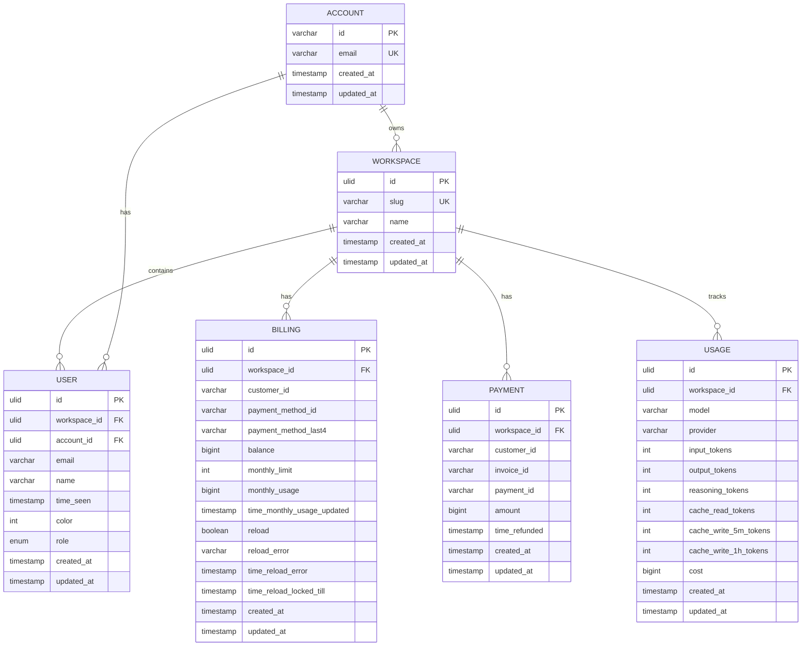

# 数据模型

<cite>
**本文档引用的文件**
- [message.ts](file://packages/opencode/src/session/message.ts)
- [message-v2.ts](file://packages/opencode/src/session/message-v2.ts)
- [tool.ts](file://packages/opencode/src/tool/tool.ts)
- [session/index.ts](file://packages/opencode/src/session/index.ts)
- [user.sql.ts](file://packages/console/core/src/schema/user.sql.ts)
- [workspace.sql.ts](file://packages/console/core/src/schema/workspace.sql.ts)
- [account.sql.ts](file://packages/console/core/src/schema/account.sql.ts)
- [billing.sql.ts](file://packages/console/core/src/schema/billing.sql.ts)
</cite>

## 目录
1. [核心领域模型](#核心领域模型)
2. [数据库持久化模型](#数据库持久化模型)
3. [数据生命周期](#数据生命周期)
4. [数据验证与序列化](#数据验证与序列化)

## 核心领域模型

本节详细定义了系统中的核心领域模型，包括消息（Message）、会话（Session）、上下文项（ContextItem）和工具（Tool）的属性、数据类型、约束和业务规则。

### 消息（Message）

消息模型是系统中最核心的实体之一，用于表示用户与AI助手之间的交互。系统中存在两个版本的消息模型：`Message` 和 `MessageV2`，其中 `MessageV2` 是更现代和功能更丰富的版本。

#### MessageV2 模型

`MessageV2` 模型通过 `Info` 类型定义，采用判别联合（discriminated union）模式区分用户消息和助手消息。

**用户消息（User）属性**

| 字段 | 类型 | 描述 | 约束 |
|------|------|------|------|
| id | string | 消息的唯一标识符 | 必填 |
| sessionID | string | 所属会话的ID | 必填 |
| role | "user" | 消息角色 | 固定值 |
| time.created | number | 消息创建时间戳（毫秒） | 必填 |

**助手消息（Assistant）属性**

| 字段 | 类型 | 描述 | 约束 |
|------|------|------|------|
| id | string | 消息的唯一标识符 | 必填 |
| sessionID | string | 所属会话的ID | 必填 |
| role | "assistant" | 消息角色 | 固定值 |
| time.created | number | 消息创建时间戳（毫秒） | 必填 |
| time.completed | number | 消息完成时间戳（毫秒） | 可选 |
| error | ErrorUnion | 消息处理过程中发生的错误 | 可选 |
| system | string[] | 系统提示词数组 | 必填 |
| modelID | string | 使用的AI模型ID | 必填 |
| providerID | string | AI服务提供商ID | 必填 |
| mode | string | 消息处理模式 | 必填 |
| path.cwd | string | 当前工作目录 | 必填 |
| path.root | string | 项目根目录 | 必填 |
| summary | boolean | 是否为会话摘要消息 | 可选 |
| cost | number | 消息处理成本 | 必填 |
| tokens.input | number | 输入令牌数 | 必填 |
| tokens.output | number | 输出令牌数 | 必填 |
| tokens.reasoning | number | 推理令牌数 | 必填 |
| tokens.cache.read | number | 缓存读取令牌数 | 必填 |
| tokens.cache.write | number | 缓存写入令牌数 | 必填 |

**消息部分（Part）**

消息由多个部分（Part）组成，每个部分都有不同的类型和结构。

| 字段 | 类型 | 描述 | 约束 |
|------|------|------|------|
| id | string | 部分的唯一标识符 | 必填 |
| sessionID | string | 所属会话的ID | 必填 |
| messageID | string | 所属消息的ID | 必填 |

**文本部分（TextPart）**

| 字段 | 类型 | 描述 | 约束 |
|------|------|------|------|
| type | "text" | 部分类型 | 固定值 |
| text | string | 文本内容 | 必填 |
| synthetic | boolean | 是否为合成文本 | 可选 |
| time.start | number | 开始时间戳 | 可选 |
| time.end | number | 结束时间戳 | 可选 |
| metadata | Record<string, any> | 附加元数据 | 可选 |

**推理部分（ReasoningPart）**

| 字段 | 类型 | 描述 | 约束 |
|------|------|------|------|
| type | "reasoning" | 部分类型 | 固定值 |
| text | string | 推理内容 | 必填 |
| metadata | Record<string, any> | 附加元数据 | 可选 |
| time.start | number | 开始时间戳 | 必填 |
| time.end | number | 结束时间戳 | 可选 |

**工具部分（ToolPart）**

| 字段 | 类型 | 描述 | 约束 |
|------|------|------|------|
| type | "tool" | 部分类型 | 固定值 |
| callID | string | 工具调用ID | 必填 |
| tool | string | 工具名称 | 必填 |
| state | ToolState | 工具状态 | 必填 |
| metadata | Record<string, any> | 附加元数据 | 可选 |

**文件部分（FilePart）**

| 字段 | 类型 | 描述 | 约束 |
|------|------|------|------|
| type | "file" | 部分类型 | 固定值 |
| mime | string | MIME类型 | 必填 |
| filename | string | 文件名 | 可选 |
| url | string | 文件URL | 必填 |
| source | FilePartSource | 文件源信息 | 可选 |

**步骤开始部分（StepStartPart）**

| 字段 | 类型 | 描述 | 约束 |
|------|------|------|------|
| type | "step-start" | 部分类型 | 固定值 |

**步骤完成部分（StepFinishPart）**

| 字段 | 类型 | 描述 | 约束 |
|------|------|------|------|
| type | "step-finish" | 部分类型 | 固定值 |
| cost | number | 步骤成本 | 必填 |
| tokens.input | number | 输入令牌数 | 必填 |
| tokens.output | number | 输出令牌数 | 必填 |
| tokens.reasoning | number | 推理令牌数 | 必填 |
| tokens.cache.read | number | 缓存读取令牌数 | 必填 |
| tokens.cache.write | number | 缓存写入令牌数 | 必填 |

**工具状态（ToolState）**

工具状态采用判别联合模式，表示工具调用的不同阶段。

| 状态 | 描述 | 属性 |
|------|------|------|
| pending | 待处理 | status: "pending" |
| running | 运行中 | status: "running", input: any, title: string, metadata: Record<string, any>, time.start: number |
| completed | 已完成 | status: "completed", input: Record<string, any>, output: string, title: string, metadata: Record<string, any>, time.start: number, time.end: number, time.compacted: number |
| error | 出错 | status: "error", input: Record<string, any>, error: string, metadata: Record<string, any>, time.start: number, time.end: number |

**文件源（FilePartSource）**

文件源信息描述了文件内容的来源，可以是文件本身或符号。

| 字段 | 类型 | 描述 | 约束 |
|------|------|------|------|
| type | "file" \| "symbol" | 源类型 | 必填 |
| path | string | 文件路径 | 必填 |
| text.value | string | 文本内容 | 必填 |
| text.start | number | 开始位置 | 必填 |
| text.end | number | 结束位置 | 必填 |
| range | LSP.Range | LSP范围信息 | 仅当type为"symbol"时必填 |
| name | string | 符号名称 | 仅当type为"symbol"时必填 |
| kind | number | 符号种类 | 仅当type为"symbol"时必填 |

**错误类型**

消息模型支持多种错误类型，通过判别联合实现。

| 错误类型 | 描述 | 属性 |
|------|------|------|
| OutputLengthError | 输出长度超限 | name: "MessageOutputLengthError" |
| AbortedError | 消息被中止 | name: "MessageAbortedError", message: string |
| AuthError | 认证错误 | name: "ProviderAuthError", providerID: string, message: string |
| UnknownError | 未知错误 | name: "UnknownError", message: string |

**Section sources**
- [message-v2.ts](file://packages/opencode/src/session/message-v2.ts#L0-L581)

### 会话（Session）

会话模型表示用户与系统的交互会话，是组织消息和其他相关数据的容器。

| 字段 | 类型 | 描述 | 约束 |
|------|------|------|------|
| id | string | 会话的唯一标识符 | 必填 |
| projectID | string | 所属项目的ID | 必填 |
| directory | string | 项目目录路径 | 必填 |
| parentID | string | 父会话ID | 可选 |
| share | ShareInfo | 共享信息 | 可选 |
| title | string | 会话标题 | 必填 |
| version | string | 会话版本 | 必填 |
| time.created | number | 会话创建时间戳（毫秒） | 必填 |
| time.updated | number | 会话最后更新时间戳（毫秒） | 必填 |
| time.compacting | number | 会话压缩时间戳（毫秒） | 可选 |
| revert | RevertInfo | 恢复信息 | 可选 |

**共享信息（ShareInfo）**

| 字段 | 类型 | 描述 | 约束 |
|------|------|------|------|
| secret | string | 共享密钥 | 必填 |
| url | string | 共享URL | 必填 |

**恢复信息（RevertInfo）**

| 字段 | 类型 | 描述 | 约束 |
|------|------|------|------|
| messageID | string | 恢复的消息ID | 必填 |
| partID | string | 恢复的部分ID | 可选 |
| snapshot | string | 快照内容 | 可选 |
| diff | string | 差异内容 | 可选 |

**业务规则**

1. 会话创建时会自动生成默认标题，格式为"New session - {timestamp}"或"Child session - {timestamp}"。
2. 会话更新时会自动更新`time.updated`字段。
3. 会话可以被共享，共享信息存储在独立的存储中。
4. 会话可以被删除，删除时会级联删除其所有子会话和关联的消息。
5. 会话支持恢复操作，可以恢复到特定消息的状态。

**Section sources**
- [index.ts](file://packages/opencode/src/session/index.ts#L0-L348)

### 上下文项（ContextItem）

上下文项模型表示在会话中使用的上下文信息，可以是文件、符号或其他类型的上下文。

| 字段 | 类型 | 描述 | 约束 |
|------|------|------|------|
| id | string | 上下文项的唯一标识符 | 必填 |
| type | ContextType | 上下文项类型 | 必填 |
| path | string | 文件路径 | 可选 |
| content | string | 上下文内容 | 可选 |
| symbol | SymbolInfo | 符号信息 | 可选 |
| relevance | number | 相关性评分 | 必填 |
| addedAt | Date | 添加时间 | 必填 |
| size | number | 大小（字符数） | 必填 |
| language | string | 语言/文件类型 | 可选 |
| metadata | Record<string, any> | 元数据 | 可选 |

**上下文类型（ContextType）**

| 类型 | 描述 |
|------|------|
| FILE | 文件 |
| SYMBOL | 符号 |
| FUNCTION | 函数 |
| CLASS | 类 |
| INTERFACE | 接口 |
| VARIABLE | 变量 |
| IMPORT | 导入 |
| EXPORT | 导出 |
| COMMENT | 注释 |
| ERROR | 错误 |
| GIT_CHANGE | Git变更 |

**符号信息（SymbolInfo）**

| 字段 | 类型 | 描述 | 约束 |
|------|------|------|------|
| name | string | 符号名称 | 必填 |
| kind | SymbolKind | 符号种类 | 必填 |
| location.file | string | 文件路径 | 必填 |
| location.line | number | 行号 | 必填 |
| location.column | number | 列号 | 必填 |
| location.range.start.line | number | 范围开始行号 | 可选 |
| location.range.start.column | number | 范围开始列号 | 可选 |
| location.range.end.line | number | 范围结束行号 | 可选 |
| location.range.end.column | number | 范围结束列号 | 可选 |
| container | string | 容器/模块名称 | 可选 |
| documentation | string | 文档 | 可选 |
| type | string | 类型信息 | 可选 |

**符号种类（SymbolKind）**

| 种类 | 值 | 描述 |
|------|------|------|
| FILE | 1 | 文件 |
| MODULE | 2 | 模块 |
| NAMESPACE | 3 | 命名空间 |
| PACKAGE | 4 | 包 |
| CLASS | 5 | 类 |
| METHOD | 6 | 方法 |
| PROPERTY | 7 | 属性 |
| FIELD | 8 | 字段 |
| CONSTRUCTOR | 9 | 构造函数 |
| ENUM | 10 | 枚举 |
| INTERFACE | 11 | 接口 |
| FUNCTION | 12 | 函数 |
| VARIABLE | 13 | 变量 |
| CONSTANT | 14 | 常量 |
| STRING | 15 | 字符串 |
| NUMBER | 16 | 数字 |
| BOOLEAN | 17 | 布尔值 |
| ARRAY | 18 | 数组 |
| OBJECT | 19 | 对象 |
| KEY | 20 | 键 |
| NULL | 21 | 空值 |
| ENUM_MEMBER | 22 | 枚举成员 |
| STRUCT | 23 | 结构体 |
| EVENT | 24 | 事件 |
| OPERATOR | 25 | 操作符 |
| TYPE_PARAMETER | 26 | 类型参数 |

**业务规则**

1. 上下文项的`relevance`字段用于排序和过滤，值越大表示相关性越高。
2. 上下文项的`addedAt`字段记录了上下文被添加到会话的时间。
3. 上下文项的`size`字段用于计算上下文窗口的使用情况。
4. 上下文项可以包含元数据，用于存储特定于上下文类型的附加信息。

**Section sources**
- [types.ts](file://packages/sdk/node/src/context/types.ts#L0-L224)

### 工具（Tool）

工具模型表示系统中可用的工具，这些工具可以被AI助手调用以执行特定任务。

| 字段 | 类型 | 描述 | 纠束 |
|------|------|------|------|
| id | string | 工具的唯一标识符 | 必填 |
| init | function | 初始化函数 | 必填 |

**工具上下文（Context）**

| 字段 | 类型 | 描述 | 约束 |
|------|------|------|------|
| sessionID | string | 会话ID | 必填 |
| messageID | string | 消息ID | 必填 |
| agent | string | 代理名称 | 必填 |
| abort | AbortSignal | 中止信号 | 必填 |
| callID | string | 调用ID | 可选 |
| extra | Record<string, any> | 额外信息 | 可选 |
| metadata | function | 元数据设置函数 | 必填 |

**工具信息（Info）**

| 字段 | 类型 | 描述 | 约束 |
|------|------|------|------|
| id | string | 工具ID | 必填 |
| init | function | 初始化函数 | 必填 |

**初始化函数返回值**

| 字段 | 类型 | 描述 | 约束 |
|------|------|------|------|
| description | string | 工具描述 | 必填 |
| parameters | z.ZodType | 参数模式 | 必填 |
| execute | function | 执行函数 | 必填 |

**执行函数返回值**

| 字段 | 类型 | 描述 | 约束 |
|------|------|------|------|
| title | string | 执行标题 | 必填 |
| metadata | Record<string, any> | 元数据 | 必填 |
| output | string | 执行输出 | 必填 |

**业务规则**

1. 工具通过`define`函数定义，该函数接受工具ID和初始化函数作为参数。
2. 工具的初始化函数可以返回一个对象，包含工具的描述、参数模式和执行函数。
3. 工具的执行函数接收参数和上下文作为输入，并返回执行结果。
4. 工具的元数据可以通过`metadata`函数设置，用于跟踪工具调用的详细信息。

**Section sources**
- [tool.ts](file://packages/opencode/src/tool/tool.ts#L0-L44)

## 数据库持久化模型

本节基于Drizzle ORM的SQL定义，展示用户（user）、工作区（workspace）、账户（account）和账单（billing）等表的完整数据库Schema。

### 用户表（user）

用户表存储系统中的用户信息。

| 字段 | 类型 | 描述 | 约束 |
|------|------|------|------|
| id | ulid | 主键，ULID格式 | NOT NULL, PRIMARY KEY |
| workspaceID | ulid | 所属工作区ID | NOT NULL |
| createdAt | datetime | 创建时间 | NOT NULL |
| updatedAt | datetime | 更新时间 | NOT NULL |
| accountID | ulid | 账户ID | NOT NULL |
| email | varchar(255) | 电子邮件 | |
| name | varchar(255) | 用户名 | NOT NULL |
| timeSeen | datetime | 最后查看时间 | |
| color | int | 颜色 | |
| role | enum | 用户角色 | NOT NULL, 可选值: admin, member |

**索引**

- `user_account_id`: 唯一索引，组合字段 (workspaceID, accountID)
- `user_email`: 唯一索引，组合字段 (workspaceID, email)
- `global_account_id`: 普通索引，字段 accountID
- `global_email`: 普通索引，字段 email

**外键关系**

- `accountID` 引用 `account` 表的 `id` 字段
- `workspaceID` 引用 `workspace` 表的 `id` 字段

**Section sources**
- [user.sql.ts](file://packages/console/core/src/schema/user.sql.ts#L0-L26)

### 工作区表（workspace）

工作区表存储系统中的工作区信息。

| 字段 | 类型 | 描述 | 约束 |
|------|------|------|------|
| id | ulid | 主键，ULID格式 | NOT NULL, PRIMARY KEY |
| slug | varchar(255) | 工作区短标识符 | |
| name | varchar(255) | 工作区名称 | |
| createdAt | datetime | 创建时间 | NOT NULL |
| updatedAt | datetime | 更新时间 | NOT NULL |

**索引**

- `slug`: 唯一索引，字段 slug

**主键**

- 组合主键 (workspaceID, id)，用于分区表

**Section sources**
- [workspace.sql.ts](file://packages/console/core/src/schema/workspace.sql.ts#L0-L21)

### 账户表（account）

账户表存储系统中的账户信息。

| 字段 | 类型 | 描述 | 约束 |
|------|------|------|------|
| id | varchar(255) | 主键，账户ID | NOT NULL, PRIMARY KEY |
| createdAt | datetime | 创建时间 | NOT NULL |
| updatedAt | datetime | 更新时间 | NOT NULL |
| email | varchar(255) | 账户邮箱 | NOT NULL |

**索引**

- `email`: 唯一索引，字段 email

**Section sources**
- [account.sql.ts](file://packages/console/core/src/schema/account.sql.ts#L0-L12)

### 账单表（billing）

账单表存储系统中的账单信息。

| 字段 | 类型 | 描述 | 约束 |
|------|------|------|------|
| id | ulid | 主键，ULID格式 | NOT NULL, PRIMARY KEY |
| workspaceID | ulid | 所属工作区ID | NOT NULL |
| createdAt | datetime | 创建时间 | NOT NULL |
| updatedAt | datetime | 更新时间 | NOT NULL |
| customerID | varchar(255) | 客户ID | |
| paymentMethodID | varchar(255) | 支付方式ID | |
| paymentMethodLast4 | varchar(4) | 支付方式后四位 | |
| balance | bigint | 余额 | NOT NULL |
| monthlyLimit | int | 月度限额 | |
| monthlyUsage | bigint | 月度使用量 | NOT NULL |
| timeMonthlyUsageUpdated | datetime | 月度使用量更新时间 | |
| reload | boolean | 是否自动续费 | |
| reloadError | varchar(255) | 续费错误信息 | |
| timeReloadError | datetime | 续费错误时间 | |
| timeReloadLockedTill | datetime | 续费锁定截止时间 | |

**索引**

- `global_customer_id`: 唯一索引，字段 customerID

**外键关系**

- `workspaceID` 引用 `workspace` 表的 `id` 字段

**Section sources**
- [billing.sql.ts](file://packages/console/core/src/schema/billing.sql.ts#L0-L55)

### 支付表（payment）

支付表存储系统中的支付信息。

| 字段 | 类型 | 描述 | 约束 |
|------|------|------|------|
| id | ulid | 主键，ULID格式 | NOT NULL, PRIMARY KEY |
| workspaceID | ulid | 所属工作区ID | NOT NULL |
| createdAt | datetime | 创建时间 | NOT NULL |
| updatedAt | datetime | 更新时间 | NOT NULL |
| customerID | varchar(255) | 客户ID | |
| invoiceID | varchar(255) | 发票ID | |
| paymentID | varchar(255) | 支付ID | |
| amount | bigint | 支付金额 | NOT NULL |
| timeRefunded | datetime | 退款时间 | |

**外键关系**

- `workspaceID` 引用 `workspace` 表的 `id` 字段

**Section sources**
- [billing.sql.ts](file://packages/console/core/src/schema/billing.sql.ts#L30-L40)

### 使用量表（usage）

使用量表存储系统中的使用量信息。

| 字段 | 类型 | 描述 | 约束 |
|------|------|------|------|
| id | ulid | 主键，ULID格式 | NOT NULL, PRIMARY KEY |
| workspaceID | ulid | 所属工作区ID | NOT NULL |
| createdAt | datetime | 创建时间 | NOT NULL |
| updatedAt | datetime | 更新时间 | NOT NULL |
| model | varchar(255) | 模型名称 | NOT NULL |
| provider | varchar(255) | 提供商名称 | NOT NULL |
| inputTokens | int | 输入令牌数 | NOT NULL |
| outputTokens | int | 输出令牌数 | NOT NULL |
| reasoningTokens | int | 推理令牌数 | |
| cacheReadTokens | int | 缓存读取令牌数 | |
| cacheWrite5mTokens | int | 5分钟缓存写入令牌数 | |
| cacheWrite1hTokens | int | 1小时缓存写入令牌数 | |
| cost | bigint | 成本 | NOT NULL |

**外键关系**

- `workspaceID` 引用 `workspace` 表的 `id` 字段

**Section sources**
- [billing.sql.ts](file://packages/console/core/src/schema/billing.sql.ts#L42-L55)

### 实体关系图



**Diagram sources**
- [account.sql.ts](file://packages/console/core/src/schema/account.sql.ts#L0-L12)
- [workspace.sql.ts](file://packages/console/core/src/schema/workspace.sql.ts#L0-L21)
- [user.sql.ts](file://packages/console/core/src/schema/user.sql.ts#L0-L26)
- [billing.sql.ts](file://packages/console/core/src/schema/billing.sql.ts#L0-L55)

## 数据生命周期

本节解释数据的生命周期，包括会话数据的过期策略和日志数据的归档机制。

### 会话数据生命周期

会话数据的生命周期由多个因素决定，包括会话的活动状态、存储策略和用户操作。

**创建阶段**

1. 当用户开始一个新的交互时，系统会创建一个新的会话。
2. 会话的`id`字段使用ULID生成，确保全局唯一性和时间排序性。
3. 会话的`title`字段使用默认模板生成，格式为"New session - {timestamp}"。
4. 会话的`version`字段设置为当前系统版本号。
5. 会话的`time.created`和`time.updated`字段设置为当前时间戳。

**活动阶段**

1. 会话在创建后进入活动状态，用户可以向会话发送消息。
2. 每次会话更新时，`time.updated`字段会自动更新为当前时间戳。
3. 会话可以被共享，共享信息存储在独立的存储中。
4. 会话可以被子会话继承，形成会话树结构。

**过期策略**

1. 系统没有明确的会话过期时间，会话数据会一直保留直到被用户删除。
2. 会话的`timeSeen`字段用于跟踪用户最后查看会话的时间，但不影响会话的生命周期。
3. 会话数据的存储成本由账单系统跟踪，用户需要支付存储费用。

**删除阶段**

1. 用户可以手动删除会话，删除操作会级联删除所有子会话和关联的消息。
2. 删除会话时会触发`Session.Event.Deleted`事件，通知系统其他组件。
3. 删除操作是不可逆的，所有相关数据都会被永久删除。

**Section sources**
- [index.ts](file://packages/opencode/src/session/index.ts#L0-L348)

### 消息数据生命周期

消息数据的生命周期与会话数据紧密相关，但有其独特的特点。

**创建阶段**

1. 当用户或AI助手发送消息时，系统会创建一个新的消息。
2. 消息的`id`字段使用ULID生成，确保全局唯一性和时间排序性。
3. 消息的`time.created`字段设置为当前时间戳。
4. 消息的`sessionID`字段设置为所属会话的ID。

**处理阶段**

1. 助手消息在处理过程中会逐步更新，添加推理、工具调用等部分。
2. 消息的`time.completed`字段在处理完成后设置为当前时间戳。
3. 消息的成本和令牌使用量在处理完成后计算并存储。

**归档机制**

1. 系统没有明确的消息归档机制，消息数据会一直保留在会话中。
2. 会话压缩功能可以减少消息数据的存储空间，但不会删除消息。
3. 消息数据的存储成本由账单系统跟踪，用户需要支付存储费用。

**删除阶段**

1. 消息可以被删除，删除操作通常发生在会话删除时。
2. 删除消息时会触发`MessageV2.Event.Removed`事件，通知系统其他组件。
3. 删除操作是不可逆的，所有相关数据都会被永久删除。

**Section sources**
- [message-v2.ts](file://packages/opencode/src/session/message-v2.ts#L0-L581)

## 数据验证与序列化

本节说明数据验证和序列化/反序列化的处理方式。

### 数据验证

系统使用Zod库进行数据验证，确保数据的完整性和正确性。

**验证模式定义**

1. 每个数据模型都有对应的Zod验证模式，定义在`zod/v4`命名空间下。
2. 验证模式使用`z.object`、`z.string`、`z.number`等方法定义字段类型和约束。
3. 复杂类型使用`z.discriminatedUnion`方法定义判别联合模式。
4. 自定义类型使用`z.custom`方法定义。

**验证执行**

1. 数据在创建和更新时会自动进行验证。
2. 验证失败会抛出详细的错误信息，包括错误字段和原因。
3. 验证结果使用`z.infer`类型推断，确保类型安全。

**验证示例**

```typescript
// 定义消息验证模式
export const Info = z.object({
  id: z.string(),
  role: z.enum(["user", "assistant"]),
  parts: z.array(MessagePart),
  metadata: z.object({
    time: z.object({
      created: z.number(),
      completed: z.number().optional(),
    }),
    // ... 其他字段
  }),
})
```

**Section sources**
- [message-v2.ts](file://packages/opencode/src/session/message-v2.ts#L0-L581)

### 序列化与反序列化

系统使用JSON作为主要的序列化格式，确保数据的可移植性和互操作性。

**序列化规则**

1. 所有数据模型都实现了JSON序列化接口，可以转换为JSON格式。
2. ULID字段序列化为字符串格式。
3. 时间戳字段序列化为数字格式（毫秒）。
4. 枚举字段序列化为字符串格式。
5. 判别联合字段序列化为包含`type`或`role`字段的JSON对象。

**反序列化规则**

1. JSON数据在反序列化时会进行验证，确保数据的完整性和正确性。
2. 反序列化失败会抛出详细的错误信息。
3. 反序列化结果使用Zod的`parse`方法，确保类型安全。

**序列化示例**

```typescript
// 消息序列化
const messageJson = JSON.stringify({
  id: "01J9QJQJQJQJQJQJQJQJQJQJQJ",
  role: "assistant",
  time: {
    created: 1700000000000,
    completed: 1700000001000,
  },
  // ... 其他字段
})
```

**Section sources**
- [message-v2.ts](file://packages/opencode/src/session/message-v2.ts#L0-L581)