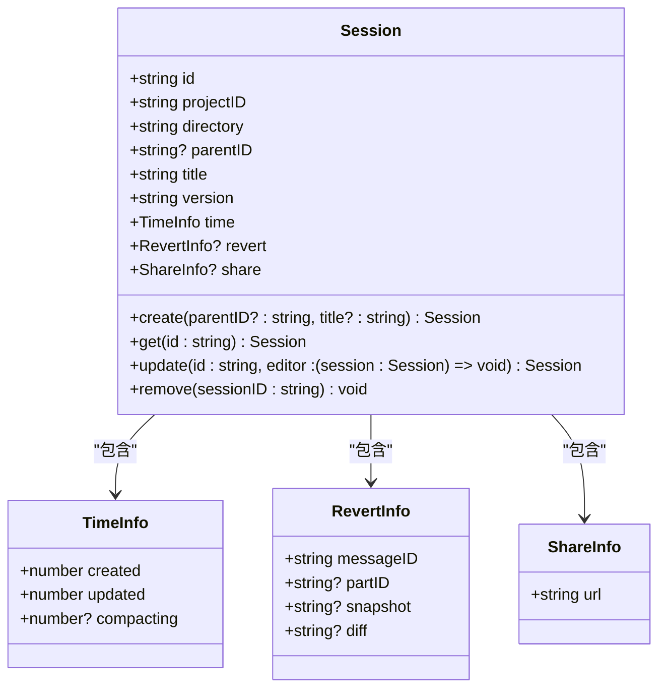
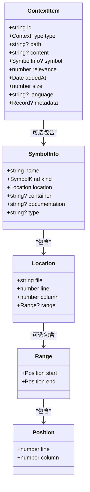

# 领域模型

<cite>
**本文档引用的文件**  
- [message.ts](file://packages/opencode/src/session/message.ts)
- [index.ts](file://packages/opencode/src/session/index.ts)
- [message-v2.ts](file://packages/opencode/src/session/message-v2.ts)
- [registry.ts](file://packages/opencode/src/tool/registry.ts)
- [tool.ts](file://packages/opencode/src/tool/tool.ts)
- [index.js](file://context-claude-code/src/types/index.js)
- [types.ts](file://packages/sdk/node/src/context/types.ts)
- [02-session-management.md](file://doc-agent-context/02-session-management.md)
- [04-tool-integration.md](file://doc-agent-context/04-tool-integration.md)
</cite>

## 目录
1. [引言](#引言)
2. [消息模型](#消息模型)
3. [会话模型](#会话模型)
4. [上下文项模型](#上下文项模型)
5. [工具模型](#工具模型)
6. [序列化与反序列化](#序列化与反序列化)
7. [SDK使用示例](#sdk使用示例)
8. [结论](#结论)

## 引言
本领域模型文档详细阐述了OpenCode系统中的四个核心数据模型：消息（Message）、会话（Session）、上下文项（ContextItem）和工具（Tool）。这些模型构成了系统上下文管理的基础，通过精确的属性定义、清晰的业务含义和紧密的相互关系，实现了强大的AI对话和上下文管理能力。文档将深入分析每个模型的技术实现、数据结构和业务逻辑，并提供实际使用示例。

## 消息模型
消息模型是系统中最基本的通信单元，用于表示用户和AI助手之间的交互内容。系统实现了两个版本的消息模型（V1和V2），其中V2版本提供了更丰富的功能和更精细的控制。

### 消息字段详细说明
消息模型包含多个字段，每个字段都有特定的数据类型和业务含义。以下表格详细列出了Message模型的所有字段：

| 字段名 | 数据类型 | 说明 |
|--------|---------|------|
| id | string | 消息的唯一标识符，用于在会话中唯一识别该消息 |
| role | enum | 消息角色，枚举值包括"user"（用户）和"assistant"（助手），表示消息的发送方 |
| parts | array | 消息内容部分的数组，包含文本、文件、工具调用等多种类型的内容 |
| metadata.time.created | number | 消息创建的时间戳（毫秒） |
| metadata.time.completed | number | 消息处理完成的时间戳（毫秒），可选字段 |
| metadata.error | union type | 错误信息，采用联合类型设计，可包含认证错误、输出长度错误等不同类型 |
| metadata.sessionID | string | 所属会话的ID，用于关联消息和会话 |
| metadata.assistant.modelID | string | 使用的AI模型ID |
| metadata.assistant.providerID | string | 模型提供者ID |
| metadata.assistant.tokens.input | number | 输入token数量 |
| metadata.assistant.tokens.output | number | 输出token数量 |
| metadata.assistant.tokens.reasoning | number | 推理token数量 |
| metadata.assistant.tokens.cache.read | number | 缓存读取token数量 |
| metadata.assistant.tokens.cache.write | number | 缓存写入token数量 |
| metadata.assistant.cost | number | 处理该消息的成本（以货币单位计） |

**联合类型设计说明**：消息模型中的`error`字段采用了联合类型（union type）设计，通过Zod的`discriminatedUnion`实现。这种设计允许一个字段包含多种可能的错误类型，每种类型都有其特定的结构。例如，`AuthError`包含`providerID`和`message`字段，而`OutputLengthError`则没有特定字段。这种设计提供了类型安全的错误处理机制，使得在运行时可以准确识别和处理不同类型的错误。

**Section sources**
- [message.ts](file://packages/opencode/src/session/message.ts#L1-L189)
- [message-v2.ts](file://packages/opencode/src/session/message-v2.ts#L1-L582)

## 会话模型
会话模型是系统上下文管理的核心，负责维护对话的完整状态和历史。会话模型通过生命周期属性和状态属性，实现了对对话过程的精确控制。

### 生命周期属性
会话模型的生命周期属性记录了会话在不同时间点的状态，这些属性对于理解会话的演变过程至关重要：

- **created**: 会话创建的时间戳，记录了会话开始的时间
- **updated**: 会话最后更新的时间戳，用于判断会话的活跃状态
- **compacting**: 会话开始压缩的时间戳，标记了上下文压缩操作的开始时间

这些时间戳属性共同构成了会话的时间线，使得系统能够根据时间信息做出智能决策，如自动归档长时间未活动的会话。

### 状态属性
会话模型的状态属性描述了会话的当前状态和配置：

- **title**: 会话标题，用于用户识别和管理会话
- **version**: 会话版本号，用于跟踪会话结构的变更
- **revert**: 恢复点信息，包含`messageID`（消息ID）、`partID`（部分ID）、`snapshot`（快照）和`diff`（差异）等字段，用于支持会话的撤销和恢复功能
- **share**: 共享信息，包含`url`字段，用于会话的分享功能

会话模型还支持父子会话关系，通过`parentID`字段建立会话之间的层级结构。这种设计使得复杂的任务可以分解为多个子会话，提高了对话的组织性和可管理性。



**Diagram sources**
- [index.ts](file://packages/opencode/src/session/index.ts#L1-L349)
- [02-session-management.md](file://doc-agent-context/02-session-management.md#L1-L1325)

**Section sources**
- [index.ts](file://packages/opencode/src/session/index.ts#L1-L349)
- [02-session-management.md](file://doc-agent-context/02-session-management.md#L1-L1325)

## 上下文项模型
上下文项模型用于表示系统中的各种上下文元素，如文件、符号、函数等。该模型通过丰富的属性和灵活的扩展能力，实现了对复杂上下文的精确管理。

### Relevance评分机制
上下文项的`relevance`字段是一个0-1之间的浮点数，表示该上下文项与当前任务的相关性评分。评分机制基于多种因素计算：

- **语义相似度**：通过向量嵌入计算上下文项内容与当前查询的语义相似度
- **使用频率**：最近频繁访问的上下文项会获得更高的相关性评分
- **修改时间**：最近修改的文件或代码会获得更高的评分
- **引用关系**：被当前上下文中的其他元素频繁引用的项会获得更高评分

评分机制采用加权算法，不同因素的权重可以根据具体场景进行调整，确保评分结果的准确性和实用性。

### AddedAt时间戳
`addedAt`字段记录了上下文项被添加到当前上下文中的时间。这个时间戳对于上下文管理至关重要，因为它：

- 帮助系统实现基于时间的上下文清理策略
- 支持"最近添加"的排序和过滤功能
- 为上下文演变分析提供时间维度数据

### Metadata扩展能力
`metadata`字段是一个灵活的键值对对象，允许存储任意的扩展信息。这种设计提供了强大的扩展能力，使得上下文项可以携带丰富的附加信息，如：

- 版本控制信息（如git提交哈希）
- 性能指标（如加载时间、大小）
- 用户偏好（如折叠状态、注释）
- 分析结果（如代码复杂度、测试覆盖率）



**Diagram sources**
- [types.ts](file://packages/sdk/node/src/context/types.ts#L1-L224)

**Section sources**
- [types.ts](file://packages/sdk/node/src/context/types.ts#L1-L224)

## 工具模型
工具模型是系统功能扩展的核心，通过动态注册和内置工具的结合，实现了强大的功能集成能力。

### 动态注册机制
工具模型支持动态注册，允许在运行时添加新的工具。注册机制通过`ToolRegistry`实现，其工作流程如下：

1. 扫描配置目录中的自定义工具文件
2. 加载工具模块并提取工具定义
3. 将工具添加到注册表中
4. 提供工具发现和调用接口

动态注册机制使得系统具有极强的扩展性，开发者可以轻松添加新的功能而无需修改核心代码。

### 内置工具角色
系统提供了丰富的内置工具，每种工具都有特定的角色和功能：

- **BashTool**: 执行命令行操作，提供系统级功能
- **EditTool**: 编辑文件内容，支持代码修改
- **WebFetchTool**: 获取网络资源，扩展信息获取能力
- **GlobTool**: 文件路径匹配，支持批量操作
- **GrepTool**: 内容搜索，提供文本查找功能
- **ReadTool**: 读取文件内容，获取信息
- **WriteTool**: 写入文件内容，保存修改
- **TaskTool**: 执行任务，支持复杂操作流程

这些内置工具构成了系统的基础功能集，通过统一的接口和权限控制，确保了功能的安全性和一致性。

```mermaid
classDiagram
class ToolRegistry {
+Map<string, Tool.Info> tools
+Map<string, Set<string>> categories
+register(tool : Tool.Info) void
+unregister(toolId : string) void
+getTool(toolId : string) Tool.Info | null
+getAllTools() Tool.Info[]
+getToolsByCategory(category : string) Tool.Info[]
}
class ToolInfo {
+string id
+() => Promise<ToolDefinition> init
}
class ToolDefinition {
+Record<string, any> args
+string description
+(args : any, ctx : ToolContext) => Promise<any> execute
}
class ToolContext {
+string sessionID
+string messageID
+string agent
+AbortSignal abort
+string? callID
+{ [key : string] : any }? extra
+(input : { title? : string; metadata? : M }) => void metadata
}
ToolRegistry --> ToolInfo : "管理"
ToolInfo --> ToolDefinition : "初始化"
ToolDefinition --> ToolContext : "执行"
```

**Diagram sources**
- [registry.ts](file://packages/opencode/src/tool/registry.ts#L1-L132)
- [tool.ts](file://packages/opencode/src/tool/tool.ts#L1-L44)
- [04-tool-integration.md](file://doc-agent-context/04-tool-integration.md#L1-L896)

**Section sources**
- [registry.ts](file://packages/opencode/src/tool/registry.ts#L1-L132)
- [tool.ts](file://packages/opencode/src/tool/tool.ts#L1-L44)
- [04-tool-integration.md](file://doc-agent-context/04-tool-integration.md#L1-L896)

## 序列化与反序列化
系统实现了完整的序列化和反序列化机制，确保模型数据在不同格式之间的正确转换。

### 消息序列化
消息模型的序列化通过`toModelMessage`函数实现，将内部消息结构转换为AI模型可以理解的格式。转换过程包括：

- 将消息角色映射到标准角色（user/assistant）
- 将内容部分转换为模型特定的格式
- 处理工具调用状态的转换
- 过滤和优化内容以适应模型的上下文窗口

### 消息反序列化
消息反序列化通过`fromV1`函数实现，将旧版本的消息格式转换为新版本。转换过程包括：

- 映射ID和会话信息
- 转换时间戳格式
- 重构内容部分结构
- 处理工具调用状态的转换

序列化机制确保了系统在不同版本之间的兼容性，同时为外部系统集成提供了标准化的接口。

**Section sources**
- [message-v2.ts](file://packages/opencode/src/session/message-v2.ts#L1-L582)

## SDK使用示例
以下示例展示了如何在实际API调用中使用这些模型：

### 创建会话
```typescript
// 创建新会话
const session = await Session.create(undefined, "新项目开发")

// 获取会话信息
const sessionInfo = await Session.get(session.id)

// 更新会话标题
await Session.update(session.id, (draft) => {
  draft.title = "React前端开发"
})
```

### 发送消息
```typescript
// 发送用户消息
const userMessage = await MessageV2.prompt({
  sessionID: session.id,
  parts: [
    {
      type: "text",
      text: "请帮我创建一个React组件"
    }
  ]
})

// 处理助手响应
const assistantResponse = await Session.getMessage(session.id, userMessage.info.id)
```

### 使用工具
```typescript
// 注册自定义工具
await ToolRegistry.register({
  id: "custom-analyzer",
  init: async () => ({
    description: "代码分析工具",
    parameters: z.object({
      filePath: z.string(),
      analysisType: z.enum(["complexity", "security", "performance"])
    }),
    async execute(args, ctx) {
      // 执行分析逻辑
      const result = await analyzeCode(args.filePath, args.analysisType)
      return {
        title: "分析结果",
        output: JSON.stringify(result),
        metadata: { duration: Date.now() - ctx.startTime }
      }
    }
  })
})

// 调用工具
const toolResult = await ToolRegistry.execute("custom-analyzer", {
  filePath: "src/App.tsx",
  analysisType: "complexity"
})
```

### 管理上下文项
```typescript
// 创建上下文项
const contextItem: ContextItem = {
  id: "file-1",
  type: ContextType.FILE,
  path: "src/components/Button.tsx",
  content: await fs.readFile("src/components/Button.tsx", "utf-8"),
  relevance: 0.8,
  addedAt: new Date(),
  size: 1500,
  language: "typescript"
}

// 搜索上下文
const searchResults = await contextManager.search({
  query: "按钮组件",
  types: [ContextType.FILE, ContextType.SYMBOL],
  minRelevance: 0.5
})
```

**Section sources**
- [index.ts](file://packages/opencode/src/session/index.ts#L1-L349)
- [message-v2.ts](file://packages/opencode/src/session/message-v2.ts#L1-L582)
- [registry.ts](file://packages/opencode/src/tool/registry.ts#L1-L132)
- [types.ts](file://packages/sdk/node/src/context/types.ts#L1-L224)

## 结论
本文档详细阐述了OpenCode系统中的四个核心领域模型：消息、会话、上下文项和工具。这些模型通过精确的属性定义、清晰的业务含义和紧密的相互关系，构建了一个强大而灵活的上下文管理系统。消息模型作为基本通信单元，支持丰富的联合类型设计；会话模型通过生命周期和状态属性，实现了对对话过程的精确控制；上下文项模型通过relevance评分和metadata扩展，提供了智能的上下文管理能力；工具模型通过动态注册和内置工具的结合，实现了功能的灵活扩展。这些模型共同构成了系统的核心，为AI对话和上下文管理提供了坚实的基础。