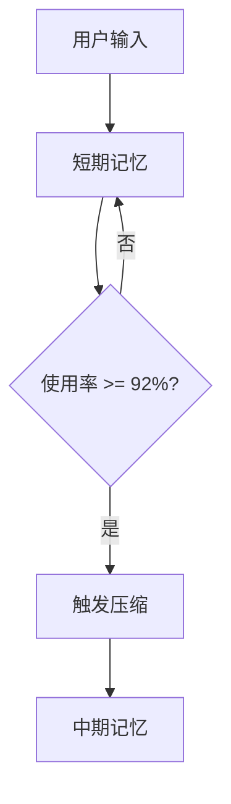
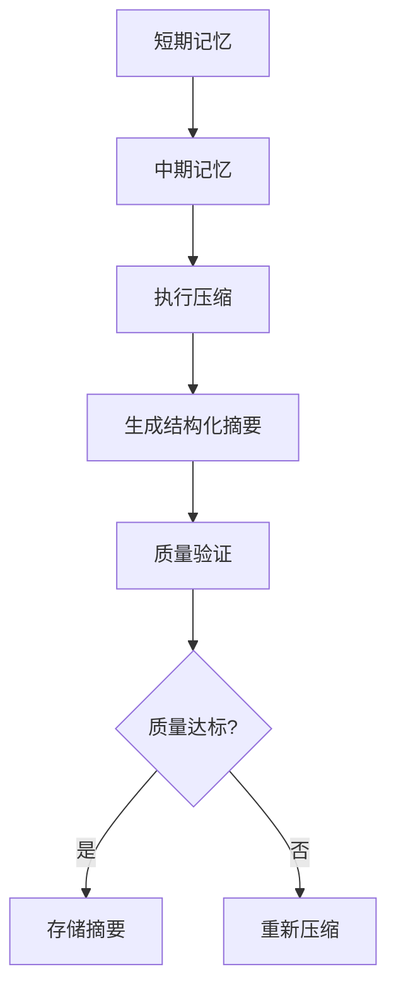
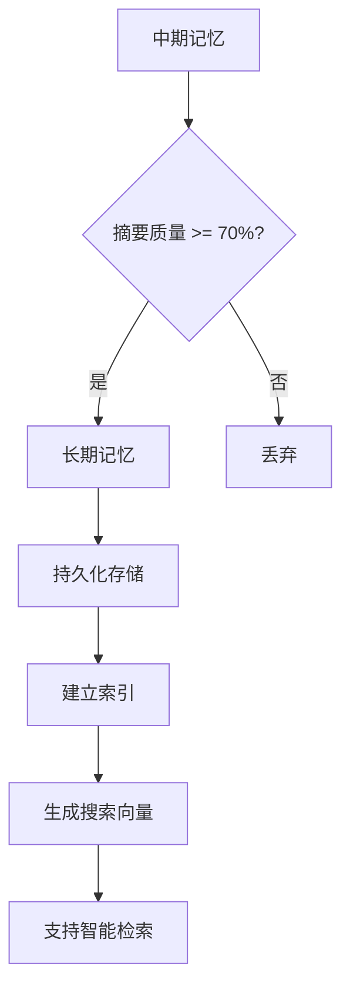
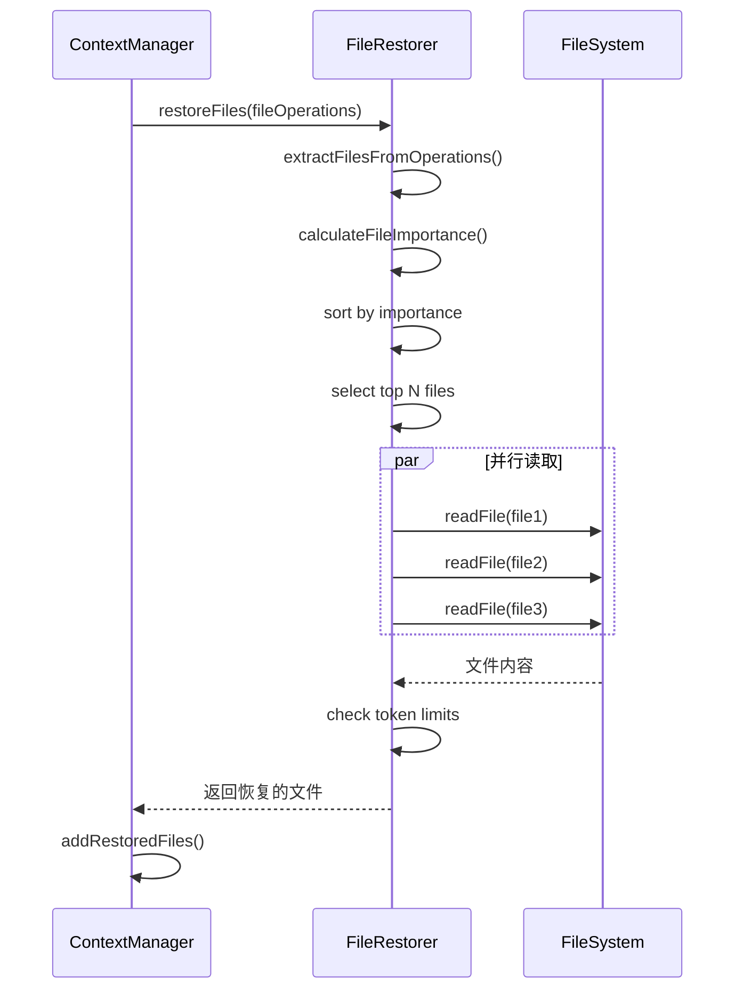

# 上下文优化

<cite>
**本文档引用的文件**   
- [ClaudeContextManager.js](file://context-claude-code/src/claude-core/ClaudeContextManager.js)
- [WU2Compressor.js](file://context-claude-code/src/claude-core/WU2Compressor.js)
- [IntelligentFileRestorer.js](file://context-claude-code/src/restoration/IntelligentFileRestorer.js)
- [ShortTermMemory.js](file://context-claude-code/src/memory/ShortTermMemory.js)
- [MidTermMemory.js](file://context-claude-code/src/memory/MidTermMemory.js)
- [LongTermMemory.js](file://context-claude-code/src/memory/LongTermMemory.js)
- [上下文工程管理实践-第3部分-压缩触发.md](file://context-claude-code/上下文工程管理实践-第3部分-压缩触发.md)
- [上下文工程管理实践-第2部分-对话追踪.md](file://context-claude-code/上下文工程管理实践-第2部分-对话追踪.md)
- [三层记忆架构详解.md](file://context-claude-code/三层记忆架构详解.md)
- [TW5文件恢复的详细实现流程.md](file://context-claude-code/TW5文件恢复的详细实现流程.md)
- [Claude_Code_Large_File_Handling_Complete_Guide.md](file://context-claude-code/Claude_Code_Large_File_Handling_Complete_Guide.md)
</cite>

## 目录
1. [引言](#引言)
2. [三层记忆架构](#三层记忆架构)
3. [上下文工程管理实践](#上下文工程管理实践)
4. [可压缩提示词编写技巧](#可压缩提示词编写技巧)
5. [大型文件处理优化](#大型文件处理优化)
6. [选择性上下文注入与智能文件恢复](#选择性上下文注入与智能文件恢复)
7. [常见问题与解决方案](#常见问题与解决方案)
8. [性能影响评估方法](#性能影响评估方法)
9. [结论](#结论)

## 引言

在AI交互系统中，上下文管理是确保对话连贯性和信息完整性的核心。随着对话的深入，上下文信息会迅速膨胀，导致系统性能下降和信息过载。为解决这一问题，本文档详细介绍了基于三层记忆架构的上下文优化策略，结合压缩触发机制和对话追踪策略，提供了一套完整的上下文管理解决方案。

## 三层记忆架构

### 短期记忆

短期记忆层作为高速工作区，负责存储最近的对话消息，提供O(1)的访问效率。它类似于CPU的L1缓存，确保了对当前对话内容的快速访问。

**核心特性**：
- **高速访问**：通过反向遍历算法（VE函数）从最新消息开始查找token使用信息，确保快速获取当前上下文状态
- **智能过滤**：采用三重检查机制（HY5函数）验证usage数据的有效性，排除合成消息和无效数据
- **精确计算**：使用zY5函数精确计算包含缓存的完整token使用量，确保容量管理的准确性
- **自动压缩**：当使用率达到92%阈值时，自动触发压缩流程，防止上下文溢出



**图源**
- [ShortTermMemory.js](file://context-claude-code/src/memory/ShortTermMemory.js#L12-L334)

**本节源**
- [ShortTermMemory.js](file://context-claude-code/src/memory/ShortTermMemory.js#L12-L334)

### 中期记忆

中期记忆层作为智能蒸馏器，负责将短期记忆中的对话历史压缩为结构化摘要。它通过WU2压缩器实现智能压缩，将大量对话内容提炼为精华信息。

**核心功能**：
- **智能压缩**：使用wU2主压缩函数协调整个压缩流程，包括检查压缩需求、执行压缩和更新统计
- **8段式结构化**：生成包含主要请求、技术概念、文件代码、错误修复等8个关键部分的结构化摘要
- **质量验证**：通过validateCompressionResult函数验证压缩结果的完整性，确保所有必需段落都存在
- **统计监控**：维护压缩统计信息，包括成功次数、失败次数、平均压缩比等



**图源**
- [MidTermMemory.js](file://context-claude-code/src/memory/MidTermMemory.js#L13-L411)

**本节源**
- [MidTermMemory.js](file://context-claude-code/src/memory/MidTermMemory.js#L13-L411)

### 长期记忆

长期记忆层作为持久化知识库，负责跨会话存储有价值的摘要和知识。它支持向量化搜索，确保历史经验可以被有效检索和复用。

**核心特性**：
- **持久化存储**：将高质量的摘要保存到磁盘文件中，实现跨会话的知识积累
- **智能搜索**：支持向量化搜索和关键词搜索，提高知识检索的准确性和效率
- **自动整理**：使用LRU算法清理不重要的旧记录，优化存储空间利用率
- **标签系统**：自动提取技术标签和概念标签，便于分类和检索



**图源**
- [LongTermMemory.js](file://context-claude-code/src/memory/LongTermMemory.js#L14-L627)

**本节源**
- [LongTermMemory.js](file://context-claude-code/src/memory/LongTermMemory.js#L14-L627)

## 上下文工程管理实践

### 压缩触发机制

压缩触发机制是上下文管理的核心，它通过渐进式警告系统实时监控上下文使用情况，并在达到阈值时自动触发压缩。

**触发条件**：
- **60%警告阈值**：当使用率达到60%时，系统发出警告，提醒用户注意上下文长度
- **80%错误阈值**：当使用率达到80%时，系统进入紧急状态，强烈建议进行压缩
- **80%压缩阈值**：当使用率达到80%时，系统自动触发压缩流程，防止上下文溢出

```javascript
// 渐进式警告系统评估结果
const warningStatus = claudeContextManager.warningSystem.m11(162000, 0.8);

console.log(`⚠️ 渐进式警告状态检查:`);
console.log(`- 当前级别: ${warningStatus.level}`);              // urgent
console.log(`- 前一级别: ${warningStatus.previousLevel}`);       // warning
console.log(`- 剩余空间: ${warningStatus.percentLeft}%`);        // 19%
console.log(`- 进度条: ${warningStatus.progressBar}`);          // [▓▓▓▓▓▓▓▓▓▓▓▓▓▓▓▓▓▓░░░░] 81%
console.log(`- 估计剩余轮数: ${warningStatus.estimatedTurns}`); // 47轮
```

**本节源**
- [上下文工程管理实践-第3部分-压缩触发.md](file://context-claude-code/上下文工程管理实践-第3部分-压缩触发.md#L1-L799)

### 对话追踪策略

对话追踪策略通过详细记录每一步的message变化和算法处理，确保上下文管理的透明性和可追溯性。

**追踪内容**：
- **消息分布**：记录用户消息、AI消息、工具调用和结果的数量和分布
- **文件操作**：跟踪文件读取、写入和编辑的次数和时间
- **状态变化**：监控token使用量、压缩次数和警告级别的变化
- **组件状态**：记录压缩器、文件恢复器和警告系统的运行状态

```javascript
// 压缩前状态检查
const preCompressionState = {
  messageDistribution: {
    userMessages: 18,
    aiMessages: 20,
    toolCalls: 7,
    toolResults: 5,
    totalMessages: 50
  },
  fileOperations: new Map([
    ['./src/config/auth.js', { operation: 'edit', count: 3, lastAccess: Date.now() }],
    ['./src/models/User.js', { operation: 'create', count: 2, lastAccess: Date.now() }]
  ]),
  state: {
    currentTokenUsage: 162000,
    contextSize: 50
  }
};
```

**本节源**
- [上下文工程管理实践-第2部分-对话追踪.md](file://context-claude-code/上下文工程管理实践-第2部分-对话追踪.md#L1-L799)

## 可压缩提示词编写技巧

### 结构化指令

使用结构化指令可以显著提高提示词的可压缩性。通过明确的段落划分和内容要求，确保压缩器能够准确提取关键信息。

**最佳实践**：
- **明确分段**：将提示词分为主要请求、技术概念、文件代码、错误修复等8个明确的段落
- **具体要求**：在每个段落中提供具体的内容要求，如"列出所有用户消息"、"描述正在进行的任务"
- **优先级排序**：按重要性排序内容，确保最重要的信息在前

```markdown
你的任务是创建一个详细的对话摘要，重点关注用户的明确请求和之前的行动。
摘要应详尽地捕捉对继续开发工作至关重要的技术细节、代码模式和架构决策。

在提供最终摘要之前，请在<analysis>标签中组织你的思路，确保你已涵盖所有必要要点。

你的摘要应包括以下部分：

1. 主要请求和意图：详细捕捉用户的所有明确请求和意图
2. 关键技术概念：列出讨论的所有重要技术概念、技术和框架
3. 文件和代码部分：列举检查、修改或创建的特定文件和代码部分
4. 错误和修复：列出遇到的所有错误及修复方法
5. 问题解决：记录已解决的问题和正在进行的故障排除工作
6. 所有用户消息：列出所有非工具结果的用户消息
7. 待办任务：概述明确要求处理的待办任务
8. 当前工作：详细描述在请求摘要前正在处理的工作
9. 可选下一步：列出与最近工作相关的下一步行动
```

### 避免冗余描述

避免冗余描述是提高提示词效率的关键。通过精简语言和去除重复信息，减少不必要的token消耗。

**优化技巧**：
- **去除重复**：避免在不同段落中重复相同的信息
- **简洁表达**：使用简洁的语言表达复杂概念
- **聚焦重点**：只保留对任务完成至关重要的信息

### 合理标记关键信息

合理标记关键信息可以帮助压缩器更好地识别和保留重要内容。

**标记方法**：
- **代码块**：使用\`\`\`标记代码片段，确保代码完整性
- **文件引用**：明确标记文件路径和名称
- **重要概念**：使用加粗或斜体强调关键概念

**本节源**
- [上下文工程管理实践-第3部分-压缩触发.md](file://context-claude-code/上下文工程管理实践-第3部分-压缩触发.md#L1-L799)

## 大型文件处理优化

### WU2Compressor优化

WU2Compressor通过智能算法优化大型文件处理，确保在有限的上下文窗口内最大化信息价值。

**核心功能**：
- **上下文保护**：预估总大小并添加警告，防止超出上下文窗口限制
- **智能截断**：当检测到大容量对话时，应用智能截断策略
- **格式化处理**：对工具调用和结果进行特殊处理，确保关键信息不丢失

```javascript
// formatMessagesForCompression函数处理
function formatMessagesForCompression(messages) {
  return messages.map(msg => {
    const timestamp = new Date(msg.timestamp).toISOString();
    const role = msg.role.toUpperCase();
    const content = msg.content || '';

    // 处理工具调用消息
    if (msg.tool_calls) {
      const toolCalls = msg.tool_calls.map(call =>
        `[TOOL_CALL] ${call.function.name}: ${call.function.arguments}`
      ).join('\n');

      return `[${timestamp}] ${role}:\n${toolCalls}`;
    }

    // 处理工具结果消息
    if (msg.tool_call_id) {
      const preview = content.length > 500
        ? content.substring(0, 500) + '...[TRUNCATED]'
        : content;

      return `[${timestamp}] TOOL_RESULT (${msg.tool_call_id}):\n${preview}`;
    }

    // 处理普通消息
    const preview = content.length > 1000
      ? content.substring(0, 1000) + '...[TRUNCATED]'
      : content;

    return `[${timestamp}] ${role}:\n${preview}`;
  }).join('\n\n');
}
```

**本节源**
- [WU2Compressor.js](file://context-claude-code/src/claude-core/WU2Compressor.js#L28-L643)

### ContextManager.js优化

ContextManager.js通过集成多个核心组件，实现对大型文件的综合管理。

**集成组件**：
- **文件处理器**：处理文本文件的读取、截断和分块
- **图片处理器**：优化图片文件的大小和格式
- **模型适配器**：根据不同LLM模型动态调整上下文限制
- **调试命令系统**：提供调试和优化工具

```javascript
// ClaudeContextManager 初始化
initializeNewComponents() {
  // 文件处理器
  this.fileProcessor = new FileProcessor({
    maxFileLines: this.config.maxFileLines,
    enableFileTruncation: this.config.enableFileTruncation,
    chunkSize: this.config.chunkSize
  });

  // 模型适配器
  this.modelAdapter = new ModelAdapter({
    defaultMaxTokens: this.config.maxTokens,
    enableAdaptiveLimits: true
  });

  // 图片处理器
  this.imageProcessor = new ImageProcessor({
    maxImageSize: this.config.maxImageSize,
    enableAutoCompression: this.config.enableImageOptimization
  });

  // 调试命令系统
  this.debugCommands = new DebugCommands(this, {
    enableDebugCommands: this.config.enableDebugCommands
  });
}
```

**本节源**
- [ClaudeContextManager.js](file://context-claude-code/src/claude-core/ClaudeContextManager.js#L19-L786)

## 选择性上下文注入与智能文件恢复

### IntelligentFileRestorer.js

IntelligentFileRestorer.js通过智能算法在压缩后恢复重要文件内容，确保上下文的连续性。

**核心算法**：
- **五维评分系统**：从时间、频率、操作类型、文件类型和项目相关性五个维度评估文件重要性
- **并行处理**：同时读取多个文件，提高恢复效率
- **Token管理**：严格控制单文件和总体Token限制，防止上下文溢出

```javascript
// 五维评分算法
calculateFileImportance(filename, fileData, agentContext) {
  let score = 0;

  // 1. 时间评分 (35%权重)
  const timeScore = this.calculateTimeScore(fileData);
  score += timeScore * 0.35;

  // 2. 频率评分 (25%权重)
  const frequencyScore = this.calculateFrequencyScore(filename, fileData);
  score += frequencyScore * 0.25;

  // 3. 操作类型评分 (20%权重)
  const operationScore = this.calculateOperationScore(fileData);
  score += operationScore * 0.20;

  // 4. 文件类型评分 (15%权重)
  const fileTypeScore = this.calculateFileTypeScore(filename);
  score += fileTypeScore * 0.15;

  // 5. 项目相关性评分 (5%权重)
  const relevanceScore = this.calculateRelevanceScore(filename, agentContext);
  score += relevanceScore * 0.05;

  return score;
}
```

**本节源**
- [IntelligentFileRestorer.js](file://context-claude-code/src/restoration/IntelligentFileRestorer.js#L13-L644)

### 选择性上下文注入

选择性上下文注入通过智能算法选择最重要的文件进行恢复，确保在有限的Token空间内最大化信息价值。

**实现流程**：
1. **文件识别**：从文件操作历史中提取所有相关文件
2. **评分排序**：计算每个文件的重要性评分并按重要性排序
3. **选择文件**：选择评分最高的前N个文件
4. **并行读取**：同时读取选中的文件内容
5. **Token管理**：检查总Token限制，必要时进行智能截断



**图源**
- [TW5文件恢复的详细实现流程.md](file://context-claude-code/TW5文件恢复的详细实现流程.md#L1-L561)

**本节源**
- [TW5文件恢复的详细实现流程.md](file://context-claude-code/TW5文件恢复的详细实现流程.md#L1-L561)

## 常见问题与解决方案

### 上下文丢失

**问题描述**：在长时间对话中，由于上下文压缩，重要信息可能丢失。

**解决方案**：
- **智能文件恢复**：使用TW5文件恢复系统在压缩后恢复重要文件
- **长期记忆存储**：将高质量的摘要保存到长期记忆中，实现跨会话的知识积累
- **定期备份**：定期导出系统状态，防止意外丢失

### 信息过载

**问题描述**：在处理大型项目时，上下文信息可能过于庞大，导致系统性能下降。

**解决方案**：
- **选择性注入**：只注入当前任务相关的文件和信息
- **智能截断**：对大文件进行智能截断，保留关键部分
- **分块处理**：将大文件分块处理，逐步注入上下文

### 性能下降

**问题描述**：随着上下文增长，系统响应速度变慢。

**解决方案**：
- **定期压缩**：设置合理的压缩阈值，定期清理上下文
- **缓存机制**：使用LRU缓存避免重复读取相同文件
- **并行处理**：使用并行处理提高文件读取和压缩效率

**本节源**
- [Claude_Code_Large_File_Handling_Complete_Guide.md](file://context-claude-code/Claude_Code_Large_File_Handling_Complete_Guide.md#L1-L1955)

## 性能影响评估方法

### 压缩效率评估

通过压缩比和信息密度等指标评估压缩效率。

**评估指标**：
- **压缩比**：压缩后token数与原始token数的比率
- **信息密度**：单位token包含的信息量
- **质量评分**：摘要的质量评分，反映信息的完整性和准确性

```javascript
// 压缩统计信息
const compressionStats = {
  originalMessageCount: preCompressionState.shortTermMemory.messages.length,
  originalTokens: currentUsage,
  compressedTokens: estimateTokens(compressionResult),
  compressionRatio: estimateTokens(compressionResult) / currentUsage,
  compressionTime: compressionDuration
};
```

### 系统性能监控

通过实时监控系统性能，及时发现和解决性能问题。

**监控指标**：
- **Token使用率**：当前token使用量与最大限制的比率
- **压缩次数**：已完成的压缩次数
- **文件操作**：文件读取和写入的次数
- **上下文质量**：上下文的相关性和信息密度

```javascript
// 更新监控指标
monitoringMetrics.tokenUsage = {
  current: 0,
  peak: beforeCleanup.memoryUsage,
  compressionCount: 1,
  averageCompressionRatio: compressionStats.compressionRatio
};
```

**本节源**
- [上下文工程管理实践-第3部分-压缩触发.md](file://context-claude-code/上下文工程管理实践-第3部分-压缩触发.md#L1-L799)

## 结论

通过三层记忆架构、压缩触发机制和对话追踪策略的综合应用，可以有效管理AI交互中的上下文信息。WU2Compressor和IntelligentFileRestorer.js等工具的优化使用，进一步提高了大型文件处理的效率。选择性上下文注入和智能文件恢复机制确保了上下文的连续性和完整性。通过合理的性能评估方法，可以持续优化系统性能，为用户提供高效、稳定的AI交互体验。

**本节源**
- [三层记忆架构详解.md](file://context-claude-code/三层记忆架构详解.md#L1-L866)