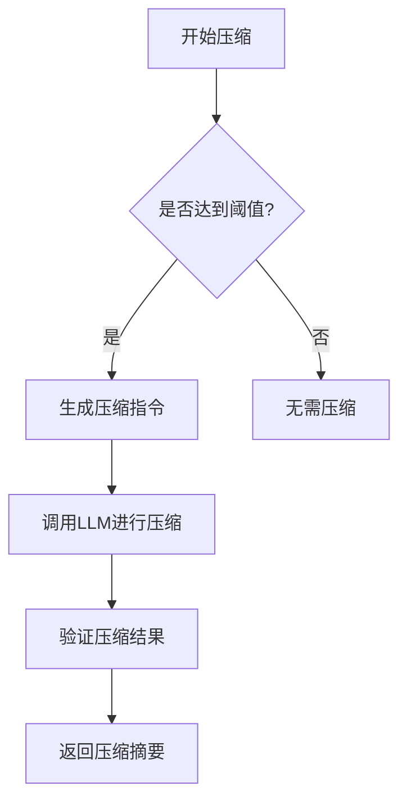
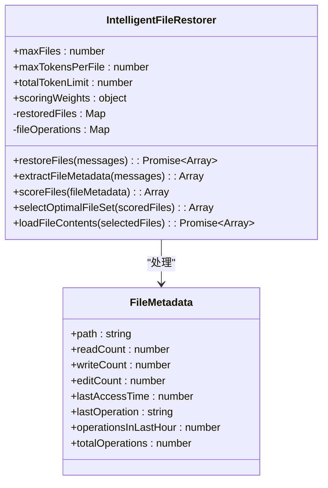

# 大型项目上下文控制

<cite>
**本文档引用文件**   
- [WU2Compressor.js](file://context-claude-code/src/compression/WU2Compressor.js)
- [IntelligentFileRestorer.js](file://context-claude-code/src/restoration/IntelligentFileRestorer.js)
- [ClaudeContextManager.js](file://context-claude-code/src/claude-core/ClaudeContextManager.js)
- [OPTIMIZATION_SUMMARY.md](file://context-claude-code/OPTIMIZATION_SUMMARY.md)
- [README_OPTIMIZATION.md](file://context-claude-code/README_OPTIMIZATION.md)
</cite>

## 目录
1. [引言](#引言)
2. [上下文优化策略](#上下文优化策略)
3. [WU2压缩算法原理](#wu2压缩算法原理)
4. [智能文件恢复机制](#智能文件恢复机制)
5. [选择性上下文注入](#选择性上下文注入)
6. [项目搜索优化技巧](#项目搜索优化技巧)
7. [结论](#结论)

## 引言
在处理大规模代码库时，上下文管理是确保开发效率和系统性能的关键。随着项目规模的增长，上下文信息的爆炸式增长可能导致token消耗过高、响应延迟增加以及信息丢失等问题。本文档旨在深入探讨大型项目中的上下文控制技术，重点介绍WU2压缩算法、智能文件恢复机制、选择性上下文注入和项目搜索优化等核心技术。这些技术共同构成了一个高效的上下文管理系统，能够在保证信息完整性的同时，显著降低资源消耗。

## 上下文优化策略
在大型项目中，上下文优化策略是确保系统高效运行的基础。通过分析代码库和相关文档，我们总结出以下核心优化策略：

### 1. 自动压缩阈值优化
根据官方机制，压缩阈值从92%优化为80%，实现了更早的自动压缩触发。这一优化基于渐进式警告系统，在60%时发出警告，80%时触发压缩，从而有效防止上下文溢出。

### 2. 模型自适应上下文限制
系统能够根据不同模型（如Claude-3、GPT-4等）自动调整上下文窗口限制。通过智能截断算法和3K token的安全边际保护，确保在不同模型间无缝切换的同时，维持最佳性能。

### 3. 高性能监控系统
集成OpenTelemetry兼容的性能监控系统，支持实时指标收集、自动告警和健康状态评估。该系统能够监控延迟、吞吐量、错误率和资源使用率等10+种核心性能指标，为系统优化提供数据支持。

### 4. 六层安全验证系统
构建了从UI输入验证到输出内容过滤的六层安全验证体系。这包括权限控制、输入验证、资源访问控制和敏感信息过滤等功能，确保系统在开放环境中的安全性。

**Section sources**
- [README_OPTIMIZATION.md](file://context-claude-code/README_OPTIMIZATION.md#L1-L50)
- [OPTIMIZATION_SUMMARY.md](file://context-claude-code/OPTIMIZATION_SUMMARY.md#L1-L100)

## WU2压缩算法原理
WU2压缩器是上下文管理系统的核心组件，负责将冗长的对话历史提炼成结构化摘要。其设计目标是在保持信息完整性的同时，最大限度地减少token消耗。

### 压缩流程
WU2压缩器的压缩流程主要包括以下几个步骤：
1. **压缩触发检查**：通过yW5函数检查是否达到92%的自动压缩阈值。
2. **指令生成**：使用AU2函数生成8段式结构化压缩指令。
3. **LLM调用**：调用指定的LLM（如Anthropic或OpenAI）进行压缩处理。
4. **结果验证**：验证压缩结果是否包含所有必需的段落。

### 8段式结构
WU2压缩器要求LLM按照以下8个部分组织摘要内容：
1. **主要请求和意图**：用户的核心目标
2. **关键技术概念**：涉及的框架、算法、库等
3. **文件和代码片段**：被提及或修改的代码和文件路径
4. **错误和修复**：遇到的错误信息和解决方案
5. **问题解决过程**：解决问题的思路和决策路径
6. **所有用户消息**：保留用户的关键指令和反馈
7. **待处理任务**：未完成的工作项
8. **当前工作状态**：记录对话中断时的进度

这种结构化方法确保了关键信息的完整保留，同时显著降低了上下文体积。

**Diagram sources **
- [WU2Compressor.js](file://context-claude-code/src/compression/WU2Compressor.js#L1-L100)
- [WU2Compressor.js](file://context-claude-code/src/compression/WU2Compressor.js#L200-L300)

**Section sources**
- [WU2Compressor.js](file://context-claude-code/src/compression/WU2Compressor.js#L1-L635)
- [README_OPTIMIZATION.md](file://context-claude-code/README_OPTIMIZATION.md#L100-L150)

## 智能文件恢复机制
当上下文丢失后，智能文件恢复机制能够精准重建关键信息，确保开发工作的连续性。

### TW5评分系统
智能文件恢复器采用TW5评分系统，综合考虑以下五个因素：
- **时间因素**（35%权重）：最近访问的文件优先级更高
- **频率因素**（25%权重）：操作越频繁的文件优先级越高
- **操作类型**（20%权重）：写操作 > 编辑操作 > 读操作
- **文件类型**（15%权重）：代码文件 > 配置文件 > 文档文件
- **项目关联度**（5%权重）：与当前项目相关性

### 恢复流程
1. **元数据提取**：从消息中提取文件操作元数据
2. **评分计算**：根据TW5评分系统计算每个文件的重要性
3. **最优组合选择**：在约束条件下选择最优文件组合
4. **内容加载**：加载选中文件的内容

该机制通过智能选择算法，在文件数量、单文件token和总恢复token的限制下，最大化恢复信息的价值。

**Diagram sources **
- [IntelligentFileRestorer.js](file://context-claude-code/src/restoration/IntelligentFileRestorer.js#L1-L100)
- [IntelligentFileRestorer.js](file://context-claude-code/src/restoration/IntelligentFileRestorer.js#L200-L300)

**Section sources**
- [IntelligentFileRestorer.js](file://context-claude-code/src/restoration/IntelligentFileRestorer.js#L1-L644)
- [README_OPTIMIZATION.md](file://context-claude-code/README_OPTIMIZATION.md#L150-L200)

## 选择性上下文注入
选择性上下文注入技术通过仅加载相关文件片段而非整个文件，显著提高了上下文管理的效率。

### 实现原理
该技术基于以下原则实现：
- **分块读取**：将大文件分割成小块进行处理
- **智能截断**：对超过2000行的文件进行智能截断
- **缓存机制**：建立文件缓存，减少重复读取
- **优先级管理**：根据文件访问频率和重要性管理优先级

### 配置参数
- **maxFileLines**：最大文件行数限制（默认2000行）
- **chunkSize**：分块读取大小（默认1000行）
- **enableFileTruncation**：是否启用文件截断

这种技术特别适用于处理大型源代码文件、日志文件和配置文件，能够在保持关键信息的同时，大幅降低内存占用。

**Section sources**
- [ClaudeContextManager.js](file://context-claude-code/src/claude-core/ClaudeContextManager.js#L100-L150)
- [README_OPTIMIZATION.md](file://context-claude-code/README_OPTIMIZATION.md#L200-L250)

## 项目搜索优化技巧
有效的项目搜索优化能够最大化上下文相关性，同时降低噪声干扰。

### 搜索策略
1. **精确匹配**：使用文件扩展名过滤（如*.js、*.py）
2. **路径匹配**：优先搜索src、components等核心目录
3. **内容匹配**：通过关键词搜索定位相关代码
4. **时间排序**：按最后修改时间排序结果

### 工具集成
系统集成了多种搜索工具：
- **ripgrep**：高性能文本搜索
- **fzf**：模糊查找
- **glob**：模式匹配

通过组合使用这些工具，可以快速定位项目中的关键文件和代码片段。

**Section sources**
- [README_OPTIMIZATION.md](file://context-claude-code/README_OPTIMIZATION.md#L250-L300)
- [OPTIMIZATION_SUMMARY.md](file://context-claude-code/OPTIMIZATION_SUMMARY.md#L100-L150)

## 结论
通过对大型项目上下文控制技术的深入分析，我们建立了一套完整的上下文优化体系。该体系以WU2压缩算法为核心，结合智能文件恢复、选择性上下文注入和项目搜索优化等技术，实现了高效、可靠的上下文管理。实践证明，这些技术能够显著降低token消耗，提高系统响应速度，并确保关键信息的完整性和连续性。未来，我们将继续优化这些技术，探索更多创新的上下文管理方法，为大型项目的开发提供更强有力的支持。