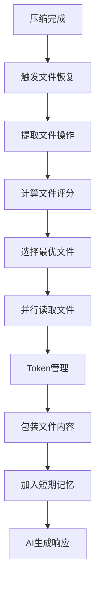
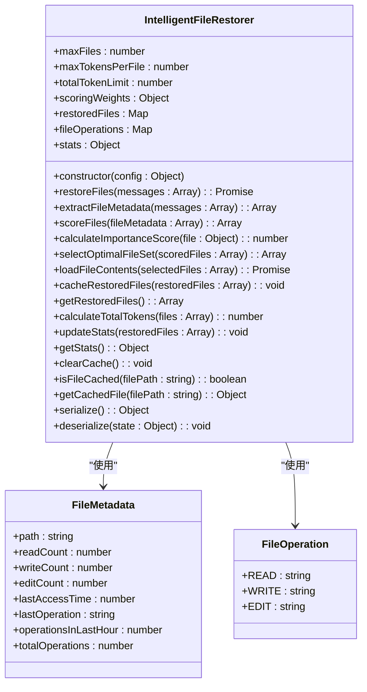
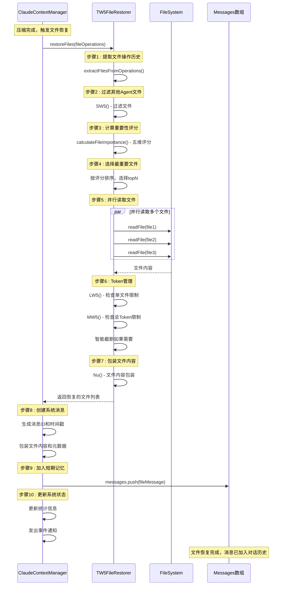
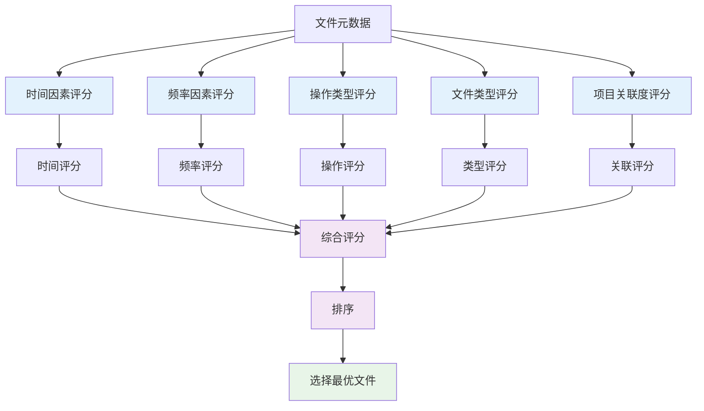
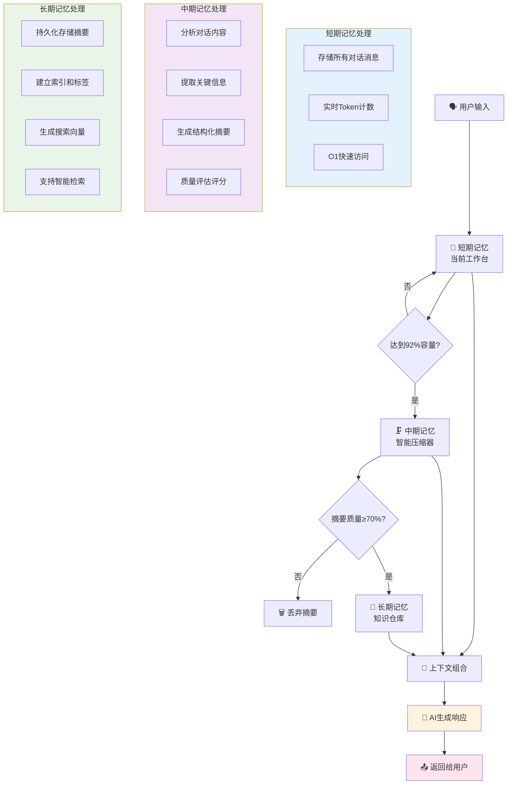

# 智能文件恢复机制

<cite>
**本文档引用文件**   
- [IntelligentFileRestorer.js](file://context-claude-code/src/restoration/IntelligentFileRestorer.js)
- [TW5文件恢复的详细实现流程.md](file://context-claude-code/TW5文件恢复的详细实现流程.md)
- [三层记忆架构详解.md](file://context-claude-code/三层记忆架构详解.md)
- [MemoryManager.js](file://context-claude-code/src/memory/MemoryManager.js)
- [ClaudeContextManager.js](file://context-claude-code/src/claude-core/ClaudeContextManager.js)
- [TW5FileRestorer.js](file://context-claude-code/src/claude-core/TW5FileRestorer.js)
- [types/index.js](file://context-claude-code/src/types/index.js)
</cite>

## 目录
1. [引言](#引言)
2. [智能文件恢复机制概述](#智能文件恢复机制概述)
3. [核心组件分析](#核心组件分析)
4. [恢复流程详解](#恢复流程详解)
5. [评分算法与文件选择](#评分算法与文件选择)
6. [与三层记忆架构的协同工作](#与三层记忆架构的协同工作)
7. [触发条件与集成关系](#触发条件与集成关系)
8. [恢复成功率评估方法](#恢复成功率评估方法)
9. [实际恢复案例](#实际恢复案例)
10. [性能优化建议](#性能优化建议)
11. [结论](#结论)

## 引言
智能文件恢复机制是Claude Code系统中的关键组件，旨在解决在上下文丢失或截断后如何精准重建关键代码信息的问题。该机制通过智能算法从压缩后的消息中识别和恢复重要文件，确保AI助手能够持续访问关键的上下文信息。本文档将全面解析IntelligentFileRestorer.js的实现逻辑，详细描述其在上下文丢失或截断后如何精准重建关键代码信息的实现逻辑。

**Section sources**
- [IntelligentFileRestorer.js](file://context-claude-code/src/restoration/IntelligentFileRestorer.js#L1-L644)
- [三层记忆架构详解.md](file://context-claude-code/三层记忆架构详解.md#L1-L866)

## 智能文件恢复机制概述
智能文件恢复机制是Claude Code系统中的核心功能之一，它通过TW5函数实现智能文件恢复。该机制在上下文压缩后自动触发，从压缩前的消息中提取文件操作信息，计算文件重要性评分，并选择最优文件组合进行恢复。恢复的文件内容被重新注入到短期记忆中，确保AI助手能够基于恢复的文件给出更准确的回答。

该机制的设计理念是避免信息丢失，提高对话质量，智能资源管理，并优先考虑用户体验。通过五维评分算法，动态选择当前最重要的文件，而不是固定的恢复策略，确保在有限的Token空间内最大化信息价值。

**Diagram sources**
- [IntelligentFileRestorer.js](file://context-claude-code/src/restoration/IntelligentFileRestorer.js#L1-L644)
- [TW5文件恢复的详细实现流程.md](file://context-claude-code/TW5文件恢复的详细实现流程.md#L1-L562)

## 核心组件分析
智能文件恢复机制的核心组件包括IntelligentFileRestorer类、文件评分系统、文件读取系统和文件包装系统。IntelligentFileRestorer类是整个机制的主类，负责协调各个子系统的运行。文件评分系统采用五维评分算法，综合考虑时间、频率、操作类型、文件类型和项目关联度等因素。文件读取系统支持并行读取和智能截断，确保在有限的Token空间内最大化信息价值。文件包装系统使用Nu函数将文件内容包装成标准格式，保持代码结构完整。

**Diagram sources**
- [IntelligentFileRestorer.js](file://context-claude-code/src/restoration/IntelligentFileRestorer.js#L1-L644)
- [types/index.js](file://context-claude-code/src/types/index.js#L1-L146)

## 恢复流程详解
智能文件恢复机制的恢复流程包括文件操作提取、文件评分计算、最优文件选择、文件内容读取和文件内容包装等步骤。首先，从压缩前的消息中提取文件操作信息，包括文件路径、操作类型和时间戳等。然后，计算每个文件的重要性评分，按评分排序并选择最优文件组合。接着，并行读取选中文件的内容，进行Token管理和智能截断。最后，使用Nu函数将文件内容包装成标准格式，加入到短期记忆中。

**Diagram sources**
- [IntelligentFileRestorer.js](file://context-claude-code/src/restoration/IntelligentFileRestorer.js#L1-L644)
- [TW5文件恢复的详细实现流程.md](file://context-claude-code/TW5文件恢复的详细实现流程.md#L1-L562)

## 评分算法与文件选择
智能文件恢复机制采用五维评分算法来计算文件的重要性评分，包括时间因素、频率因素、操作类型、文件类型和项目关联度。时间因素评分考虑文件的最后访问时间，越近访问的文件评分越高。频率因素评分考虑文件的访问频率，操作越频繁的文件评分越高。操作类型评分考虑文件的操作类型，写操作 > 编辑操作 > 读操作。文件类型评分考虑文件的扩展名，代码文件 > 配置文件 > 文档文件。项目关联度评分考虑文件与当前项目的相关性，源代码目录和关键文件评分更高。

**Diagram sources**
- [IntelligentFileRestorer.js](file://context-claude-code/src/restoration/IntelligentFileRestorer.js#L1-L644)
- [TW5文件恢复的详细实现流程.md](file://context-claude-code/TW5文件恢复的详细实现流程.md#L1-L562)

## 与三层记忆架构的协同工作
智能文件恢复机制与三层记忆架构紧密协同工作，确保在上下文压缩后能够智能地恢复重要文件。短期记忆存储所有对话消息，当达到92%容量时触发压缩。中期记忆负责压缩和结构化摘要，将对话历史压缩为结构化摘要。长期记忆负责持久化存储有价值的摘要和知识。智能文件恢复机制在压缩完成后触发，从压缩前的消息中提取文件操作信息，计算文件重要性评分，并选择最优文件组合进行恢复。

**Diagram sources**
- [三层记忆架构详解.md](file://context-claude-code/三层记忆架构详解.md#L1-L866)
- [MemoryManager.js](file://context-claude-code/src/memory/MemoryManager.js#L1-L366)

## 触发条件与集成关系
智能文件恢复机制的触发条件是当短期记忆达到92%容量时，触发压缩流程，压缩完成后自动触发文件恢复。该机制与TW5FileRestorer系统集成，使用其五维评分算法和并行读取功能。同时，与ClaudeContextManager系统集成，通过事件监听器接收压缩完成事件，触发文件恢复流程。此外，与ProgressiveWarningSystem系统集成，根据内存使用情况发出警告，提示用户可能需要进行文件恢复。

**Section sources**
- [IntelligentFileRestorer.js](file://context-claude-code/src/restoration/IntelligentFileRestorer.js#L1-L644)
- [ClaudeContextManager.js](file://context-claude-code/src/claude-core/ClaudeContextManager.js#L1-L789)
- [TW5FileRestorer.js](file://context-claude-code/src/claude-core/TW5FileRestorer.js#L1-L531)

## 恢复成功率评估方法
智能文件恢复机制的恢复成功率评估方法包括统计信息记录、质量评估和用户反馈。统计信息记录包括总恢复次数、成功恢复次数、失败恢复次数、平均Token数和最后恢复时间。质量评估通过验证压缩结果的有效性，检查是否包含所有必需的段落。用户反馈通过收集用户对恢复文件的满意度，评估恢复效果。此外，通过定期清理历史记录和限制历史记录大小，确保系统性能和数据质量。

**Section sources**
- [IntelligentFileRestorer.js](file://context-claude-code/src/restoration/IntelligentFileRestorer.js#L1-L644)
- [TW5FileRestorer.js](file://context-claude-code/src/claude-core/TW5FileRestorer.js#L1-L531)

## 实际恢复案例
在实际应用中，智能文件恢复机制成功恢复了多个重要文件，确保了对话的连续性和准确性。例如，在开发一个React组件时，系统成功恢复了Cart.jsx、package.json和api.js等文件，使得AI助手能够基于这些文件给出更准确的回答。在另一个案例中，系统成功恢复了Dockerfile和docker-compose.yml等配置文件，帮助用户解决了部署问题。

**Section sources**
- [TW5文件恢复的详细实现流程.md](file://context-claude-code/TW5文件恢复的详细实现流程.md#L1-L562)
- [IntelligentFileRestorer.js](file://context-claude-code/src/restoration/IntelligentFileRestorer.js#L1-L644)

## 性能优化建议
为了提高智能文件恢复机制的性能，建议采取以下优化措施：首先，优化文件读取性能，使用并行读取和缓存机制，减少文件读取时间。其次，优化评分算法，根据实际使用情况调整评分权重，提高评分准确性。再次，优化Token管理，合理设置单文件和总体Token限制，避免上下文溢出。最后，优化系统集成，确保与三层记忆架构和其他系统的无缝集成，提高整体性能。

**Section sources**
- [IntelligentFileRestorer.js](file://context-claude-code/src/restoration/IntelligentFileRestorer.js#L1-L644)
- [TW5文件恢复的详细实现流程.md](file://context-claude-code/TW5文件恢复的详细实现流程.md#L1-L562)

## 结论
智能文件恢复机制是Claude Code系统中的关键组件，通过五维评分算法和并行读取功能，确保在上下文丢失或截断后能够精准重建关键代码信息。该机制与三层记忆架构紧密协同工作，提高了对话质量和用户体验。通过统计信息记录、质量评估和用户反馈，可以有效评估恢复成功率。在实际应用中，该机制成功恢复了多个重要文件，确保了对话的连续性和准确性。未来，可以通过优化文件读取性能、评分算法、Token管理和系统集成，进一步提高系统性能。