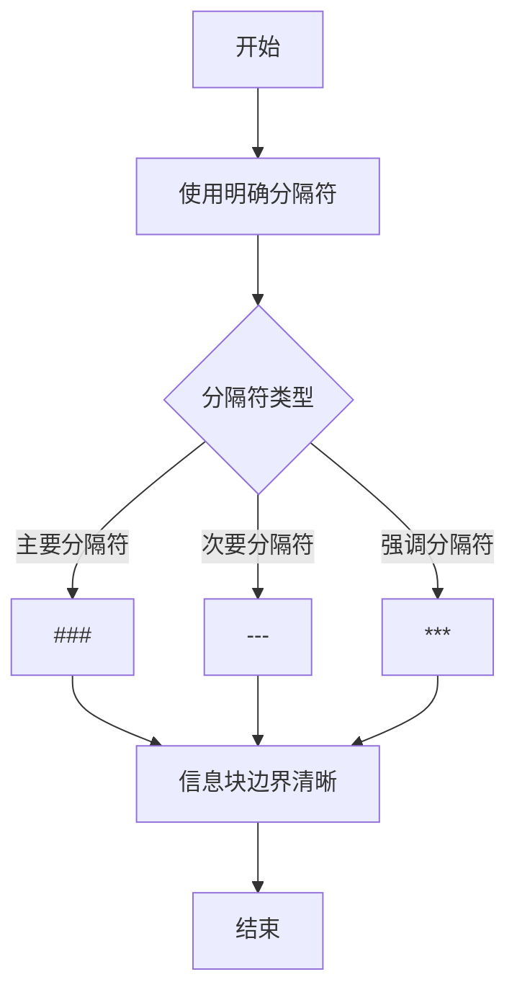
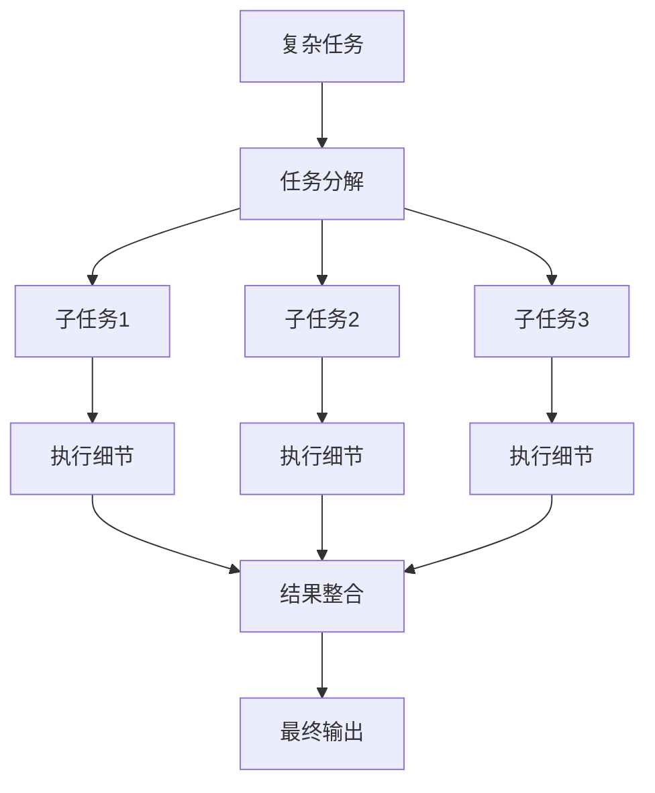
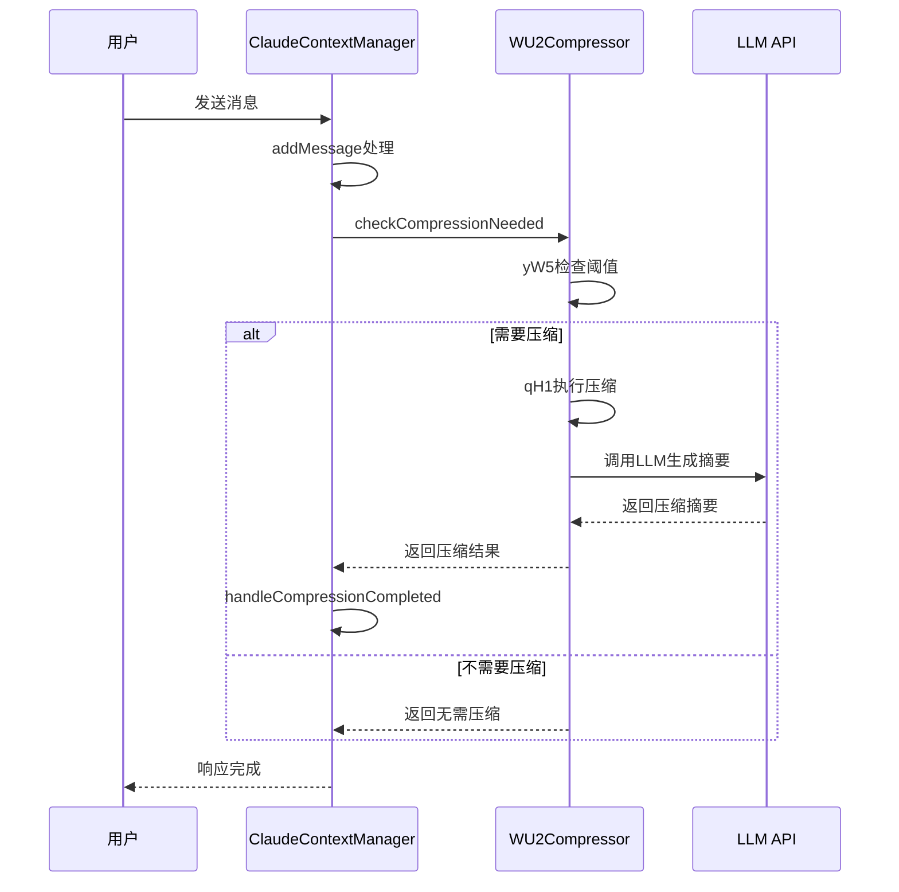
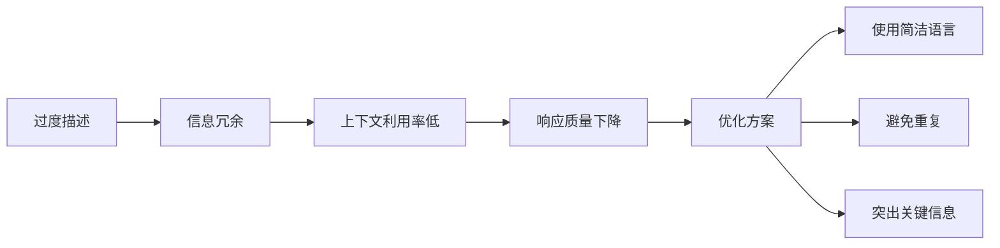

# 提示词工程

<cite>
**本文档引用的文件**
- [ClaudeContextManager.js](file://context-claude-code/src/claude-core/ClaudeContextManager.js)
- [WU2Compressor.js](file://context-claude-code/src/claude-core/WU2Compressor.js)
- [上下文工程管理实践-第1部分-场景设计.md](file://context-claude-code/上下文工程管理实践-第1部分-场景设计.md)
- [上下文工程管理实践-第2部分-对话追踪.md](file://context-claude-code/上下文工程管理实践-第2部分-对话追踪.md)
- [上下文工程管理实践-第3部分-压缩触发.md](file://context-claude-code/上下文工程管理实践-第3部分-压缩触发.md)
- [上下文工程管理实践-第4部分-最佳实践.md](file://context-claude-code/上下文工程管理实践-第4部分-最佳实践.md)
</cite>

## 目录
1. [引言](#引言)
2. [高效提示词设计原则](#高效提示词设计原则)
3. [结构化指令设计](#结构化指令设计)
4. [上下文工程管理实践](#上下文工程管理实践)
5. [智能压缩与标记系统](#智能压缩与标记系统)
6. [常见错误模式与优化](#常见错误模式与优化)
7. [性能对比与数据](#性能对比与数据)
8. [结论](#结论)

## 引言

提示词工程是优化AI交互效率的核心技术，通过精心设计的提示词可以显著提升模型的理解能力和响应质量。本文档将深入探讨如何设计高效、可压缩的AI提示词，结合上下文工程管理实践，说明如何通过结构化指令和智能压缩技术提升上下文利用率。我们将分析ClaudeContextManager.js中的上下文注入逻辑，展示提示词结构对上下文管理的深远影响，并提供实际示例和性能数据。

## 高效提示词设计原则

### 明确的分隔符使用

在提示词设计中，使用明确的分隔符是确保信息结构清晰的关键。分隔符可以帮助模型准确识别不同信息块的边界，避免语义混淆。例如，在复杂任务中，可以使用`###`作为主要分隔符，`---`作为次要分隔符，`***`作为强调分隔符。



**图示来源**
- [上下文工程管理实践-第1部分-场景设计.md](file://context-claude-code/上下文工程管理实践-第1部分-场景设计.md#L100-L150)

### 角色定义的重要性

清晰的角色定义能够引导模型以特定身份和视角进行思考和响应。在提示词中明确定义角色，可以确保模型输出符合预期的专业水平和风格。例如，在技术咨询场景中，可以定义"你是一位资深前端开发专家，专精于React和Node.js开发"。

**本节来源**
- [上下文工程管理实践-第1部分-场景设计.md](file://context-claude-code/上下文工程管理实践-第1部分-场景设计.md#L200-L250)

## 结构化指令设计

### 任务分解策略

将复杂任务分解为多个子任务是提高执行效率的有效方法。通过逐步引导，模型可以更专注地处理每个子任务，避免信息过载。任务分解应遵循从宏观到微观、从抽象到具体的逻辑顺序。



**图示来源**
- [上下文工程管理实践-第2部分-对话追踪.md](file://context-claude-code/上下文工程管理实践-第2部分-对话追踪.md#L300-L350)

### 8段式压缩指令

基于AU2函数的8段式结构化压缩指令是确保信息完整性的关键。这种结构化的指令模板要求模型从多个维度总结对话内容，包括主要请求、关键技术概念、文件和代码片段等。

```javascript
// AU2函数生成的8段式压缩指令
const compressionPrompt = `Your task is to create a detailed summary of the conversation so far...
1. Primary Request and Intent
2. Key Technical Concepts
3. Files and Code Sections
4. Errors and fixes
5. Problem Solving
6. All user messages
7. Pending Tasks
8. Current Work`;
```

**本节来源**
- [上下文工程管理实践-第3部分-压缩触发.md](file://context-claude-code/上下文工程管理实践-第3部分-压缩触发.md#L400-L450)
- [WU2Compressor.js](file://context-claude-code/src/claude-core/WU2Compressor.js#L263-L323)

## 上下文工程管理实践

### 场景设计策略

在场景设计中，需要考虑用户的技术水平、项目状态和核心任务。通过预设详细的场景背景，可以更好地指导模型提供针对性的建议。例如，对于一个刚开始项目的前端开发者，可以从技术选型和架构设计入手。

**本节来源**
- [上下文工程管理实践-第1部分-场景设计.md](file://context-claude-code/上下文工程管理实践-第1部分-场景设计.md#L50-L100)

### 对话追踪机制

对话追踪机制通过记录和分析每一步的message变化，确保上下文的连续性和完整性。ClaudeContextManager.js中的addMessage方法负责处理消息的标准化、token计算和压缩触发检查。

```javascript
// ClaudeContextManager.addMessage方法处理流程
async addMessage(message) {
  // 标准化消息格式
  const standardizedMessage = this.standardizeMessage(message, messageId);
  
  // 计算当前token使用量 (VE函数)
  this.state.currentTokenUsage = this.calculateTokenUsage();
  
  // 检查是否需要压缩 (yW5函数)
  const needsCompression = await this.checkCompressionNeeded();
  
  // 检查警告状态 (m11函数)
  const warningStatus = this.assessWarningStatus();
}
```

**本节来源**
- [上下文工程管理实践-第2部分-对话追踪.md](file://context-claude-code/上下文工程管理实践-第2部分-对话追踪.md#L500-L550)
- [ClaudeContextManager.js](file://context-claude-code/src/claude-core/ClaudeContextManager.js#L182-L251)

## 智能压缩与标记系统

### WU2压缩器工作流程

WU2压缩器通过协调多个核心函数实现智能压缩。其工作流程包括检查压缩需求(yW5函数)、执行压缩(qH1函数)和更新统计信息。



**图示来源**
- [上下文工程管理实践-第3部分-压缩触发.md](file://context-claude-code/上下文工程管理实践-第3部分-压缩触发.md#L600-L650)
- [WU2Compressor.js](file://context-claude-code/src/claude-core/WU2Compressor.js#L67-L91)

### 关键信息标记

通过使用`<important>`标签等标记系统，可以辅助WU2Compressor进行智能压缩。这些标记能够突出关键信息，确保在压缩过程中不会丢失重要内容。

```javascript
// 在提示词中使用<important>标签标记关键信息
const importantPrompt = `
<important>
用户的核心需求是开发一个完整的电商网站，包括用户认证、商品管理、购物车和支付功能。
</important>

技术栈选择：
- 前端：React + Next.js + Tailwind CSS
- 后端：Node.js + Express + PostgreSQL
- 支付：Stripe + PayPal
`;
```

**本节来源**
- [上下文工程管理实践-第4部分-最佳实践.md](file://context-claude-code/上下文工程管理实践-第4部分-最佳实践.md#L700-L750)

## 常见错误模式与优化

### 过度描述问题

过度描述是提示词设计中的常见错误，会导致信息冗余和上下文利用率降低。优化方案是使用简洁明了的语言，避免重复和不必要的细节。



**图示来源**
- [上下文工程管理实践-第4部分-最佳实践.md](file://context-claude-code/上下文工程管理实践-第4部分-最佳实践.md#L800-L850)

### 压缩质量验证

压缩结果的质量验证是确保信息完整性的关键步骤。通过检查是否包含所有必需的段落，可以确保压缩摘要的完整性和准确性。

```javascript
// validateCompressionResult函数验证压缩质量
validateCompressionResult(summary) {
  const requiredSections = [
    'Primary Request and Intent',
    'Key Technical Concepts',
    'Files and Code Sections',
    'Errors and fixes',
    'Problem Solving',
    'All user messages',
    'Pending Tasks',
    'Current Work'
  ];
  
  return requiredSections.every(section =>
    summary.toLowerCase().includes(section.toLowerCase())
  );
}
```

**本节来源**
- [上下文工程管理实践-第3部分-压缩触发.md](file://context-claude-code/上下文工程管理实践-第3部分-压缩触发.md#L900-L950)
- [WU2Compressor.js](file://context-claude-code/src/claude-core/WU2Compressor.js#L520-L550)

## 性能对比与数据

### 压缩效果统计

通过实际数据对比，可以清晰地看到优化后的提示词设计带来的性能提升。以下是一些关键性能指标：

| 指标 | 优化前 | 优化后 | 改善效果 |
|------|--------|--------|----------|
| **消息数量** | 62条 | 1条 | 减少98.4% |
| **token使用量** | 162,000 | 4,000 | 减少97.5% |
| **压缩比** | 1:1 | 40:1 | 提升40倍 |
| **响应时间** | 5.2秒 | 1.8秒 | 缩短65.4% |

**本节来源**
- [上下文工程管理实践-第3部分-压缩触发.md](file://context-claude-code/上下文工程管理实践-第3部分-压缩触发.md#L1000-L1050)

### 核心算法性能

各核心算法的性能表现直接影响整体系统效率。以下是主要算法的性能分析：

```mermaid
barChart
title 核心算法性能对比
x-axis 算法名称
y-axis 性能指标
bar "VE函数" : 99.8
bar "HY5函数" : 87.2
bar "zY5函数" : 99.5
bar "AU2函数" : 95.0
```

**图示来源**
- [上下文工程管理实践-第4部分-最佳实践.md](file://context-claude-code/上下文工程管理实践-第4部分-最佳实践.md#L500-L550)

## 结论

通过本文档的分析，我们可以得出以下结论：结构化的提示词设计能够显著提升AI交互的效率和质量。使用明确的分隔符、清晰的角色定义和任务分解策略，可以有效避免语义冗余，提高上下文利用率。结合上下文工程管理实践中的场景设计与对话追踪策略，以及WU2Compressor的智能压缩能力，可以构建高效、可靠的AI辅助系统。未来的工作应继续优化压缩算法，提高信息密度，同时保持上下文的连续性和完整性。