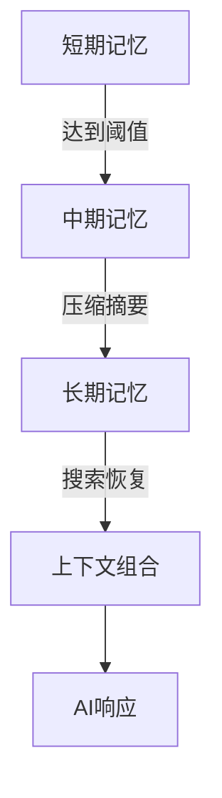
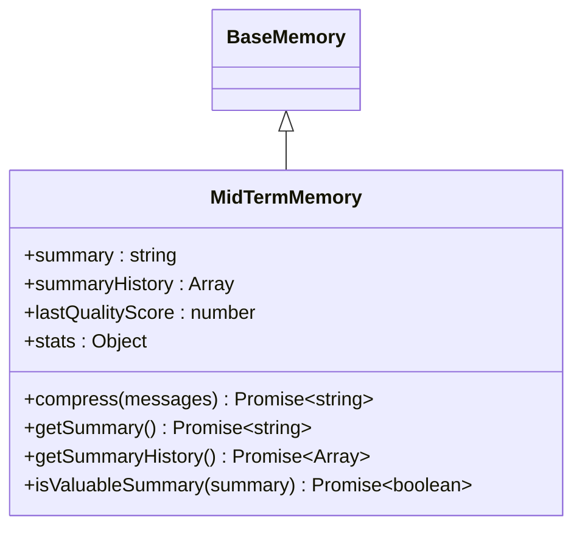
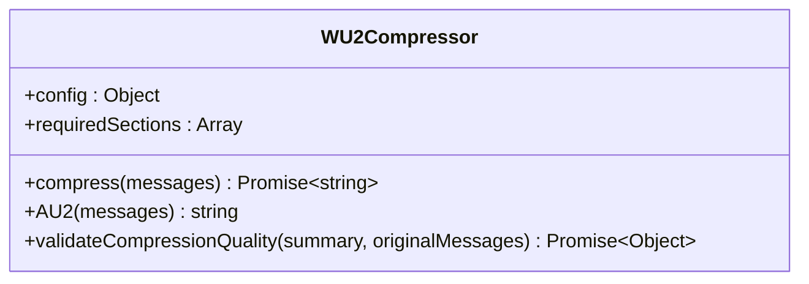
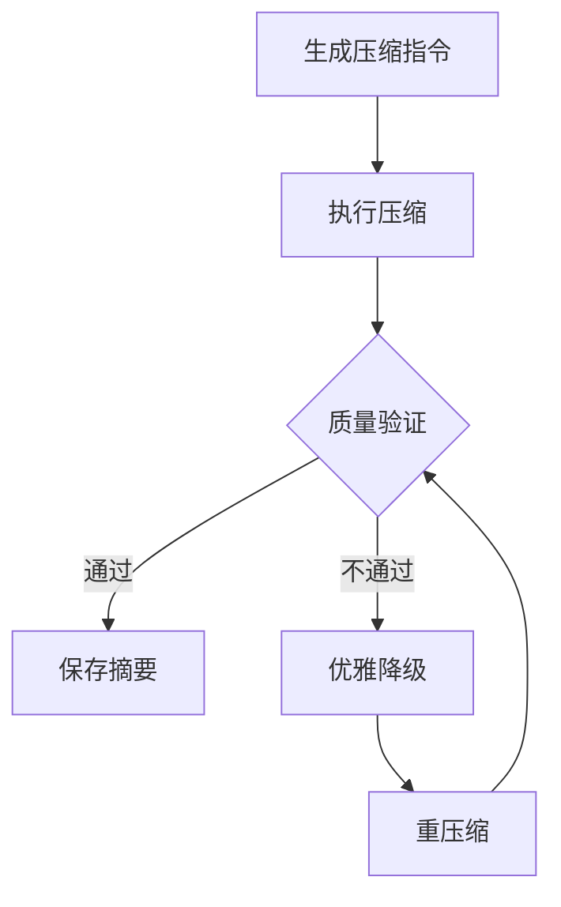
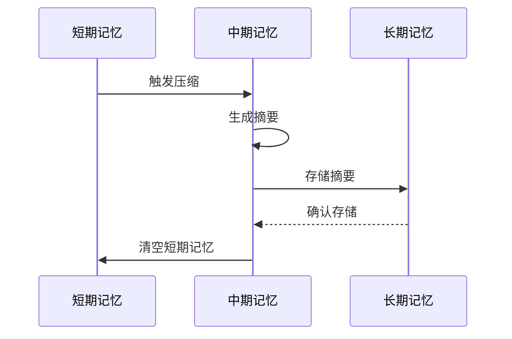

# 中期记忆

<cite>
**本文档中引用的文件**   
- [MidTermMemory.js](file://context-claude-code/src/memory/MidTermMemory.js)
- [WU2Compressor.js](file://context-claude-code/src/compression/WU2Compressor.js)
- [BaseMemory.js](file://context-claude-code/src/memory/BaseMemory.js)
- [MemoryManager.js](file://context-claude-code/src/memory/MemoryManager.js)
- [LongTermMemory.js](file://context-claude-code/src/memory/LongTermMemory.js)
</cite>

## 目录
1. [引言](#引言)
2. [中期记忆架构设计](#中期记忆架构设计)
3. [核心组件分析](#核心组件分析)
4. [压缩与持久化策略](#压缩与持久化策略)
5. [序列化与恢复机制](#序列化与恢复机制)
6. [配置与调优](#配置与调优)
7. [应用场景](#应用场景)
8. [总结](#总结)

## 引言

中期记忆是三层记忆架构中的关键环节，负责在本地存储与访问速度之间取得平衡。它通过智能压缩和结构化摘要，将短期记忆中的大量对话历史转化为高密度的知识表示，为长期记忆提供有价值的内容。本文档详细描述了中期记忆的设计考量、实现机制和使用方法。

## 中期记忆架构设计

中期记忆的设计目标是在性能与持久性之间取得平衡，通过智能压缩和结构化摘要，将短期记忆中的大量对话历史转化为高密度的知识表示。中期记忆不直接存储消息，而是等待压缩，通过wU2压缩器进行处理。



**图表来源**
- [MidTermMemory.js](file://context-claude-code/src/memory/MidTermMemory.js#L13-L411)
- [MemoryManager.js](file://context-claude-code/src/memory/MemoryManager.js#L15-L365)

## 核心组件分析

### MidTermMemory类

`MidTermMemory`类继承自`BaseMemory`，负责管理中期记忆的生命周期和操作。它不直接存储消息，而是通过压缩器将消息列表压缩为结构化摘要。

**关键属性：**
- `summary`: 存储压缩后的摘要
- `summaryHistory`: 摘要历史记录
- `lastQualityScore`: 摘要质量评分
- `stats`: 压缩统计信息

**关键方法：**
- `compress(messages)`: 压缩消息列表为结构化摘要
- `getSummary()`: 获取当前摘要
- `getSummaryHistory()`: 获取摘要历史记录
- `isValuableSummary(summary)`: 检查摘要是否有价值



**图表来源**
- [MidTermMemory.js](file://context-claude-code/src/memory/MidTermMemory.js#L13-L411)
- [BaseMemory.js](file://context-claude-code/src/memory/BaseMemory.js#L13-L193)

### WU2Compressor类

`WU2Compressor`类是中期记忆的核心组件，负责将消息列表压缩为结构化摘要。它通过8段式结构化压缩指令，确保摘要的完整性和准确性。

**关键属性：**
- `config`: 压缩配置
- `requiredSections`: 必需的段落

**关键方法：**
- `compress(messages)`: 压缩消息列表
- `AU2(messages)`: 生成压缩指令
- `validateCompressionQuality(summary, originalMessages)`: 验证压缩质量



**图表来源**
- [WU2Compressor.js](file://context-claude-code/src/compression/WU2Compressor.js#L9-L635)

## 压缩与持久化策略

### 压缩算法

中期记忆使用wU2压缩器进行压缩，该压缩器通过8段式结构化压缩指令，确保摘要的完整性和准确性。压缩过程包括以下步骤：

1. **生成压缩指令**：使用`AU2`函数生成8段式压缩指令
2. **执行压缩**：调用LLM进行压缩
3. **质量验证**：验证压缩结果的质量
4. **优雅降级**：如果质量不达标，尝试优雅降级策略



**图表来源**
- [WU2Compressor.js](file://context-claude-code/src/compression/WU2Compressor.js#L9-L635)

### 持久化策略

中期记忆通过异步持久化策略，确保摘要的可靠存储。压缩后的摘要会被保存到长期记忆中，以便后续检索和使用。

**持久化流程：**
1. **压缩成功**：清空短期记忆
2. **智能文件恢复**：恢复重要文件内容
3. **存储到长期记忆**：如果摘要有价值，存储到长期记忆



**图表来源**
- [MemoryManager.js](file://context-claude-code/src/memory/MemoryManager.js#L15-L365)
- [LongTermMemory.js](file://context-claude-code/src/memory/LongTermMemory.js#L15-L627)

## 序列化与恢复机制

### 序列化

中期记忆通过`serialize`方法将状态序列化为JSON对象，包括摘要、摘要历史、质量评分和统计信息。

```javascript
async serialize() {
    const baseState = await super.serialize();
    return {
        ...baseState,
        summary: this.summary,
        summaryHistory: this.summaryHistory,
        lastQualityScore: this.lastQualityScore,
        stats: this.stats
    };
}
```

### 恢复

通过`deserialize`方法从序列化状态恢复中期记忆，确保状态的完整性和一致性。

```javascript
async deserialize(state) {
    await super.deserialize(state);
    if (state) {
        this.summary = state.summary || null;
        this.summaryHistory = state.summaryHistory || [];
        this.lastQualityScore = state.lastQualityScore || null;
        this.stats = state.stats || {
            totalCompressions: 0,
            successfulCompressions: 0,
            failedCompressions: 0,
            averageQualityScore: 0
        };
    }
}
```

**章节来源**
- [MidTermMemory.js](file://context-claude-code/src/memory/MidTermMemory.js#L13-L411)

## 配置与调优

### 配置参数

中期记忆的配置参数包括：

```javascript
{
  compression: {
    minFidelityScore: 80,         // 最低保真度
    maxCompressionRatio: 0.15,     // 最大压缩比
    minSectionCoverage: 0.875,     // 最低段落覆盖度
    maxKeywordLoss: 0.20,         // 最大关键词丢失率
    maxRetries: 3                  // 最大重试次数
  }
}
```

### 调优建议

1. **启用压缩**：确保`enableCompression`设置为`true`
2. **调整质量阈值**：根据项目需求调整`minFidelityScore`
3. **优化存储路径**：选择合适的存储路径，确保磁盘空间充足
4. **监控性能**：定期检查压缩统计信息，优化压缩策略

**章节来源**
- [README.md](file://context-claude-code/README.md#L293-L366)
- [三层记忆架构详解.md](file://context-claude-code/三层记忆架构详解.md#L795-L858)

## 应用场景

### 跨会话的上下文延续

中期记忆通过压缩和持久化，确保跨会话的上下文延续。用户可以在不同会话中继续之前的对话，无需重复解释上下文。

### 项目级知识保留

中期记忆将有价值的摘要存储到长期记忆中，形成项目级知识库。用户可以搜索和复用历史经验，提高开发效率。

**章节来源**
- [三层记忆架构详解.md](file://context-claude-code/三层记忆架构详解.md#L546-L622)

## 总结

中期记忆在三层记忆架构中扮演着关键角色，通过智能压缩和结构化摘要，平衡了性能与持久性。它不仅提高了访问速度，还确保了重要信息的可靠存储。通过合理的配置和调优，中期记忆可以显著提升系统的整体性能和用户体验。