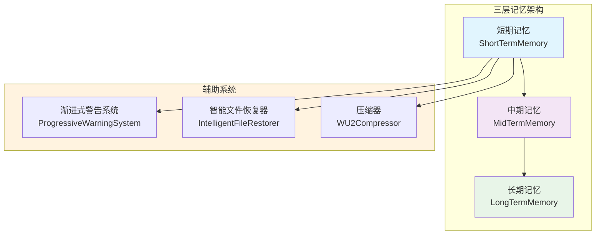
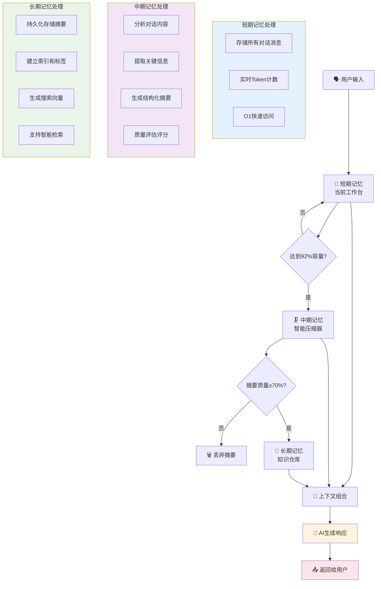
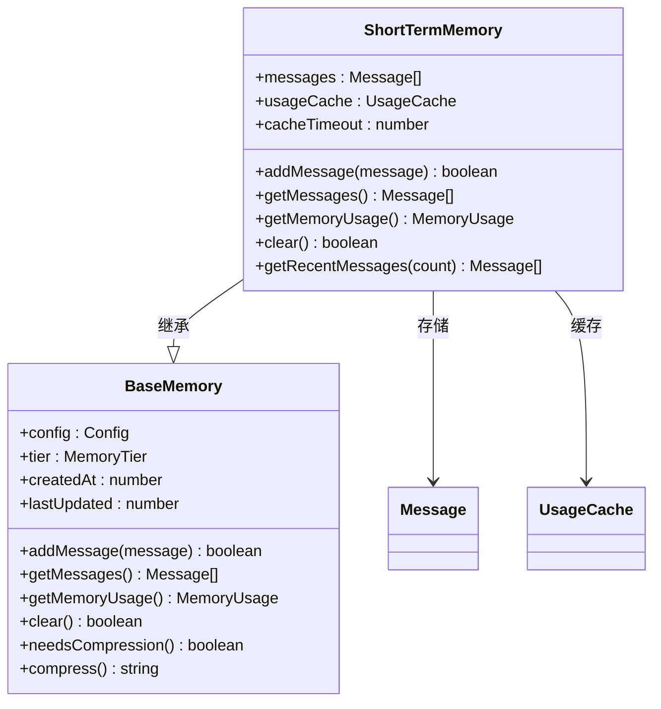
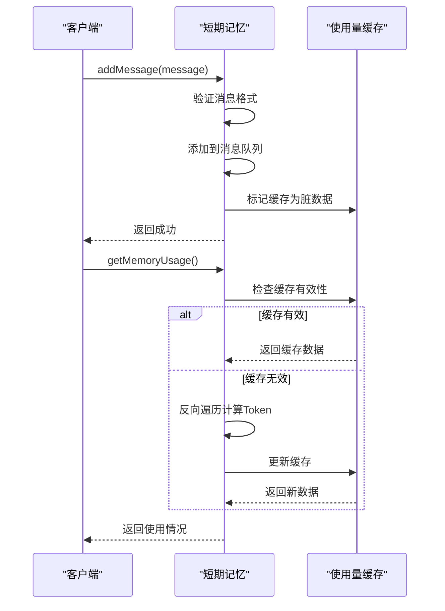
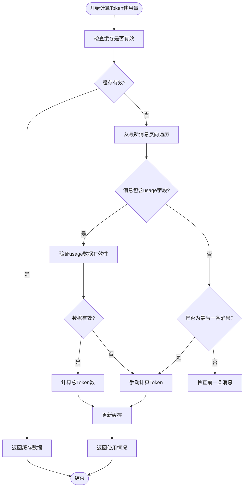
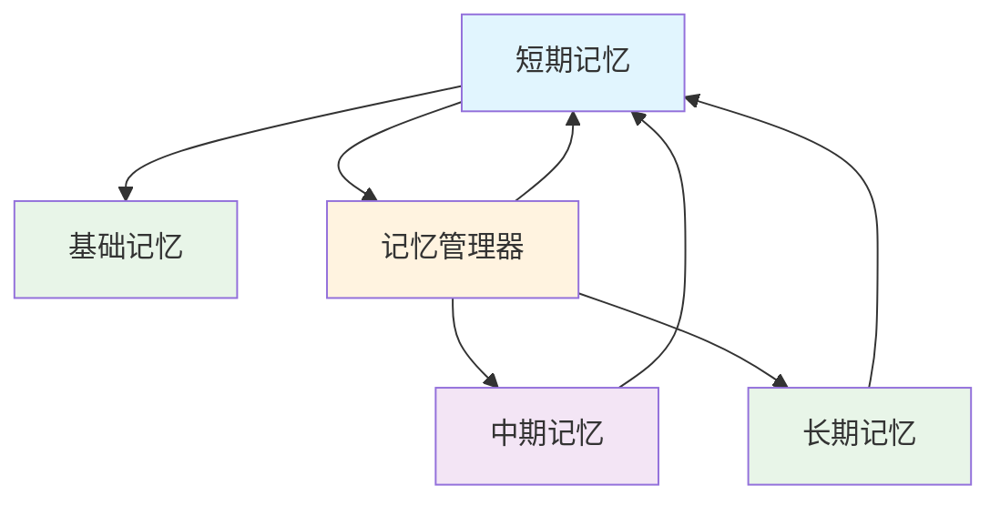

# 短期记忆

<cite>
**Referenced Files in This Document**   
- [ShortTermMemory.js](file://context-claude-code/src/memory/ShortTermMemory.js)
- [BaseMemory.js](file://context-claude-code/src/memory/BaseMemory.js)
- [MidTermMemory.js](file://context-claude-code/src/memory/MidTermMemory.js)
- [MemoryManager.js](file://context-claude-code/src/memory/MemoryManager.js)
- [EnhancedMemoryManager.js](file://context-claude-code/src/memory/EnhancedMemoryManager.js)
- [三层记忆架构详解.md](file://context-claude-code/三层记忆架构详解.md)
</cite>

## 目录
1. [简介](#简介)
2. [项目结构](#项目结构)
3. [核心组件](#核心组件)
4. [架构概述](#架构概述)
5. [详细组件分析](#详细组件分析)
6. [依赖分析](#依赖分析)
7. [性能考量](#性能考量)
8. [故障排除指南](#故障排除指南)
9. [结论](#结论)

## 简介

短期记忆机制是三层记忆架构中的核心组件，作为系统的高速工作区，它通过内存缓存实现了毫秒级的上下文检索性能。该机制在高频交互场景下表现出卓越的性能优势，能够快速响应用户请求并维护对话的连续性。短期记忆的设计借鉴了CPU缓存的工作原理，为最近的对话消息提供了O(1)的访问效率，确保了系统在处理大量实时交互时的响应速度。

## 项目结构

短期记忆组件位于`context-claude-code/src/memory/`目录下，是三层记忆架构的一部分。该架构包括短期记忆(ShortTermMemory)、中期记忆(MidTermMemory)和长期记忆(LongTermMemory)，它们共同构成了完整的上下文管理系统。短期记忆作为最活跃的层级，直接与用户交互，负责存储最近的对话消息并提供高速访问。

**Diagram sources**
- [ShortTermMemory.js](file://context-claude-code/src/memory/ShortTermMemory.js#L1-L334)
- [MidTermMemory.js](file://context-claude-code/src/memory/MidTermMemory.js#L1-L411)
- [LongTermMemory.js](file://context-claude-code/src/memory/LongTermMemory.js#L1-L300)

**Section sources**
- [ShortTermMemory.js](file://context-claude-code/src/memory/ShortTermMemory.js#L1-L334)
- [三层记忆架构详解.md](file://context-claude-code/三层记忆架构详解.md#L1-L866)

## 核心组件

短期记忆的核心是`ShortTermMemory`类，它继承自`BaseMemory`抽象基类，并实现了特定于短期记忆的功能。该组件通过消息队列存储最近的对话消息，利用内存缓存实现毫秒级的上下文检索。其性能优势主要体现在O(1)的访问效率上，这使得系统能够在高频交互场景下快速响应。

短期记忆的实现采用了多种优化策略，包括反向遍历算法(VE函数)、智能过滤机制(HY5函数)和精确的Token计算(zY5函数)。这些策略共同确保了系统在处理大量对话时的高效性和准确性。此外，短期记忆还实现了基于会话活跃度的自动清理策略，当内存使用达到预设阈值时，会触发压缩流程，将部分数据转移到中期记忆中。

**Section sources**
- [ShortTermMemory.js](file://context-claude-code/src/memory/ShortTermMemory.js#L12-L334)
- [BaseMemory.js](file://context-claude-code/src/memory/BaseMemory.js#L1-L193)

## 架构概述

短期记忆在三层记忆架构中扮演着关键角色，它作为系统的高速工作区，负责存储和管理最近的对话消息。整个架构的设计模仿了人类大脑的记忆系统，从短期工作记忆到长期知识存储，每一层都有不同的职责和特点。

**Diagram sources**
- [三层记忆架构详解.md](file://context-claude-code/三层记忆架构详解.md#L1-L866)

## 详细组件分析

### 短期记忆分析

短期记忆组件通过内存缓存实现了毫秒级的上下文检索，其核心优势在于高效的访问速度和实时性。该组件采用消息队列的方式存储对话消息，确保了O(1)的访问效率。在高频交互场景下，这种设计使得系统能够快速响应用户请求，维持对话的流畅性。

#### 数据结构设计

**Diagram sources**
- [ShortTermMemory.js](file://context-claude-code/src/memory/ShortTermMemory.js#L12-L334)
- [BaseMemory.js](file://context-claude-code/src/memory/BaseMemory.js#L1-L193)

#### 访问控制与线程安全
短期记忆通过多种机制确保了访问控制和线程安全。首先，`getMessages`方法返回消息数组的副本，防止外部直接修改内部状态。其次，使用`usageCache`对象来缓存Token使用量，并通过`dirty`标志位管理缓存的有效性。这种设计避免了在高并发场景下的数据竞争问题。

**Diagram sources**
- [ShortTermMemory.js](file://context-claude-code/src/memory/ShortTermMemory.js#L69-L123)
- [ShortTermMemory.js](file://context-claude-code/src/memory/ShortTermMemory.js#L40-L54)

#### 性能优化策略
短期记忆采用了多种性能优化策略，其中最核心的是反向遍历算法(VE函数)。该算法从最新消息开始反向查找Token使用信息，因为usage信息通常在最近的AI回复中。这种策略大大减少了遍历的开销，提高了计算效率。

**Diagram sources**
- [ShortTermMemory.js](file://context-claude-code/src/memory/ShortTermMemory.js#L69-L123)
- [ShortTermMemory.js](file://context-claude-code/src/memory/ShortTermMemory.js#L131-L160)

**Section sources**
- [ShortTermMemory.js](file://context-claude-code/src/memory/ShortTermMemory.js#L12-L334)

## 依赖分析

短期记忆组件与其他多个组件存在紧密的依赖关系。它直接依赖于`BaseMemory`基类，继承了基本的记忆管理接口。同时，它与`MemoryManager`紧密协作，由后者协调三层记忆架构的工作流程。

**Diagram sources**
- [MemoryManager.js](file://context-claude-code/src/memory/MemoryManager.js#L15-L365)
- [ShortTermMemory.js](file://context-claude-code/src/memory/ShortTermMemory.js#L12-L334)

**Section sources**
- [MemoryManager.js](file://context-claude-code/src/memory/MemoryManager.js#L15-L365)
- [ShortTermMemory.js](file://context-claude-code/src/memory/ShortTermMemory.js#L12-L334)

## 性能考量

短期记忆在性能方面表现出色，主要得益于其内存缓存机制和优化的算法设计。通过使用`usageCache`缓存Token使用量，并设置5秒的缓存超时，系统避免了频繁的重复计算，显著提升了性能。

在高并发场景下，建议适当增加内存配额以减少上下文丢失的风险。可以通过配置`maxTokens`参数来调整短期记忆的容量，例如将其从默认的200,000增加到更高的值。同时，可以调整`compressionThreshold`参数来控制压缩触发的时机，平衡性能和内存使用。

## 故障排除指南

当遇到短期记忆相关的问题时，首先应检查`getMemoryUsage`方法的输出，确认内存使用情况是否正常。如果发现内存使用量异常增长，可能是由于消息未被正确清理导致的。此时可以手动触发压缩流程，或者检查`needsCompression`方法的逻辑是否正确。

对于性能问题，应重点关注`getMemoryUsage`方法的执行时间。如果该方法耗时过长，可能是由于缓存机制失效导致频繁的完整遍历。此时应检查`usageCache`的更新逻辑，确保在消息添加时正确标记缓存为脏数据。

**Section sources**
- [ShortTermMemory.js](file://context-claude-code/src/memory/ShortTermMemory.js#L69-L123)
- [ShortTermMemory.js](file://context-claude-code/src/memory/ShortTermMemory.js#L185-L195)

## 结论

短期记忆机制通过内存缓存和优化的算法设计，在高频交互场景下实现了卓越的性能表现。其O(1)的访问效率和毫秒级的上下文检索能力，确保了系统在处理大量实时交互时的响应速度。基于会话活跃度的自动清理策略，有效管理了内存使用，避免了资源耗尽的风险。

该机制的数据结构设计合理，访问控制严格，线程安全特性完善，为系统的稳定运行提供了保障。通过合理配置容量和超时阈值，并在高并发场景下进行适当的调优，可以充分发挥短期记忆的性能优势，提升用户体验。