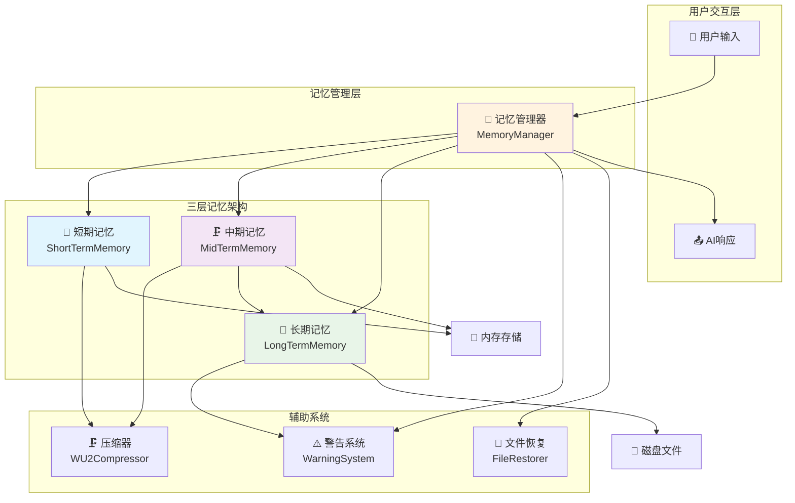
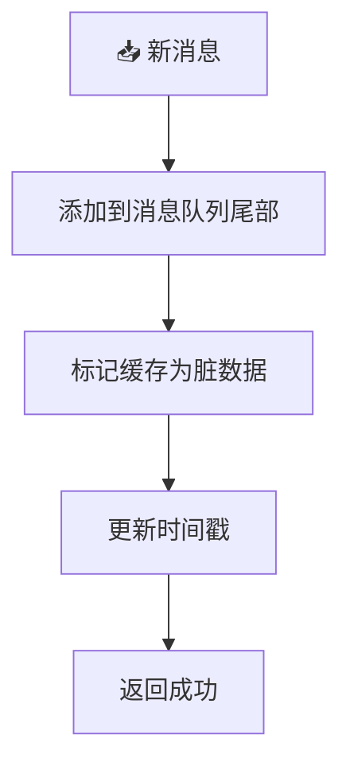
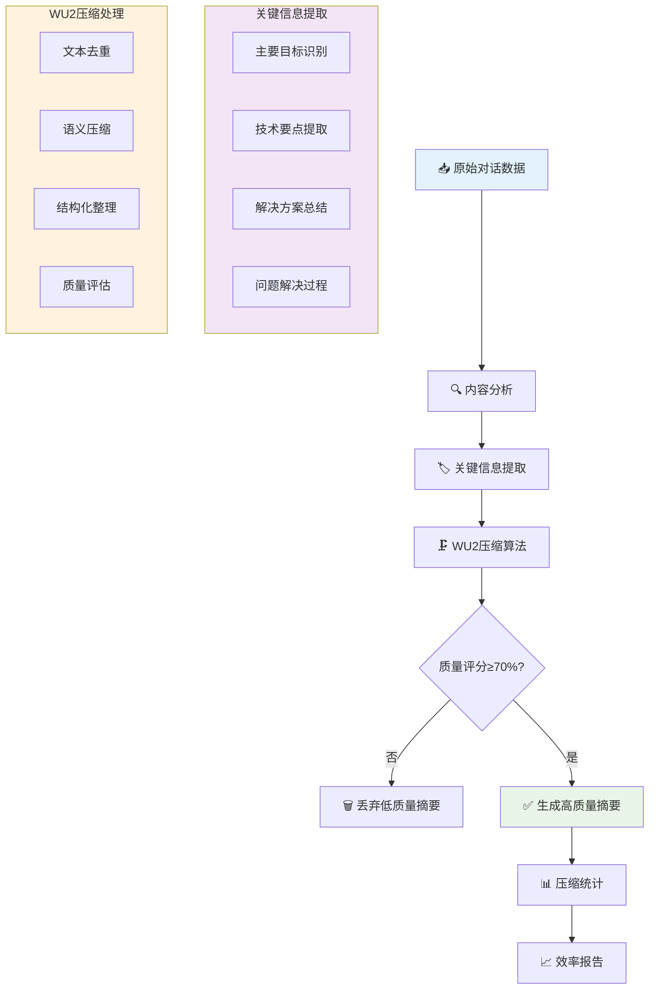
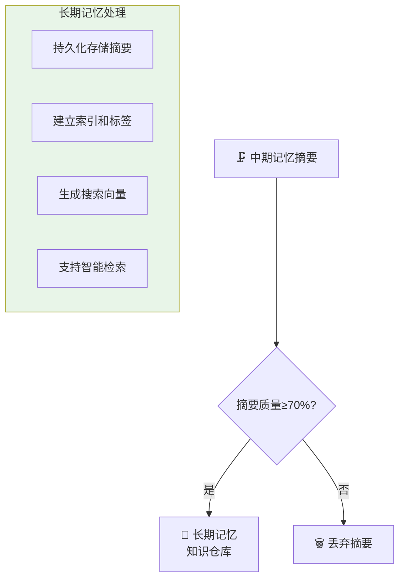
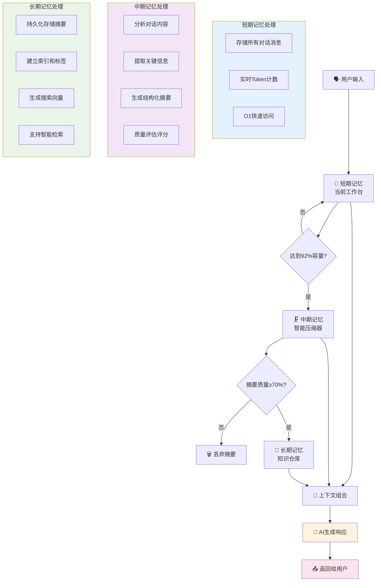
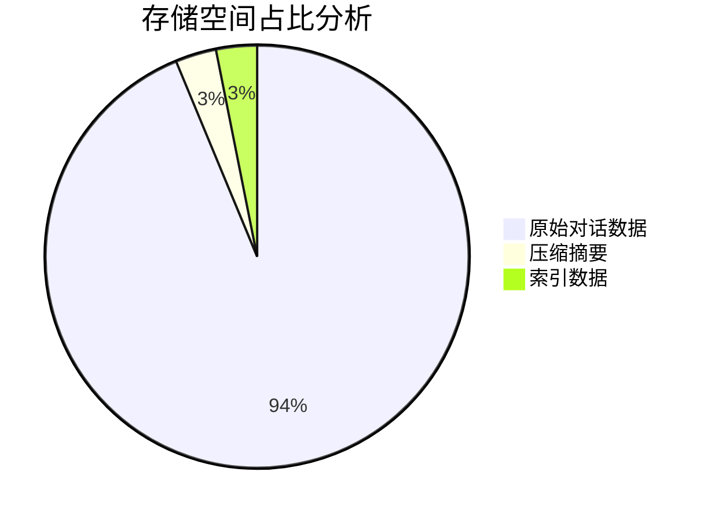
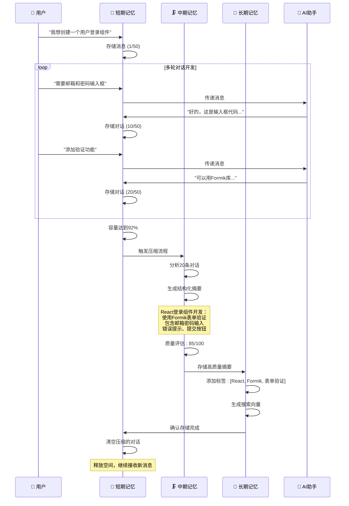
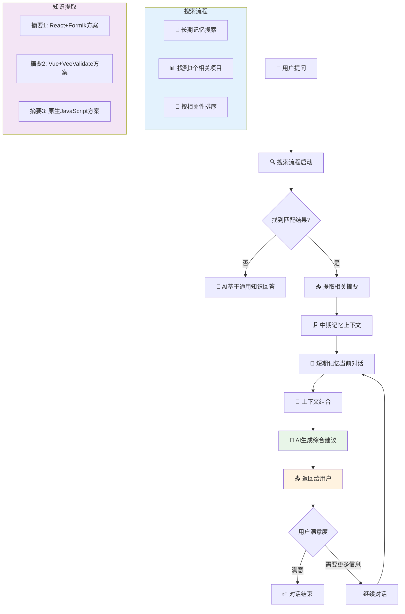

# 记忆层管理

<cite>
**本文档引用文件**   
- [MemoryManager.js](file://context-claude-code/src/memory/MemoryManager.js)
- [ShortTermMemory.js](file://context-claude-code/src/memory/ShortTermMemory.js)
- [MidTermMemory.js](file://context-claude-code/src/memory/MidTermMemory.js)
- [LongTermMemory.js](file://context-claude-code/src/memory/LongTermMemory.js)
- [三层记忆架构详解.md](file://context-claude-code/三层记忆架构详解.md)
- [小白专用-三层记忆架构完全指南.md](file://context-claude-code/小白专用-三层记忆架构完全指南.md)
- [核心算法详解.md](file://context-claude-code/核心算法详解.md)
</cite>

## 目录
1. [三层记忆架构概述](#三层记忆架构概述)
2. [短期记忆层](#短期记忆层)
3. [中期记忆层](#中期记忆层)
4. [长期记忆层](#长期记忆层)
5. [记忆层级协同机制](#记忆层级协同机制)
6. [存储策略与过期机制](#存储策略与过期机制)
7. [检索性能特征](#检索性能特征)
8. [配置参数调整](#配置参数调整)
9. [监控与调优建议](#监控与调优建议)
10. [典型场景应用](#典型场景应用)

## 三层记忆架构概述

三层记忆架构模仿人类大脑的记忆系统，从短期工作记忆到长期知识存储，每一层都有不同的职责和特点。该系统通过MemoryManager统一协调三层记忆架构的工作，实现了高效的上下文优化和管理。



**Diagram sources**
- [MemoryManager.js](file://context-claude-code/src/memory/MemoryManager.js#L15-L365)
- [三层记忆架构详解.md](file://context-claude-code/三层记忆架构详解.md#L1-L100)

**Section sources**
- [MemoryManager.js](file://context-claude-code/src/memory/MemoryManager.js#L15-L365)
- [三层记忆架构详解.md](file://context-claude-code/三层记忆架构详解.md#L1-L100)

## 短期记忆层

短期记忆层作为高速工作区，类似于CPU的L1缓存，提供O(1)访问效率。它负责存储最近的对话消息，确保AI能够快速访问当前上下文。

### 存储策略

短期记忆采用消息队列的方式存储数据，具有以下特点：
- **O(1)访问效率**：通过数组尾部添加消息实现
- **容量限制**：默认200K tokens，可通过配置调整
- **缓存优化**：使用usageCache缓存token使用量，减少重复计算



**Diagram sources**
- [ShortTermMemory.js](file://context-claude-code/src/memory/ShortTermMemory.js#L12-L334)

### 过期机制

短期记忆的过期机制基于使用频率和时效性自动调度：

1. **VE函数**：从最新消息反向查找Token使用情况
2. **HY5函数**：智能过滤的三重检查机制
3. **zY5函数**：精确的Token计算
4. **yW5函数**：检查是否需要启动压缩

当内存使用率达到配置的压缩阈值（默认92%）时，系统会自动触发压缩流程。

```javascript
async needsCompression() {
  const usage = await this.getMemoryUsage();
  if (usage.percentage >= this.config.compressionThreshold) {
    console.log(`⚠️ Memory usage at ${Math.round(usage.percentage * 100)}%, triggering compression!`);
    return true;
  }
  return false;
}
```

**Section sources**
- [ShortTermMemory.js](file://context-claude-code/src/memory/ShortTermMemory.js#L69-L192)

## 中期记忆层

中期记忆层作为智能蒸馏器，负责将短期记忆的对话历史压缩为结构化摘要，实现信息的高效存储和检索。

### 压缩机制

中期记忆通过wU2压缩器将消息列表压缩为结构化摘要：



**Diagram sources**
- [MidTermMemory.js](file://context-claude-code/src/memory/MidTermMemory.js#L13-L411)

### 质量评估

中期记忆通过多维度评估摘要质量，确保只有有价值的摘要被保存：

```javascript
async isValuableSummary(summary) {
  if (!summary) return false;

  // 基本检查：长度不能太短
  if (summary.length < 100) {
    return false;
  }

  // 检查是否包含关键信息
  const valuableIndicators = [
    'Primary Request and Intent',
    'Key Technical Concepts',
    'Files and Code Sections',
    'Problem Solving',
    'task',
    'error',
    'solution',
    'implement',
    'create'
  ];

  const foundIndicators = valuableIndicators.filter(indicator =>
    summary.toLowerCase().includes(indicator.toLowerCase())
  );

  // 至少包含3个有价值指标才认为有保存价值
  return foundIndicators.length >= 3;
}
```

**Section sources**
- [MidTermMemory.js](file://context-claude-code/src/memory/MidTermMemory.js#L150-L177)

## 长期记忆层

长期记忆层作为持久化知识库，负责跨会话的知识存储，支持向量化搜索和关键词搜索。

### 持久化存储

长期记忆将有价值的摘要持久化存储在磁盘文件中：



**Diagram sources**
- [LongTermMemory.js](file://context-claude-code/src/memory/LongTermMemory.js#L14-L627)

### 存储管理

长期记忆通过LRU算法和存储限制机制管理存储空间：

```javascript
async enforceStorageLimits() {
  const usage = await this.getMemoryUsage();

  if (usage.percentage > 0.9) { // 超过90%时清理
    console.log('🧹 Long-term memory storage limit exceeded, cleaning up...');

    // 按访问时间和访问次数排序，删除最少使用的条目
    const sortedSummaries = [...this.summaries].sort((a, b) => {
      const scoreA = a.accessCount * 0.7 + (Date.now() - a.lastAccessed) * 0.00001 * 0.3;
      const scoreB = b.accessCount * 0.7 + (Date.now() - b.lastAccessed) * 0.00001 * 0.3;
      return scoreA - scoreB;
    });

    // 删除最旧的25%
    const deleteCount = Math.floor(sortedSummaries.length * 0.25);
    const toDelete = sortedSummaries.slice(0, deleteCount);

    // 执行删除操作...
  }
}
```

**Section sources**
- [LongTermMemory.js](file://context-claude-code/src/memory/LongTermMemory.js#L455-L471)

## 记忆层级协同机制

三层记忆架构通过MemoryManager协调工作，实现高效的上下文优化和管理。

### 协同流程



**Diagram sources**
- [MemoryManager.js](file://context-claude-code/src/memory/MemoryManager.js#L62-L94)
- [MemoryManager.js](file://context-claude-code/src/memory/MemoryManager.js#L100-L143)
- [MemoryManager.js](file://context-claude-code/src/memory/MemoryManager.js#L149-L183)

### 事件驱动

MemoryManager采用事件驱动架构，确保各层记忆的协同工作：

```javascript
// 添加消息到记忆系统
async addMessage(message) {
  try {
    // 添加到短期记忆
    await this.shortTermMemory.addMessage(message);

    // 跟踪文件操作
    this.trackFileOperations(message);

    // 检查是否需要压缩
    if (await this.shortTermMemory.needsCompression()) {
      await this.triggerCompression();
    }

    // 检查警告状态
    if (this.warningSystem) {
      const status = await this.warningSystem.assessMemoryStatus(
        await this.getCurrentTokenUsage(),
        this.config.maxTokens
      );

      if (status.shouldDisplay) {
        this.emit('warning', status);
      }
    }

    this.emit('messageAdded', message);
    return true;
  } catch (error) {
    console.error('Failed to add message:', error);
    this.emit('error', error);
    return false;
  }
}
```

**Section sources**
- [MemoryManager.js](file://context-claude-code/src/memory/MemoryManager.js#L62-L94)

## 存储策略与过期机制

各层记忆采用不同的存储策略和过期机制，以适应不同的使用场景。

### 存储策略对比

| 记忆层 | 存储介质 | 访问速度 | 容量限制 | 数据格式 |
|--------|----------|----------|----------|----------|
| 短期记忆 | 内存 | ⚡ 极快 (毫秒级) | 200K tokens | 原始消息 |
| 中期记忆 | 内存 | 🚀 快速 (10-50ms) | 50K tokens | 结构化摘要 |
| 长期记忆 | 磁盘文件 | 🐢 较慢 (100-500ms) | 100MB | 索引化摘要 |

### 过期机制

各层记忆的过期机制基于访问频率和时效性自动调度：

1. **短期记忆**：基于容量阈值触发压缩
2. **中期记忆**：基于质量评估决定是否保存
3. **长期记忆**：基于LRU算法清理不重要的旧记录



**Section sources**
- [ShortTermMemory.js](file://context-claude-code/src/memory/ShortTermMemory.js#L69-L123)
- [MidTermMemory.js](file://context-claude-code/src/memory/MidTermMemory.js#L234-L244)
- [LongTermMemory.js](file://context-claude-code/src/memory/LongTermMemory.js#L583-L598)

## 检索性能特征

各层记忆具有不同的检索性能特征，满足不同场景的需求。

### 检索能力对比

| 记忆层 | 搜索能力 | 检索性能 | 适用场景 |
|--------|----------|----------|----------|
| 短期记忆 | 简单查询 | ⚡ 极快 | 实时对话 |
| 中期记忆 | 内容搜索 | 🚀 快速 | 近期摘要 |
| 长期记忆 | 向量搜索 | 🐢 较慢 | 历史知识 |

### 搜索算法

长期记忆支持向量化搜索和关键词搜索：

```javascript
async search(query, limit = 10) {
  try {
    if (!this.enableVectorSearch) {
      return await this.keywordSearch(query, limit);
    }

    // 生成查询向量
    const queryVector = await this.generateVector(query);

    // 计算相似度并排序
    const results = [];

    for (const summary of this.summaries) {
      const vector = this.vectors.get(summary.id);
      if (vector) {
        const similarity = this.calculateCosineSimilarity(queryVector, vector);

        if (similarity > 0.1) { // 相似度阈值
          results.push({
            id: summary.id,
            content: summary.content,
            timestamp: summary.timestamp,
            metadata: summary.metadata,
            tags: summary.tags,
            similarity,
            relevance: 'vector'
          });
        }
      }
    }

    // 按相似度排序
    results.sort((a, b) => b.similarity - a.similarity);

    // 更新访问统计
    results.slice(0, limit).forEach(result => {
      this.updateAccessStats(result.id);
    });

    return results.slice(0, limit);
  } catch (error) {
    console.error('Vector search failed:', error);
    return await this.keywordSearch(query, limit);
  }
}
```

**Section sources**
- [LongTermMemory.js](file://context-claude-code/src/memory/LongTermMemory.js#L253-L297)

## 配置参数调整

通过配置参数可以调整各层容量与保留策略，以适应不同工作负载。

### 配置选项

```javascript
constructor(config = {}) {
  this.config = {
    // 默认配置
    maxTokens: 200000,
    compressionThreshold: 0.92,
    enableWarningSystem: true,
    enableFileRestoration: true,
    ...config
  };

  // 初始化三层记忆架构
  this.shortTermMemory = new ShortTermMemory({
    maxTokens: this.config.maxTokens,
    compressionThreshold: this.config.compressionThreshold,
    ...config.shortTermMemory
  });

  this.midTermMemory = new MidTermMemory({
    ...config.midTermMemory
  });

  this.longTermMemory = new LongTermMemory({
    ...config.longTermMemory
  });
}
```

### 调整策略

1. **高频交互任务**：降低压缩阈值，优先保留短期记忆内容
2. **知识密集型任务**：提高长期记忆容量，增强知识复用
3. **资源受限环境**：减少各层容量，优化内存使用

**Section sources**
- [MemoryManager.js](file://context-claude-code/src/memory/MemoryManager.js#L15-L365)

## 监控与调优建议

通过监控各层使用情况，可以及时发现性能瓶颈并进行调优。

### 监控指标

```javascript
async getStatus() {
  const shortTermStats = await this.shortTermMemory.getStats();
  const midTermStats = await this.midTermMemory.getStats();
  const longTermStats = await this.longTermMemory.getStats();

  return {
    shortTerm: shortTermStats,
    midTerm: midTermStats,
    longTerm: longTermStats,
    fileOperations: this.fileOperations.size,
    warning: this.warningSystem ?
      await this.warningSystem.getCurrentStatus() : null
  };
}
```

### 调优建议

1. **监控内存使用**：定期检查各层内存使用情况
2. **调整压缩阈值**：根据实际工作负载调整压缩触发点
3. **优化搜索性能**：根据查询模式优化索引策略
4. **管理存储空间**：定期清理不重要的历史记录

**Section sources**
- [MemoryManager.js](file://context-claude-code/src/memory/MemoryManager.js#L198-L211)

## 典型场景应用

### 高频交互任务

对于高频交互任务，应优先保留短期记忆内容：



**Diagram sources**
- [三层记忆架构详解.md](file://context-claude-code/三层记忆架构详解.md#L1-L100)

### 知识密集型任务

对于知识密集型任务，应充分利用长期记忆的知识复用能力：



**Diagram sources**
- [三层记忆架构详解.md](file://context-claude-code/三层记忆架构详解.md#L1-L100)