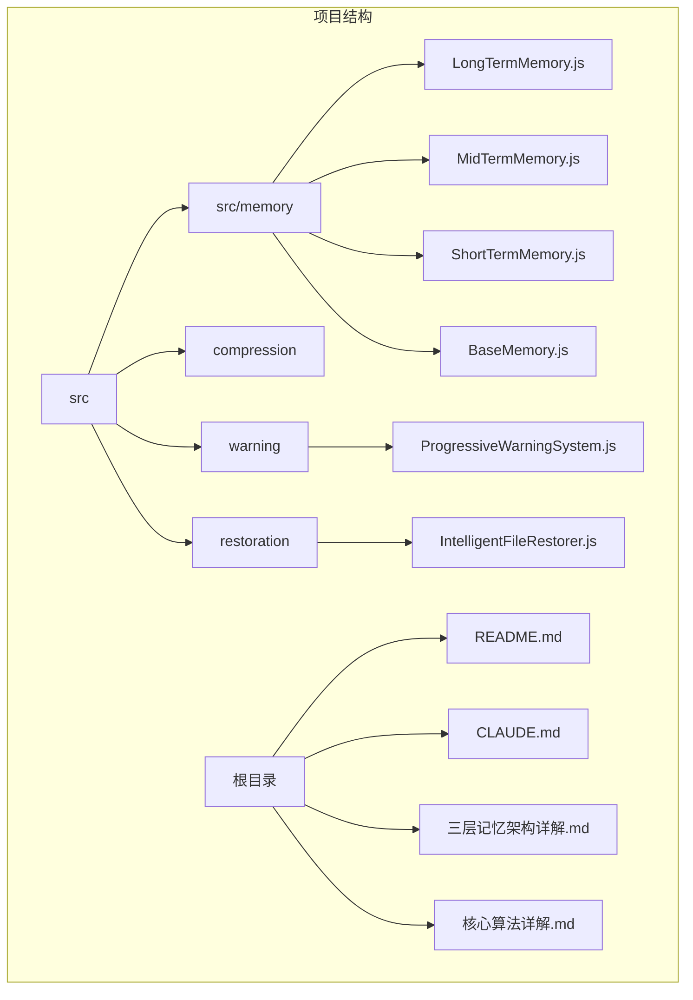
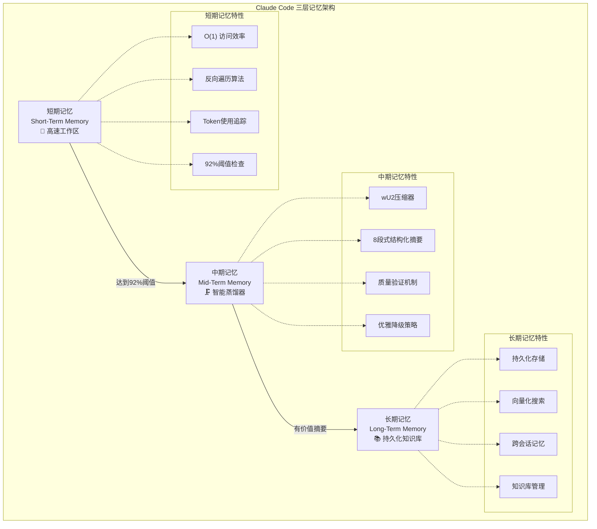
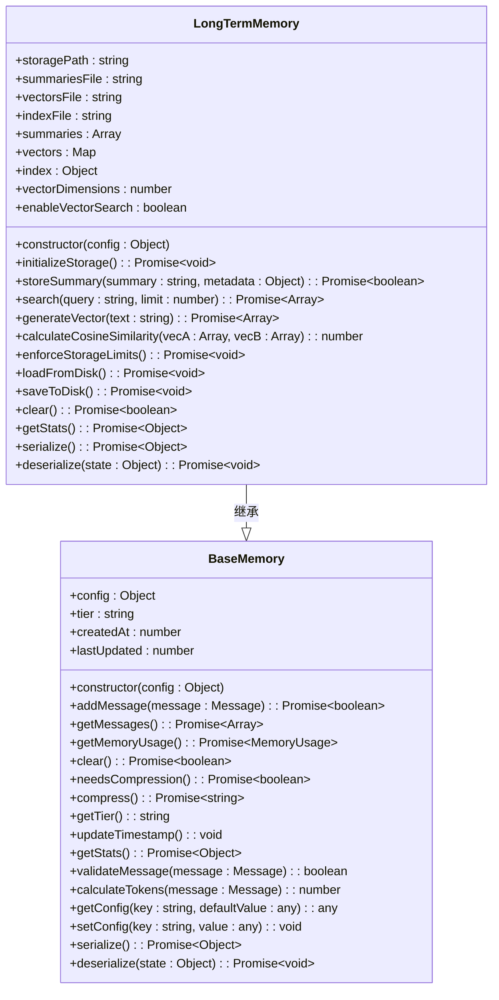
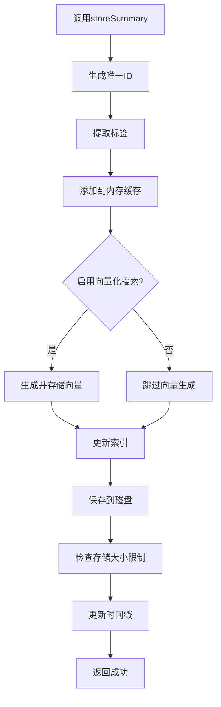
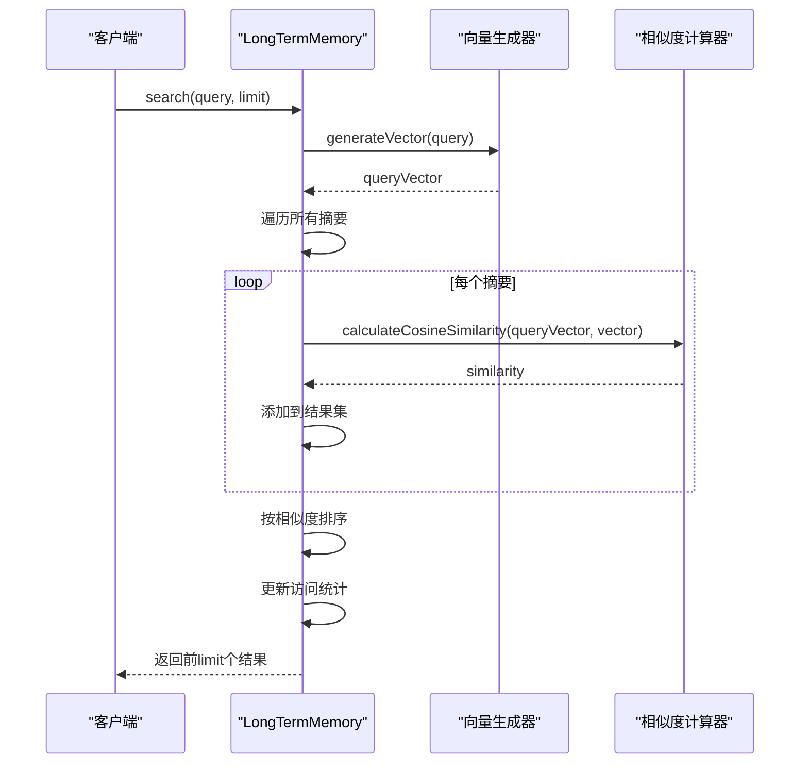
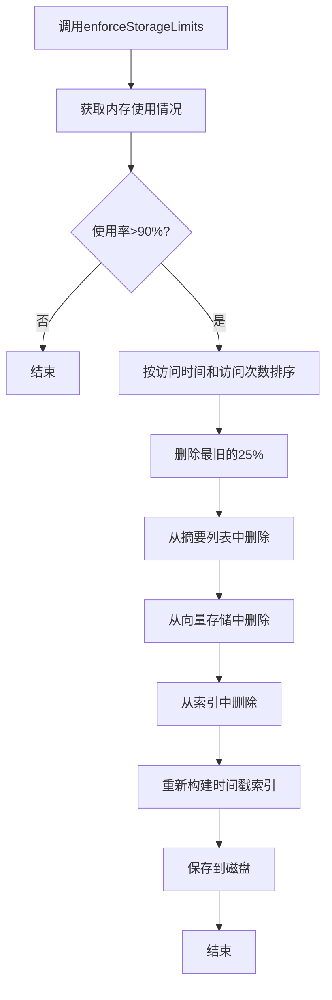
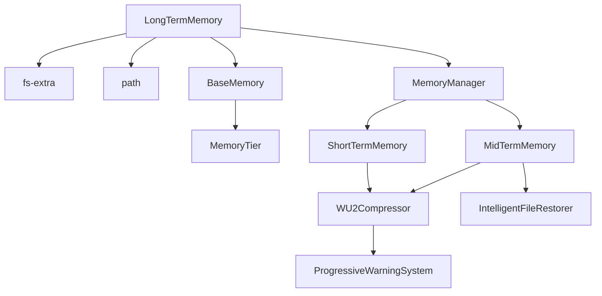

# 长期记忆

<cite>
**本文档引用文件**   
- [LongTermMemory.js](file://context-claude-code/src/memory/LongTermMemory.js)
- [BaseMemory.js](file://context-claude-code/src/memory/BaseMemory.js)
- [MemoryManager.js](file://context-claude-code/src/memory/MemoryManager.js)
- [index.js](file://context-claude-code/src/index.js)
- [index.json](file://context-claude-code/memory-storage/index.json)
- [三层记忆架构详解.md](file://context-claude-code/三层记忆架构详解.md)
- [CLAUDE.md](file://context-claude-code/CLAUDE.md)
- [README.md](file://context-claude-code/README.md)
- [核心算法详解.md](file://context-claude-code/核心算法详解.md)
</cite>

## 目录
1. [引言](#引言)
2. [项目结构](#项目结构)
3. [核心组件](#核心组件)
4. [架构概述](#架构概述)
5. [详细组件分析](#详细组件分析)
6. [依赖分析](#依赖分析)
7. [性能考虑](#性能考虑)
8. [故障排除指南](#故障排除指南)
9. [结论](#结论)

## 引言
长期记忆机制是Claude Code系统中的持久化知识库，负责跨会话存储有价值的摘要和知识。它通过索引化存储实现大规模上下文的高效检索，支持基于语义相似度的查询机制与增量更新策略。长期记忆与短期记忆、中期记忆协同工作，构成了一个完整的三层记忆架构，实现了从瞬时到永恒的智能分层管理。

## 项目结构
项目结构清晰地展示了三层记忆架构的实现。核心记忆组件位于`src/memory`目录下，包括`ShortTermMemory.js`、`MidTermMemory.js`和`LongTermMemory.js`。`LongTermMemory.js`是长期记忆的实现类，负责持久化存储有价值的摘要和知识。配置文件和示例位于根目录，提供了系统的配置选项和使用示例。

**图源**
- [LongTermMemory.js](file://context-claude-code/src/memory/LongTermMemory.js#L1-L627)
- [README.md](file://context-claude-code/README.md#L1-L733)

**节源**
- [LongTermMemory.js](file://context-claude-code/src/memory/LongTermMemory.js#L1-L627)
- [README.md](file://context-claude-code/README.md#L1-L733)

## 核心组件
长期记忆的核心组件包括`LongTermMemory`类，它继承自`BaseMemory`类，实现了持久化存储、向量化搜索和智能清理等功能。`LongTermMemory`类通过`storeSummary`方法存储摘要，通过`search`方法进行向量化搜索，并通过`enforceStorageLimits`方法强制执行存储限制。

**节源**
- [LongTermMemory.js](file://context-claude-code/src/memory/LongTermMemory.js#L14-L627)
- [BaseMemory.js](file://context-claude-code/src/memory/BaseMemory.js#L13-L193)

## 架构概述
长期记忆架构是一个三层记忆系统的一部分，包括短期记忆、中期记忆和长期记忆。短期记忆负责高速工作区，中期记忆负责智能蒸馏器，长期记忆负责持久化知识库。这三层记忆协同工作，实现了从瞬时到永恒的智能分层管理。

**图源**
- [README.md](file://context-claude-code/README.md#L150-L190)

## 详细组件分析
### LongTermMemory 类分析
`LongTermMemory`类是长期记忆的实现类，负责持久化存储有价值的摘要和知识。它通过`storeSummary`方法存储摘要，通过`search`方法进行向量化搜索，并通过`enforceStorageLimits`方法强制执行存储限制。

#### 类图

**图源**
- [LongTermMemory.js](file://context-claude-code/src/memory/LongTermMemory.js#L14-L627)
- [BaseMemory.js](file://context-claude-code/src/memory/BaseMemory.js#L13-L193)

#### 存储摘要流程

**图源**
- [LongTermMemory.js](file://context-claude-code/src/memory/LongTermMemory.js#L88-L131)

#### 向量化搜索流程

**图源**
- [LongTermMemory.js](file://context-claude-code/src/memory/LongTermMemory.js#L253-L297)
- [LongTermMemory.js](file://context-claude-code/src/memory/LongTermMemory.js#L183-L209)
- [LongTermMemory.js](file://context-claude-code/src/memory/LongTermMemory.js#L363-L383)

#### 智能清理流程

**图源**
- [LongTermMemory.js](file://context-claude-code/src/memory/LongTermMemory.js#L476-L521)

**节源**
- [LongTermMemory.js](file://context-claude-code/src/memory/LongTermMemory.js#L14-L627)

## 依赖分析
长期记忆依赖于`fs-extra`和`path`模块进行文件操作，依赖于`BaseMemory`类提供基础记忆功能。`LongTermMemory`类通过继承`BaseMemory`类，获得了基础的记忆管理功能，并在此基础上实现了持久化存储、向量化搜索和智能清理等高级功能。

**图源**
- [LongTermMemory.js](file://context-claude-code/src/memory/LongTermMemory.js#L1-L53)
- [MemoryManager.js](file://context-claude-code/src/memory/MemoryManager.js#L1-L365)

## 性能考虑
长期记忆的性能考虑主要包括存储效率、访问速度和内存使用。通过向量化搜索和索引化存储，长期记忆实现了大规模上下文的高效检索。通过智能清理机制，长期记忆在存储空间和信息保留之间找到了最佳平衡点。

## 故障排除指南
### 常见问题
1. **存储空间不足**：检查`maxStorageSize`配置，确保有足够的磁盘空间。
2. **向量化搜索失败**：检查`enableVectorSearch`配置，确保向量化搜索已启用。
3. **数据加载失败**：检查文件路径和权限，确保`summaries.json`、`vectors.json`和`index.json`文件可读。

**节源**
- [LongTermMemory.js](file://context-claude-code/src/memory/LongTermMemory.js#L14-L627)
- [README.md](file://context-claude-code/README.md#L1-L733)

## 结论
长期记忆机制是Claude Code系统中的持久化知识库，通过索引化存储实现大规模上下文的高效检索，支持基于语义相似度的查询机制与增量更新策略。它与短期记忆、中期记忆协同工作，构成了一个完整的三层记忆架构，实现了从瞬时到永恒的智能分层管理。通过合理的配置和优化，长期记忆可以有效地支持企业级知识库的构建和维护。