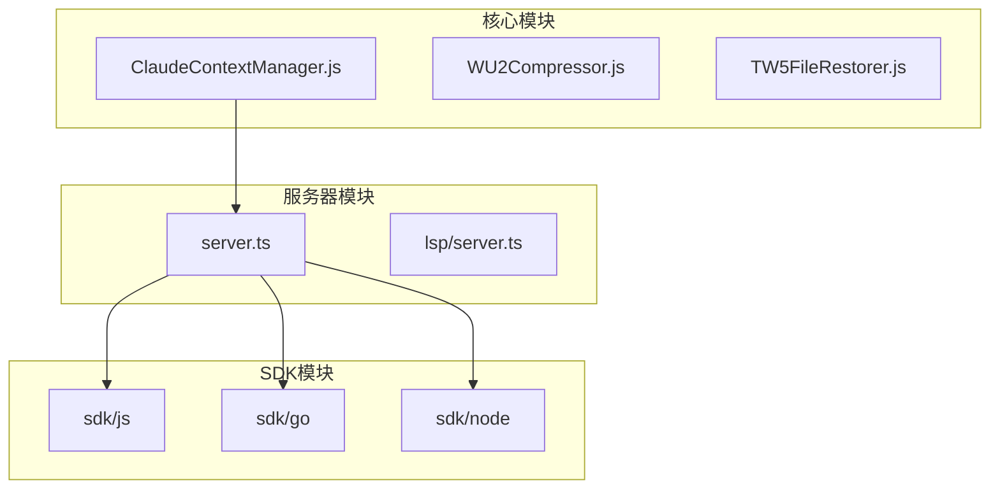
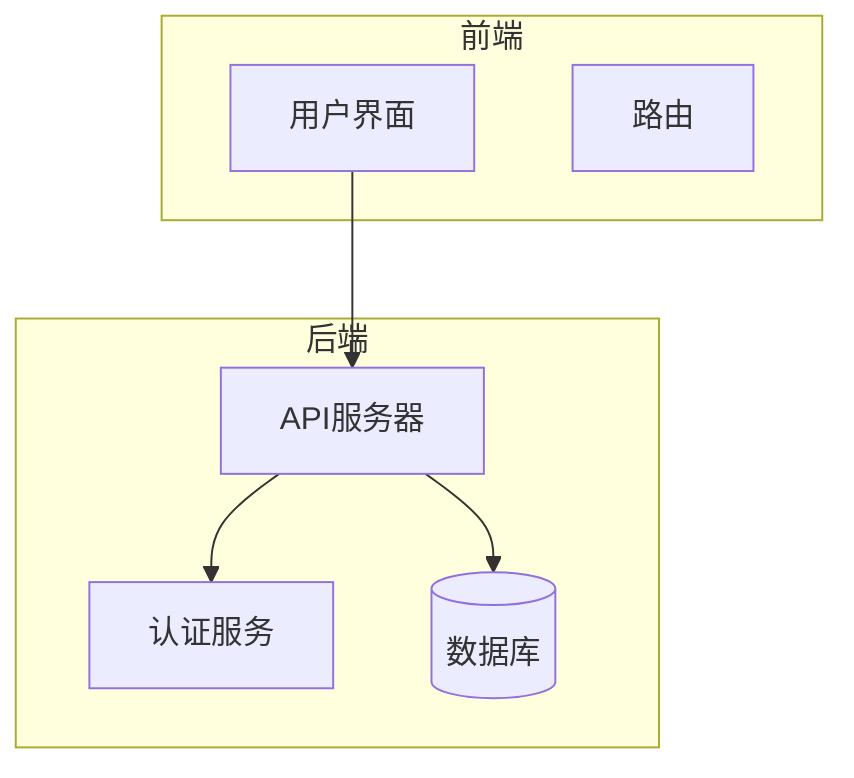
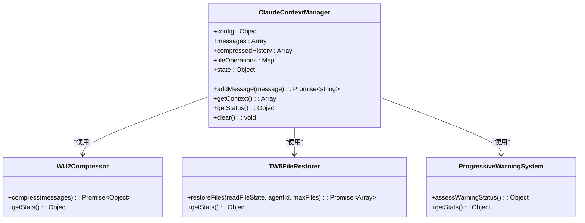
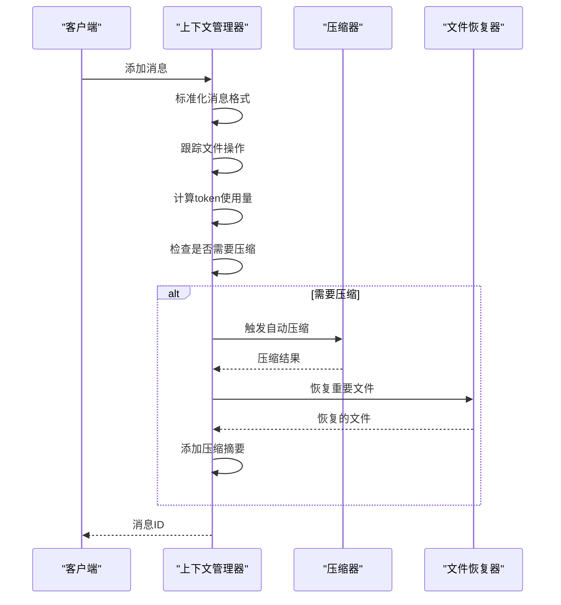
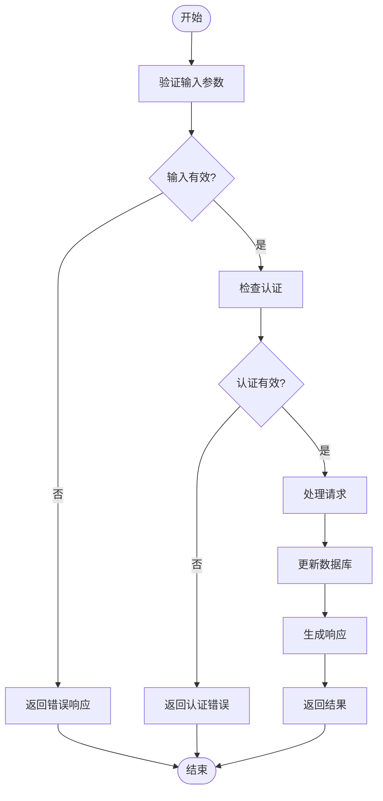
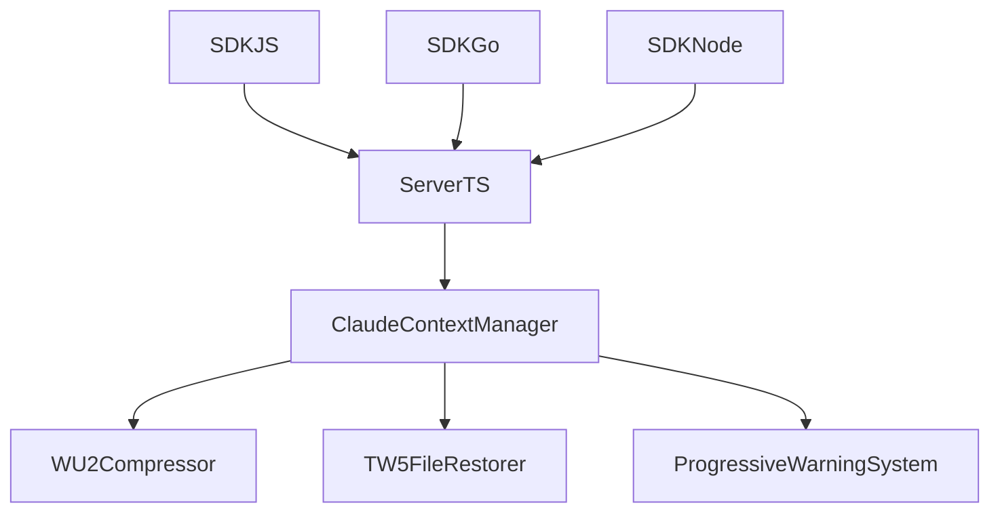

# API设计一致性审查

<cite>
**本文档引用的文件**  
- [ClaudeContextManager.js](file://context-claude-code/src/claude-core/ClaudeContextManager.js)
- [server.ts](file://packages/opencode/src/server/server.ts)
- [api.md](file://packages/sdk/js/src/gen/api.md)
</cite>

## 目录
1. [引言](#引言)
2. [项目结构](#项目结构)
3. [核心组件](#核心组件)
4. [架构概述](#架构概述)
5. [详细组件分析](#详细组件分析)
6. [依赖分析](#依赖分析)
7. [性能考虑](#性能考虑)
8. [故障排除指南](#故障排除指南)
9. [结论](#结论)
10. [附录](#附录)（如有必要）

## 引言
本文档旨在建立API设计一致性审查标准，确保所有接口遵循统一的设计规范。基于ClaudeContextManager中的上下文管理接口模式，审查所有RESTful API的URL命名、HTTP方法使用、请求/响应结构和错误码定义。检查server.ts中的路由定义是否符合REST最佳实践，验证SDK生成的接口是否与后端实现保持同步。重点关注版本控制策略、参数序列化方式和分页机制的一致性。提供常见反模式示例及修正方案。

## 项目结构
项目结构遵循模块化设计原则，主要分为以下几个部分：
- `context-claude-code`：包含上下文管理核心逻辑
- `packages/opencode`：包含服务器和客户端实现
- `packages/sdk`：包含多种语言的SDK实现

**Diagram sources**
- [ClaudeContextManager.js](file://context-claude-code/src/claude-core/ClaudeContextManager.js)
- [server.ts](file://packages/opencode/src/server/server.ts)

**Section sources**
- [ClaudeContextManager.js](file://context-claude-code/src/claude-core/ClaudeContextManager.js)
- [server.ts](file://packages/opencode/src/server/server.ts)

## 核心组件
核心组件包括上下文管理器、压缩器、文件恢复器和警告系统。这些组件协同工作，确保上下文的有效管理和优化。

**Section sources**
- [ClaudeContextManager.js](file://context-claude-code/src/claude-core/ClaudeContextManager.js#L19-L786)
- [WU2Compressor.js](file://context-claude-code/src/compression/WU2Compressor.js)
- [TW5FileRestorer.js](file://context-claude-code/src/restoration/TW5FileRestorer.js)

## 架构概述
系统架构采用分层设计，包括前端、后端和数据存储层。前端通过API与后端通信，后端处理业务逻辑并与数据存储层交互。

**Diagram sources**
- [server.ts](file://packages/opencode/src/server/server.ts#L59-L110)

## 详细组件分析
### 上下文管理器分析
上下文管理器负责管理对话上下文，包括消息的添加、压缩和恢复。

#### 类图

**Diagram sources**
- [ClaudeContextManager.js](file://context-claude-code/src/claude-core/ClaudeContextManager.js#L19-L786)
- [WU2Compressor.js](file://context-claude-code/src/compression/WU2Compressor.js)
- [TW5FileRestorer.js](file://context-claude-code/src/restoration/TW5FileRestorer.js)
- [ProgressiveWarningSystem.js](file://context-claude-code/src/warning/ProgressiveWarningSystem.js)

#### 序列图

**Diagram sources**
- [ClaudeContextManager.js](file://context-claude-code/src/claude-core/ClaudeContextManager.js#L182-L251)
- [WU2Compressor.js](file://context-claude-code/src/compression/WU2Compressor.js)
- [TW5FileRestorer.js](file://context-claude-code/src/restoration/TW5FileRestorer.js)

**Section sources**
- [ClaudeContextManager.js](file://context-claude-code/src/claude-core/ClaudeContextManager.js#L19-L786)

### 服务器路由分析
服务器路由定义了API的端点，确保RESTful设计的一致性。

#### 流程图

**Diagram sources**
- [server.ts](file://packages/opencode/src/server/server.ts#L59-L110)

**Section sources**
- [server.ts](file://packages/opencode/src/server/server.ts#L59-L110)

## 依赖分析
系统依赖关系包括内部组件依赖和外部库依赖。内部组件依赖通过事件驱动和钩子系统实现松耦合。

**Diagram sources**
- [ClaudeContextManager.js](file://context-claude-code/src/claude-core/ClaudeContextManager.js)
- [server.ts](file://packages/opencode/src/server/server.ts)

**Section sources**
- [ClaudeContextManager.js](file://context-claude-code/src/claude-core/ClaudeContextManager.js)
- [server.ts](file://packages/opencode/src/server/server.ts)

## 性能考虑
性能优化主要集中在上下文压缩和文件恢复上。通过wU2压缩算法和TW5文件恢复机制，有效减少上下文大小并恢复重要文件。

## 故障排除指南
常见问题包括上下文溢出、文件恢复失败和认证错误。通过日志记录和错误处理系统，可以快速定位和解决问题。

**Section sources**
- [ErrorHandlingSystem.js](file://context-claude-code/src/error/ErrorHandlingSystem.js)
- [server.ts](file://packages/opencode/src/server/server.ts#L59-L110)

## 结论
本文档详细分析了API设计一致性审查标准，确保所有接口遵循统一的设计规范。通过审查URL命名、HTTP方法使用、请求/响应结构和错误码定义，验证了SDK生成的接口与后端实现的同步性。提供了常见反模式示例及修正方案，有助于提高系统的稳定性和可维护性。