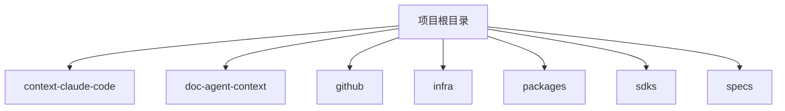
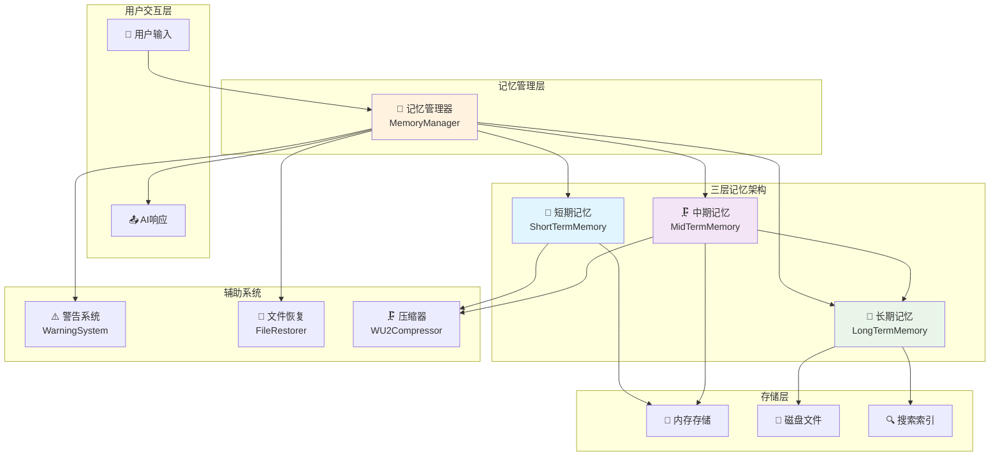
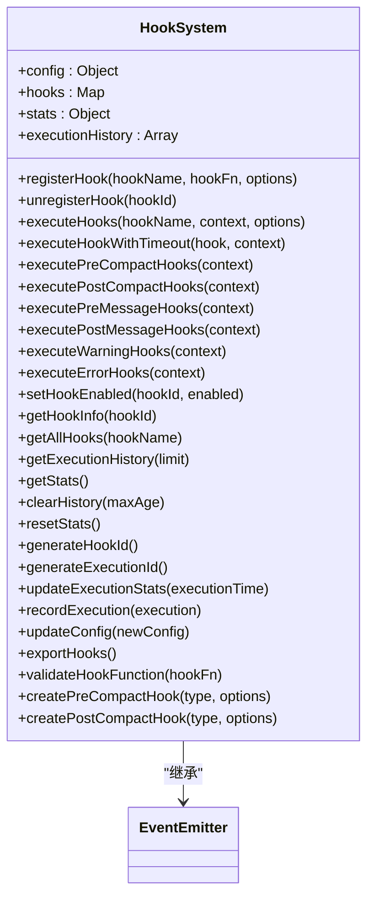
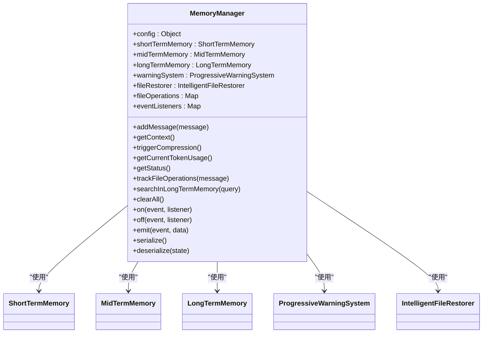
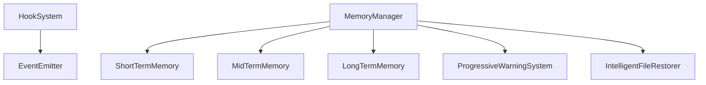

# 代码审查指南

<cite>
**本文档引用的文件**  
- [project.md](file://specs/project.md)
- [index.js](file://context-claude-code/src/types/index.js)
- [HookSystem.js](file://context-claude-code/src/claude-core/HookSystem.js)
- [MemoryManager.js](file://context-claude-code/src/memory/MemoryManager.js)
- [Claude_Code_Large_File_Handling_Complete_Guide.md](file://context-claude-code/Claude_Code_Large_File_Handling_Complete_Guide.md)
- [三层记忆架构详解.md](file://context-claude-code/三层记忆架构详解.md)
- [SecuritySystem.js](file://context-claude-code/src/security/SecuritySystem.js)
</cite>

## 目录
1. [引言](#引言)
2. [项目结构](#项目结构)
3. [核心组件](#核心组件)
4. [架构概述](#架构概述)
5. [详细组件分析](#详细组件分析)
6. [依赖分析](#依赖分析)
7. [性能考虑](#性能考虑)
8. [故障排除指南](#故障排除指南)
9. [结论](#结论)

## 引言
本文档旨在建立代码审查流程的标准指南，确保代码质量和架构一致性。基于项目规范，定义审查重点：包括API设计一致性、类型安全、性能影响、内存管理（特别是三层记忆架构的交互）和安全风险（如上下文泄露）。针对HookSystem和MemoryManager等核心组件，列出特定审查清单，并提供审查意见的表述规范。

## 项目结构
本项目采用模块化设计，主要分为以下几个部分：
- `context-claude-code`：核心功能实现
- `doc-agent-context`：文档代理上下文管理
- `github`：GitHub集成
- `infra`：基础设施
- `packages`：可复用的包
- `sdks`：软件开发工具包
- `specs`：项目规范

**图示来源**
- [project.md](file://specs/project.md#L1-L65)

**章节来源**
- [project.md](file://specs/project.md#L1-L65)

## 核心组件
核心组件包括HookSystem、MemoryManager、SecuritySystem等，它们共同构成了系统的基石。这些组件负责处理关键的业务逻辑，如钩子系统、记忆管理和安全验证。

**章节来源**
- [HookSystem.js](file://context-claude-code/src/claude-core/HookSystem.js#L10-L723)
- [MemoryManager.js](file://context-claude-code/src/memory/MemoryManager.js#L15-L365)
- [SecuritySystem.js](file://context-claude-code/src/security/SecuritySystem.js#L558-L845)

## 架构概述
系统采用分层架构，主要包括以下层次：
- **用户交互层**：处理用户输入和输出
- **记忆管理层**：协调三层记忆架构
- **辅助系统层**：提供警告系统、文件恢复等功能
- **存储层**：负责数据的持久化存储

**图示来源**
- [三层记忆架构详解.md](file://context-claude-code/三层记忆架构详解.md#L700-L750)

**章节来源**
- [三层记忆架构详解.md](file://context-claude-code/三层记忆架构详解.md#L1-L866)

## 详细组件分析
### HookSystem 分析
HookSystem 是一个基于事件的钩子系统，支持多种类型的钩子，如 preCompact、postCompact、preMessage、postMessage 等。它允许在特定事件发生时执行自定义逻辑。

#### 类图

**图示来源**
- [HookSystem.js](file://context-claude-code/src/claude-core/HookSystem.js#L10-L723)

**章节来源**
- [HookSystem.js](file://context-claude-code/src/claude-core/HookSystem.js#L10-L723)

### MemoryManager 分析
MemoryManager 协调三层记忆架构的工作，包括短期记忆、中期记忆和长期记忆。它负责管理消息的添加、获取上下文、触发压缩流程等。

#### 类图

**图示来源**
- [MemoryManager.js](file://context-claude-code/src/memory/MemoryManager.js#L15-L365)

**章节来源**
- [MemoryManager.js](file://context-claude-code/src/memory/MemoryManager.js#L15-L365)

## 依赖分析
系统中的各个组件之间存在紧密的依赖关系。例如，MemoryManager 依赖于 ShortTermMemory、MidTermMemory 和 LongTermMemory，而 HookSystem 则依赖于 EventEmitter。

**图示来源**
- [HookSystem.js](file://context-claude-code/src/claude-core/HookSystem.js#L10-L723)
- [MemoryManager.js](file://context-claude-code/src/memory/MemoryManager.js#L15-L365)

**章节来源**
- [HookSystem.js](file://context-claude-code/src/claude-core/HookSystem.js#L10-L723)
- [MemoryManager.js](file://context-claude-code/src/memory/MemoryManager.js#L15-L365)

## 性能考虑
在处理大文件时，系统需要考虑性能影响。例如，文件截断策略、分块读取机制和图片处理优化都是为了提高性能而设计的。

**章节来源**
- [Claude_Code_Large_File_Handling_Complete_Guide.md](file://context-claude-code/Claude_Code_Large_File_Handling_Complete_Guide.md#L1-L1955)

## 故障排除指南
当遇到问题时，可以参考以下步骤进行排查：
1. 检查日志文件
2. 验证配置文件
3. 检查网络连接
4. 查看系统状态

**章节来源**
- [SecuritySystem.js](file://context-claude-code/src/security/SecuritySystem.js#L558-L845)

## 结论
通过本文档，我们建立了代码审查流程的标准指南，确保了代码质量和架构一致性。针对核心组件，列出了特定的审查清单，并提供了审查意见的表述规范，以促进团队协作。