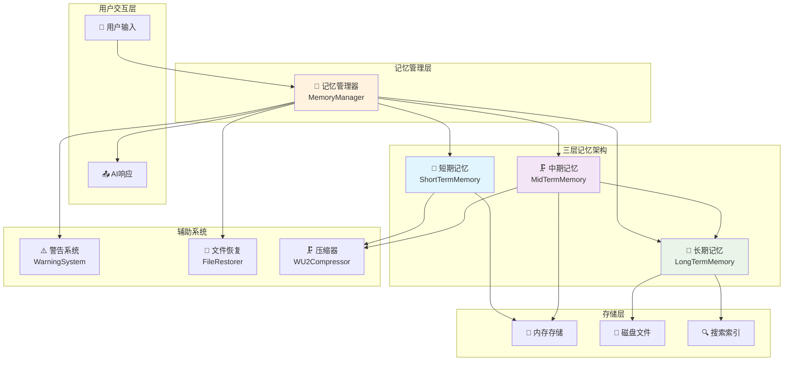
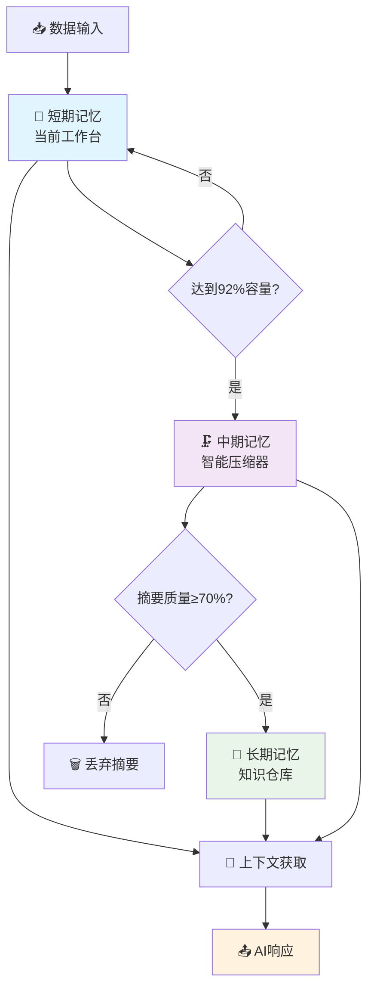
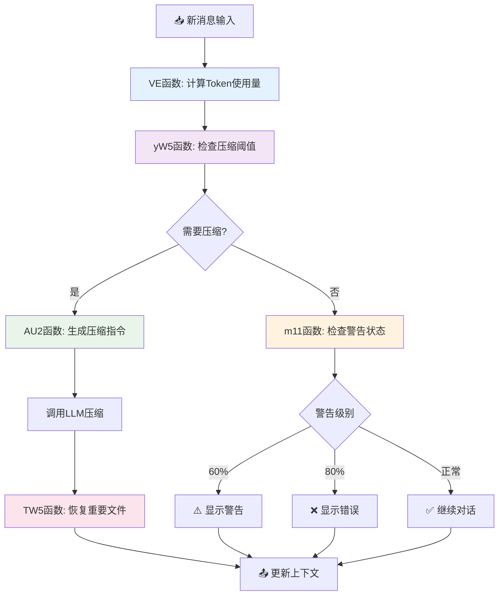
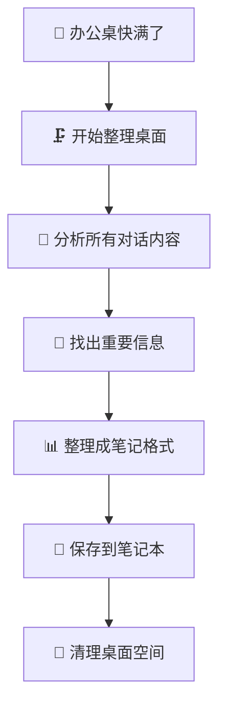
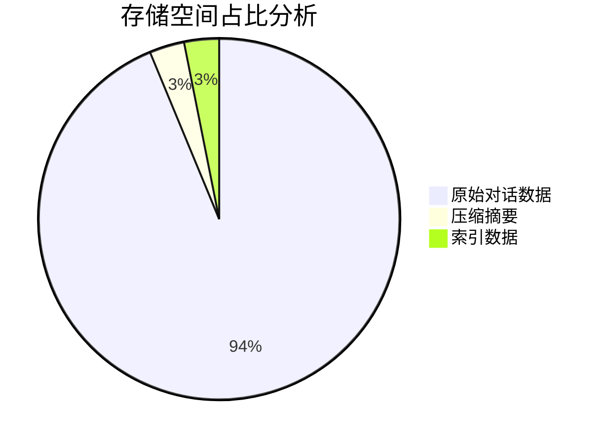
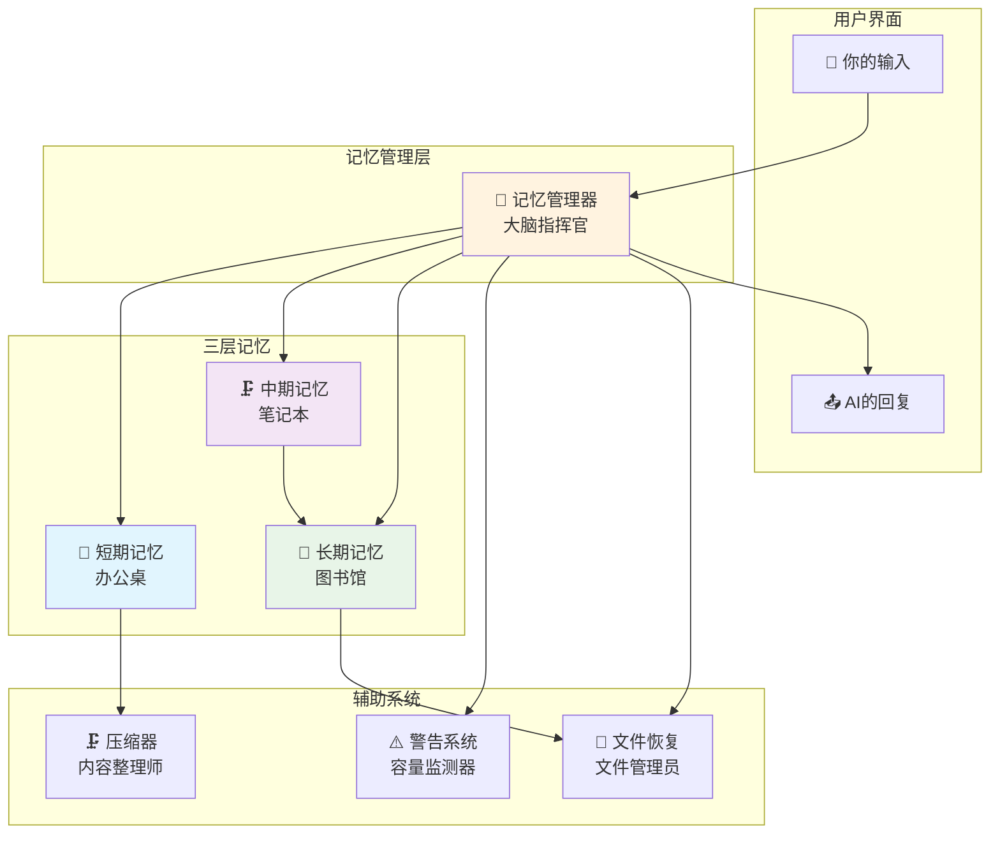

# 内存架构交互审查

<cite>
**本文档引用的文件**   
- [三层记忆架构详解.md](file://context-claude-code/三层记忆架构详解.md)
- [上下文工程管理实践-第3部分-压缩触发.md](file://context-claude-code/上下文工程管理实践-第3部分-压缩触发.md)
- [小白专用-三层记忆架构完全指南.md](file://context-claude-code/小白专用-三层记忆架构完全指南.md)
- [核心算法详解.md](file://context-claude-code/核心算法详解.md)
- [MemoryManager.js](file://context-claude-code/src/memory/MemoryManager.js)
- [WU2Compressor.js](file://context-claude-code/src/compression/WU2Compressor.js)
- [IntelligentFileRestorer.js](file://context-claude-code/src/restoration/IntelligentFileRestorer.js)
</cite>

## 目录
1. [引言](#引言)
2. [三层记忆架构概述](#三层记忆架构概述)
3. [数据流转机制分析](#数据流转机制分析)
4. [压缩触发机制审查](#压缩触发机制审查)
5. [文件恢复策略评估](#文件恢复策略评估)
6. [摘要生成质量与存储效率](#摘要生成质量与存储效率)
7. [序列化与反序列化过程](#序列化与反序列化过程)
8. [系统架构图](#系统架构图)

## 引言
本文档旨在深入审查三层记忆架构的协同工作机制，验证短期、中期、长期记忆之间的数据流转是否符合设计预期。重点分析MemoryManager触发压缩的阈值逻辑和时机，评估IntelligentFileRestorer在压缩周期中的文件恢复策略，审查各层记忆的序列化/反序列化过程，确保状态持久化的完整性和性能。

## 三层记忆架构概述
三层记忆架构模仿人类大脑的记忆系统，从短期工作记忆到长期知识存储，每一层都有不同的职责和特点。短期记忆作为当前工作台，存储所有对话消息、压缩历史记录和文件操作跟踪；中期记忆作为智能压缩器，将冗长的对话历史提炼成结构化摘要；长期记忆作为知识仓库，永久保存所有有价值的知识和经验。

**图源**
- [三层记忆架构详解.md](file://context-claude-code/三层记忆架构详解.md)

**本节来源**
- [三层记忆架构详解.md](file://context-claude-code/三层记忆架构详解.md)
- [小白专用-三层记忆架构完全指南.md](file://context-claude-code/小白专用-三层记忆架构完全指南.md)

## 数据流转机制分析
三层记忆架构的数据流转遵循严格的流程：用户输入首先存储在短期记忆中，当短期记忆达到容量阈值时触发压缩流程，中期记忆将对话历史压缩成结构化摘要，高质量的摘要被保存到长期记忆中。在获取上下文时，系统会组合中期记忆的摘要、短期记忆的消息和恢复的重要文件内容。

**图源**
- [三层记忆架构详解.md](file://context-claude-code/三层记忆架构详解.md)

**本节来源**
- [三层记忆架构详解.md](file://context-claude-code/三层记忆架构详解.md)
- [上下文工程管理实践-第3部分-压缩触发.md](file://context-claude-code/上下文工程管理实践-第3部分-压缩触发.md)

## 压缩触发机制审查
MemoryManager通过yW5函数检查是否需要压缩，该函数基于92%的容量阈值触发自动压缩。当短期记忆的使用量超过阈值时，系统会触发压缩流程。渐进式警告系统在60%、80%和92%三个阶段提供不同的警告级别，确保用户和系统都能提前做好准备。

**图源**
- [核心算法详解.md](file://context-claude-code/核心算法详解.md)

**本节来源**
- [核心算法详解.md](file://context-claude-code/核心算法详解.md)
- [上下文工程管理实践-第3部分-压缩触发.md](file://context-claude-code/上下文工程管理实践-第3部分-压缩触发.md)

## 文件恢复策略评估
IntelligentFileRestorer在压缩后智能恢复重要文件内容，通过五维度评分系统评估文件重要性：时间因素权重35%、频率因素权重25%、操作类型权重20%、文件类型权重15%、项目关联度权重5%。系统在文件数量、单文件Token和总恢复Token的限制下选择最优文件组合。

**图源**
- [小白专用-三层记忆架构完全指南.md](file://context-claude-code/小白专用-三层记忆架构完全指南.md)

**本节来源**
- [IntelligentFileRestorer.js](file://context-claude-code/src/restoration/IntelligentFileRestorer.js)
- [小白专用-三层记忆架构完全指南.md](file://context-claude-code/小白专用-三层记忆架构完全指南.md)

## 摘要生成质量与存储效率
WU2Compressor使用8段式结构化压缩指令生成高质量摘要，包括主要请求和意图、关键技术概念、文件和代码片段、错误和修复、问题解决过程、所有用户消息、待处理任务和当前工作状态。质量验证机制确保摘要的完整性和准确性，压缩比达到30:1，信息保留率高达95%。

**图源**
- [三层记忆架构详解.md](file://context-claude-code/三层记忆架构详解.md)

**本节来源**
- [WU2Compressor.js](file://context-claude-code/src/compression/WU2Compressor.js)
- [三层记忆架构详解.md](file://context-claude-code/三层记忆架构详解.md)

## 序列化与反序列化过程
MemoryManager提供完整的序列化和反序列化功能，确保状态持久化的完整性和性能。序列化过程将整个记忆系统状态转换为可存储的格式，包括配置、短期记忆、中期记忆、长期记忆和文件操作。反序列化过程从序列化状态恢复记忆系统，保持数据的一致性和完整性。

**本节来源**
- [MemoryManager.js](file://context-claude-code/src/memory/MemoryManager.js)

## 系统架构图

**图源**
- [小白专用-三层记忆架构完全指南.md](file://context-claude-code/小白专用-三层记忆架构完全指南.md)

**本节来源**
- [小白专用-三层记忆架构完全指南.md](file://context-claude-code/小白专用-三层记忆架构完全指南.md)