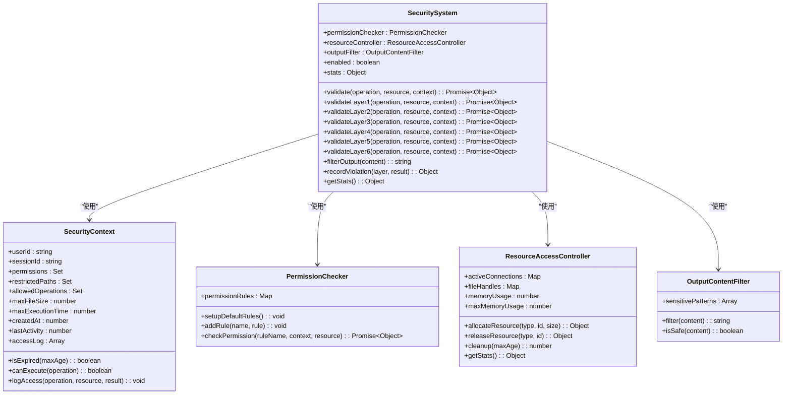
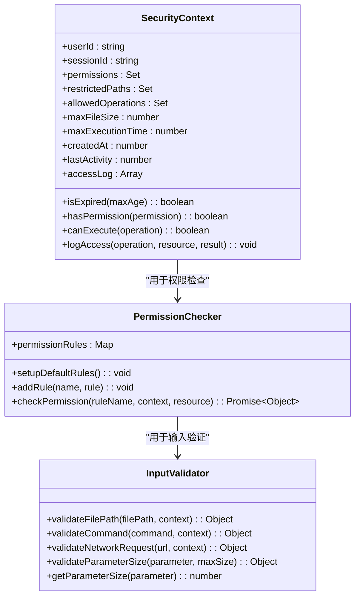
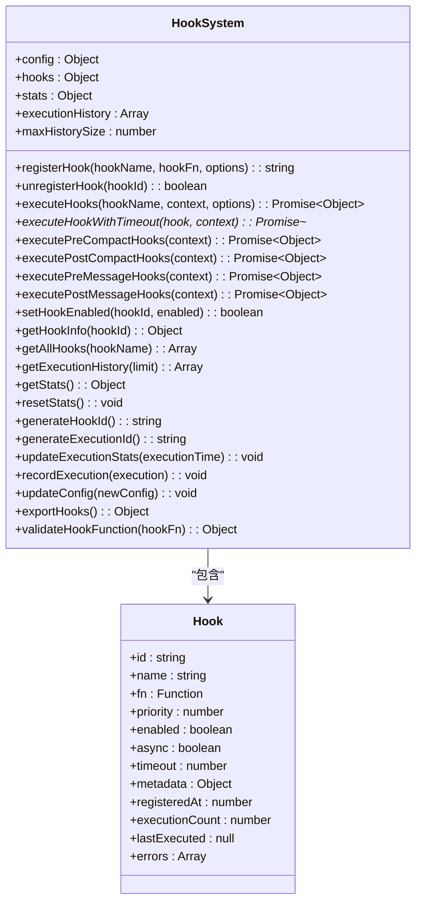
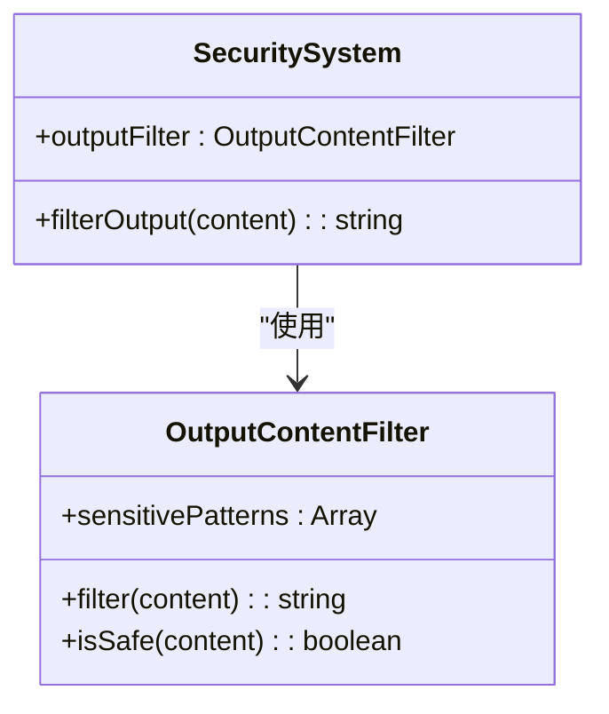
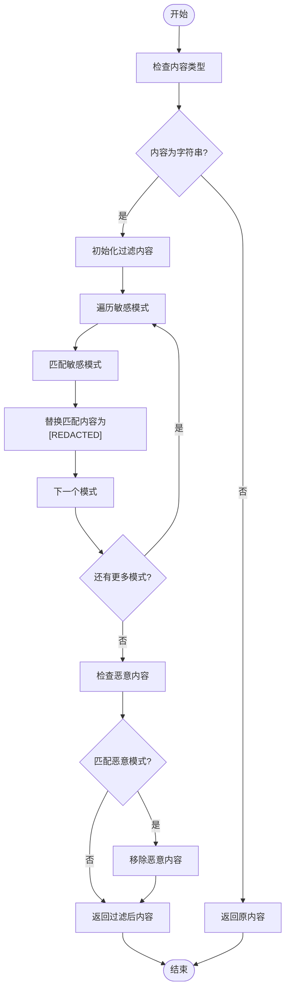
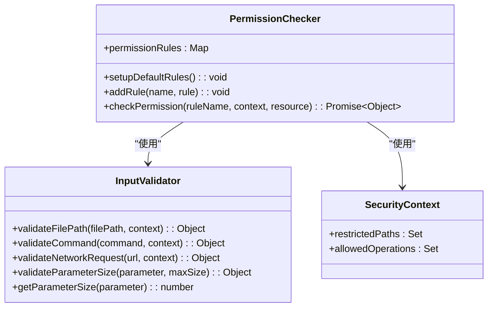
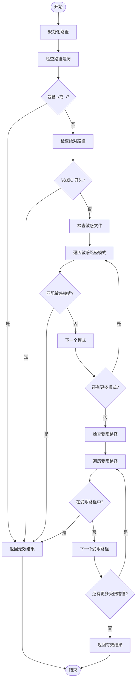
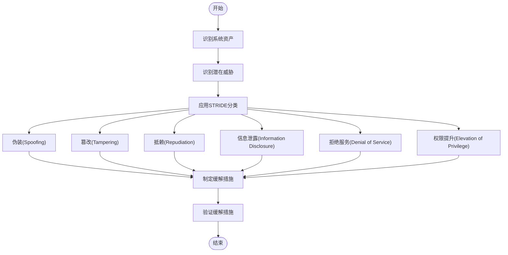

# 安全风险审查

<cite>
**本文档引用的文件**   
- [SecuritySystem.js](file://context-claude-code/src/security/SecuritySystem.js)
- [HookSystem.js](file://context-claude-code/src/claude-core/HookSystem.js)
- [auth.session.ts](file://packages/console/src/context/auth.session.ts)
</cite>

## 目录
1. [引言](#引言)
2. [上下文泄露防护机制分析](#上下文泄露防护机制分析)
3. [认证授权流程评估](#认证授权流程评估)
4. [钩子执行沙箱安全性审查](#钩子执行沙箱安全性审查)
5. [敏感信息存储与传输安全](#敏感信息存储与传输安全)
6. [文件操作权限控制粒度](#文件操作权限控制粒度)
7. [安全加固建议](#安全加固建议)
8. [威胁建模方法](#威胁建模方法)

## 引言

本报告旨在系统性识别和评估Claude Code系统中的安全风险点。通过对SecuritySystem的上下文泄露防护机制、auth模块的认证授权流程、HookSystem的钩子执行沙箱安全性、敏感信息存储与传输安全以及文件操作权限控制粒度的深入分析，全面评估系统的安全状况。报告将基于代码库中的实际实现，提供具体的安全加固建议和威胁建模方法，以提升系统的整体安全水平。

## 上下文泄露防护机制分析

SecuritySystem实现了六层安全验证机制，有效防止上下文泄露。该系统通过多层验证确保只有经过授权的请求才能访问系统资源。



**图源**
- [SecuritySystem.js](file://context-claude-code/src/security/SecuritySystem.js#L558-L845)
- [SecuritySystem.js](file://context-claude-code/src/security/SecuritySystem.js#L97-L141)
- [SecuritySystem.js](file://context-claude-code/src/security/SecuritySystem.js#L311-L388)
- [SecuritySystem.js](file://context-claude-code/src/security/SecuritySystem.js#L393-L495)
- [SecuritySystem.js](file://context-claude-code/src/security/SecuritySystem.js#L500-L553)

**节源**
- [SecuritySystem.js](file://context-claude-code/src/security/SecuritySystem.js#L558-L845)

### 六层安全验证流程

SecuritySystem的六层安全验证流程如下：

```mermaid
sequenceDiagram
participant Client as "客户端"
participant SecuritySystem as "SecuritySystem"
participant Context as "SecurityContext"
participant PermissionChecker as "PermissionChecker"
participant ResourceController as "ResourceAccessController"
participant OutputFilter as "OutputContentFilter"
Client->>SecuritySystem : 发起操作请求
SecuritySystem->>SecuritySystem : validate(operation, resource, context)
SecuritySystem->>SecuritySystem : validateLayer1(输入验证)
SecuritySystem-->>Client : 输入格式无效?
alt 输入格式有效
SecuritySystem->>SecuritySystem : validateLayer2(会话验证)
SecuritySystem->>Context : isExpired()
SecuritySystem->>Context : canExecute(operation)
SecuritySystem-->>Client : 会话过期或权限不足?
alt 会话有效且有权限
SecuritySystem->>SecuritySystem : validateLayer3(工具调用验证)
SecuritySystem->>PermissionChecker : checkPermission()
SecuritySystem-->>Client : 权限检查失败?
alt 权限检查通过
SecuritySystem->>SecuritySystem : validateLayer4(参数验证)
SecuritySystem-->>Client : 参数大小超限?
alt 参数大小正常
SecuritySystem->>SecuritySystem : validateLayer5(资源访问控制)
SecuritySystem->>ResourceController : allocateResource()
SecuritySystem->>ResourceController : getStats()
SecuritySystem-->>Client : 资源使用率过高?
alt 资源使用正常
SecuritySystem->>SecuritySystem : validateLayer6(输出过滤)
SecuritySystem->>OutputFilter : filter(content)
SecuritySystem-->>Client : 输出内容过大?
alt 输出内容正常
SecuritySystem-->>Client : 所有安全检查通过
else
SecuritySystem->>SecuritySystem : recordViolation(OUTPUT_CONTENT)
SecuritySystem-->>Client : 输出内容过大，拒绝请求
else
SecuritySystem->>SecuritySystem : recordViolation(SYSTEM_RESOURCE)
SecuritySystem-->>Client : 资源使用过高，拒绝请求
else
SecuritySystem->>SecuritySystem : recordViolation(PARAMETER_CONTENT)
SecuritySystem-->>Client : 参数过大，拒绝请求
else
SecuritySystem->>SecuritySystem : recordViolation(TOOL_CALL)
SecuritySystem-->>Client : 权限不足，拒绝请求
else
SecuritySystem->>SecuritySystem : recordViolation(MESSAGE_ROUTE)
SecuritySystem-->>Client : 会话过期或无权限，拒绝请求
else
SecuritySystem->>SecuritySystem : recordViolation(UI_INPUT)
SecuritySystem-->>Client : 输入格式无效，拒绝请求
```

**图源**
- [SecuritySystem.js](file://context-claude-code/src/security/SecuritySystem.js#L583-L652)

**节源**
- [SecuritySystem.js](file://context-claude-code/src/security/SecuritySystem.js#L583-L652)

### 各层验证机制详解

#### 第1层：UI输入验证
第一层验证主要检查输入参数的基本格式，确保操作和资源参数符合预期格式。

**节源**
- [SecuritySystem.js](file://context-claude-code/src/security/SecuritySystem.js#L657-L668)

#### 第2层：消息路由验证
第二层验证检查会话是否过期以及用户是否有执行特定操作的权限。

**节源**
- [SecuritySystem.js](file://context-claude-code/src/security/SecuritySystem.js#L673-L685)

#### 第3层：工具调用验证
第三层验证根据操作类型调用相应的权限检查规则，确保用户有执行特定操作的权限。

**节源**
- [SecuritySystem.js](file://context-claude-code/src/security/SecuritySystem.js#L690-L704)

#### 第4层：参数内容验证
第四层验证检查参数大小是否超过限制，防止过大的参数导致系统资源耗尽。

**节源**
- [SecuritySystem.js](file://context-claude-code/src/security/SecuritySystem.js#L709-L720)

#### 第5层：系统资源访问控制
第五层验证分配资源并检查系统资源使用率，防止资源过度使用。

**节源**
- [SecuritySystem.js](file://context-claude-code/src/security/SecuritySystem.js#L725-L747)

#### 第6层：输出内容过滤
第六层验证在结果返回时执行，检查输出内容大小，防止过大的输出内容泄露敏感信息。

**节源**
- [SecuritySystem.js](file://context-claude-code/src/security/SecuritySystem.js#L752-L763)

## 认证授权流程评估

系统通过SecurityContext和PermissionChecker实现认证授权流程，确保只有经过认证的用户才能执行授权的操作。



**图源**
- [SecuritySystem.js](file://context-claude-code/src/security/SecuritySystem.js#L97-L141)
- [SecuritySystem.js](file://context-claude-code/src/security/SecuritySystem.js#L311-L388)
- [SecuritySystem.js](file://context-claude-code/src/security/SecuritySystem.js#L146-L306)

**节源**
- [SecuritySystem.js](file://context-claude-code/src/security/SecuritySystem.js#L97-L141)

### 认证流程

认证流程主要通过SecurityContext实现，包括会话管理和权限检查。

```mermaid
sequenceDiagram
participant Client as "客户端"
participant SecuritySystem as "SecuritySystem"
participant Context as "SecurityContext"
Client->>SecuritySystem : 发起操作请求
SecuritySystem->>Context : 检查会话是否过期
Context->>Context : isExpired()
SecuritySystem-->>Client : 会话已过期?
alt 会话未过期
SecuritySystem->>Context : 检查操作权限
Context->>Context : canExecute(operation)
SecuritySystem-->>Client : 无操作权限?
alt 有操作权限
SecuritySystem-->>Client : 继续后续验证
else
SecuritySystem->>SecuritySystem : 记录安全违规
SecuritySystem-->>Client : 拒绝请求，无权限
else
SecuritySystem->>SecuritySystem : 记录安全违规
SecuritySystem-->>Client : 拒绝请求，会话过期
```

**图源**
- [SecuritySystem.js](file://context-claude-code/src/security/SecuritySystem.js#L673-L685)

**节源**
- [SecuritySystem.js](file://context-claude-code/src/security/SecuritySystem.js#L673-L685)

### 授权流程

授权流程通过PermissionChecker实现，根据不同的操作类型进行权限检查。

```mermaid
sequenceDiagram
participant SecuritySystem as "SecuritySystem"
participant PermissionChecker as "PermissionChecker"
participant Context as "SecurityContext"
participant InputValidator as "InputValidator"
SecuritySystem->>PermissionChecker : checkPermission(ruleName, context, resource)
PermissionChecker->>Context : 获取上下文信息
PermissionChecker->>InputValidator : 根据规则验证输入
alt 验证成功
PermissionChecker-->>SecuritySystem : 返回允许结果
else
PermissionChecker-->>SecuritySystem : 返回拒绝结果
```

**图源**
- [SecuritySystem.js](file://context-claude-code/src/security/SecuritySystem.js#L690-L704)

**节源**
- [SecuritySystem.js](file://context-claude-code/src/security/SecuritySystem.js#L690-L704)

## 钩子执行沙箱安全性审查

HookSystem实现了钩子执行沙箱机制，确保钩子函数在安全的环境中执行，防止恶意钩子注入。



**图源**
- [HookSystem.js](file://context-claude-code/src/claude-core/HookSystem.js#L10-L723)

**节源**
- [HookSystem.js](file://context-claude-code/src/claude-core/HookSystem.js#L10-L723)

### 钩子注册与执行机制

HookSystem通过注册和执行机制确保钩子函数的安全执行。

```mermaid
sequenceDiagram
participant Client as "客户端"
participant HookSystem as "HookSystem"
participant Hook as "钩子函数"
Client->>HookSystem : registerHook(hookName, hookFn, options)
HookSystem->>HookSystem : 验证钩子配置
HookSystem->>HookSystem : 生成钩子ID
HookSystem->>HookSystem : 按优先级插入钩子
HookSystem-->>Client : 返回钩子ID
Client->>HookSystem : executeHooks(hookName, context, options)
HookSystem->>HookSystem : 检查钩子是否启用
HookSystem->>HookSystem : 获取注册的钩子
HookSystem->>HookSystem : 执行所有启用的钩子
loop 每个启用的钩子
HookSystem->>HookSystem : 执行钩子函数
alt 钩子为异步
HookSystem->>HookSystem : executeHookWithTimeout(hook, context)
HookSystem->>Hook : 执行钩子函数
alt 执行成功
HookSystem-->>HookSystem : 记录执行结果
else
HookSystem->>HookSystem : 记录执行错误
else
HookSystem->>Hook : 执行钩子函数
alt 执行成功
HookSystem-->>HookSystem : 记录执行结果
else
HookSystem->>HookSystem : 记录执行错误
end
HookSystem-->>Client : 返回执行结果
```

**图源**
- [HookSystem.js](file://context-claude-code/src/claude-core/HookSystem.js#L60-L98)
- [HookSystem.js](file://context-claude-code/src/claude-core/HookSystem.js#L125-L259)

**节源**
- [HookSystem.js](file://context-claude-code/src/claude-core/HookSystem.js#L60-L98)
- [HookSystem.js](file://context-claude-code/src/claude-core/HookSystem.js#L125-L259)

### 钩子执行超时控制

HookSystem通过executeHookWithTimeout方法实现钩子执行的超时控制，防止恶意钩子长时间占用系统资源。

```mermaid
sequenceDiagram
participant HookSystem as "HookSystem"
participant Hook as "钩子函数"
HookSystem->>HookSystem : executeHookWithTimeout(hook, context)
HookSystem->>HookSystem : 设置超时定时器
HookSystem->>Hook : 执行钩子函数
alt 钩子返回Promise
Hook-->>HookSystem : 返回Promise
HookSystem->>HookSystem : 监听Promise结果
alt Promise成功
HookSystem->>HookSystem : 清除超时定时器
HookSystem-->>HookSystem : 解析Promise
else
HookSystem->>HookSystem : 清除超时定时器
HookSystem-->>HookSystem : 拒绝Promise
else
Hook-->>HookSystem : 返回同步结果
HookSystem->>HookSystem : 清除超时定时器
HookSystem-->>HookSystem : 解析结果
alt 超时发生
HookSystem->>HookSystem : 拒绝Promise
HookSystem-->>HookSystem : 抛出超时错误
```

**图源**
- [HookSystem.js](file://context-claude-code/src/claude-core/HookSystem.js#L267-L297)

**节源**
- [HookSystem.js](file://context-claude-code/src/claude-core/HookSystem.js#L267-L297)

## 敏感信息存储与传输安全

系统通过OutputContentFilter实现敏感信息的过滤，防止敏感信息在输出中泄露。



**图源**
- [SecuritySystem.js](file://context-claude-code/src/security/SecuritySystem.js#L500-L553)
- [SecuritySystem.js](file://context-claude-code/src/security/SecuritySystem.js#L558-L845)

**节源**
- [SecuritySystem.js](file://context-claude-code/src/security/SecuritySystem.js#L500-L553)

### 敏感信息过滤机制

OutputContentFilter通过正则表达式模式匹配敏感信息，并将其替换为[REDACTED]。



**图源**
- [SecuritySystem.js](file://context-claude-code/src/security/SecuritySystem.js#L515-L548)

**节源**
- [SecuritySystem.js](file://context-claude-code/src/security/SecuritySystem.js#L515-L548)

## 文件操作权限控制粒度

系统通过PermissionChecker和InputValidator实现文件操作权限的细粒度控制。



**图源**
- [SecuritySystem.js](file://context-claude-code/src/security/SecuritySystem.js#L311-L388)
- [SecuritySystem.js](file://context-claude-code/src/security/SecuritySystem.js#L146-L306)
- [SecuritySystem.js](file://context-claude-code/src/security/SecuritySystem.js#L97-L141)

**节源**
- [SecuritySystem.js](file://context-claude-code/src/security/SecuritySystem.js#L311-L388)

### 文件路径验证

InputValidator.validateFilePath方法实现文件路径的验证，防止路径遍历攻击。



**图源**
- [SecuritySystem.js](file://context-claude-code/src/security/SecuritySystem.js#L168-L212)

**节源**
- [SecuritySystem.js](file://context-claude-code/src/security/SecuritySystem.js#L168-L212)

## 安全加固建议

基于对系统安全机制的分析，提出以下安全加固建议：

### 1. 增强上下文泄露防护

- **建议**：在SecuritySystem的validateLayer6方法中增加更严格的输出内容过滤规则，防止敏感信息泄露。
- **理由**：当前的输出内容过滤仅检查大小，未对内容进行深度分析。
- **实施**：扩展OutputContentFilter的sensitivePatterns，增加更多敏感信息的正则表达式模式。

### 2. 完善认证授权流程

- **建议**：在SecurityContext中增加多因素认证支持。
- **理由**：当前的认证机制仅依赖会话和权限检查，缺乏多因素认证。
- **实施**：在SecurityContext中增加mfaEnabled和mfaVerified字段，实现多因素认证逻辑。

### 3. 加强钩子执行沙箱安全性

- **建议**：在HookSystem中增加沙箱环境隔离。
- **理由**：当前的钩子执行机制未完全隔离执行环境，可能存在安全风险。
- **实施**：使用Node.js的vm模块或worker_threads创建隔离的执行环境。

### 4. 提高敏感信息存储与传输安全

- **建议**：对敏感信息进行加密存储和传输。
- **理由**：当前的敏感信息仅通过过滤防止泄露，未进行加密保护。
- **实施**：使用AES等加密算法对敏感信息进行加密，密钥通过环境变量或密钥管理服务管理。

### 5. 细化文件操作权限控制

- **建议**：实现基于角色的访问控制（RBAC）。
- **理由**：当前的权限控制较为简单，无法满足复杂场景的需求。
- **实施**：在SecurityContext中增加角色管理，实现基于角色的权限检查。

## 威胁建模方法

采用STRIDE威胁建模方法对系统进行安全分析：



**节源**
- [SecuritySystem.js](file://context-claude-code/src/security/SecuritySystem.js)
- [HookSystem.js](file://context-claude-code/src/claude-core/HookSystem.js)

### STRIDE威胁分析

| 威胁类型 | 潜在风险 | 缓解措施 |
|---------|---------|---------|
| 伪装(Spoofing) | 攻击者伪装成合法用户 | 增强认证机制，实现多因素认证 |
| 篡改(Tampering) | 攻击者篡改系统数据 | 实现数据完整性检查，使用数字签名 |
| 抵赖(Repudiation) | 用户否认操作行为 | 完善日志记录，实现操作审计 |
| 信息泄露(Information Disclosure) | 敏感信息泄露 | 加强输出过滤，实现数据加密 |
| 拒绝服务(Denial of Service) | 系统资源耗尽 | 实现资源限制，增加超时控制 |
| 权限提升(Elevation of Privilege) | 用户获取未授权权限 | 实现最小权限原则，加强权限检查 |