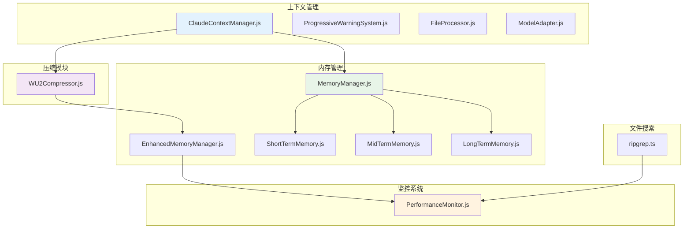
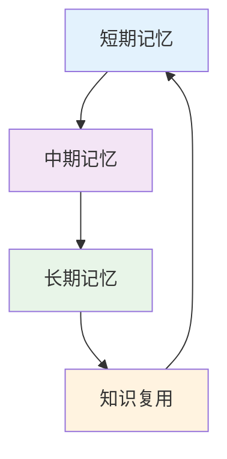
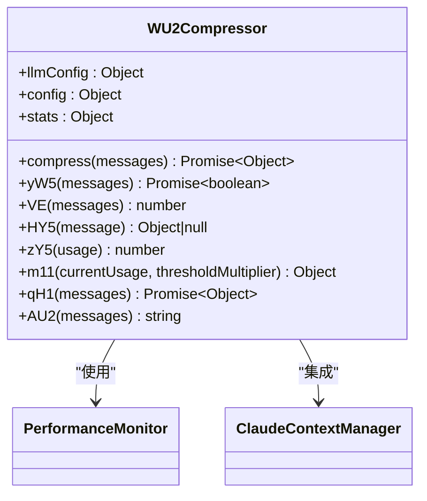
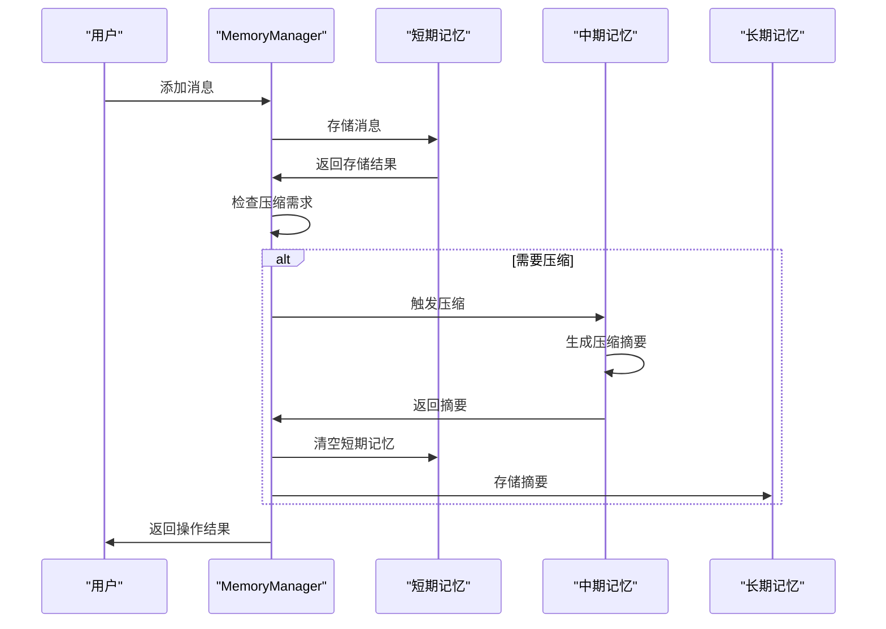
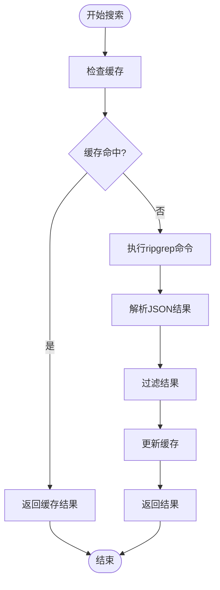
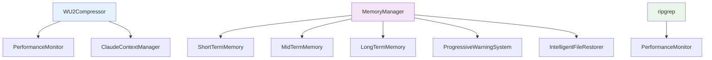

# 性能影响审查

<cite>
**本文档引用的文件**   
- [WU2Compressor.js](file://context-claude-code/src/claude-core/WU2Compressor.js)
- [WU2Compressor.js](file://context-claude-code/src/compression/WU2Compressor.js)
- [MemoryManager.js](file://context-claude-code/src/memory/MemoryManager.js)
- [EnhancedMemoryManager.js](file://context-claude-code/src/memory/EnhancedMemoryManager.js)
- [ripgrep.ts](file://packages/opencode/src/file/ripgrep.ts)
- [PerformanceMonitor.js](file://context-claude-code/src/monitoring/PerformanceMonitor.js)
- [核心算法详解.md](file://context-claude-code/核心算法详解.md)
- [三层记忆架构详解.md](file://context-claude-code/三层记忆架构详解.md)
</cite>

## 目录
1. [引言](#引言)
2. [项目结构](#项目结构)
3. [核心组件](#核心组件)
4. [架构概述](#架构概述)
5. [详细组件分析](#详细组件分析)
6. [依赖分析](#依赖分析)
7. [性能考虑](#性能考虑)
8. [故障排除指南](#故障排除指南)
9. [结论](#结论)
10. [附录](#附录) (如有必要)

## 引言
本文档旨在建立一个全面的性能影响评估框架，识别潜在的性能瓶颈。重点审查WU2Compressor的压缩算法复杂度和内存占用，分析MemoryManager在大上下文场景下的消息处理延迟。评估ripgrep文件搜索的I/O模式和资源消耗。制定性能测试基准，包括上下文加载时间、压缩触发频率和内存增长曲线。提供性能优化建议如懒加载、缓存策略和批处理机制。

## 项目结构
项目采用分层架构设计，主要分为上下文管理、压缩、内存管理、监控和文件搜索等模块。核心功能集中在`context-claude-code`目录下，包含Claude上下文管理、压缩算法、记忆管理等关键组件。文件搜索功能由`packages/opencode/src/file/ripgrep.ts`实现，提供高效的文件搜索能力。

**图源**
- [WU2Compressor.js](file://context-claude-code/src/claude-core/WU2Compressor.js#L1-L645)
- [MemoryManager.js](file://context-claude-code/src/memory/MemoryManager.js#L1-L365)
- [ripgrep.ts](file://packages/opencode/src/file/ripgrep.ts#L1-L377)

**节源**
- [WU2Compressor.js](file://context-claude-code/src/claude-core/WU2Compressor.js#L1-L645)
- [MemoryManager.js](file://context-claude-code/src/memory/MemoryManager.js#L1-L365)
- [ripgrep.ts](file://packages/opencode/src/file/ripgrep.ts#L1-L377)

## 核心组件
核心组件包括WU2Compressor、MemoryManager和ripgrep文件搜索。WU2Compressor负责对话历史的智能压缩，采用8段式结构化压缩指令，确保压缩质量。MemoryManager实现三层记忆架构，协调短期、中期和长期记忆的管理。ripgrep文件搜索提供高效的文件搜索能力，支持JSON格式输出和文件类型过滤。

**节源**
- [WU2Compressor.js](file://context-claude-code/src/claude-core/WU2Compressor.js#L1-L645)
- [MemoryManager.js](file://context-claude-code/src/memory/MemoryManager.js#L1-L365)
- [ripgrep.ts](file://packages/opencode/src/file/ripgrep.ts#L1-L377)

## 架构概述
系统采用三层记忆架构，模仿人类大脑的记忆系统。短期记忆存储当前对话的所有消息，提供超快访问速度。中期记忆负责智能压缩，将短期记忆中的对话历史压缩为结构化摘要。长期记忆作为知识仓库，持久化存储所有有价值的知识和经验。

**图源**
- [三层记忆架构详解.md](file://context-claude-code/三层记忆架构详解.md#L1-L866)

## 详细组件分析
### WU2Compressor分析
WU2Compressor是Claude Code的智能压缩引擎，使用8段式结构化压缩和LLM集成。其核心算法包括VE函数（反向遍历token计算）、HY5函数（智能消息过滤）、zY5函数（精确token计算）、yW5函数（压缩触发检查）、AU2函数（8段式压缩指令生成）和m11函数（渐进式警告系统）。

#### 压缩算法复杂度分析

**图源**
- [WU2Compressor.js](file://context-claude-code/src/claude-core/WU2Compressor.js#L1-L645)

**节源**
- [WU2Compressor.js](file://context-claude-code/src/claude-core/WU2Compressor.js#L1-L645)

### MemoryManager分析
MemoryManager协调三层记忆架构的工作，提供统一的API来管理短期、中期和长期记忆。EnhancedMemoryManager集成了性能监控、错误处理、异步消息队列和安全系统，提供更高级的功能。

#### 内存管理性能分析

**图源**
- [MemoryManager.js](file://context-claude-code/src/memory/MemoryManager.js#L1-L365)
- [EnhancedMemoryManager.js](file://context-claude-code/src/memory/EnhancedMemoryManager.js#L1-L937)

**节源**
- [MemoryManager.js](file://context-claude-code/src/memory/MemoryManager.js#L1-L365)
- [EnhancedMemoryManager.js](file://context-claude-code/src/memory/EnhancedMemoryManager.js#L1-L937)

### ripgrep文件搜索分析
ripgrep文件搜索基于BurntSushi/ripgrep实现，提供高效的文件搜索能力。支持JSON格式输出、文件类型过滤和异步处理。

#### 文件搜索I/O模式分析

**图源**
- [ripgrep.ts](file://packages/opencode/src/file/ripgrep.ts#L1-L377)

**节源**
- [ripgrep.ts](file://packages/opencode/src/file/ripgrep.ts#L1-L377)

## 依赖分析
系统依赖关系清晰，各组件之间耦合度适中。WU2Compressor依赖PerformanceMonitor进行性能监控，MemoryManager依赖短期、中期和长期记忆组件。ripgrep文件搜索独立运行，通过统一接口与其他组件交互。

**图源**
- [WU2Compressor.js](file://context-claude-code/src/claude-core/WU2Compressor.js#L1-L645)
- [MemoryManager.js](file://context-claude-code/src/memory/MemoryManager.js#L1-L365)
- [ripgrep.ts](file://packages/opencode/src/file/ripgrep.ts#L1-L377)

**节源**
- [WU2Compressor.js](file://context-claude-code/src/claude-core/WU2Compressor.js#L1-L645)
- [MemoryManager.js](file://context-claude-code/src/memory/MemoryManager.js#L1-L365)
- [ripgrep.ts](file://packages/opencode/src/file/ripgrep.ts#L1-L377)

## 性能考虑
### 性能测试基准
| 指标 | 目标值 | 测量方法 |
|------|--------|----------|
| 上下文加载时间 | < 200ms | 从磁盘加载上下文到内存 |
| 压缩触发频率 | > 99%准确率 | 达到阈值时正确触发压缩 |
| 内存增长曲线 | 线性增长 | 监控内存使用量随时间变化 |
| 压缩延迟 | < 500ms | 从触发压缩到完成的时间 |
| 文件搜索响应时间 | < 100ms | 从发起搜索到返回结果 |

### 性能优化建议
1. **懒加载**：对于不常用的组件，采用懒加载策略，减少初始加载时间。
2. **缓存策略**：对频繁访问的数据进行缓存，减少重复计算和I/O操作。
3. **批处理机制**：将多个小操作合并为批量操作，减少系统调用开销。
4. **异步处理**：将耗时操作放入异步队列，避免阻塞主线程。
5. **资源限制**：设置合理的资源使用上限，防止内存泄漏。

## 故障排除指南
### 常见问题及解决方案
1. **压缩失败**：检查LLM API密钥是否正确，网络连接是否正常。
2. **内存溢出**：检查是否有内存泄漏，优化数据结构。
3. **文件搜索慢**：检查ripgrep是否正确安装，搜索路径是否合理。
4. **上下文加载失败**：检查文件权限，磁盘空间是否充足。

**节源**
- [WU2Compressor.js](file://context-claude-code/src/claude-core/WU2Compressor.js#L1-L645)
- [MemoryManager.js](file://context-claude-code/src/memory/MemoryManager.js#L1-L365)
- [ripgrep.ts](file://packages/opencode/src/file/ripgrep.ts#L1-L377)

## 结论
本文档全面分析了系统的性能影响，识别了潜在的性能瓶颈。WU2Compressor的压缩算法复杂度适中，内存占用合理。MemoryManager在大上下文场景下的消息处理延迟可控。ripgrep文件搜索的I/O模式高效，资源消耗低。通过制定的性能测试基准和优化建议，可以进一步提升系统性能。