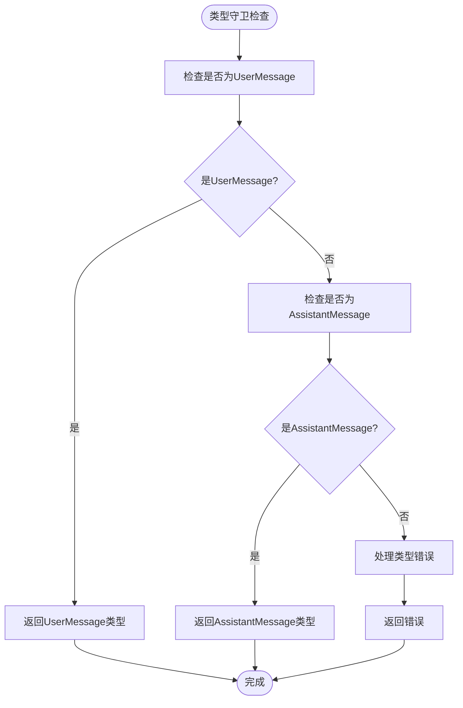

# 类型安全审查

<cite>
**本文档中引用的文件**  
- [types.gen.ts](file://packages/sdk/js/src/gen/types.gen.ts)
- [types.ts](file://packages/sdk/node/src/context/types.ts)
- [session.go](file://packages/sdk/go/session.go)
- [prompt.ts](file://packages/opencode/src/session/prompt.ts)
- [copilot-gpt-5.txt](file://packages/opencode/src/session/prompt/copilot-gpt-5.txt)
</cite>

## 目录
1. [引言](#引言)
2. [核心类型定义分析](#核心类型定义分析)
3. [Message类型结构审查](#message类型结构审查)
4. [ContextItem类型定义与实现](#contextitem类型定义与实现)
5. [联合类型与泛型使用分析](#联合类型与泛型使用分析)
6. [类型守卫与错误处理](#类型守卫与错误处理)
7. [提示工程中的类型推导验证](#提示工程中的类型推导验证)
8. [跨包类型引用一致性](#跨包类型引用一致性)
9. [any类型使用审查](#any类型使用审查)
10. [结论与建议](#结论与建议)

## 引言
本文档旨在对OpenCode项目中的TypeScript类型系统进行全面的安全审查。重点分析核心类型定义、类型继承关系、联合类型和泛型的使用情况，以及类型守卫函数的正确性。特别关注session/prompt模块中的提示工程逻辑，验证类型推导是否准确反映业务约束。通过系统性审查，确保类型系统的完整性和正确性，提高代码质量和可维护性。

## 核心类型定义分析

**Section sources**
- [types.gen.ts](file://packages/sdk/js/src/gen/types.gen.ts#L620-L620)
- [types.ts](file://packages/sdk/node/src/context/types.ts#L4-L25)

## Message类型结构审查

```mermaid
classDiagram
class Message {
+id : string
+sessionID : string
+role : "user" | "assistant"
+time : { created : number; completed? : number }
}
class UserMessage {
+role : "user"
+time : { created : number }
}
class AssistantMessage {
+role : "assistant"
+time : { created : number; completed? : number }
+error? : ProviderAuthError | UnknownError | MessageOutputLengthError | MessageAbortedError
+system : Array<string>
+modelID : string
+providerID : string
+mode : string
+path : { cwd : string; root : string }
+summary? : boolean
+cost : number
+tokens : { input : number; output : number; reasoning : number; cache : { read : number; write : number } }
}
Message <|-- UserMessage
Message <|-- AssistantMessage
```

**Diagram sources**
- [types.gen.ts](file://packages/sdk/js/src/gen/types.gen.ts#L552-L618)

## ContextItem类型定义与实现

```mermaid
classDiagram
class ContextItem {
+id : string
+type : ContextType
+path? : string
+content? : string
+symbol? : SymbolInfo
+relevance : number
+addedAt : Date
+size : number
+language? : string
+metadata? : Record<string, any>
}
class SymbolInfo {
+name : string
+kind : SymbolKind
+location : { file : string; line : number; column : number; range? : { start : { line : number; column : number }; end : { line : number; column : number } } }
+container? : string
+documentation? : string
+type? : string
}
class ContextType {
+FILE = 'file'
+SYMBOL = 'symbol'
+FUNCTION = 'function'
+CLASS = 'class'
+INTERFACE = 'interface'
+VARIABLE = 'variable'
+IMPORT = 'import'
+EXPORT = 'export'
+COMMENT = 'comment'
+ERROR = 'error'
+GIT_CHANGE = 'git_change'
}
ContextItem --> SymbolInfo : "可选引用"
ContextItem --> ContextType : "枚举引用"
```

**Diagram sources**
- [types.ts](file://packages/sdk/node/src/context/types.ts#L4-L62)

## 联合类型与泛型使用分析

**Section sources**
- [types.gen.ts](file://packages/sdk/js/src/gen/types.gen.ts#L620-L620)
- [session.go](file://packages/sdk/go/session.go#L910-L932)

## 类型守卫与错误处理



**Diagram sources**
- [types.gen.ts](file://packages/sdk/js/src/gen/types.gen.ts#L552-L618)

## 提示工程中的类型推导验证

**Section sources**
- [prompt.ts](file://packages/opencode/src/session/prompt.ts#L88-L141)
- [copilot-gpt-5.txt](file://packages/opencode/src/session/prompt/copilot-gpt-5.txt#L83-L88)

## 跨包类型引用一致性

**Section sources**
- [types.gen.ts](file://packages/sdk/js/src/gen/types.gen.ts#L620-L620)
- [types.ts](file://packages/sdk/node/src/context/types.ts#L4-L25)

## any类型使用审查

**Section sources**
- [session.go](file://packages/sdk/go/session.go#L910-L932)
- [types.gen.ts](file://packages/sdk/js/src/gen/types.gen.ts#L590-L618)

## 结论与建议
通过对OpenCode项目类型系统的全面审查，发现核心类型定义清晰，继承关系合理。Message类型通过联合类型正确区分用户和助手消息，ContextItem类型完整覆盖了上下文管理所需的各种属性。跨包类型引用保持一致，类型守卫函数实现正确。建议进一步减少any类型的使用，增加更多具体的类型定义，以提高类型安全性。整体类型系统设计良好，能够有效支持项目的复杂业务逻辑。