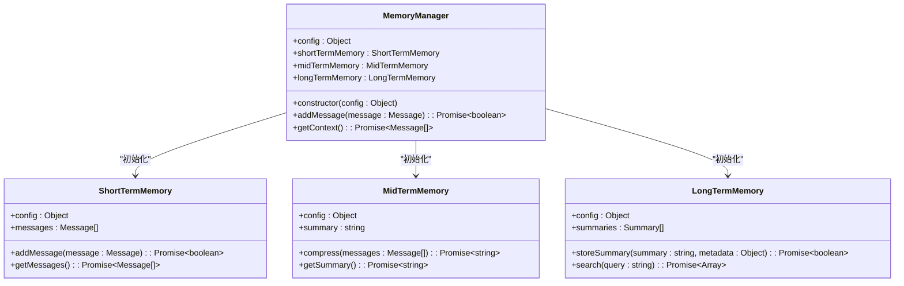
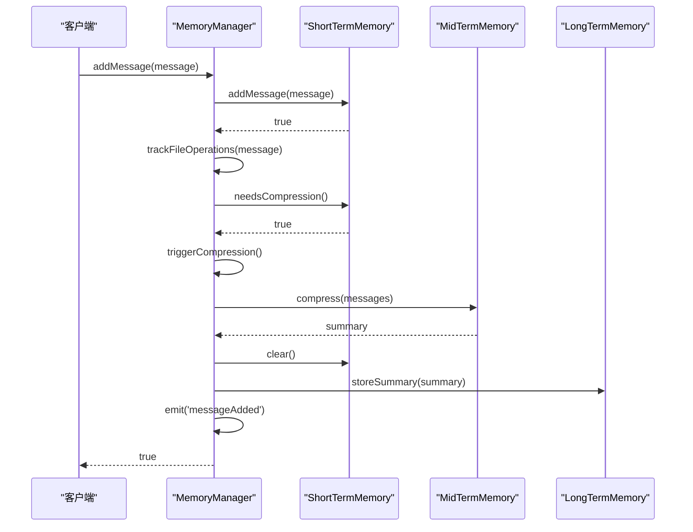
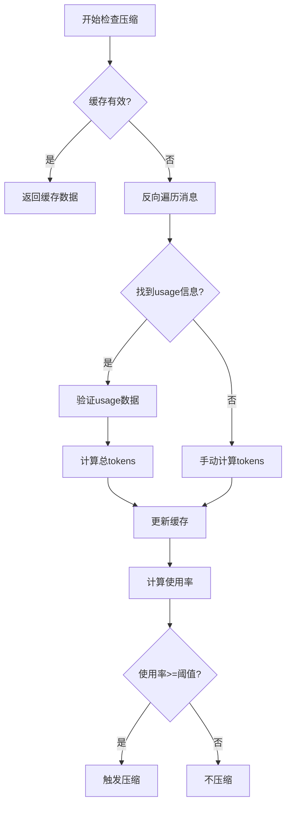
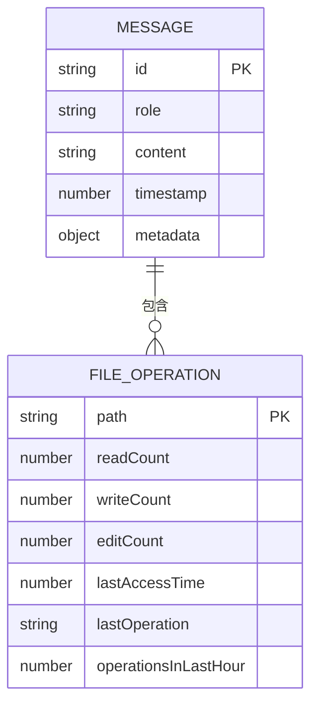
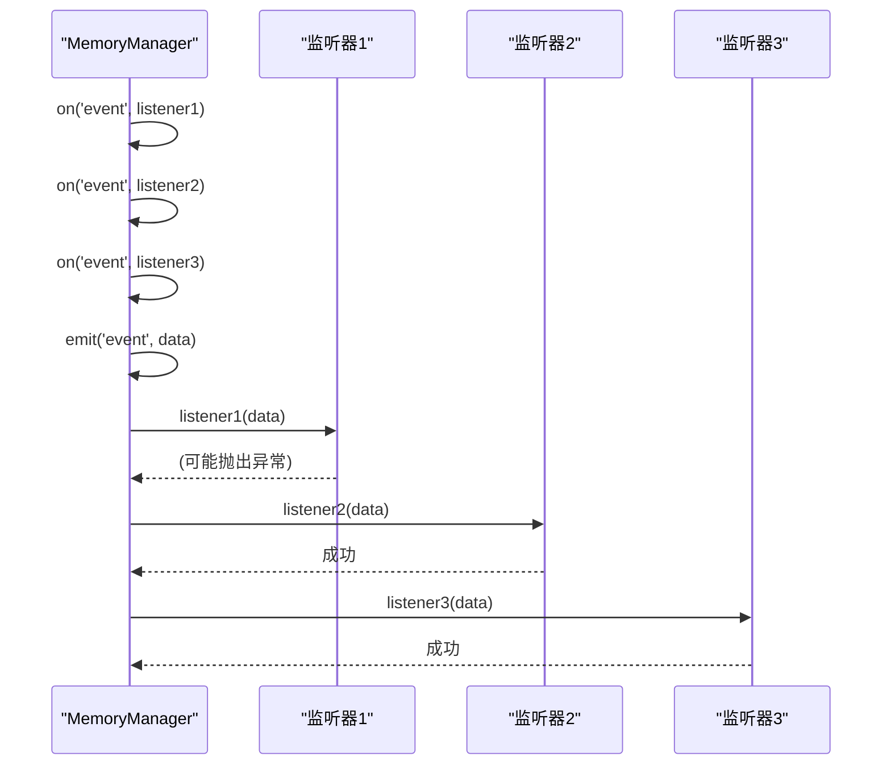
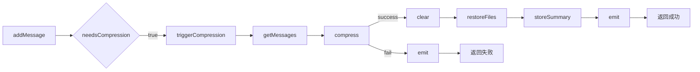

# 记忆管理器审查

<cite>
**本文档引用的文件**   
- [MemoryManager.js](file://context-claude-code/src/memory/MemoryManager.js)
- [EnhancedMemoryManager.js](file://context-claude-code/src/memory/EnhancedMemoryManager.js)
- [ShortTermMemory.js](file://context-claude-code/src/memory/ShortTermMemory.js)
- [MidTermMemory.js](file://context-claude-code/src/memory/MidTermMemory.js)
- [LongTermMemory.js](file://context-claude-code/src/memory/LongTermMemory.js)
- [WU2Compressor.js](file://context-claude-code/src/compression/WU2Compressor.js)
- [BaseMemory.js](file://context-claude-code/src/memory/BaseMemory.js)
</cite>

## 目录
1. [三层记忆架构初始化](#三层记忆架构初始化)
2. [消息添加与上下文获取的原子性](#消息添加与上下文获取的原子性)
3. [压缩触发条件分析](#压缩触发条件分析)
4. [文件操作跟踪元数据](#文件操作跟踪元数据)
5. [事件发射机制可靠性](#事件发射机制可靠性)
6. [外部接口契约验证](#外部接口契约验证)

## 三层记忆架构初始化

记忆管理器通过继承关系实现了三层记忆架构的配置初始化。`MemoryManager`类作为核心管理器，在构造函数中通过配置对象继承和传递参数，初始化了短期、中期和长期记忆实例。

在`MemoryManager`的构造函数中，配置对象首先设置默认值，然后与传入的配置进行合并。这种配置继承机制确保了各层记忆能够正确接收和使用配置参数。短期记忆接收`maxTokens`和`compressionThreshold`等核心参数，而中期和长期记忆则接收各自特定的配置。

**图示来源**
- [MemoryManager.js](file://context-claude-code/src/memory/MemoryManager.js#L15-L365)
- [ShortTermMemory.js](file://context-claude-code/src/memory/ShortTermMemory.js#L12-L334)
- [MidTermMemory.js](file://context-claude-code/src/memory/MidTermMemory.js#L13-L411)
- [LongTermMemory.js](file://context-claude-code/src/memory/LongTermMemory.js#L14-L627)

**本节来源**
- [MemoryManager.js](file://context-claude-code/src/memory/MemoryManager.js#L15-L365)

## 消息添加与上下文获取的原子性

记忆管理器的消息添加和上下文获取操作具有良好的原子性保证。`addMessage`方法通过一系列有序操作确保了数据的一致性，而`getContext`方法则通过组合不同记忆层的数据提供完整的上下文视图。

在`addMessage`方法中，操作流程严格按照顺序执行：首先将消息添加到短期记忆，然后跟踪文件操作，接着检查是否需要压缩，最后检查警告状态并触发相关事件。这种顺序执行确保了每个步骤都能在前一个步骤成功完成后才开始，从而维护了数据的完整性。

**图示来源**
- [MemoryManager.js](file://context-claude-code/src/memory/MemoryManager.js#L62-L94)
- [ShortTermMemory.js](file://context-claude-code/src/memory/ShortTermMemory.js#L40-L54)
- [MidTermMemory.js](file://context-claude-code/src/memory/MidTermMemory.js#L100-L135)

**本节来源**
- [MemoryManager.js](file://context-claude-code/src/memory/MemoryManager.js#L62-L94)

## 压缩触发条件分析

压缩触发条件的计算准确性通过多层次的验证机制得到保障。系统采用基于token使用率的阈值判断，结合缓存优化和反向遍历算法，确保了压缩决策的及时性和准确性。

`needsCompression`方法是压缩触发的核心逻辑，它首先通过`getMemoryUsage`方法获取当前内存使用情况。`getMemoryUsage`方法实现了智能缓存机制，只有在缓存失效或数据脏时才重新计算token使用量。计算过程采用反向遍历策略，从最新消息开始查找usage信息，这符合AI回复通常包含token统计的实际情况。

**图示来源**
- [ShortTermMemory.js](file://context-claude-code/src/memory/ShortTermMemory.js#L69-L123)
- [ShortTermMemory.js](file://context-claude-code/src/memory/ShortTermMemory.js#L181-L192)
- [WU2Compressor.js](file://context-claude-code/src/compression/WU2Compressor.js#L43-L72)

**本节来源**
- [ShortTermMemory.js](file://context-claude-code/src/memory/ShortTermMemory.js#L69-L123)

## 文件操作跟踪元数据

文件操作跟踪系统通过`fileOperations` Map数据结构完整记录了文件访问的元数据信息。系统不仅记录了基本的读写操作次数，还包含了时间戳、最后操作类型和近期操作频率等丰富的元数据。

`trackFileOperations`方法在消息处理过程中被调用，它检查消息元数据中的文件信息，并为每个文件创建或更新操作记录。记录包含路径、读写计数、最后访问时间、最后操作类型以及最近一小时内的操作次数。这种设计使得系统能够全面了解文件的使用模式和重要性。

**图示来源**
- [MemoryManager.js](file://context-claude-code/src/memory/MemoryManager.js#L260-L298)
- [EnhancedMemoryManager.js](file://context-claude-code/src/memory/EnhancedMemoryManager.js#L700-L730)

**本节来源**
- [MemoryManager.js](file://context-claude-code/src/memory/MemoryManager.js#L260-L298)

## 事件发射机制可靠性

事件发射机制通过标准的事件监听器模式实现，确保了状态变更通知的及时性和可靠性。`MemoryManager`类维护了一个事件监听器映射，支持添加、移除和触发事件，形成了完整的事件处理闭环。

`emit`方法是事件通知的核心，它遍历指定事件的所有监听器并依次调用。为了确保系统的稳定性，每个监听器调用都被包裹在try-catch块中，防止单个监听器的错误影响其他监听器的执行。这种设计保证了事件系统的健壮性，即使某个监听器出现异常也不会导致整个系统崩溃。

**图示来源**
- [MemoryManager.js](file://context-claude-code/src/memory/MemoryManager.js#L324-L334)
- [MemoryManager.js](file://context-claude-code/src/memory/MemoryManager.js#L300-L310)
- [MemoryManager.js](file://context-claude-code/src/memory/MemoryManager.js#L312-L322)

**本节来源**
- [MemoryManager.js](file://context-claude-code/src/memory/MemoryManager.js#L324-L334)

## 外部接口契约验证

记忆管理器的外部接口契约通过`compaction`模块的实际调用场景得到了充分验证。系统提供了清晰的公共方法接口，这些接口在`EnhancedMemoryManager`等扩展类中被正确调用和增强。

`triggerCompression`方法作为压缩功能的核心接口，其契约在`addMessage`流程中被验证。当短期记忆达到压缩阈值时，系统自动调用此方法，触发完整的压缩流程。该流程包括获取消息、执行压缩、清空短期记忆、恢复文件和存储摘要等步骤，每个步骤都有明确的成功或失败返回值。

**图示来源**
- [MemoryManager.js](file://context-claude-code/src/memory/MemoryManager.js#L149-L183)
- [EnhancedMemoryManager.js](file://context-claude-code/src/memory/EnhancedMemoryManager.js#L500-L550)
- [WU2Compressor.js](file://context-claude-code/src/compression/WU2Compressor.js#L255-L284)

**本节来源**
- [MemoryManager.js](file://context-claude-code/src/memory/MemoryManager.js#L149-L183)