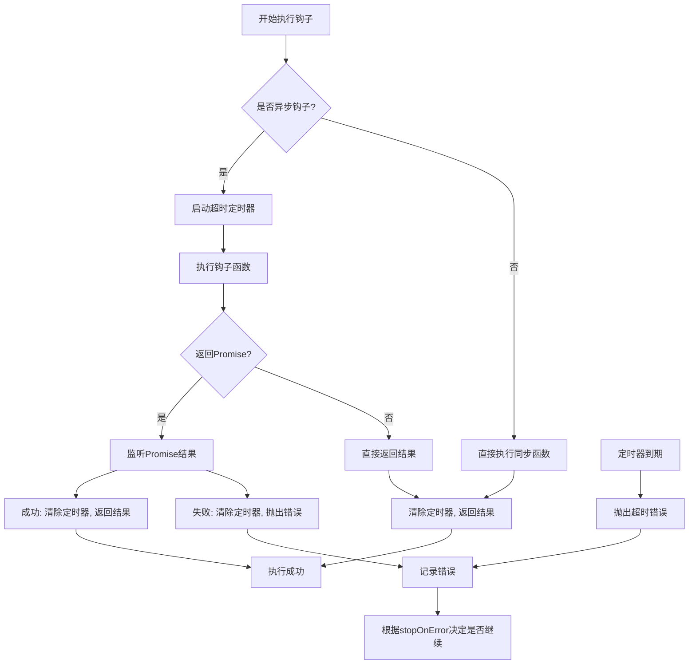
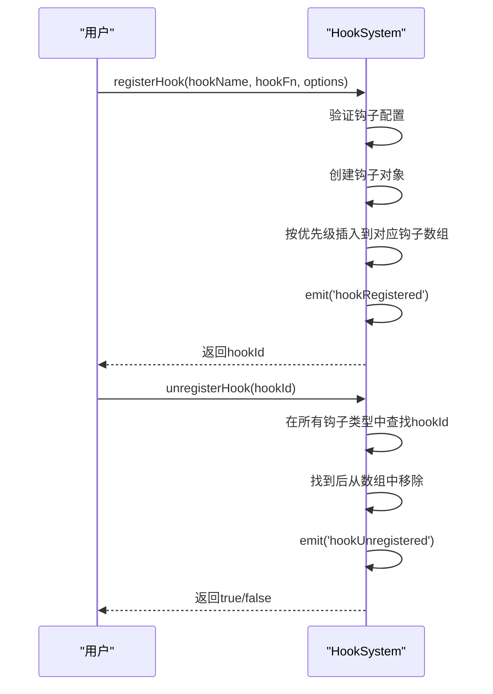
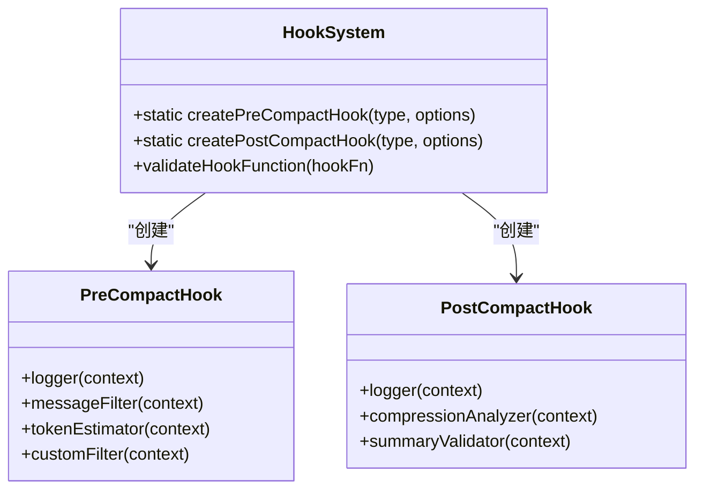
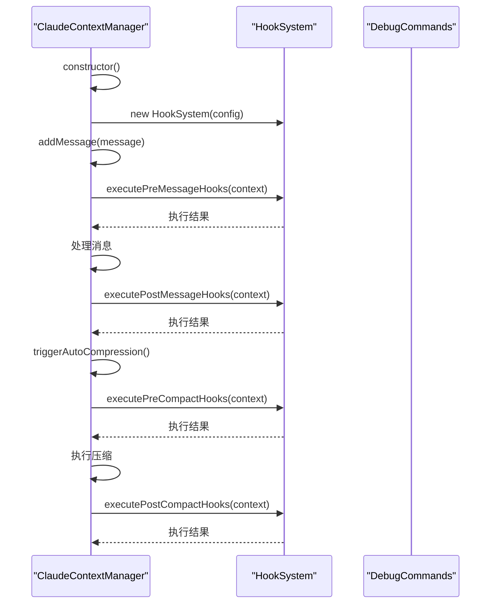
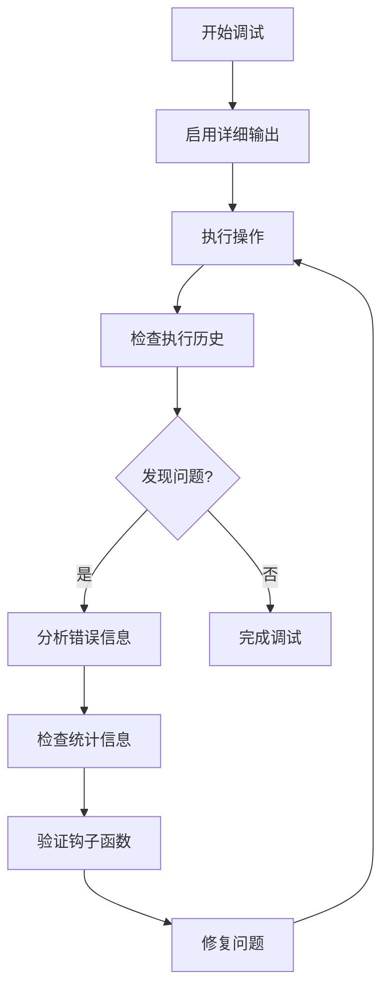

# 钩子系统审查

<cite>
**本文档引用文件**   
- [HookSystem.js](file://context-claude-code/src/claude-core/HookSystem.js)
- [DebugCommands.js](file://context-claude-code/src/claude-core/DebugCommands.js)
- [ClaudeContextManager.js](file://context-claude-code/src/claude-core/ClaudeContextManager.js)
</cite>

## 目录
1. [引言](#引言)
2. [超时控制与错误隔离机制验证](#超时控制与错误隔离机制验证)
3. [事件监听器生命周期管理](#事件监听器生命周期管理)
4. [预定义钩子分析](#预定义钩子分析)
5. [DebugCommands集成分析](#debugcommands集成分析)
6. [CLI工具支持评估](#cli工具支持评估)
7. [开发最佳实践与调试指南](#开发最佳实践与调试指南)

## 引言
钩子系统是Claude Code上下文管理的核心扩展机制，提供在关键操作（如压缩、消息处理）前后执行自定义逻辑的能力。本审查文档全面评估钩子系统的可靠性、安全性及可维护性，重点关注超时控制、错误隔离、生命周期管理等关键方面，并提供开发和调试的最佳实践。

## 超时控制与错误隔离机制验证

钩子系统实现了完善的超时控制和错误隔离机制，确保单个钩子的异常不会影响整体系统稳定性。

### 超时控制机制
系统通过`executeHookWithTimeout`方法为异步钩子提供超时保护。每个钩子执行时都会启动一个定时器，如果在指定时间内未完成，将抛出超时错误并终止执行。

**Diagram sources**
- [HookSystem.js](file://context-claude-code/src/claude-core/HookSystem.js#L247-L297)

### 错误隔离机制
系统通过以下方式实现错误隔离：
1. **独立错误处理**：每个钩子的错误被捕获并记录在其独立的错误数组中，不会影响其他钩子。
2. **执行策略控制**：通过`options.stopOnError`参数控制错误发生后的行为，默认情况下会停止后续钩子执行。
3. **异常捕获**：整个执行过程被try-catch包裹，确保任何未处理的异常都不会导致系统崩溃。

**Section sources**
- [HookSystem.js](file://context-claude-code/src/claude-core/HookSystem.js#L148-L248)

## 事件监听器生命周期管理

钩子系统提供了完整的事件监听器注册和注销生命周期管理，确保资源的正确分配和释放。

### 注册与注销流程
系统通过`registerHook`和`unregisterHook`方法管理钩子的生命周期。注册时，钩子按优先级排序插入；注销时，从所有钩子类型中查找并移除。

**Diagram sources**
- [HookSystem.js](file://context-claude-code/src/claude-core/HookSystem.js#L48-L146)

### 生命周期事件
系统通过EventEmitter发出以下生命周期事件：
- `hookRegistered`：钩子注册成功时
- `hookUnregistered`：钩子注销成功时
- `hookExecuted`：钩子执行完成时
- `hookError`：钩子执行出错时
- `hookToggled`：钩子启用状态改变时

这些事件允许外部系统监控钩子系统的状态变化。

**Section sources**
- [HookSystem.js](file://context-claude-code/src/claude-core/HookSystem.js#L48-L146)

## 预定义钩子分析

系统提供了`createPreCompactHook`和`createPostCompactHook`静态方法，用于创建常用的预定义钩子。

### createPreCompactHook实用性
该方法提供了多种预定义的压缩前钩子：
- **logger**：记录压缩前的上下文状态
- **messageFilter**：过滤掉系统消息
- **tokenEstimator**：估算token使用量
- **customFilter**：自定义消息过滤器

这些预定义钩子简化了常见场景的实现，提高了开发效率。

### 安全性分析
预定义钩子的安全性体现在：
1. **输入验证**：`validateHookFunction`方法验证钩子函数的有效性
2. **上下文隔离**：每个钩子接收独立的上下文副本，防止意外修改
3. **错误处理**：预定义钩子内部包含错误处理逻辑，如`summaryValidator`中的长度检查

**Diagram sources**
- [HookSystem.js](file://context-claude-code/src/claude-core/HookSystem.js#L641-L723)

**Section sources**
- [HookSystem.js](file://context-claude-code/src/claude-core/HookSystem.js#L600-L723)

## DebugCommands集成分析

DebugCommands系统与钩子系统深度集成，提供了强大的调试和监控能力。

### 集成方式
`ClaudeContextManager`在初始化时创建`HookSystem`实例，并在关键操作中调用相应的钩子执行方法：

**Diagram sources**
- [ClaudeContextManager.js](file://context-claude-code/src/claude-core/ClaudeContextManager.js#L182-L251)
- [ClaudeContextManager.js](file://context-claude-code/src/claude-core/ClaudeContextManager.js#L358-L394)
- [ClaudeContextManager.js](file://context-claude-code/src/claude-core/ClaudeContextManager.js#L400-L454)

### 调试命令支持
DebugCommands提供了多个与钩子系统相关的调试命令：
- `/context`：显示上下文状态，包括钩子执行情况
- `/memory`：显示内存统计，包含钩子执行历史
- `/warnings`：显示警告历史，可监控钩子触发的警告
- `/help`：显示所有可用命令，包括钩子相关命令

这些命令为开发者提供了全面的系统状态视图。

**Section sources**
- [DebugCommands.js](file://context-claude-code/src/claude-core/DebugCommands.js#L99-L116)

## CLI工具支持评估

系统通过DebugCommands提供了对钩子管理的CLI工具支持，但功能相对基础。

### 当前支持的功能
1. **状态查询**：通过`/context`和`/memory`命令查看钩子执行状态
2. **历史查看**：通过`getExecutionHistory`方法获取执行历史
3. **统计信息**：通过`getStats`方法获取统计信息

### 建议的增强功能
为了提升CLI工具对钩子管理的支持，建议增加以下命令：
- `/hooks list`：列出所有注册的钩子
- `/hooks info <hookId>`：查看特定钩子的详细信息
- `/hooks enable <hookId>`：启用指定钩子
- `/hooks disable <hookId>`：禁用指定钩子
- `/hooks history <hookId>`：查看特定钩子的执行历史

这些功能可以通过扩展`DebugCommands`类来实现。

**Section sources**
- [HookSystem.js](file://context-claude-code/src/claude-core/HookSystem.js#L421-L474)
- [DebugCommands.js](file://context-claude-code/src/claude-core/DebugCommands.js#L123-L180)

## 开发最佳实践与调试指南

### 开发最佳实践
1. **优先级设置**：合理设置钩子优先级，确保关键钩子优先执行
2. **异步处理**：耗时操作应使用异步钩子，避免阻塞主线程
3. **错误处理**：在钩子函数内部进行充分的错误处理
4. **上下文使用**：只读取必要的上下文字段，避免过度依赖
5. **性能监控**：监控钩子执行时间，避免性能瓶颈

### 调试指南
1. **启用详细输出**：使用`/debug --on`命令启用详细输出模式
2. **检查执行历史**：使用`getExecutionHistory()`方法查看最近的执行记录
3. **监控统计信息**：定期检查`getStats()`返回的统计信息
4. **验证钩子函数**：使用`validateHookFunction()`方法验证钩子函数
5. **清理历史记录**：使用`clearHistory()`方法清理过期的历史记录

**Diagram sources**
- [HookSystem.js](file://context-claude-code/src/claude-core/HookSystem.js#L421-L474)

**Section sources**
- [HookSystem.js](file://context-claude-code/src/claude-core/HookSystem.js#L421-L474)
- [HookSystem.js](file://context-claude-code/src/claude-core/HookSystem.js#L583-L641)