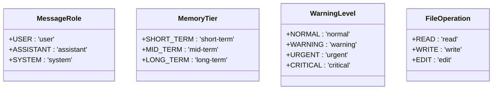
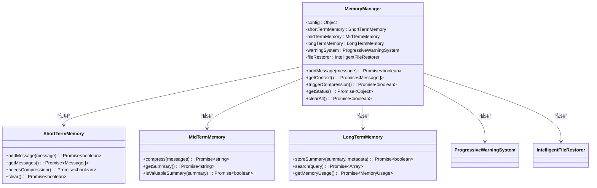
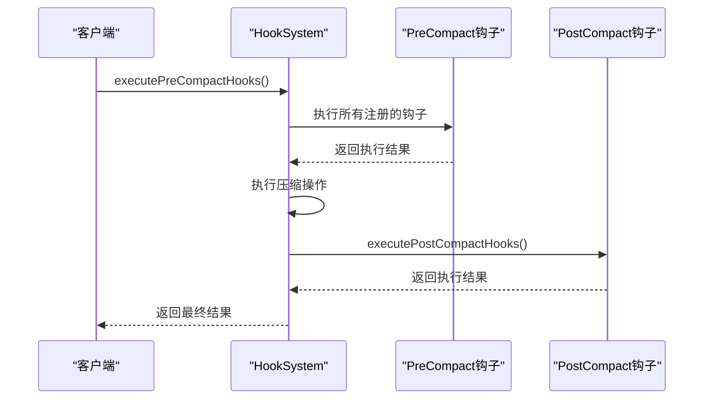
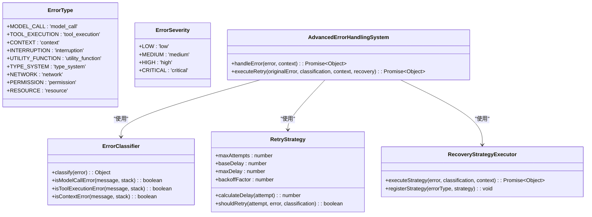
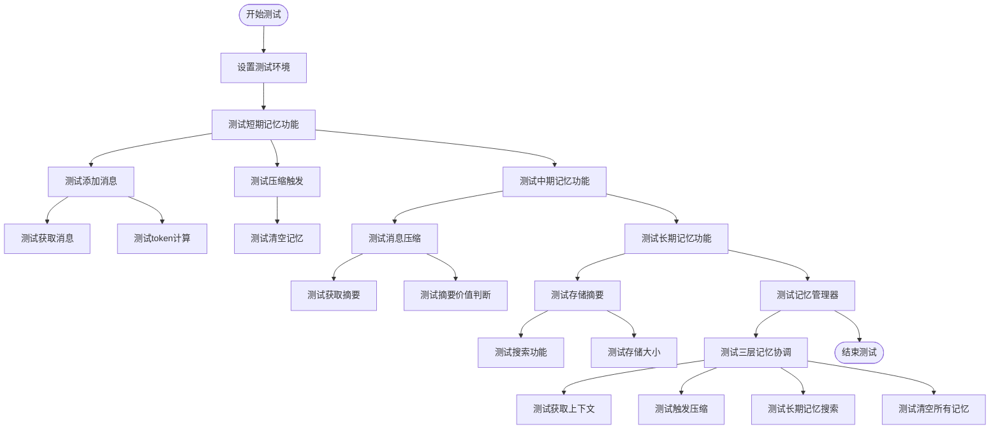
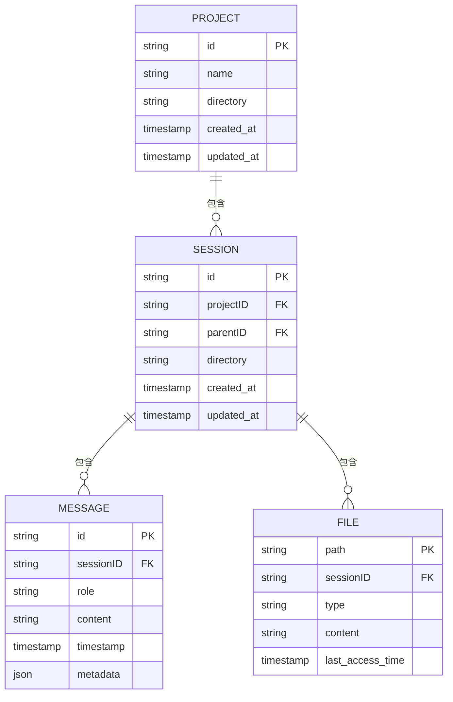

# 代码库维护

<cite>
**本文档引用的文件**  
- [project.md](file://specs/project.md)
- [index.js](file://context-claude-code/src/types/index.js)
- [MemoryManager.js](file://context-claude-code/src/memory/MemoryManager.js)
- [EnhancedMemoryManager.js](file://context-claude-code/src/memory/EnhancedMemoryManager.js)
- [HookSystem.js](file://context-claude-code/src/claude-core/HookSystem.js)
- [ErrorHandlingSystem.js](file://context-claude-code/src/error/ErrorHandlingSystem.js)
- [memory.test.js](file://context-claude-code/tests/memory.test.js)
</cite>

## 目录
1. [引言](#引言)
2. [类型系统与接口契约](#类型系统与接口契约)
3. [模块化设计与职责分离](#模块化设计与职责分离)
4. [日志规范与错误处理](#日志规范与错误处理)
5. [可测试代码编写指南](#可测试代码编写指南)
6. [代码审查关键点](#代码审查关键点)
7. [项目规范与代码风格](#项目规范与代码风格)
8. [结论](#结论)

## 引言
本文档旨在为团队提供代码库维护的最佳实践，确保代码的可维护性与可扩展性。通过分析项目中的核心组件，包括记忆管理器、钩子系统、错误处理机制等，总结出一套完整的开发规范和设计原则。文档重点强调类型系统的重要性、模块化设计原则、日志与错误处理规范、测试策略以及代码审查要点，帮助团队成员建立一致的开发标准。

## 类型系统与接口契约
类型系统是保证代码质量和可维护性的基石。通过在 `types/index.js` 中定义清晰的接口契约，可以有效减少运行时错误，提高代码的可读性和可维护性。

### 核心类型定义
项目中使用了多种枚举类型来规范数据结构和行为。这些类型定义不仅提供了代码提示，还作为文档的一部分，帮助开发者理解系统的预期行为。

**图表来源**
- [index.js](file://context-claude-code/src/types/index.js#L10-L50)

### 类型使用最佳实践
1. **统一消息格式**：所有消息对象都应遵循 `Message` 类型定义，包含角色、内容、时间戳和元数据。
2. **内存层级管理**：通过 `MemoryTier` 枚举明确区分短期、中期和长期记忆，避免混淆。
3. **警告级别控制**：使用 `WarningLevel` 来标准化警告系统的行为，确保不同级别的警告有明确的处理策略。
4. **文件操作追踪**：利用 `FileOperation` 枚举记录文件的读取、写入和编辑操作，便于审计和调试。

**章节来源**
- [index.js](file://context-claude-code/src/types/index.js#L10-L145)

## 模块化设计与职责分离
模块化设计是实现高内聚、低耦合的关键。项目中的 `MemoryManager` 和 `HookSystem` 组件展示了如何通过清晰的职责划分来构建可维护的系统。

### 记忆管理系统架构
`MemoryManager` 类协调三层记忆架构（短期、中期、长期），每个层级都有明确的职责：
- **短期记忆**：存储最近的对话消息
- **中期记忆**：生成对话摘要以节省空间
- **长期记忆**：持久化重要信息供后续检索

**图表来源**
- [MemoryManager.js](file://context-claude-code/src/memory/MemoryManager.js#L15-L365)
- [EnhancedMemoryManager.js](file://context-claude-code/src/memory/EnhancedMemoryManager.js#L24-L798)

### 钩子系统设计
`HookSystem` 实现了基于事件的扩展机制，允许在关键操作（如压缩前后）插入自定义逻辑。这种设计提高了系统的灵活性和可扩展性。

**图表来源**
- [HookSystem.js](file://context-claude-code/src/claude-core/HookSystem.js#L10-L723)

**章节来源**
- [MemoryManager.js](file://context-claude-code/src/memory/MemoryManager.js#L15-L365)
- [EnhancedMemoryManager.js](file://context-claude-code/src/memory/EnhancedMemoryManager.js#L24-L798)
- [HookSystem.js](file://context-claude-code/src/claude-core/HookSystem.js#L10-L723)

## 日志规范与错误处理
有效的日志记录和错误处理机制对于问题追踪和系统稳定性至关重要。项目中的 `ErrorHandlingSystem` 提供了一套完整的错误分类、恢复和重试策略。

### 错误分类与严重性
系统定义了详细的错误类型和严重级别，便于针对性地处理不同类型的错误。

**图表来源**
- [ErrorHandlingSystem.js](file://context-claude-code/src/error/ErrorHandlingSystem.js#L10-L707)

### 错误处理流程
1. **错误分类**：根据错误信息和堆栈跟踪确定错误类型和严重性。
2. **恢复策略**：执行相应的恢复策略，如切换备用模型、简化命令等。
3. **重试机制**：对于可重试的错误，采用指数退避策略进行重试。
4. **熔断器**：防止故障扩散，当错误率达到阈值时暂时停止服务。

**章节来源**
- [ErrorHandlingSystem.js](file://context-claude-code/src/error/ErrorHandlingSystem.js#L10-L707)

## 可测试代码编写指南
编写可测试的代码是保证软件质量的关键。项目中的测试用例展示了如何通过单元测试验证核心功能。

### 测试策略
1. **隔离依赖**：使用 Mock 机制隔离外部依赖，确保测试的独立性和可靠性。
2. **异步测试**：正确处理异步操作，使用 `async/await` 确保测试的时序正确。
3. **覆盖率**：确保关键路径都有相应的测试用例覆盖。

**图表来源**
- [memory.test.js](file://context-claude-code/tests/memory.test.js#L0-L301)

**章节来源**
- [memory.test.js](file://context-claude-code/tests/memory.test.js#L0-L301)

## 代码审查关键点
代码审查是保证代码质量的重要环节。以下是审查过程中应重点关注的几个方面：

### 上下文泄露风险
- 检查是否在日志或错误信息中意外暴露敏感数据。
- 确保 `securitySystem.filterOutput()` 在适当的地方被调用。
- 验证 `securityContext` 的权限设置是否合理。

### 性能瓶颈
- 检查是否存在同步阻塞操作，特别是在 `addMessage` 和 `getContext` 方法中。
- 确认异步消息队列 (`AsyncMessageQueue`) 的使用是否恰当。
- 审查 `performanceMonitor` 的指标收集是否会影响性能。

### API一致性
- 确保所有方法的返回值类型一致，特别是 Promise 的处理。
- 检查事件名称是否遵循统一的命名规范。
- 验证配置对象的结构是否一致，避免随意扩展。

**章节来源**
- [EnhancedMemoryManager.js](file://context-claude-code/src/memory/EnhancedMemoryManager.js#L24-L798)
- [ErrorHandlingSystem.js](file://context-claude-code/src/error/ErrorHandlingSystem.js#L10-L707)

## 项目规范与代码风格
项目规范定义了代码风格和文档标准，确保团队成员之间的协作顺畅。

### API设计规范
根据 `project.md` 文件，API 设计遵循 RESTful 原则，使用清晰的路径和 HTTP 方法：

**图表来源**
- [project.md](file://specs/project.md#L0-L65)

### 代码风格指南
1. **命名规范**：使用驼峰命名法，类名首字母大写。
2. **注释要求**：关键方法和复杂逻辑必须有 JSDoc 注释。
3. **错误处理**：所有异步操作都应有适当的错误处理。
4. **性能考虑**：避免在循环中执行昂贵的操作。

**章节来源**
- [project.md](file://specs/project.md#L0-L65)

## 结论
本文档总结了代码库维护的最佳实践，涵盖了类型系统、模块化设计、错误处理、测试策略和代码审查等多个方面。通过遵循这些原则，团队可以构建出更加健壮、可维护和可扩展的系统。建议定期回顾和更新这些实践，以适应项目的发展和技术的进步。