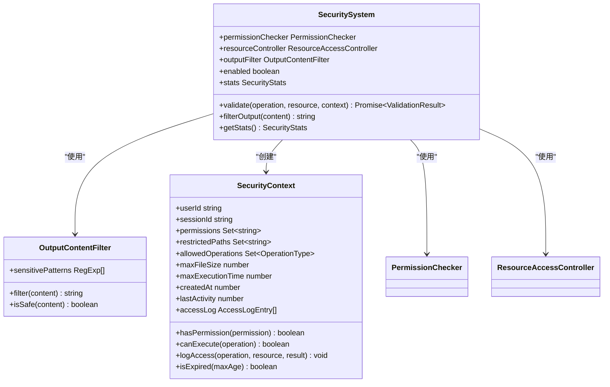
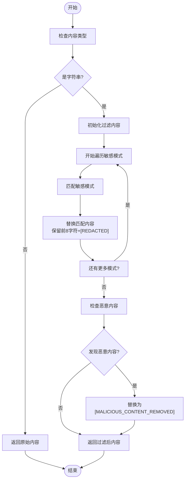
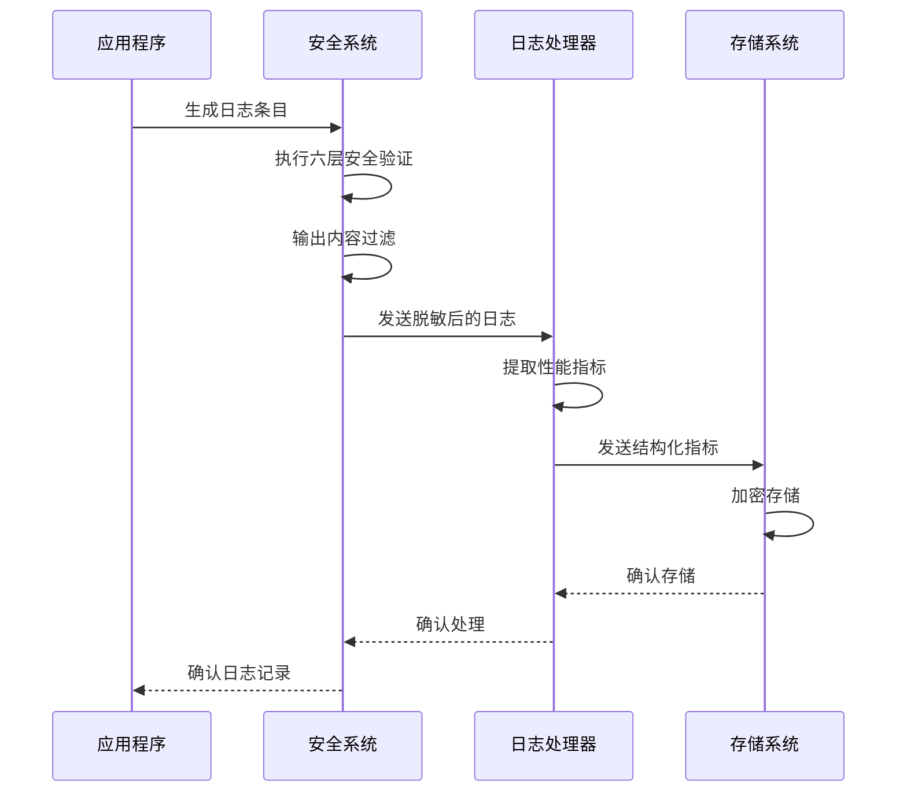
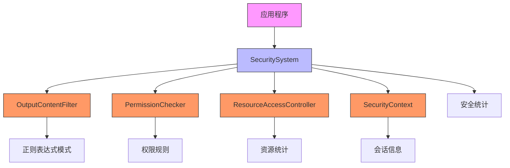
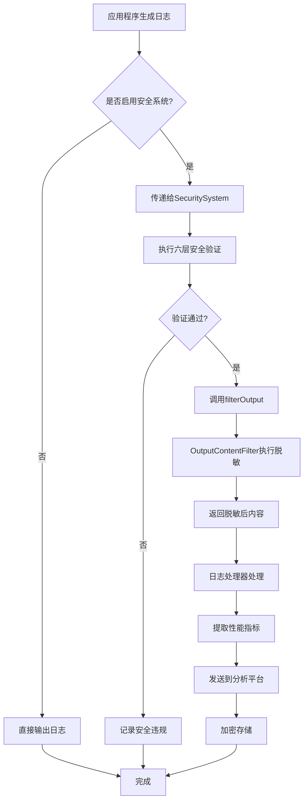

# 安全与敏感信息

<cite>
**Referenced Files in This Document**   
- [SecuritySystem.js](file://context-claude-code/src/security/SecuritySystem.js)
- [log-processor.ts](file://packages/console/function/src/log-processor.ts)
- [log.ts](file://packages/opencode/src/util/log.ts)
</cite>

## 目录
1. [简介](#简介)
2. [敏感信息过滤规则](#敏感信息过滤规则)
3. [日志脱敏与字段屏蔽](#日志脱敏与字段屏蔽)
4. [敏感信息检测工具](#敏感信息检测工具)
5. [日志访问控制与存储安全](#日志访问控制与存储安全)
6. [安全系统架构](#安全系统架构)
7. [日志处理流程](#日志处理流程)
8. [实施建议](#实施建议)

## 简介

本文档详细说明了在系统中如何保护敏感信息的安全策略和实施方法。重点介绍了敏感信息过滤规则、日志脱敏机制、访问控制策略以及安全存储要求，确保API密钥、用户凭证和个人身份信息等敏感数据不会被意外记录或泄露。

系统采用多层安全验证机制，通过六层安全防护体系来确保数据安全。该体系涵盖了从输入验证到输出内容过滤的完整流程，特别强调在日志输出前对潜在敏感信息进行检测和脱敏处理。

**Section sources**
- [SecuritySystem.js](file://context-claude-code/src/security/SecuritySystem.js#L1-L50)

## 敏感信息过滤规则

系统实施严格的敏感信息过滤规则，禁止在日志中记录任何敏感数据。这些规则主要通过`OutputContentFilter`类实现，该类负责在输出内容到达日志系统之前进行过滤和脱敏。

### 核心过滤原则

1. **禁止记录原则**：所有包含API密钥、密码、令牌、密钥、凭证等敏感信息的日志条目都必须经过脱敏处理。
2. **最小化原则**：只记录必要的调试信息，避免记录完整的请求/响应体，特别是包含敏感字段的数据。
3. **分层验证原则**：采用六层安全验证系统，确保在不同处理阶段都能检测和阻止敏感信息泄露。

### 六层安全验证系统

系统实现了六层安全验证机制，每层都有特定的职责：

1. **UI输入验证**：验证基本输入格式
2. **消息路由验证**：检查会话状态和操作权限
3. **工具调用验证**：根据操作类型进行权限检查
4. **参数内容验证**：验证参数大小和内容
5. **系统资源访问控制**：管理资源分配和使用
6. **输出内容过滤**：对输出内容进行最终过滤

这种分层架构确保了敏感信息在传播路径的每个关键节点都能被检测和处理。



**Diagram sources**
- [SecuritySystem.js](file://context-claude-code/src/security/SecuritySystem.js#L558-L850)

**Section sources**
- [SecuritySystem.js](file://context-claude-code/src/security/SecuritySystem.js#L1-L100)

## 日志脱敏与字段屏蔽

日志脱敏是保护敏感信息的关键环节，系统通过多种机制确保敏感数据在记录到日志之前被适当处理。

### 输出内容过滤器

`OutputContentFilter`类是实现日志脱敏的核心组件。它通过正则表达式模式匹配来识别和替换敏感信息。

#### 过滤机制

1. **字符串类型检查**：首先检查内容是否为字符串类型，非字符串内容直接返回。
2. **敏感模式匹配**：使用预定义的正则表达式模式匹配各种敏感信息。
3. **部分保留脱敏**：对于匹配到的敏感信息，保留前8个字符并用`[REDACTED]`替换其余部分。
4. **恶意内容检测**：额外检查是否存在潜在的恶意内容，如脚本标签或JavaScript协议。

### 脱敏处理流程

当系统需要输出日志或其他内容时，会经过以下脱敏流程：

1. 调用`filterOutput`方法将内容传递给`OutputContentFilter`
2. 过滤器遍历所有预定义的敏感模式
3. 对每个匹配到的敏感信息进行脱敏处理
4. 返回处理后的安全内容

这种方法确保了即使在调试或错误情况下，敏感信息也不会以明文形式出现在日志中。



**Diagram sources**
- [SecuritySystem.js](file://context-claude-code/src/security/SecuritySystem.js#L500-L544)

**Section sources**
- [SecuritySystem.js](file://context-claude-code/src/security/SecuritySystem.js#L500-L550)

## 敏感信息检测工具

系统提供了强大的工具来自动检测潜在的敏感信息，主要通过正则表达式模式和专门的检测函数实现。

### 正则表达式模式

系统定义了一系列正则表达式模式来识别不同类型的敏感信息：

```javascript
this.sensitivePatterns = [
  /password\s*[=:]\s*\S+/gi,
  /token\s*[=:]\s*\S+/gi,
  /key\s*[=:]\s*\S+/gi,
  /secret\s*[=:]\s*\S+/gi,
  /credential\s*[=:]\s*\S+/gi,
  /\b[A-Za-z0-9+/]{40,}\={0,2}\b/g // Base64编码的敏感数据
];
```

这些模式覆盖了常见的敏感信息标识符，包括：
- `password`：密码字段
- `token`：认证令牌
- `key`：密钥
- `secret`：密钥或秘密
- `credential`：凭证
- 长Base64编码字符串：可能包含加密的敏感数据

### 检测函数示例

除了正则表达式，系统还提供了专门的检测函数来验证不同类型的数据：

#### 文件路径验证

```javascript
static validateFilePath(filePath, context) {
  const normalizedPath = filePath.replace(/[\\\/]+/g, '/');
  
  // 检查路径遍历攻击
  if (normalizedPath.includes('../') || normalizedPath.includes('..\\')) {
    return {
      valid: false,
      reason: 'Path traversal attack detected',
      severity: 'high'
    };
  }
  
  // 检查敏感文件
  for (const pattern of SENSITIVE_PATHS) {
    if (pattern.test(normalizedPath)) {
      return {
        valid: false,
        reason: 'Access to sensitive files not allowed',
        severity: 'high'
      };
    }
  }
  
  return { valid: true };
}
```

#### 网络请求验证

```javascript
static validateNetworkRequest(url, context) {
  try {
    const parsedUrl = new URL(url);
    
    // 检查协议
    if (!['http:', 'https:'].includes(parsedUrl.protocol)) {
      return {
        valid: false,
        reason: 'Only HTTP/HTTPS protocols allowed',
        severity: 'high'
      };
    }
    
    // 检查主机
    if (!NETWORK_RESTRICTIONS.allowedHosts.includes(parsedUrl.hostname)) {
      return {
        valid: false,
        reason: `Host ${parsedUrl.hostname} not allowed`,
        severity: 'medium'
      };
    }
    
    return { valid: true };
  } catch (error) {
    return {
      valid: false,
      reason: 'Invalid URL format',
      severity: 'medium'
    };
  }
}
```

### 安全检查工具

系统还提供了`isSafe`方法来快速检查内容是否包含敏感信息：

```javascript
isSafe(content) {
  const filtered = this.filter(content);
  return filtered === content;
}
```

这个方法通过比较原始内容和过滤后的内容来判断是否存在敏感信息。如果两者相同，说明内容是安全的；如果不同，则说明有敏感信息被过滤。

**Section sources**
- [SecuritySystem.js](file://context-claude-code/src/security/SecuritySystem.js#L458-L550)

## 日志访问控制与存储安全

为了防止信息泄露，系统实施了严格的日志访问控制和加密存储要求。

### 访问权限控制

系统通过多层次的权限控制系统来管理日志访问：

1. **基于角色的访问控制(RBAC)**：不同角色的用户拥有不同的日志访问权限。
2. **最小权限原则**：用户只能访问完成其工作所需的最低限度的日志信息。
3. **审计日志**：所有日志访问操作都会被记录，便于审计和追踪。

### 加密存储要求

所有日志文件必须按照以下安全要求进行存储：

1. **传输加密**：日志在传输过程中必须使用TLS等加密协议。
2. **静态加密**：存储在磁盘上的日志文件必须进行加密。
3. **访问控制**：文件系统级别的权限设置，确保只有授权进程可以读取日志文件。

### 日志处理器

系统中的日志处理器负责将日志数据发送到分析平台，同时确保敏感信息不会被泄露：

```typescript
export default {
  async tail(events: TraceItem[]) {
    for (const event of events) {
      if (!event.event) continue
      if (!("request" in event.event)) continue
      if (event.event.request.method !== "POST") continue

      const url = new URL(event.event.request.url)
      if (
        url.pathname !== "/zen/v1/chat/completions" &&
        url.pathname !== "/zen/v1/messages" &&
        url.pathname !== "/zen/v1/responses"
      )
        return

      let metrics = {
        event_type: "completions",
        "cf.continent": event.event.request.cf?.continent,
        "cf.country": event.event.request.cf?.country,
        "cf.city": event.event.request.cf?.city,
        "cf.region": event.event.request.cf?.region,
        "cf.latitude": event.event.request.cf?.latitude,
        "cf.longitude": event.event.request.cf?.longitude,
        "cf.timezone": event.event.request.cf?.timezone,
        duration: event.wallTime,
        request_length: parseInt(event.event.request.headers["content-length"] ?? "0"),
        status: event.event.response?.status ?? 0,
        ip: event.event.request.headers["x-real-ip"],
      }
      
      // 处理日志消息
      for (const log of event.logs) {
        for (const message of log.message) {
          if (!message.startsWith("_metric:")) continue
          metrics = { ...metrics, ...JSON.parse(message.slice(8)) }
        }
      }
      
      console.log(JSON.stringify(metrics, null, 2))
    }
  },
}
```

这个处理器只收集必要的性能指标和元数据，避免记录完整的请求/响应内容。



**Diagram sources**
- [log-processor.ts](file://packages/console/function/src/log-processor.ts#L1-L55)
- [SecuritySystem.js](file://context-claude-code/src/security/SecuritySystem.js#L558-L850)

**Section sources**
- [log-processor.ts](file://packages/console/function/src/log-processor.ts#L1-L55)

## 安全系统架构

系统的安全架构采用分层设计，确保每个安全功能都有明确的职责和边界。

### 核心组件

1. **SecuritySystem**：主安全系统，协调各安全组件
2. **OutputContentFilter**：输出内容过滤器，负责脱敏
3. **PermissionChecker**：权限检查器，管理访问控制
4. **ResourceAccessController**：资源访问控制器，管理资源使用
5. **SecurityContext**：安全上下文，存储会话安全信息

### 组件交互

各组件之间的交互遵循单一职责原则，每个组件只负责特定的安全功能。主安全系统负责协调这些组件，确保安全策略的一致性执行。



**Diagram sources**
- [SecuritySystem.js](file://context-claude-code/src/security/SecuritySystem.js#L1-L850)

**Section sources**
- [SecuritySystem.js](file://context-claude-code/src/security/SecuritySystem.js#L1-L850)

## 日志处理流程

系统的日志处理流程设计为在多个阶段进行安全检查，确保敏感信息不会被记录。

### 处理阶段

1. **生成阶段**：应用程序生成日志条目
2. **验证阶段**：安全系统执行六层验证
3. **过滤阶段**：输出内容过滤器脱敏敏感信息
4. **处理阶段**：日志处理器提取必要指标
5. **存储阶段**：加密存储日志数据

### 详细流程



这个流程确保了即使在开发或调试模式下，敏感信息也能得到有效保护。

**Section sources**
- [SecuritySystem.js](file://context-claude-code/src/security/SecuritySystem.js#L558-L652)
- [log-processor.ts](file://packages/console/function/src/log-processor.ts#L1-L55)

## 实施建议

为了确保敏感信息保护策略的有效实施，建议遵循以下最佳实践：

### 开发阶段

1. **代码审查**：在代码审查过程中特别注意日志语句，确保不会意外记录敏感信息。
2. **单元测试**：为安全过滤器编写单元测试，验证各种敏感模式的检测准确性。
3. **静态分析**：使用静态代码分析工具检测潜在的敏感信息泄露风险。

### 部署阶段

1. **配置管理**：确保安全系统在生产环境中始终启用。
2. **监控告警**：设置监控告警，当检测到敏感信息访问时及时通知安全团队。
3. **定期审计**：定期审计日志文件，验证脱敏策略的有效性。

### 持续改进

1. **模式更新**：定期更新敏感信息检测模式，应对新的安全威胁。
2. **性能优化**：监控安全过滤的性能影响，确保不会成为系统瓶颈。
3. **用户培训**：对开发人员进行安全培训，提高对敏感信息保护的意识。

通过遵循这些实施建议，可以确保系统的敏感信息保护机制持续有效，为用户提供安全可靠的服务。

**Section sources**
- [SecuritySystem.js](file://context-claude-code/src/security/SecuritySystem.js#L1-L850)
- [log.ts](file://packages/opencode/src/util/log.ts#L1-L176)