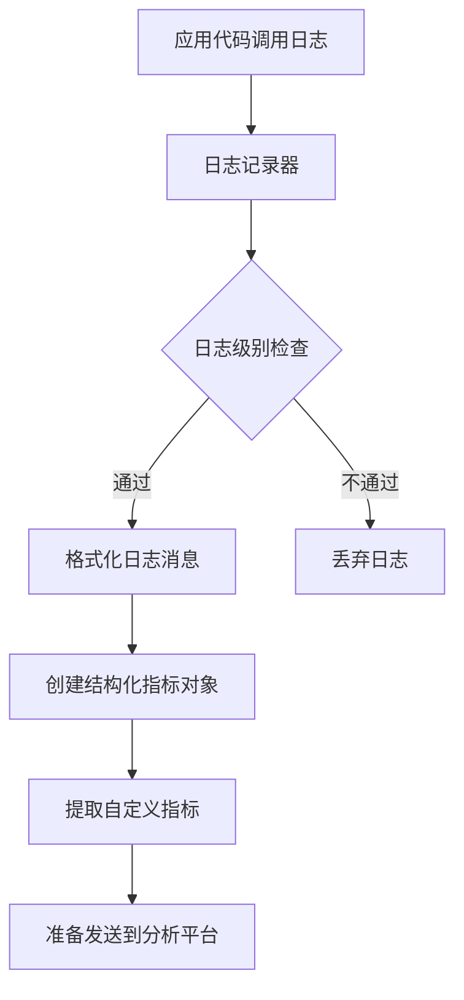
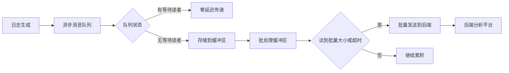
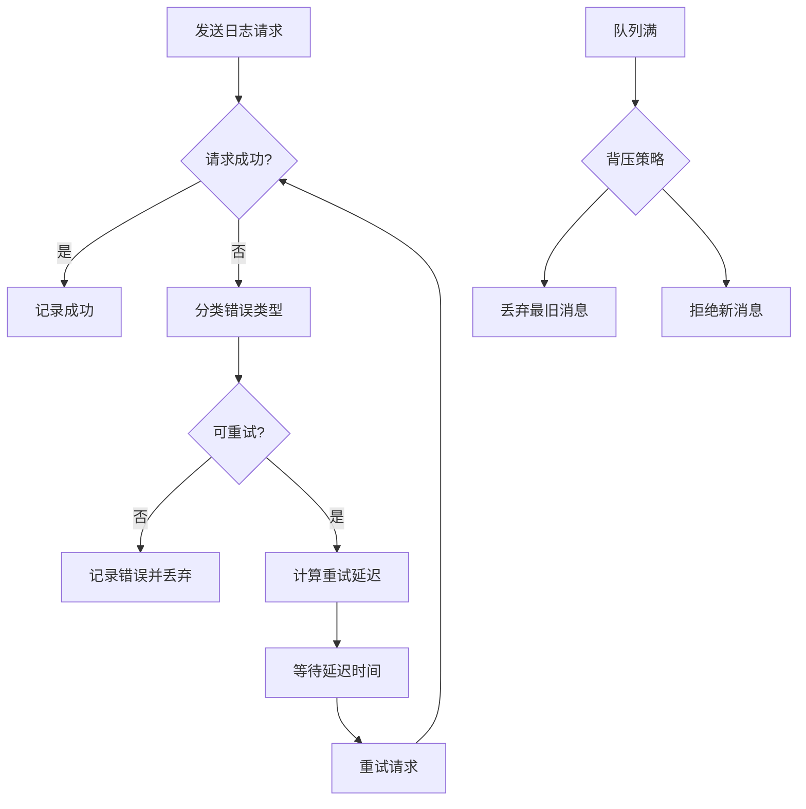
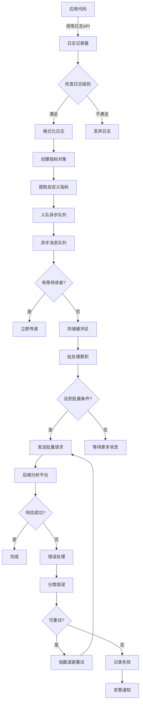

# 日志处理流程

<cite>
**本文档引用的文件**  
- [log-processor.ts](file://packages/console/function/src/log-processor.ts)
- [log.ts](file://packages/opencode/src/util/log.ts)
- [AsyncMessageQueue.js](file://context-claude-code/src/queue/AsyncMessageQueue.js)
- [ErrorHandlingSystem.js](file://context-claude-code/src/error/ErrorHandlingSystem.js)
</cite>

## 目录
1. [日志处理流程概述](#日志处理流程概述)
2. [日志收集与格式化](#日志收集与格式化)
3. [异步写入与批量发送](#异步写入与批量发送)
4. [错误重试与网络异常处理](#错误重试与网络异常处理)
5. [日志处理流程图](#日志处理流程图)

## 日志处理流程概述

本系统实现了完整的日志处理链路，从日志生成到持久化，涵盖了收集、格式化、传输、异步写入、批量发送和错误处理等关键环节。核心目标是确保日志数据的可靠性，同时避免阻塞主业务流程。

日志处理流程始于应用代码中的日志记录调用，通过异步队列机制将日志消息与主流程解耦，然后经过格式化处理，最终通过网络传输到后端分析平台（如Honeycomb）。整个流程设计为高可靠、高性能，能够处理网络异常和系统故障。

**Section sources**
- [log-processor.ts](file://packages/console/function/src/log-processor.ts#L1-L54)
- [log.ts](file://packages/opencode/src/util/log.ts#L0-L175)

## 日志收集与格式化

日志收集始于应用代码中调用日志记录器。系统提供了统一的日志API，支持不同级别的日志记录（DEBUG、INFO、WARN、ERROR）。当应用调用日志方法时，日志消息首先被格式化为结构化数据。

在 `log.ts` 文件中，日志系统通过 `create` 函数创建日志记录器实例，支持为不同服务创建独立的记录器。日志消息包含时间戳、服务名称、日志级别和自定义元数据。格式化后的日志消息通过 `build` 函数生成标准格式的字符串。

对于特定的API请求日志，`log-processor.ts` 文件中的 `tail` 函数负责处理Cloudflare Workers的跟踪事件。该函数首先过滤出POST请求到特定API端点（`/zen/v1/chat/completions`、`/zen/v1/messages`、`/zen/v1/responses`）的事件，然后从请求上下文中提取地理位置、性能指标和请求元数据。

日志格式化过程中，系统会从事件日志中解析以 `_metric:` 开头的特殊消息，这些消息包含JSON格式的自定义指标，会被合并到最终的指标对象中。这种设计允许在代码中通过简单的日志语句注入自定义监控指标。

**Diagram sources**
- [log-processor.ts](file://packages/console/function/src/log-processor.ts#L18-L35)
- [log.ts](file://packages/opencode/src/util/log.ts#L104-L139)

**Section sources**
- [log-processor.ts](file://packages/console/function/src/log-processor.ts#L1-L54)
- [log.ts](file://packages/opencode/src/util/log.ts#L0-L175)

## 异步写入与批量发送

为避免日志记录阻塞主业务流程，系统采用了异步写入机制。日志消息首先被放入异步消息队列，由独立的后台任务处理发送，确保主流程的高性能和响应性。

`AsyncMessageQueue.js` 实现了高性能的异步消息队列，支持优先级队列（主缓冲区和次要缓冲区）和背压处理。当队列中有等待的读者时，消息可以零延迟传递；否则，消息被存储在缓冲区中，等待被消费。这种设计确保了高吞吐量下的低延迟。

批量发送策略是性能优化的关键。系统通过批处理缓冲区收集多个日志消息，然后一次性发送到后端服务。这减少了网络请求的开销，提高了整体吞吐量。`flushBatch` 方法负责强制刷新批处理缓冲区，将累积的日志消息作为批量请求发送。

在 `log-processor.ts` 中，虽然直接使用了 `fetch` 发送日志，但结合异步队列的架构，实际的日志处理是异步进行的。每个日志事件被独立处理，但通过事件驱动的架构，多个日志可以并行处理，提高了整体效率。

**Diagram sources**
- [AsyncMessageQueue.js](file://context-claude-code/src/queue/AsyncMessageQueue.js#L193-L248)
- [log-processor.ts](file://packages/console/function/src/log-processor.ts#L45-L53)

**Section sources**
- [AsyncMessageQueue.js](file://context-claude-code/src/queue/AsyncMessageQueue.js#L0-L526)
- [log-processor.ts](file://packages/console/function/src/log-processor.ts#L1-L54)

## 错误重试与网络异常处理

为确保日志的可靠性，系统实现了完善的错误重试机制和网络异常处理逻辑。当发送日志到后端服务失败时，系统会自动尝试重试，避免数据丢失。

`ErrorHandlingSystem.js` 实现了高级错误处理系统，包含错误分类、重试策略和熔断器模式。错误首先被分类为不同类型的错误（如网络错误、权限错误等），然后根据错误类型决定是否可重试。对于可重试的错误，系统采用指数退避算法计算重试延迟，避免对后端服务造成过大压力。

在 `log-processor.ts` 中，虽然没有显式的重试逻辑，但结合全局错误处理系统，网络请求失败会被捕获并触发重试机制。`fetch` 请求的响应状态码和文本内容被记录，便于故障排查。

系统还实现了背压处理策略，当队列达到最大容量时，根据配置的策略（如丢弃最旧消息）处理新消息，防止内存溢出。这种设计确保了系统在高负载下的稳定性。

**Diagram sources**
- [ErrorHandlingSystem.js](file://context-claude-code/src/error/ErrorHandlingSystem.js#L214-L274)
- [AsyncMessageQueue.js](file://context-claude-code/src/queue/AsyncMessageQueue.js#L295-L351)

**Section sources**
- [ErrorHandlingSystem.js](file://context-claude-code/src/error/ErrorHandlingSystem.js#L0-L707)
- [AsyncMessageQueue.js](file://context-claude-code/src/queue/AsyncMessageQueue.js#L68-L138)

## 日志处理流程图

以下是完整的日志处理流程图，展示了从日志生成到持久化的完整链路：

**Diagram sources**
- [log-processor.ts](file://packages/console/function/src/log-processor.ts#L1-L54)
- [log.ts](file://packages/opencode/src/util/log.ts#L0-L175)
- [AsyncMessageQueue.js](file://context-claude-code/src/queue/AsyncMessageQueue.js#L0-L526)
- [ErrorHandlingSystem.js](file://context-claude-code/src/error/ErrorHandlingSystem.js#L0-L707)