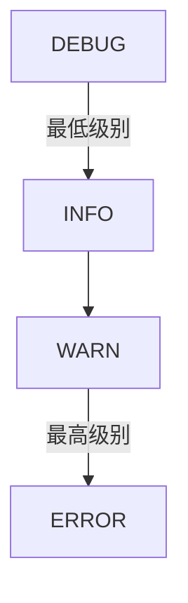
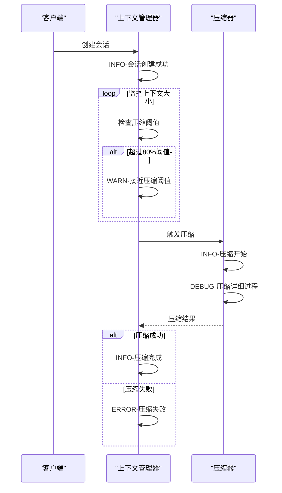
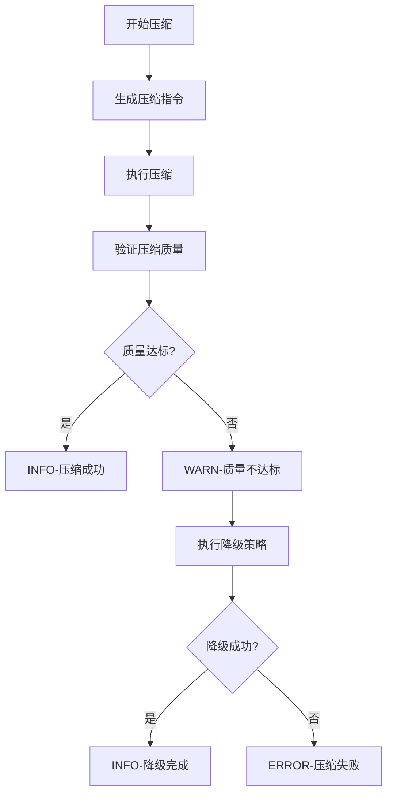
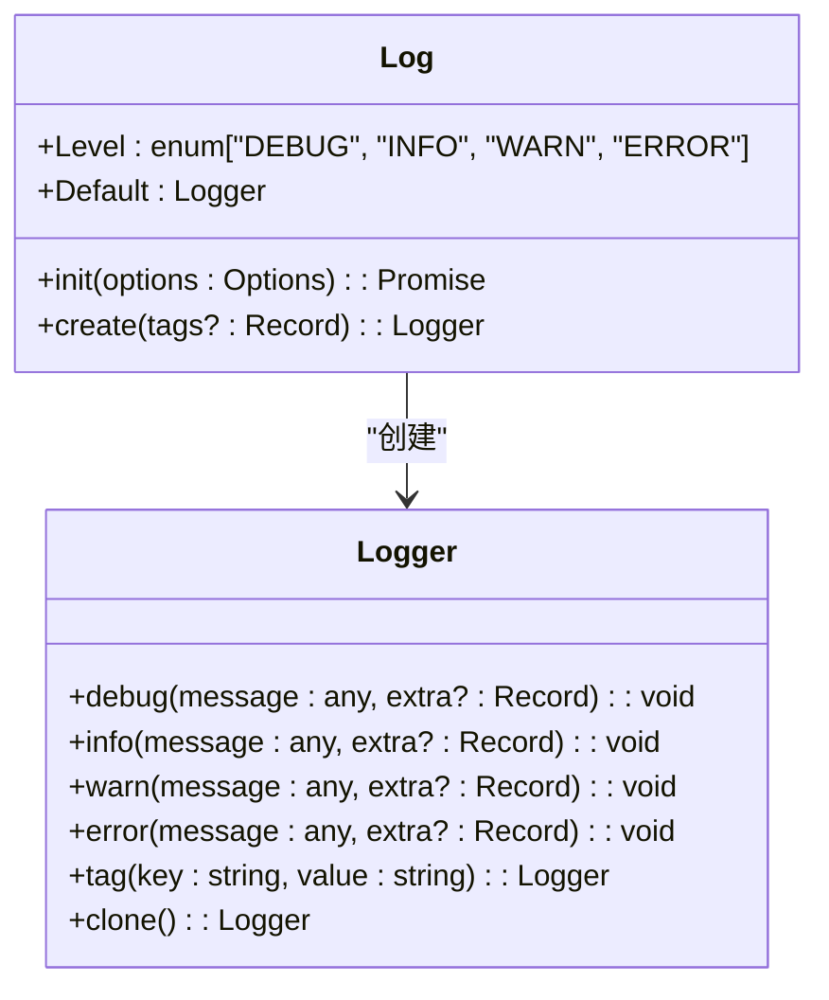
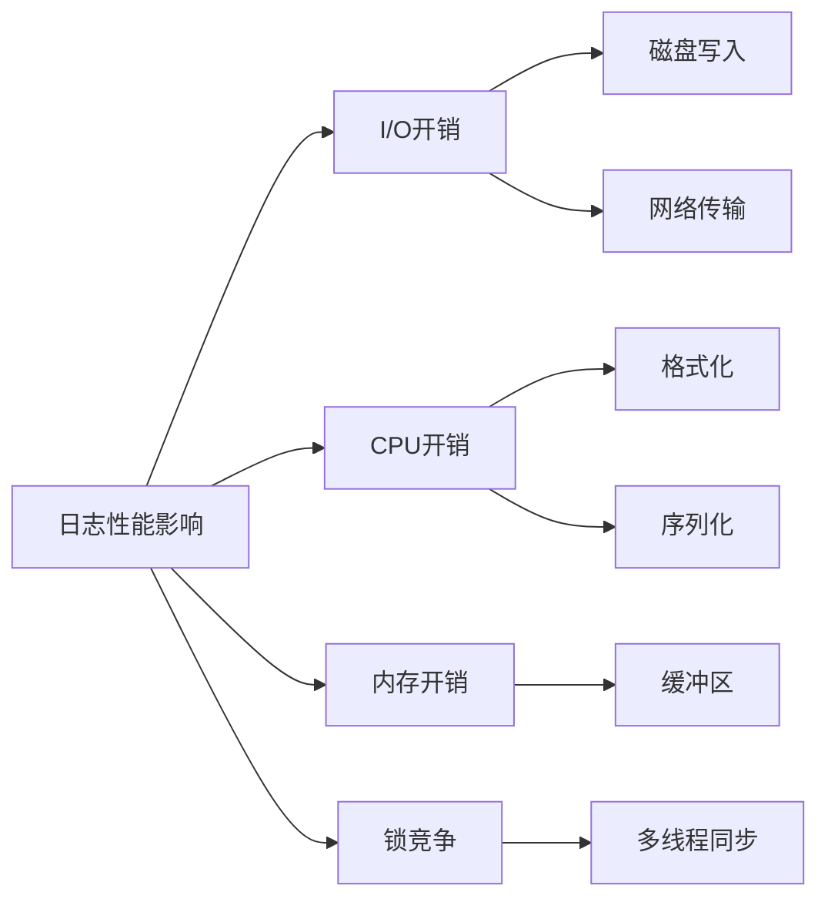
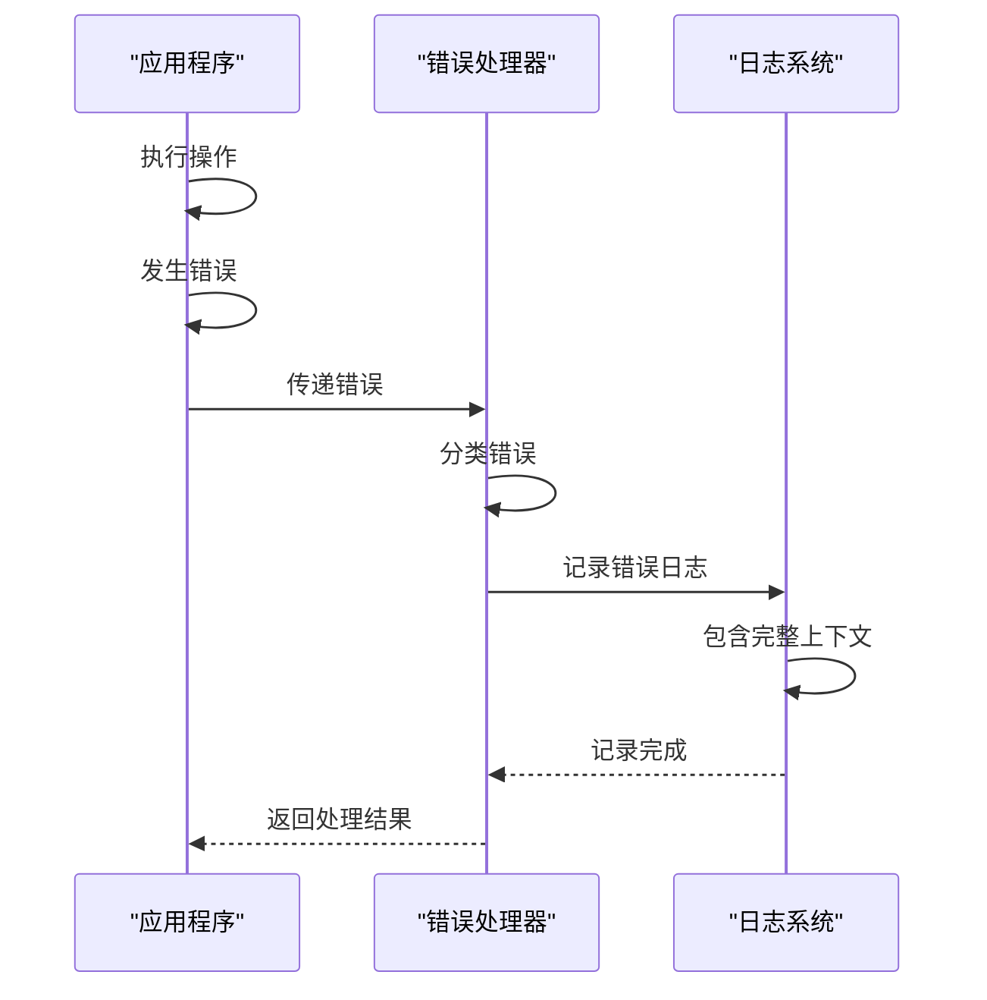

# 日志级别规范

<cite>
**本文档引用的文件**  
- [log.ts](file://packages/opencode/src/util/log.ts)
- [server.ts](file://packages/opencode/src/server/server.ts)
- [ClaudeContextManager.js](file://context-claude-code/src/claude-core/ClaudeContextManager.js)
- [WU2Compressor.js](file://context-claude-code/src/compression/WU2Compressor.js)
- [ErrorHandlingSystem.js](file://context-claude-code/src/error/ErrorHandlingSystem.js)
</cite>

## 目录
1. [引言](#引言)
2. [日志级别定义与语义边界](#日志级别定义与语义边界)
3. [关键流程中的日志级别使用规范](#关键流程中的日志级别使用规范)
4. [代码示例与调用方式](#代码示例与调用方式)
5. [系统性能影响分析](#系统性能影响分析)
6. [生产环境日志使用准则](#生产环境日志使用准则)
7. [错误日志上下文要求](#错误日志上下文要求)
8. [结论](#结论)

## 引言
本文档详细定义了debug、info、warn、error四个日志级别的使用场景和语义边界。通过分析系统核心组件的实现，明确了在上下文管理、会话创建、压缩决策等关键流程中应使用的日志级别。文档提供了代码示例展示不同级别日志的调用方式，并解释了其对系统性能的影响。特别强调了在生产环境中应避免过度使用debug日志，以及error级别日志必须包含可追溯的上下文信息。

**本节来源**
- [log.ts](file://packages/opencode/src/util/log.ts)
- [server.ts](file://packages/opencode/src/server/server.ts)

## 日志级别定义与语义边界
系统定义了四个主要日志级别，每个级别都有明确的语义边界和使用场景：

- **DEBUG**：用于开发调试，记录详细的执行流程和变量状态。仅在开发和问题排查时启用。
- **INFO**：记录系统正常运行的关键事件和状态变更，如服务启动、配置加载、重要操作完成等。
- **WARN**：表示潜在问题或非关键性异常，系统仍能正常运行但需要关注，如性能下降、资源接近阈值等。
- **ERROR**：表示严重错误，导致功能无法正常执行，需要立即处理。

日志级别具有优先级关系：DEBUG < INFO < WARN < ERROR。系统根据配置的最低日志级别决定哪些日志需要输出。



**图示来源**
- [log.ts](file://packages/opencode/src/util/log.ts#L0-L51)

**本节来源**
- [log.ts](file://packages/opencode/src/util/log.ts#L0-L51)

## 关键流程中的日志级别使用规范
### 上下文管理流程
在上下文管理流程中，不同操作应使用相应的日志级别：

- **会话创建**：使用INFO级别记录会话的创建和初始化
- **上下文压缩决策**：使用INFO级别记录压缩的开始和完成
- **自动压缩触发**：使用WARN级别当接近压缩阈值时
- **压缩失败**：使用ERROR级别记录压缩过程中的严重错误



**图示来源**
- [ClaudeContextManager.js](file://context-claude-code/src/claude-core/ClaudeContextManager.js#L100-L150)
- [WU2Compressor.js](file://context-claude-code/src/compression/WU2Compressor.js#L50-L80)

### 压缩决策流程
压缩决策流程中的日志级别使用规范：

- **压缩质量验证**：使用INFO级别记录验证过程
- **验证失败**：使用WARN级别记录降级策略的执行
- **关键信息丢失**：使用ERROR级别当重要信息无法保留时



**图示来源**
- [WU2Compressor.js](file://context-claude-code/src/compression/WU2Compressor.js#L200-L300)

**本节来源**
- [ClaudeContextManager.js](file://context-claude-code/src/claude-core/ClaudeContextManager.js)
- [WU2Compressor.js](file://context-claude-code/src/compression/WU2Compressor.js)

## 代码示例与调用方式
### 日志初始化
日志系统需要在应用启动时进行初始化，设置适当的日志级别：



**图示来源**
- [log.ts](file://packages/opencode/src/util/log.ts#L0-L51)

### 日志调用示例
以下是不同级别日志的调用方式示例：

- **INFO级别**：记录正常操作
```javascript
logger.info("会话创建成功", { sessionId: "123", user: "alice" });
```

- **WARN级别**：记录潜在问题
```javascript
logger.warn("上下文接近压缩阈值", { usage: "85%", threshold: "80%" });
```

- **ERROR级别**：记录严重错误
```javascript
logger.error("压缩失败", { error: err, contextSize: 150000 });
```

- **DEBUG级别**：记录详细调试信息
```javascript
logger.debug("压缩过程详情", { step: "extractKeyInformation", files: fileCount });
```

**本节来源**
- [log.ts](file://packages/opencode/src/util/log.ts#L104-L139)
- [server.ts](file://packages/opencode/src/server/server.ts#L1080-L1116)

## 系统性能影响分析
日志记录对系统性能有显著影响，不同级别日志的影响程度不同：

### 性能影响因素
- **I/O开销**：日志写入磁盘或网络的I/O操作
- **CPU开销**：日志格式化、序列化等处理
- **内存开销**：日志缓冲区占用的内存
- **锁竞争**：多线程环境下的日志写入锁

### 各级别性能影响对比
| 日志级别 | I/O开销 | CPU开销 | 内存开销 | 适用场景 |
|---------|--------|--------|--------|--------|
| DEBUG | 高 | 高 | 高 | 开发调试 |
| INFO | 中 | 中 | 中 | 正常运行 |
| WARN | 低 | 低 | 低 | 警告信息 |
| ERROR | 低 | 低 | 低 | 错误记录 |

### 性能优化建议
- 在生产环境中将日志级别设置为INFO或更高
- 避免在循环中记录DEBUG日志
- 使用异步日志写入减少对主线程的影响
- 合理配置日志轮转策略



**图示来源**
- [log.ts](file://packages/opencode/src/util/log.ts#L48-L102)

**本节来源**
- [log.ts](file://packages/opencode/src/util/log.ts)
- [server.ts](file://packages/opencode/src/server/server.ts)

## 生产环境日志使用准则
### 禁止过度使用DEBUG日志
在生产环境中，必须严格控制DEBUG日志的使用：

- **性能影响**：大量DEBUG日志会显著增加I/O和CPU开销
- **存储成本**：DEBUG日志量大，会快速消耗存储空间
- **日志分析难度**：过多的DEBUG日志会淹没重要信息

生产环境日志级别应设置为INFO或更高，仅在问题排查时临时启用DEBUG级别，并在问题解决后立即恢复。

### 日志级别配置
生产环境推荐的日志级别配置：

```javascript
await Log.init({
  level: "INFO",  // 生产环境使用INFO级别
  dev: false,
  print: false
});
```

### 日志采样策略
对于高频操作，可采用日志采样策略：

```javascript
// 每100次操作记录一次日志
if (counter % 100 === 0) {
  logger.info("高频操作统计", { count: counter });
}
```

**本节来源**
- [log.ts](file://packages/opencode/src/util/log.ts#L48-L51)

## 错误日志上下文要求
### 必须包含可追溯的上下文信息
ERROR级别日志必须包含足够的上下文信息，以便于问题追溯和分析：

- **错误详情**：完整的错误对象，包括message、stack等
- **操作上下文**：发生错误时的操作、参数、状态
- **环境信息**：时间戳、用户ID、会话ID等标识信息
- **相关数据**：与错误相关的业务数据

### 错误日志示例
正确的错误日志记录方式：

```javascript
logger.error("压缩失败", {
  error: err,
  contextSize: currentSize,
  sessionId: sessionId,
  timestamp: Date.now(),
  compressionRatio: ratio
});
```

### 错误处理系统集成
错误处理系统应确保所有错误都被正确记录：



**图示来源**
- [ErrorHandlingSystem.js](file://context-claude-code/src/error/ErrorHandlingSystem.js#L100-L150)

**本节来源**
- [ErrorHandlingSystem.js](file://context-claude-code/src/error/ErrorHandlingSystem.js)
- [log.ts](file://packages/opencode/src/util/log.ts)

## 结论
本文档详细定义了debug、info、warn、error四个日志级别的使用规范。在关键流程中，应根据操作的重要性和影响程度选择合适的日志级别。生产环境中应避免过度使用DEBUG日志以保证系统性能。ERROR级别日志必须包含完整的上下文信息，以便于问题追溯和分析。通过遵循这些规范，可以建立清晰、有效的日志系统，提高系统的可维护性和可观测性。