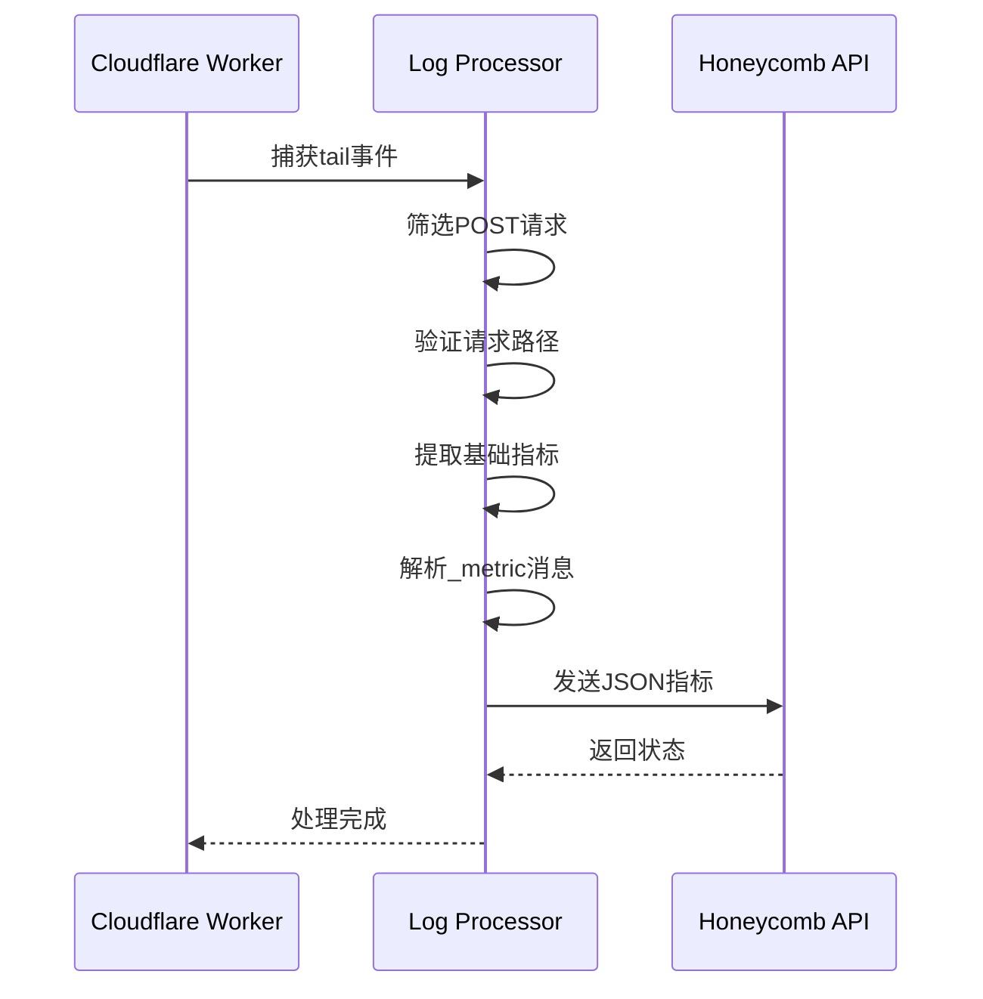
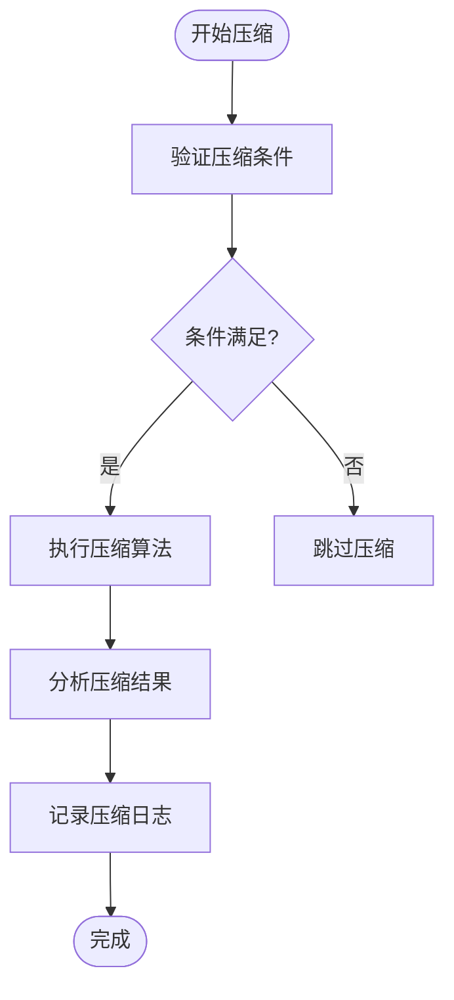
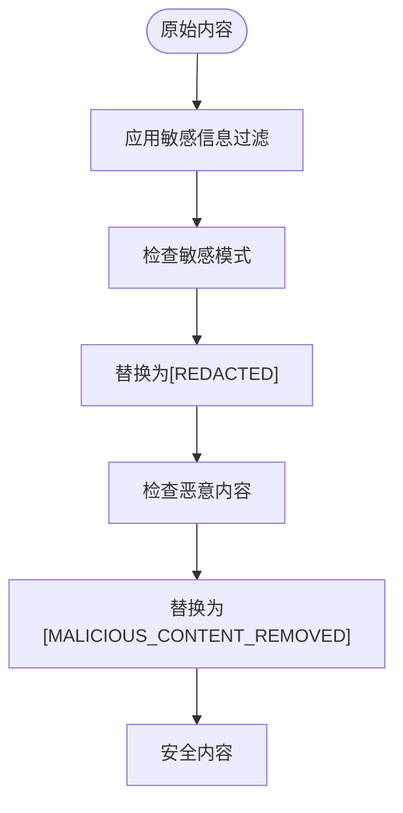

# 日志规范

<cite>
**本文档引用的文件**
- [log.ts](file://packages/opencode/src/util/log.ts)
- [log.ts](file://packages/console/core/src/util/log.ts)
- [log-processor.ts](file://packages/console/function/src/log-processor.ts)
- [HookSystem.js](file://context-claude-code/src/claude-core/HookSystem.js)
- [SecuritySystem.js](file://context-claude-code/src/security/SecuritySystem.js)
- [07-context-compaction.md](file://doc-agent-context/07-context-compaction.md)
</cite>

## 目录
1. [日志级别使用规范](#日志级别使用规范)
2. [日志处理机制](#日志处理机制)
3. [关键路径日志实践](#关键路径日志实践)
4. [敏感信息过滤](#敏感信息过滤)
5. [性能影响规避](#性能影响规避)
6. [结构化日志格式](#结构化日志格式)

## 日志级别使用规范

在系统中，日志级别分为DEBUG、INFO、WARN、ERROR四种，每种级别有明确的使用场景和区分标准。

- **DEBUG**: 用于开发调试，记录详细的执行流程和变量状态。在生产环境中通常关闭。适用于追踪复杂逻辑的执行路径，如上下文搜索算法的详细步骤。
- **INFO**: 用于记录系统正常运行的关键事件和状态变更。适用于会话创建、初始化、压缩触发等重要操作的记录。
- **WARN**: 用于记录潜在问题或非关键性错误，系统仍能继续运行。适用于配置项缺失、性能接近阈值等场景。
- **ERROR**: 用于记录导致功能失败的严重错误。适用于异常捕获、服务调用失败等需要立即关注的情况。

日志级别的优先级从低到高为DEBUG < INFO < WARN < ERROR，系统根据配置的最低日志级别决定哪些日志需要输出。

**Section sources**
- [log.ts](file://packages/opencode/src/util/log.ts#L3-L176)

## 日志处理机制

日志处理机制基于`log-processor.ts`中的逻辑实现，负责日志的收集、格式化和传输。系统通过Cloudflare Workers的tail功能捕获日志事件，对POST请求进行筛选，仅处理特定路径的请求。

日志处理器会提取请求的地理位置信息（大陆、国家、城市等）、执行时长、请求大小、状态码和IP地址等指标。同时，它会解析日志消息中的`_metric:`前缀内容，将其作为JSON数据合并到指标中。处理后的指标数据通过Honeycomb API进行传输，便于后续的监控和分析。

该机制确保了关键性能指标的收集，同时避免了不必要的日志传输开销。



**Diagram sources**
- [log-processor.ts](file://packages/console/function/src/log-processor.ts#L1-L54)

**Section sources**
- [log-processor.ts](file://packages/console/function/src/log-processor.ts#L1-L54)

## 关键路径日志实践

在关键路径中添加日志需要遵循最佳实践，确保既能提供足够的调试信息，又不影响系统性能。

### 上下文压缩

在上下文压缩过程中，应记录压缩前后的token数量、压缩比率和摘要长度等关键指标。通过`CompactionLogger`类的`logCompaction`方法记录这些信息，便于分析压缩效果和优化算法。



**Diagram sources**
- [07-context-compaction.md](file://doc-agent-context/07-context-compaction.md#L1145-L1204)

### 会话管理

在会话管理中，应记录会话的创建、初始化和状态变更。使用`SessionIDGenerator`生成唯一会话ID，并在日志中包含会话ID作为追踪标识。对于会话的异常终止或超时，应使用ERROR级别记录详细信息。

### 钩子执行

在钩子执行过程中，应记录钩子的注册、执行和注销。通过`HookSystem`的`registerHook`和`unregisterHook`方法中的日志记录，可以追踪钩子的生命周期。对于PreCompact和PostCompact钩子，应记录执行上下文和结果，便于调试和性能分析。

**Section sources**
- [07-context-compaction.md](file://doc-agent-context/07-context-compaction.md#L1090-L1204)
- [HookSystem.js](file://context-claude-code/src/claude-core/HookSystem.js#L48-L725)

## 敏感信息过滤

系统通过`SecuritySystem`中的`OutputContentFilter`类实现敏感信息过滤。该过滤器识别并遮蔽常见的敏感信息模式，包括密码、令牌、密钥、凭证和Base64编码的敏感数据。

过滤规则使用正则表达式匹配敏感信息，并将其替换为`[REDACTED]`标记。对于潜在的恶意内容（如脚本标签、javascript协议等），则替换为`[MALICIOUS_CONTENT_REMOVED]`标记。这种双重过滤机制既保护了用户隐私，又防止了安全漏洞。

在日志输出前，所有内容都应通过过滤器处理，确保不会泄露敏感信息。同时，系统记录安全违规事件，便于审计和分析。



**Diagram sources**
- [SecuritySystem.js](file://context-claude-code/src/security/SecuritySystem.js#L458-L578)

**Section sources**
- [SecuritySystem.js](file://context-claude-code/src/security/SecuritySystem.js#L458-L578)

## 性能影响规避

为避免日志记录对系统性能造成负面影响，应采取以下措施：

1. **异步日志记录**: 将日志写入操作放入异步队列，避免阻塞主线程。
2. **批量处理**: 将多个日志条目批量发送，减少I/O操作次数。
3. **级别控制**: 在生产环境中设置适当的日志级别，避免输出过多DEBUG日志。
4. **采样策略**: 对高频日志事件进行采样，只记录部分实例。
5. **资源清理**: 定期清理过期的日志文件，避免磁盘空间耗尽。

通过`PerformanceMonitor`类监控日志系统的性能指标，包括日志处理延迟、内存使用率和磁盘I/O等，及时发现和解决性能瓶颈。

**Section sources**
- [SecuritySystem.js](file://context-claude-code/src/security/SecuritySystem.js#L749-L813)
- [PerformanceMonitor.js](file://context-claude-code/src/monitoring/PerformanceMonitor.js#L0-L44)

## 结构化日志格式

系统采用结构化日志格式，便于后续的监控系统解析和分析。每条日志包含时间戳、服务名称、日志级别和结构化数据。

日志格式示例如下：
```
2023-12-01T10:30:45.123 +1ms service=compaction sessionID=ctx_123456 tokensBefore=25000 tokensAfter=8000 compressionRatio=0.68 summaryLength=1500 INFO 压缩完成
```

其中，各字段含义如下：
- 时间戳：ISO 8601格式的时间
- 时间差：与上一条日志的时间间隔
- 服务名称：产生日志的服务或模块
- 会话ID：关联的会话标识
- 统计数据：与操作相关的量化指标
- 日志级别：DEBUG/INFO/WARN/ERROR
- 消息：人类可读的描述

这种格式既便于机器解析，又保持了人类可读性，是监控和调试的理想选择。

**Section sources**
- [log.ts](file://packages/opencode/src/util/log.ts#L100-L135)
- [07-context-compaction.md](file://doc-agent-context/07-context-compaction.md#L1145-L1204)