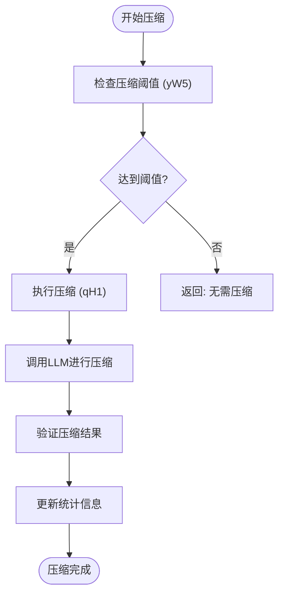
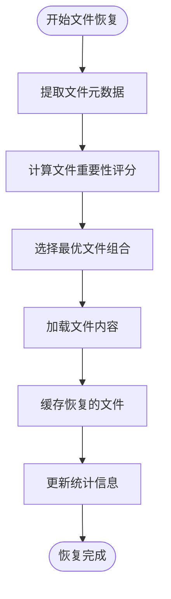
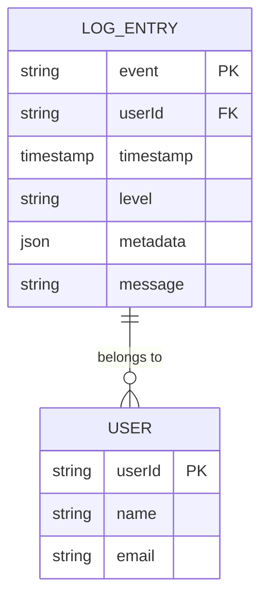
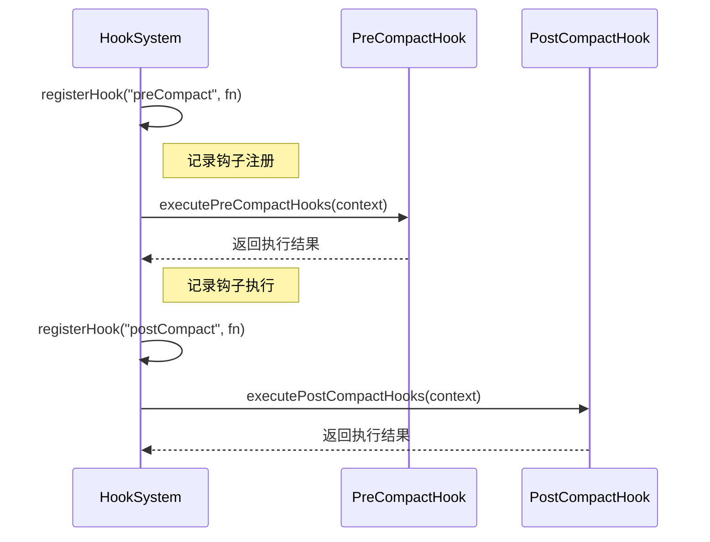
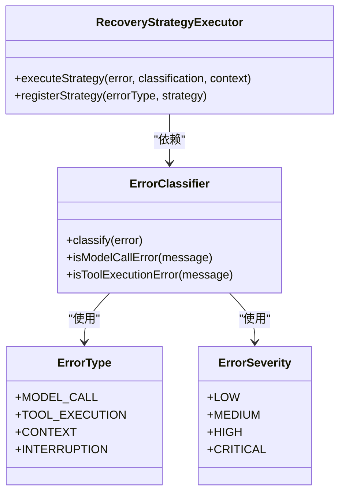

# 最佳实践

<cite>
**本文档中引用的文件**   
- [ClaudeContextManager.js](file://context-claude-code/src/claude-core/ClaudeContextManager.js)
- [WU2Compressor.js](file://context-claude-code/src/claude-core/WU2Compressor.js)
- [IntelligentFileRestorer.js](file://context-claude-code/src/restoration/IntelligentFileRestorer.js)
- [HookSystem.js](file://context-claude-code/src/claude-core/HookSystem.js)
- [PerformanceMonitor.js](file://context-claude-code/src/monitoring/PerformanceMonitor.js)
- [ErrorHandlingSystem.js](file://context-claude-code/src/error/ErrorHandlingSystem.js)
- [上下文工程管理实践-第4部分-最佳实践.md](file://context-claude-code/上下文工程管理实践-第4部分-最佳实践.md)
</cite>

## 目录
1. [引言](#引言)
2. [核心模块日志实践](#核心模块日志实践)
3. [性能优化日志策略](#性能优化日志策略)
4. [结构化日志实现](#结构化日志实现)
5. [钩子系统日志集成](#钩子系统日志集成)
6. [错误处理与监控](#错误处理与监控)
7. [总结与建议](#总结与建议)

## 引言

在复杂的上下文管理系统中，有效的日志记录是确保系统可观察性和调试能力的关键。本指南总结了在核心模块（如上下文压缩、文件恢复、钩子系统）中添加日志的实际案例，指导开发者如何在不牺牲性能的前提下提供足够的调试信息。通过分析Claude Code核心算法的实现，我们将探讨最佳实践，包括使用日志上下文对象、结构化字段查询以及避免性能瓶颈的策略。

**Section sources**
- [上下文工程管理实践-第4部分-最佳实践.md](file://context-claude-code/上下文工程管理实践-第4部分-最佳实践.md#L1-L50)

## 核心模块日志实践

### 上下文压缩日志

在上下文压缩模块中，日志记录需要平衡详细性和性能。WU2Compressor类通过在关键方法中添加日志来跟踪压缩过程的状态。



**Diagram sources**
- [WU2Compressor.js](file://context-claude-code/src/claude-core/WU2Compressor.js#L67-L91)

**Section sources**
- [WU2Compressor.js](file://context-claude-code/src/claude-core/WU2Compressor.js#L67-L91)

### 文件恢复日志

文件恢复模块通过智能评分系统选择需要恢复的重要文件。日志记录在恢复过程的关键阶段提供洞察。



**Diagram sources**
- [IntelligentFileRestorer.js](file://context-claude-code/src/restoration/IntelligentFileRestorer.js#L54-L88)

**Section sources**
- [IntelligentFileRestorer.js](file://context-claude-code/src/restoration/IntelligentFileRestorer.js#L54-L88)

## 性能优化日志策略

### 避免性能瓶颈

在日志记录中，必须避免在循环中记录日志或记录过大的对象，以防止性能瓶颈。

```javascript
// ❌ 错误做法：在循环中记录日志
for (const file of files) {
  console.log(`处理文件: ${file.path}`); // 每次迭代都记录
}

// ✅ 正确做法：批量记录或使用计数器
let processedCount = 0;
for (const file of files) {
  // 处理文件
  processedCount++;
}
console.log(`共处理 ${processedCount} 个文件`);
```

**Section sources**
- [IntelligentFileRestorer.js](file://context-claude-code/src/restoration/IntelligentFileRestorer.js#L54-L88)

### 使用日志上下文对象

推荐使用日志上下文对象而非拼接字符串，以提高日志的可读性和可查询性。

```javascript
// ❌ 错误做法：拼接字符串
console.log(`用户 ${userId} 在 ${timestamp} 执行了 ${action} 操作`);

// ✅ 正确做法：使用结构化对象
console.log({
  event: 'user_action',
  userId,
  timestamp,
  action,
  metadata: { /* 附加信息 */ }
});
```

**Section sources**
- [上下文工程管理实践-第4部分-最佳实践.md](file://context-claude-code/上下文工程管理实践-第4部分-最佳实践.md#L100-L150)

## 结构化日志实现

### 利用结构化字段实现高效查询

通过使用结构化字段，可以实现高效的日志查询和分析。



**Diagram sources**
- [PerformanceMonitor.js](file://context-claude-code/src/monitoring/PerformanceMonitor.js#L1-L50)

**Section sources**
- [PerformanceMonitor.js](file://context-claude-code/src/monitoring/PerformanceMonitor.js#L1-L50)

### 性能监控指标

性能监控系统收集关键指标，用于评估系统健康状况。

```javascript
// 关键性能指标定义
const performanceKPIs = {
  responseTime: {
    target: 2000,
    warning: 5000,
    critical: 10000
  },
  memoryUsage: {
    target: 0.8,
    warning: 0.9,
    critical: 0.95
  }
};
```

**Section sources**
- [上下文工程管理实践-第4部分-最佳实践.md](file://context-claude-code/上下文工程管理实践-第4部分-最佳实践.md#L800-L850)

## 钩子系统日志集成

### 钩子注册与执行日志

钩子系统提供了灵活的扩展机制，日志记录对于调试钩子行为至关重要。



**Diagram sources**
- [HookSystem.js](file://context-claude-code/src/claude-core/HookSystem.js#L60-L98)

**Section sources**
- [HookSystem.js](file://context-claude-code/src/claude-core/HookSystem.js#L60-L98)

## 错误处理与监控

### 错误分类与恢复

高级错误处理系统实现了多层错误分类和自动恢复策略。



**Diagram sources**
- [ErrorHandlingSystem.js](file://context-claude-code/src/error/ErrorHandlingSystem.js#L1-L50)

**Section sources**
- [ErrorHandlingSystem.js](file://context-claude-code/src/error/ErrorHandlingSystem.js#L1-L50)

## 总结与建议

在核心模块中添加日志时，应遵循以下最佳实践：

1. **使用结构化日志**：避免字符串拼接，使用对象记录日志，便于后续查询和分析。
2. **避免性能瓶颈**：不在循环中记录日志，不记录过大的对象。
3. **提供足够的上下文**：在日志中包含足够的上下文信息，如时间戳、用户ID、操作类型等。
4. **分级日志记录**：根据日志的重要性使用不同的日志级别（info、warning、error）。
5. **监控关键指标**：收集和监控关键性能指标，及时发现和解决问题。

通过遵循这些最佳实践，可以在不牺牲性能的前提下，提供足够的调试信息，确保系统的可维护性和可靠性。

**Section sources**
- [上下文工程管理实践-第4部分-最佳实践.md](file://context-claude-code/上下文工程管理实践-第4部分-最佳实践.md#L900-L987)