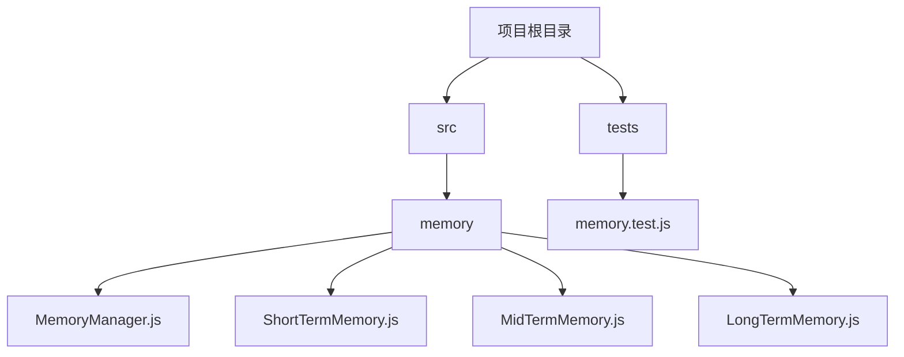
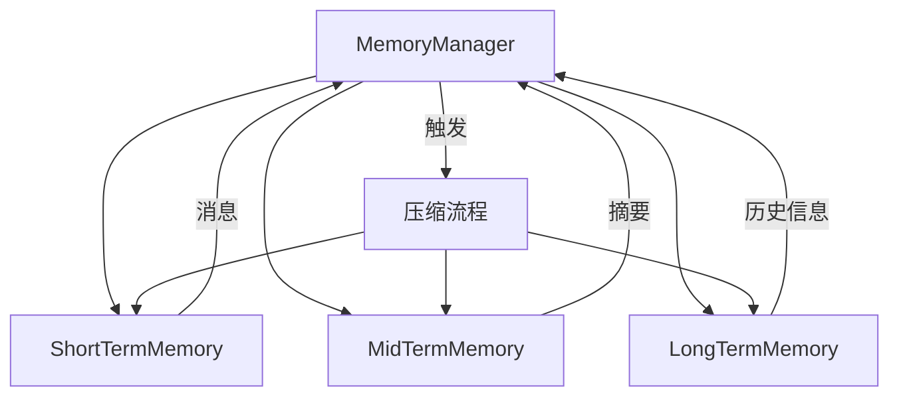
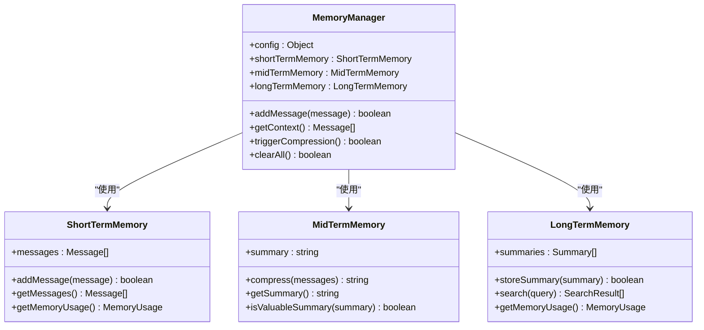
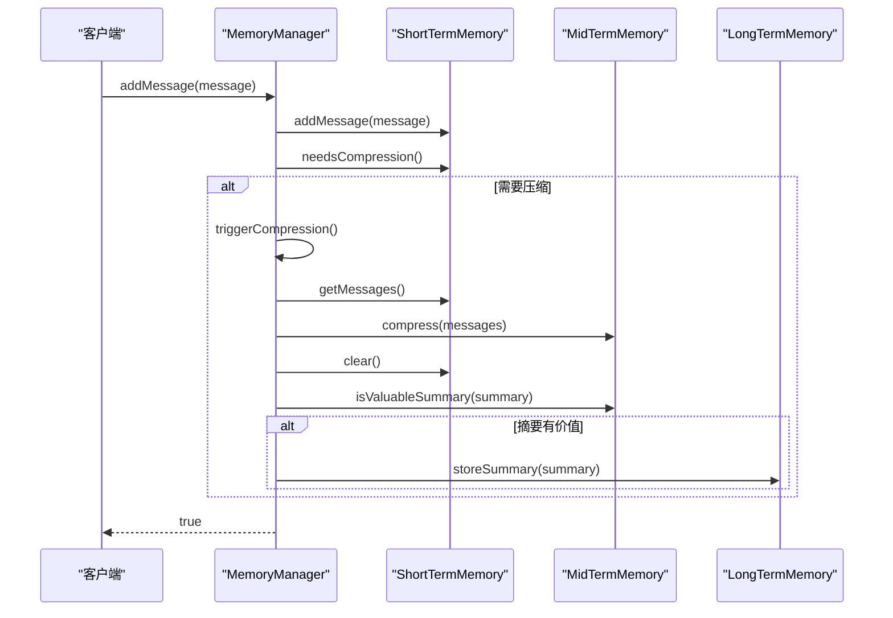
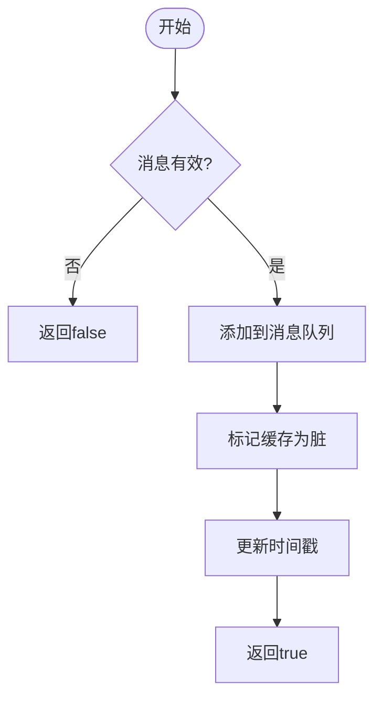
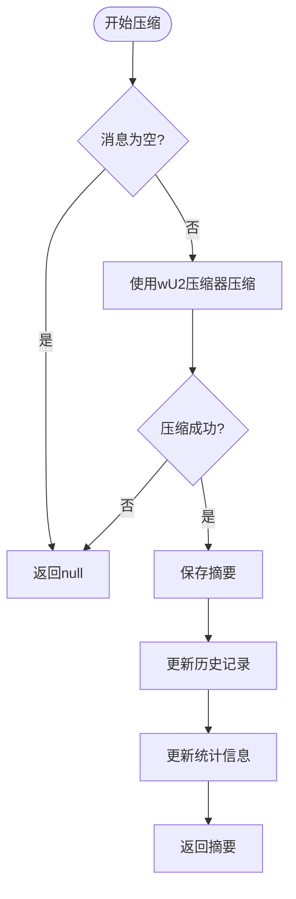
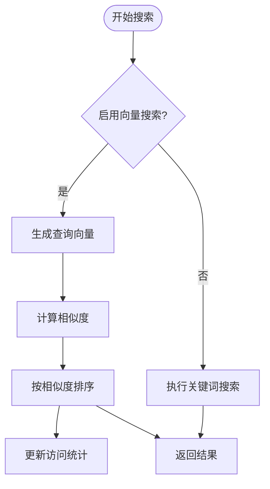
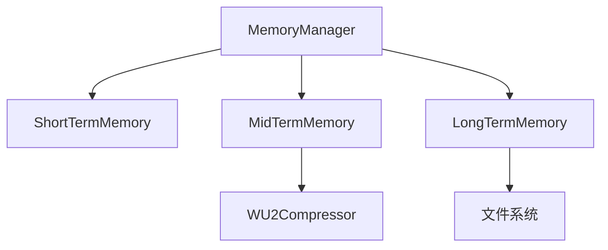

# 单元测试策略

<cite>
**Referenced Files in This Document**   
- [memory.test.js](file://context-claude-code/tests/memory.test.js)
- [config.test.ts](file://packages/opencode/test/config/config.test.ts)
- [MemoryManager.js](file://context-claude-code/src/memory/MemoryManager.js)
- [ShortTermMemory.js](file://context-claude-code/src/memory/ShortTermMemory.js)
- [MidTermMemory.js](file://context-claude-code/src/memory/MidTermMemory.js)
- [LongTermMemory.js](file://context-claude-code/src/memory/LongTermMemory.js)
</cite>

## 目录
1. [引言](#引言)
2. [项目结构](#项目结构)
3. [核心组件](#核心组件)
4. [架构概述](#架构概述)
5. [详细组件分析](#详细组件分析)
6. [依赖分析](#依赖分析)
7. [性能考量](#性能考量)
8. [故障排除指南](#故障排除指南)
9. [结论](#结论)

## 引言

本文档旨在为三层记忆架构系统提供全面的单元测试策略。基于系统中MemoryManager、ShortTermMemory、MidTermMemory和LongTermMemory等核心类的实现，本文档将详细阐述如何进行有效的隔离测试，确保各组件的功能正确性和系统整体的稳定性。通过分析现有的测试用例，我们将展示如何验证数据写入、读取和清除逻辑，并提供测试覆盖率目标建议。

## 项目结构

系统采用分层架构设计，主要分为内存管理、压缩、错误处理、监控等多个模块。记忆管理模块位于`src/memory`目录下，包含核心的四类记忆组件。测试文件位于`tests`目录下，采用Bun测试框架进行单元测试。

**Diagram sources**
- [MemoryManager.js](file://context-claude-code/src/memory/MemoryManager.js)
- [ShortTermMemory.js](file://context-claude-code/src/memory/ShortTermMemory.js)
- [MidTermMemory.js](file://context-claude-code/src/memory/MidTermMemory.js)
- [LongTermMemory.js](file://context-claude-code/src/memory/LongTermMemory.js)
- [memory.test.js](file://context-claude-code/tests/memory.test.js)

**Section sources**
- [memory.test.js](file://context-claude-code/tests/memory.test.js)

## 核心组件

核心组件包括MemoryManager作为协调者，以及ShortTermMemory、MidTermMemory和LongTermMemory三个层次的记忆存储。这些组件共同构成了系统的三层记忆架构，实现了从短期到长期的信息存储和检索功能。

**Section sources**
- [MemoryManager.js](file://context-claude-code/src/memory/MemoryManager.js#L15-L365)
- [ShortTermMemory.js](file://context-claude-code/src/memory/ShortTermMemory.js#L12-L334)
- [MidTermMemory.js](file://context-claude-code/src/memory/MidTermMemory.js#L13-L411)
- [LongTermMemory.js](file://context-claude-code/src/memory/LongTermMemory.js#L14-L627)

## 架构概述

系统采用三层记忆架构，通过MemoryManager协调各层记忆组件的工作。短期记忆负责存储最近的交互信息，中期记忆负责生成和存储对话摘要，长期记忆则负责持久化存储有价值的信息。

**Diagram sources**
- [MemoryManager.js](file://context-claude-code/src/memory/MemoryManager.js#L15-L365)
- [ShortTermMemory.js](file://context-claude-code/src/memory/ShortTermMemory.js#L12-L334)
- [MidTermMemory.js](file://context-claude-code/src/memory/MidTermMemory.js#L13-L411)
- [LongTermMemory.js](file://context-claude-code/src/memory/LongTermMemory.js#L14-L627)

## 详细组件分析

### MemoryManager分析

MemoryManager作为系统的核心协调者，负责管理三层记忆架构的交互。它通过addMessage方法接收新消息，自动触发压缩流程，并提供getContext方法获取完整的上下文信息。

#### MemoryManager类图

**Diagram sources**
- [MemoryManager.js](file://context-claude-code/src/memory/MemoryManager.js#L15-L365)
- [ShortTermMemory.js](file://context-claude-code/src/memory/ShortTermMemory.js#L12-L334)
- [MidTermMemory.js](file://context-claude-code/src/memory/MidTermMemory.js#L13-L411)
- [LongTermMemory.js](file://context-claude-code/src/memory/LongTermMemory.js#L14-L627)

#### MemoryManager方法调用序列

**Diagram sources**
- [MemoryManager.js](file://context-claude-code/src/memory/MemoryManager.js#L62-L94)
- [ShortTermMemory.js](file://context-claude-code/src/memory/ShortTermMemory.js#L40-L54)
- [MidTermMemory.js](file://context-claude-code/src/memory/MidTermMemory.js#L150-L177)
- [LongTermMemory.js](file://context-claude-code/src/memory/LongTermMemory.js#L88-L131)

**Section sources**
- [MemoryManager.js](file://context-claude-code/src/memory/MemoryManager.js#L15-L365)

### ShortTermMemory分析

ShortTermMemory负责存储最近的交互消息，采用消息队列的方式管理数据。它实现了token使用量的精确计算和缓存机制，确保系统性能。

#### ShortTermMemory数据处理流程

**Diagram sources**
- [ShortTermMemory.js](file://context-claude-code/src/memory/ShortTermMemory.js#L40-L54)

**Section sources**
- [ShortTermMemory.js](file://context-claude-code/src/memory/ShortTermMemory.js#L12-L334)

### MidTermMemory分析

MidTermMemory负责生成和管理对话摘要，通过wU2压缩器将大量消息压缩为结构化摘要。它实现了摘要质量评估机制，确保只有有价值的信息被持久化。

#### MidTermMemory压缩流程

**Diagram sources**
- [MidTermMemory.js](file://context-claude-code/src/memory/MidTermMemory.js#L150-L177)

**Section sources**
- [MidTermMemory.js](file://context-claude-code/src/memory/MidTermMemory.js#L13-L411)

### LongTermMemory分析

LongTermMemory负责持久化存储有价值的信息，支持基于关键词和向量的搜索功能。它实现了存储限制和访问统计机制，确保系统稳定运行。

#### LongTermMemory搜索流程

**Diagram sources**
- [LongTermMemory.js](file://context-claude-code/src/memory/LongTermMemory.js#L253-L297)

**Section sources**
- [LongTermMemory.js](file://context-claude-code/src/memory/LongTermMemory.js#L14-L627)

## 依赖分析

系统各组件之间存在明确的依赖关系，MemoryManager依赖于三个记忆层组件，而各记忆层组件之间相对独立。这种设计实现了关注点分离，便于单独测试和维护。

**Diagram sources**
- [MemoryManager.js](file://context-claude-code/src/memory/MemoryManager.js#L15-L365)
- [MidTermMemory.js](file://context-claude-code/src/memory/MidTermMemory.js#L13-L411)
- [LongTermMemory.js](file://context-claude-code/src/memory/LongTermMemory.js#L14-L627)

**Section sources**
- [MemoryManager.js](file://context-claude-code/src/memory/MemoryManager.js#L15-L365)
- [MidTermMemory.js](file://context-claude-code/src/memory/MidTermMemory.js#L13-L411)
- [LongTermMemory.js](file://context-claude-code/src/memory/LongTermMemory.js#L14-L627)

## 性能考量

在测试过程中，需要特别关注系统的性能表现。ShortTermMemory中的token计算缓存机制、MidTermMemory的压缩算法效率以及LongTermMemory的搜索性能都是关键的性能指标。建议在测试中包含性能基准测试，确保系统在各种负载下的响应时间满足要求。

## 故障排除指南

当测试失败时，应首先检查各组件的状态是否符合预期。对于MemoryManager，需要验证三层记忆的交互是否正确；对于各记忆层组件，需要检查数据存储和检索逻辑是否准确。同时，应关注错误处理机制，确保系统在异常情况下能够正确恢复。

**Section sources**
- [memory.test.js](file://context-claude-code/tests/memory.test.js)

## 结论

本文档提供了三层记忆架构系统的全面单元测试策略。通过隔离测试各核心组件，可以确保系统的功能正确性和稳定性。建议测试覆盖率达到90%以上，并采用should_when_then命名法提高测试的可读性和可维护性。同时，应结合配置解析测试，验证纯函数和状态管理模块的正确性。