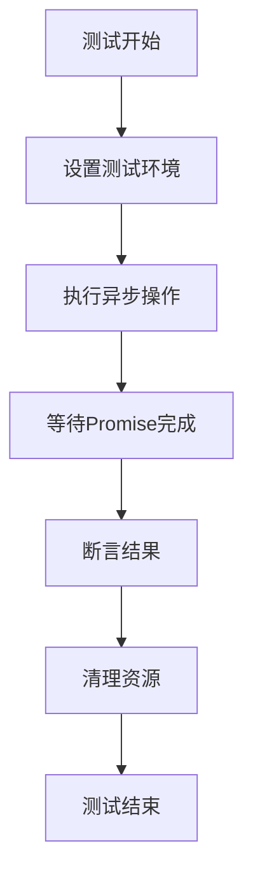
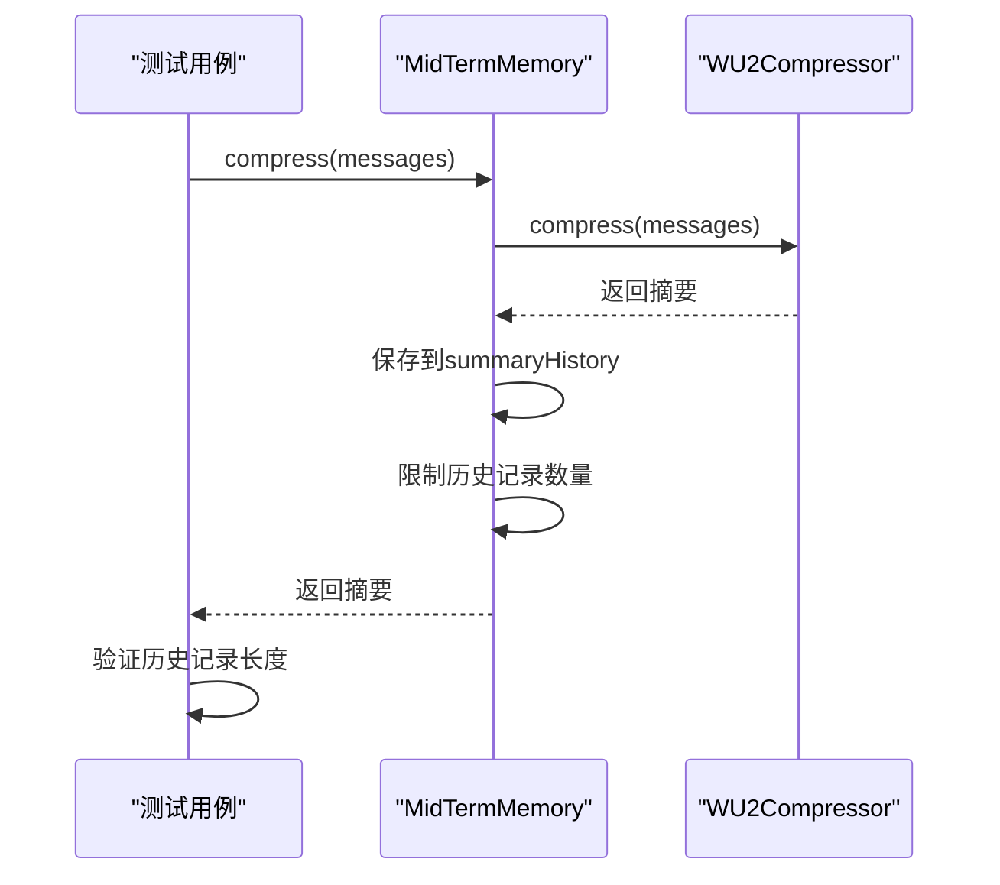
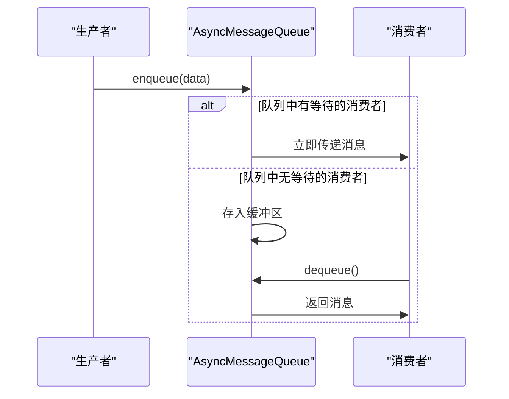
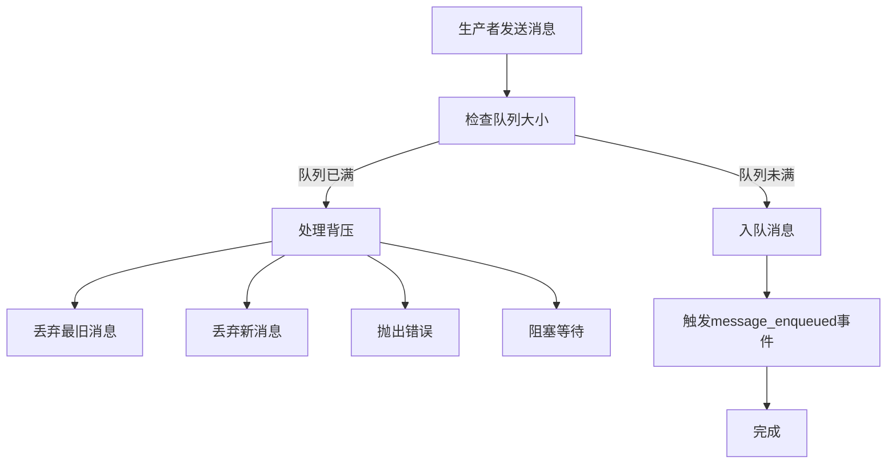
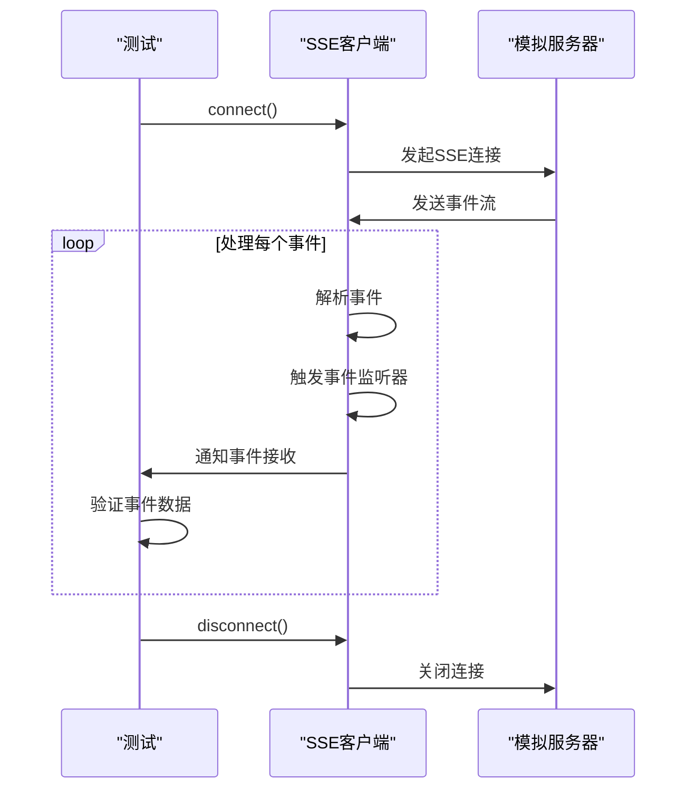
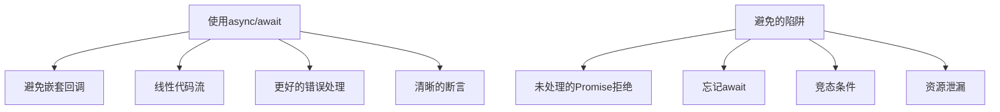

# 异步测试模式

<cite>
**Referenced Files in This Document**   
- [bun.test.ts](file://packages/opencode/test/bun.test.ts)
- [MidTermMemory.js](file://context-claude-code/src/memory/MidTermMemory.js)
- [AsyncMessageQueue.js](file://context-claude-code/src/queue/AsyncMessageQueue.js)
</cite>

## 目录
1. [引言](#引言)
2. [异步测试挑战](#异步测试挑战)
3. [Bun测试环境中的异步处理](#bun测试环境中的异步处理)
4. [定时任务与过期机制测试](#定时任务与过期机制测试)
5. [消息队列调度测试](#消息队列调度测试)
6. [实时通信测试策略](#实时通信测试策略)
7. [异步断言与常见陷阱](#异步断言与常见陷阱)
8. [结论](#结论)

## 引言

异步测试是现代JavaScript应用开发中的关键环节，特别是在处理事件循环、定时任务和Promise链时。本文档旨在提供一套完整的异步测试模式，专门解决这些挑战。通过分析Bun运行时环境中的测试实践，我们将展示如何正确处理异步操作的等待与超时，使用各种技术验证复杂的异步行为。

## 异步测试挑战

异步编程引入了独特的测试挑战，主要包括：

- **时间依赖性**：许多功能依赖于时间的推移，如缓存过期、重试机制等
- **竞态条件**：多个异步操作可能以不可预测的顺序完成
- **Promise链管理**：确保Promise链正确处理并避免未处理的拒绝
- **资源清理**：在测试完成后正确清理定时器和事件监听器

这些挑战要求测试框架提供专门的工具来模拟和控制异步行为，确保测试的可靠性和可重复性。

## Bun测试环境中的异步处理

Bun测试框架提供了强大的异步测试支持，允许开发者编写清晰、可靠的异步测试用例。通过`bun:test`模块，我们可以使用`async/await`语法编写测试，确保异步操作正确完成。

**Diagram sources**
- [bun.test.ts](file://packages/opencode/test/bun.test.ts)

**Section sources**
- [bun.test.ts](file://packages/opencode/test/bun.test.ts)

## 定时任务与过期机制测试

测试定时任务和过期机制是异步测试中的一个重要方面。虽然当前代码库中没有直接使用fake timers的示例，但我们可以基于现有组件设计相应的测试策略。

### MidTermMemory过期机制测试

`MidTermMemory`组件虽然没有显式的过期机制，但其摘要历史记录有数量限制，这可以作为测试的切入点。

**Diagram sources**
- [MidTermMemory.js](file://context-claude-code/src/memory/MidTermMemory.js)

**Section sources**
- [MidTermMemory.js](file://context-claude-code/src/memory/MidTermMemory.js)

## 消息队列调度测试

`AsyncMessageQueue`组件实现了高性能的异步消息队列，支持零延迟传递和高吞吐量处理。测试这种复杂的异步行为需要精心设计的测试策略。

### 消息队列基本功能测试

**Diagram sources**
- [AsyncMessageQueue.js](file://context-claude-code/src/queue/AsyncMessageQueue.js)

**Section sources**
- [AsyncMessageQueue.js](file://context-claude-code/src/queue/AsyncMessageQueue.js)

### 背压处理测试

**Diagram sources**
- [AsyncMessageQueue.js](file://context-claude-code/src/queue/AsyncMessageQueue.js)

## 实时通信测试策略

对于WebSocket流和SSE响应等实时通信的测试，我们需要模拟服务器端的行为并验证客户端的响应。

### SSE流测试策略

基于代码库中的SSE实现，我们可以设计以下测试策略：

**Diagram sources**
- [sse.ts](file://packages/sdk/node/src/streaming/sse.ts)

## 异步断言与常见陷阱

编写可靠的异步测试需要遵循最佳实践，避免常见的陷阱。

### 使用async/await编写清晰断言

**Section sources**
- [bun.test.ts](file://packages/opencode/test/bun.test.ts)

### 常见陷阱及解决方案

| 陷阱 | 描述 | 解决方案 |
|------|------|---------|
| 未处理的Promise拒绝 | 未捕获的Promise错误可能导致测试通过但实际失败 | 使用try-catch或.catch()处理所有Promise |
| 忘记await | 忘记await会导致测试在异步操作完成前结束 | 仔细检查所有异步调用是否使用await |
| 竞态条件 | 多个异步操作的执行顺序不确定 | 使用适当的同步机制或模拟 |
| 资源泄漏 | 未清理的定时器或事件监听器 | 在测试完成后清理所有资源 |

## 结论

异步测试是确保JavaScript应用可靠性的关键。通过使用Bun测试框架的异步支持，我们可以编写清晰、可靠的测试用例。对于复杂的异步行为，如定时任务、消息队列和实时通信，我们需要设计专门的测试策略，使用模拟和断言来验证系统行为。遵循最佳实践，避免常见陷阱，可以确保我们的测试既全面又可靠。