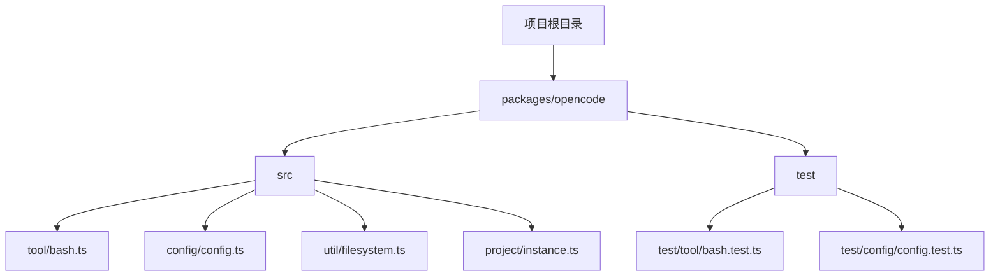
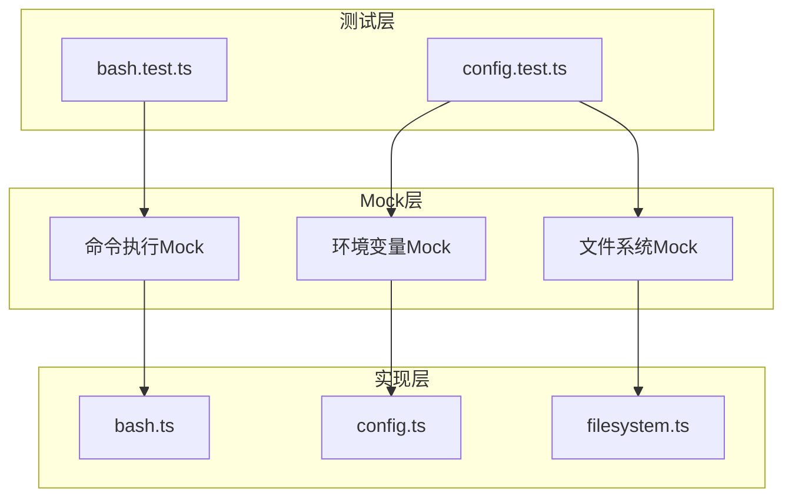
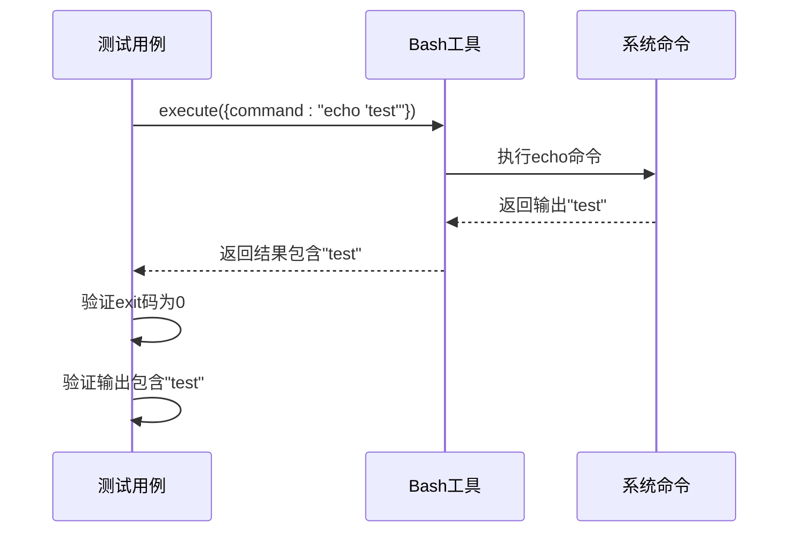
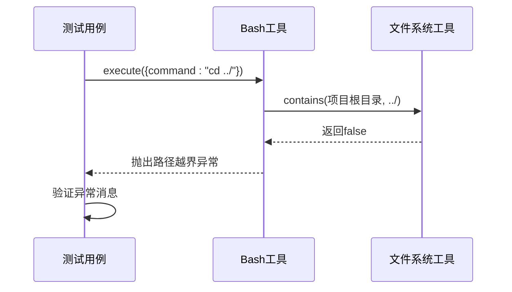
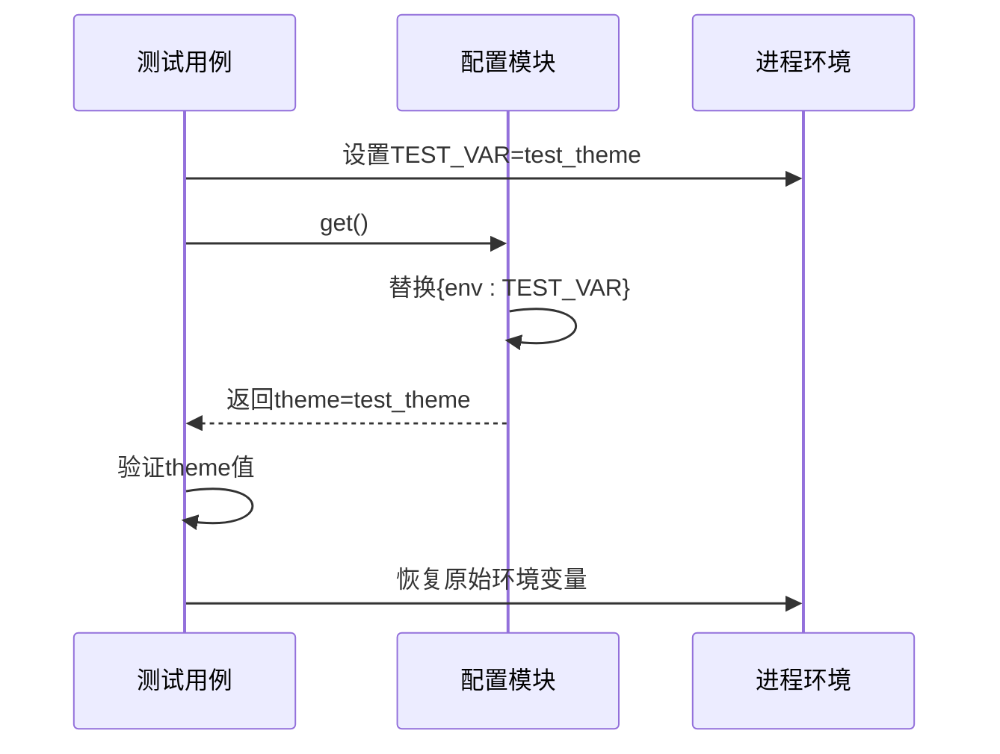
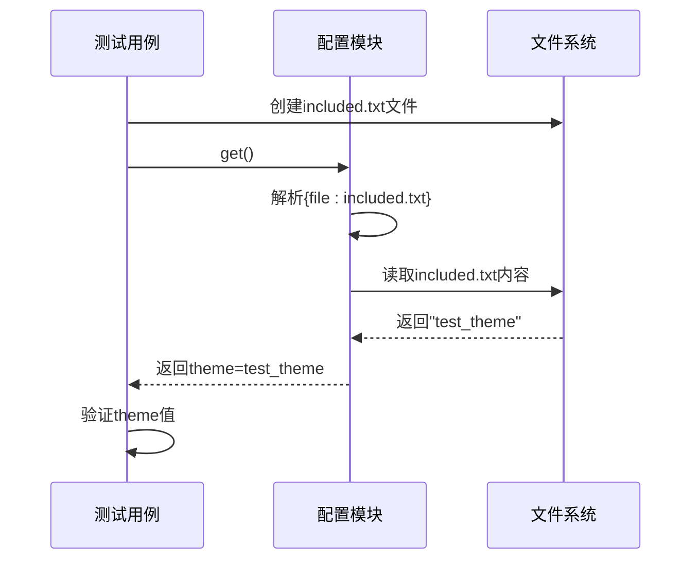
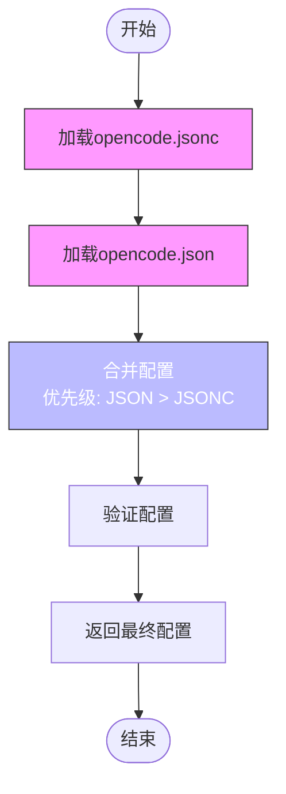
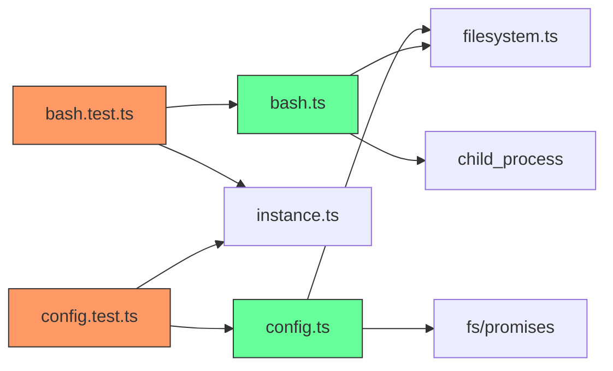

# 测试Mock技术

<cite>
**本文档中引用的文件**  
- [bash.test.ts](file://packages/opencode/test/tool/bash.test.ts)
- [config.test.ts](file://packages/opencode/test/config/config.test.ts)
- [bash.ts](file://packages/opencode/src/tool/bash.ts)
- [config.ts](file://packages/opencode/src/config/config.ts)
- [filesystem.ts](file://packages/opencode/src/util/filesystem.ts)
- [instance.ts](file://packages/opencode/src/project/instance.ts)
</cite>

## 目录
1. [简介](#简介)
2. [项目结构](#项目结构)
3. [核心组件](#核心组件)
4. [架构概述](#架构概述)
5. [详细组件分析](#详细组件分析)
6. [依赖分析](#依赖分析)
7. [性能考虑](#性能考虑)
8. [故障排除指南](#故障排除指南)
9. [结论](#结论)
10. [附录](#附录)（如有必要）

## 简介
本文档系统性地介绍了在不同场景下如何有效使用Mock机制进行测试。以`bash.test.ts`为例，展示如何Mock外部命令执行（如shell脚本调用）并验证参数传递与输出解析。说明如何Mock文件系统操作（readFile、writeFile）以隔离I/O依赖。结合`config.test.ts`中的配置加载测试，演示如何Mock环境变量和配置文件读取。提供Mock粒度选择建议（细粒度vs粗粒度）及维护成本权衡。

## 项目结构
本项目采用模块化结构，主要包含工具（tool）、配置（config）、项目实例（instance）等核心模块。测试文件位于`test`目录下，分别对应不同功能模块的单元测试。

**图示来源**  
- [bash.test.ts](file://packages/opencode/test/tool/bash.test.ts)
- [config.test.ts](file://packages/opencode/test/config/config.test.ts)

**章节来源**  
- [bash.test.ts](file://packages/opencode/test/tool/bash.test.ts)
- [config.test.ts](file://packages/opencode/test/config/config.test.ts)

## 核心组件
本文档的核心组件包括Bash工具的执行逻辑、配置管理模块、文件系统操作工具以及项目实例上下文管理。这些组件共同构成了系统的测试基础架构。

**章节来源**  
- [bash.ts](file://packages/opencode/src/tool/bash.ts)
- [config.ts](file://packages/opencode/src/config/config.ts)
- [filesystem.ts](file://packages/opencode/src/util/filesystem.ts)
- [instance.ts](file://packages/opencode/src/project/instance.ts)

## 架构概述
系统采用分层架构设计，上层为测试用例，中间为Mock机制，底层为实际功能实现。通过Mock机制隔离外部依赖，确保测试的独立性和可重复性。

**图示来源**  
- [bash.test.ts](file://packages/opencode/test/tool/bash.test.ts)
- [config.test.ts](file://packages/opencode/test/config/config.test.ts)
- [bash.ts](file://packages/opencode/src/tool/bash.ts)

## 详细组件分析

### Bash命令执行Mock分析
`bash.test.ts`文件展示了如何对Bash命令执行进行Mock测试，验证参数传递和输出解析。

#### 外部命令执行Mock

**图示来源**  
- [bash.test.ts](file://packages/opencode/test/tool/bash.test.ts#L15-L30)
- [bash.ts](file://packages/opencode/src/tool/bash.ts#L45-L213)

#### 路径安全检查Mock

**图示来源**  
- [bash.test.ts](file://packages/opencode/test/tool/bash.test.ts#L32-L45)
- [bash.ts](file://packages/opencode/src/tool/bash.ts#L75-L95)
- [filesystem.ts](file://packages/opencode/src/util/filesystem.ts#L5-L6)

**章节来源**  
- [bash.test.ts](file://packages/opencode/test/tool/bash.test.ts)
- [bash.ts](file://packages/opencode/src/tool/bash.ts)
- [filesystem.ts](file://packages/opencode/src/util/filesystem.ts)

### 配置加载Mock分析
`config.test.ts`文件展示了如何对配置加载过程进行Mock测试，包括环境变量和文件包含的处理。

#### 环境变量替换Mock

**图示来源**  
- [config.test.ts](file://packages/opencode/test/config/config.test.ts#L105-L135)
- [config.ts](file://packages/opencode/src/config/config.ts#L385-L405)

#### 文件包含替换Mock

**图示来源**  
- [config.test.ts](file://packages/opencode/test/config/config.test.ts#L137-L167)
- [config.ts](file://packages/opencode/src/config/config.ts#L365-L383)

#### 配置合并优先级Mock

**图示来源**  
- [config.test.ts](file://packages/opencode/test/config/config.test.ts#L55-L85)
- [config.ts](file://packages/opencode/src/config/config.ts#L100-L130)

**章节来源**  
- [config.test.ts](file://packages/opencode/test/config/config.test.ts)
- [config.ts](file://packages/opencode/src/config/config.ts)

## 依赖分析
系统各组件之间存在明确的依赖关系，通过Mock机制可以有效隔离这些依赖，确保测试的独立性。

**图示来源**  
- [bash.test.ts](file://packages/opencode/test/tool/bash.test.ts)
- [config.test.ts](file://packages/opencode/test/config/config.test.ts)
- [bash.ts](file://packages/opencode/src/tool/bash.ts)
- [config.ts](file://packages/opencode/src/config/config.ts)

**章节来源**  
- [bash.test.ts](file://packages/opencode/test/tool/bash.test.ts)
- [config.test.ts](file://packages/opencode/test/config/config.test.ts)
- [bash.ts](file://packages/opencode/src/tool/bash.ts)
- [config.ts](file://packages/opencode/src/config/config.ts)

## 性能考虑
在使用Mock技术时，需要考虑以下性能因素：
- Mock的粒度选择：细粒度Mock可能增加维护成本，粗粒度Mock可能降低测试精度
- 环境变量和文件I/O的Mock开销相对较低，但需要确保Mock行为与真实环境一致
- 配置加载的Mock应避免实际文件读取，以提高测试执行速度
- 命令执行的Mock应避免实际系统调用，防止测试受外部环境影响

## 故障排除指南
当Mock测试出现问题时，可以参考以下排查步骤：

1. **验证Mock设置**：确保Mock对象正确配置，特别是返回值和异常处理
2. **检查依赖注入**：确认被测代码使用的是Mock对象而非真实实现
3. **验证参数传递**：检查方法调用时的参数是否符合预期
4. **审查作用域**：确保Mock在正确的测试作用域内生效
5. **调试输出**：添加日志输出以跟踪Mock的调用过程

**章节来源**  
- [bash.test.ts](file://packages/opencode/test/tool/bash.test.ts)
- [config.test.ts](file://packages/opencode/test/config/config.test.ts)

## 结论
本文档详细介绍了在opencode项目中使用Mock技术的最佳实践。通过`bash.test.ts`和`config.test.ts`两个测试文件的分析，展示了如何有效地Mock外部命令执行、文件系统操作、环境变量读取等依赖。建议在实际测试中根据具体场景选择合适的Mock粒度，在测试覆盖率和维护成本之间取得平衡。

## 附录
本文档所涉及的Mock技术适用于各种测试场景，不仅限于Bash命令和配置加载。开发者可以参考本文档中的模式，将其应用于其他模块的测试中，提高代码质量和测试效率。