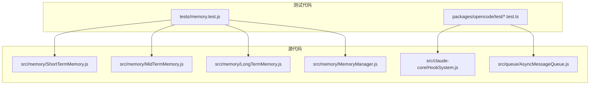
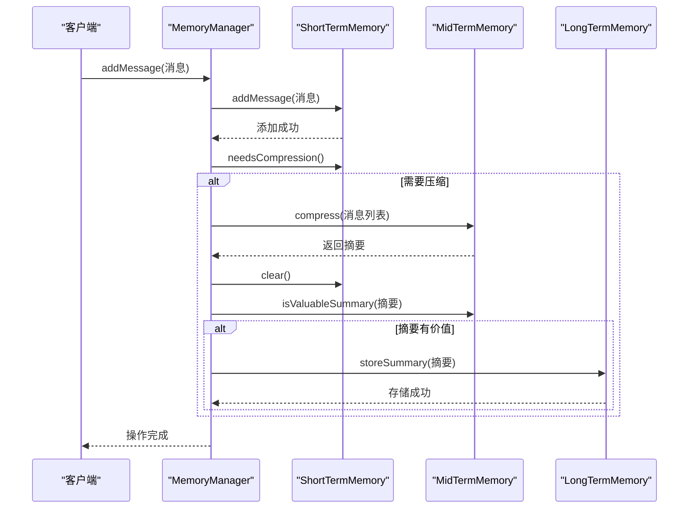

# 测试实践

<cite>
**本文档引用的文件**  
- [memory.test.js](file://context-claude-code/tests/memory.test.js)
- [MemoryManager.js](file://context-claude-code/src/memory/MemoryManager.js)
- [EnhancedMemoryManager.js](file://context-claude-code/src/memory/EnhancedMemoryManager.js)
- [HookSystem.js](file://context-claude-code/src/claude-core/HookSystem.js)
- [AsyncMessageQueue.js](file://context-claude-code/src/queue/AsyncMessageQueue.js)
</cite>

## 目录
1. [引言](#引言)
2. [项目结构与测试布局](#项目结构与测试布局)
3. [核心组件测试策略](#核心组件测试策略)
4. [三层记忆架构的数据流转验证](#三层记忆架构的数据流转验证)
5. [异步流程测试实践](#异步流程测试实践)
6. [Mock机制与外部依赖模拟](#mock机制与外部依赖模拟)
7. [测试覆盖率与质量保证](#测试覆盖率与质量保证)
8. [测试命名规范与断言策略](#测试命名规范与断言策略)
9. [结论](#结论)

## 引言
本文档旨在为项目提供全面的测试实践指南，重点围绕`memory.test.js`和各类`test.ts`文件中的测试用例，展示如何使用Jest或类似框架对核心组件进行有效测试。文档将深入探讨单元测试、集成测试和异步测试策略，特别关注`MemoryManager`和`HookSystem`等关键组件。通过分析现有测试用例，本文将详细说明Mock机制的使用方法，特别是在模拟文件系统操作和网络请求时的最佳实践。同时，文档将提供测试异步流程（如上下文压缩、消息队列处理）的具体示例，并强调测试覆盖率的重要性，确保三层记忆架构的数据流转正确性。

## 项目结构与测试布局
项目采用分层架构，核心功能模块位于`context-claude-code/src`目录下，测试文件则集中存放在`tests`和`packages/opencode/test`目录中。`memory.test.js`文件位于`context-claude-code/tests`目录，是验证三层记忆架构的核心测试套件。该测试套件通过`node:test`框架编写，对`ShortTermMemory`、`MidTermMemory`、`LongTermMemory`和`MemoryManager`等组件进行了全面的单元和集成测试。此外，`packages/opencode/test`目录下的`*.test.ts`文件则使用TypeScript编写，覆盖了CLI工具、配置、补丁等模块的测试，展示了项目在不同类型组件上的测试布局。

**图源**
- [memory.test.js](file://context-claude-code/tests/memory.test.js)
- [MemoryManager.js](file://context-claude-code/src/memory/MemoryManager.js)
- [HookSystem.js](file://context-claude-code/src/claude-core/HookSystem.js)
- [AsyncMessageQueue.js](file://context-claude-code/src/queue/AsyncMessageQueue.js)

**节源**
- [memory.test.js](file://context-claude-code/tests/memory.test.js)
- [src](file://context-claude-code/src)

## 核心组件测试策略
核心组件的测试策略分为单元测试和集成测试两个层面。单元测试专注于验证单个类或函数的内部逻辑，而集成测试则关注组件间的协作和数据流转。

### MemoryManager测试
`MemoryManager`是协调三层记忆架构的核心组件。`memory.test.js`中的测试用例通过`describe('MemoryManager', ...)`块对其进行了集成测试。测试用例`应该能够协调三层记忆架构`验证了`addMessage`方法的正确性，确保消息能被成功添加。`应该能够获取完整上下文`测试了`getContext`方法，验证了短期记忆、中期摘要和长期记忆的正确组合。`应该能够触发压缩`测试模拟了高token使用场景，验证了压缩流程的触发和执行。这些测试通过断言`assert`来验证返回值和状态，确保组件行为符合预期。

**节源**
- [memory.test.js](file://context-claude-code/tests/memory.test.js#L200-L250)
- [MemoryManager.js](file://context-claude-code/src/memory/MemoryManager.js#L15-L365)

### HookSystem测试
`HookSystem`实现了基于事件的钩子机制，支持`preCompact`、`postCompact`等多种钩子。虽然`memory.test.js`中未直接包含`HookSystem`的测试，但其设计模式（如`EventEmitter`）和异步执行逻辑（`executeHookWithTimeout`）为编写单元测试提供了清晰的边界。测试应关注`registerHook`、`unregisterHook`和`executeHooks`等核心方法，验证钩子的注册、执行顺序、优先级处理以及超时控制。

**节源**
- [HookSystem.js](file://context-claude-code/src/claude-core/HookSystem.js#L10-L723)

## 三层记忆架构的数据流转验证
三层记忆架构（短期、中期、长期）是项目的核心设计。`memory.test.js`通过一系列测试用例完整地验证了其数据流转。

### 短期记忆（ShortTermMemory）
`describe('ShortTermMemory', ...)`块中的测试验证了短期记忆的基本功能。`应该能够添加和获取消息`测试了消息的增删查。`应该能够计算token使用量`测试了`getMemoryUsage`方法的准确性。`应该在达到阈值时触发压缩`是关键测试，它验证了当token使用量超过`compressionThreshold`时，`needsCompression`方法能正确返回`true`，为后续的压缩流程提供决策依据。

### 中期记忆（MidTermMemory）
`describe('MidTermMemory', ...)`块验证了中期记忆的摘要功能。`应该能够压缩消息为摘要`测试了`compress`方法，确保能将一组消息压缩成一个有意义的字符串摘要。`应该能够判断摘要是否有价值`测试了`isValuableSummary`方法，这是防止低质量摘要污染长期记忆的关键逻辑。

### 长期记忆（LongTermMemory）
`describe('LongTermMemory', ...)`块验证了长期记忆的持久化和检索能力。`应该能够存储摘要`测试了`storeSummary`方法，确保摘要能被正确写入`./test-memory-storage`目录。`应该能够搜索摘要`测试了`search`方法，验证了基于关键词的检索功能。

### 集成验证
`MemoryManager`的测试用例`应该能够协调三层记忆架构`和`应该能够触发压缩`将上述三层组件串联起来，验证了从消息添加、token监控、压缩触发、摘要生成到长期存储的完整数据流转。

**图源**
- [memory.test.js](file://context-claude-code/tests/memory.test.js#L1-L300)
- [MemoryManager.js](file://context-claude-code/src/memory/MemoryManager.js#L15-L365)

**节源**
- [memory.test.js](file://context-claude-code/tests/memory.test.js#L1-L300)

## 异步流程测试实践
项目中的核心操作（如消息添加、压缩、搜索）均为异步操作，使用`async/await`语法。`memory.test.js`中的所有测试用例都使用`async`函数，正确地处理了异步调用。

### 异步消息队列（AsyncMessageQueue）
`AsyncMessageQueue`是处理高吞吐量异步消息的核心。其测试应重点关注：
- **零延迟传递**：当有等待的读者时，`enqueue`应直接传递消息，而非存入缓冲区。
- **背压控制**：当队列满时，`handleBackpressure`方法应根据配置策略（如`DROP_OLDEST`）正确处理。
- **批处理**：`enqueueBatch`和`dequeueBatch`方法应能高效处理批量消息。
- **性能指标**：`updateMetrics`方法应能准确计算延迟和吞吐量。

测试异步流程时，应使用`await`等待Promise完成，并利用`try-catch`块验证错误处理逻辑。对于超时场景，可以使用`Promise.race`或`setTimeout`来模拟。

**节源**
- [AsyncMessageQueue.js](file://context-claude-code/src/queue/AsyncMessageQueue.js#L160-L537)

## Mock机制与外部依赖模拟
为了隔离测试，必须模拟外部依赖，如文件系统和网络请求。

### 模拟文件系统操作
`LongTermMemory`依赖文件系统进行持久化存储。在`memory.test.js`中，通过配置`storagePath: './test-memory-storage'`，将测试数据导向一个隔离的测试目录，避免污染生产数据。在更复杂的场景下，可以使用`jest.mock('fs')`来完全模拟`fs`模块，控制`readFile`、`writeFile`等方法的返回值和行为。

### 模拟网络请求
如果组件依赖外部API，应使用`nock`或`jest.mock`来拦截HTTP请求。例如，可以模拟一个返回特定摘要的压缩服务，以测试`MidTermMemory.compress`方法在不同响应下的行为。

### 模拟安全与性能系统
`EnhancedMemoryManager`集成了`SecuritySystem`和`PerformanceMonitor`。测试时，可以创建这些系统的Mock对象，注入到`EnhancedMemoryManager`的构造函数中，从而控制其行为（如让安全验证总是通过，或让性能监控触发警报）。

**节源**
- [LongTermMemory.js](file://context-claude-code/src/memory/LongTermMemory.js)
- [EnhancedMemoryManager.js](file://context-claude-code/src/memory/EnhancedMemoryManager.js)

## 测试覆盖率与质量保证
测试覆盖率是衡量测试完整性的重要指标。项目应追求高覆盖率，特别是对核心业务逻辑。

### 覆盖率分析
使用`nyc`或`Istanbul`等工具生成覆盖率报告，重点关注：
- **分支覆盖率**：确保`if-else`、`switch`等条件语句的所有分支都被执行。
- **函数覆盖率**：确保所有公共方法都被调用。
- **行覆盖率**：确保大部分代码行都被执行。

例如，`MemoryManager.triggerCompression`方法中的`if (summary)`分支和`if (this.fileRestorer)`分支都应在测试中被覆盖。

### 质量保证
- **边界值测试**：测试`maxTokens`为0或极大值的情况。
- **错误注入**：模拟`shortTermMemory.addMessage`抛出异常，验证`MemoryManager.addMessage`的错误处理能力。
- **性能测试**：对`AsyncMessageQueue`进行压力测试，验证其在高负载下的稳定性和吞吐量。

## 测试命名规范与断言策略
清晰的命名和严谨的断言是高质量测试的基础。

### 命名规范
`memory.test.js`中的测试用例采用了描述性命名，如`应该能够添加和获取消息`。这种命名方式清晰地表达了测试的意图。建议遵循`[行为] should [预期结果] when [条件]`的模式，例如`addMessage should return true when message is valid`。

### 断言策略
文档中使用了`node:assert`模块进行断言。关键断言包括：
- `assert.strictEqual(actual, expected)`：用于验证精确相等。
- `assert.ok(value)`：用于验证值为真。
- `assert(result, '应该成功')`：用于验证操作成功。

应避免使用过于宽泛的断言，确保每个断言都明确地验证一个具体的预期结果。

**节源**
- [memory.test.js](file://context-claude-code/tests/memory.test.js#L1-L300)

## 结论
本文档基于`memory.test.js`和相关源码，系统地阐述了项目的测试实践。通过单元测试和集成测试相结合的策略，可以有效验证`MemoryManager`、`HookSystem`等核心组件的功能。利用Mock机制模拟文件系统和网络请求，能够实现测试的隔离性和可重复性。对异步流程的测试需要特别关注Promise的处理和超时场景。最终，通过追求高测试覆盖率和遵循良好的命名与断言规范，可以构建一个健壮、可靠的测试套件，为项目的长期维护和演进提供坚实保障。