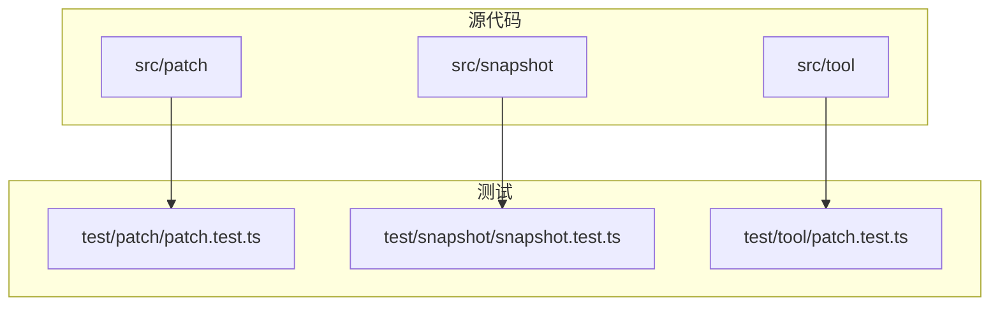
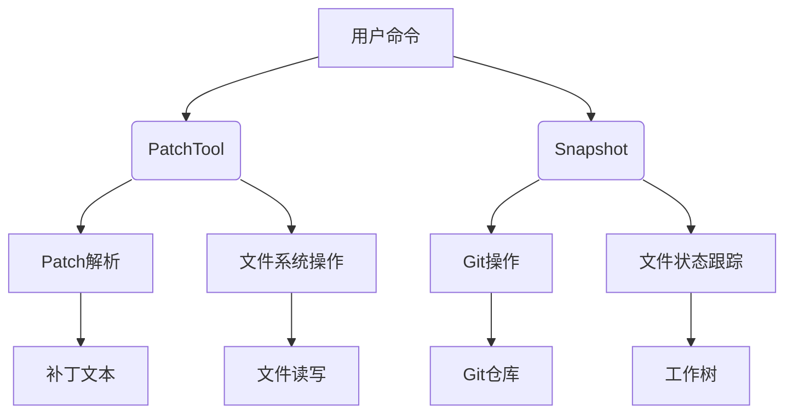
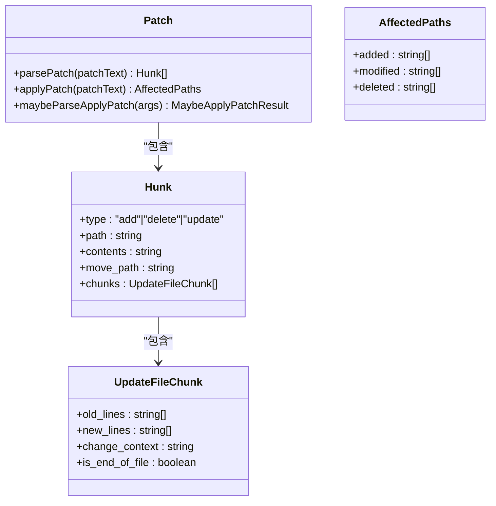
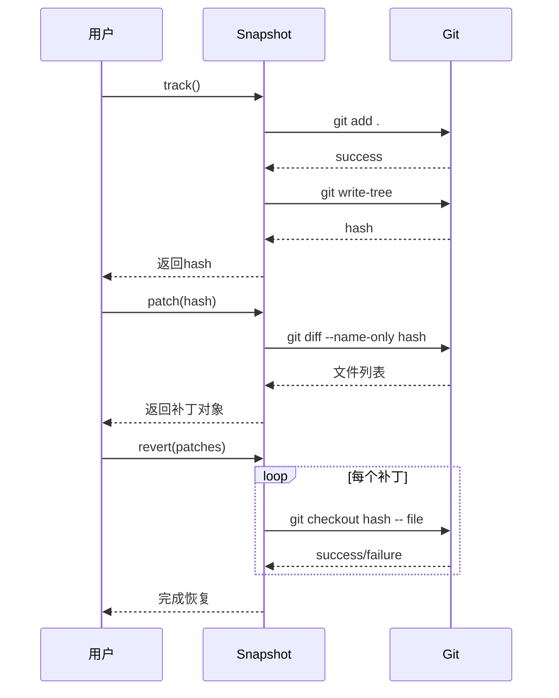
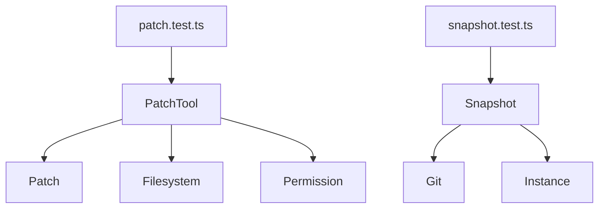

# 集成测试方法

<cite>
**本文档引用的文件**
- [patch.test.ts](file://packages/opencode/test/patch/patch.test.ts)
- [snapshot.test.ts](file://packages/opencode/test/snapshot/snapshot.test.ts)
- [patch.ts](file://packages/opencode/src/tool/patch.ts)
- [index.ts](file://packages/opencode/src/snapshot/index.ts)
- [index.ts](file://packages/opencode/src/patch/index.ts)
</cite>

## 目录
1. [简介](#简介)
2. [项目结构](#项目结构)
3. [核心组件](#核心组件)
4. [架构概述](#架构概述)
5. [详细组件分析](#详细组件分析)
6. [依赖分析](#依赖分析)
7. [性能考虑](#性能考虑)
8. [故障排除指南](#故障排除指南)
9. [结论](#结论)

## 简介
本文档旨在提供一套完整的集成测试方法指南，重点聚焦于验证多个组件协同工作的场景。通过分析`patch.test.ts`和`snapshot.test.ts`测试文件，深入探讨如何测试文件补丁应用、快照生成与恢复等跨模块操作。文档详细描述了如何构建真实环境模拟（如临时工作区、文件系统状态），确保工具链（如bash、patch）与核心逻辑的集成正确性。同时，解释了如何通过端到端测试验证上下文压缩、智能恢复等高级功能的数据流完整性，并提供了测试数据管理、清理机制和并发执行的最佳实践。

## 项目结构
项目结构清晰地划分了源代码、测试和工具模块。核心功能实现在`src`目录下，而集成测试则集中在`test`目录中。`patch`和`snapshot`功能分别有独立的源代码和测试文件，便于模块化开发和测试。

**图示来源**
- [patch.test.ts](file://packages/opencode/test/patch/patch.test.ts)
- [snapshot.test.ts](file://packages/opencode/test/snapshot/snapshot.test.ts)

**章节来源**
- [patch.test.ts](file://packages/opencode/test/patch/patch.test.ts#L1-L339)
- [snapshot.test.ts](file://packages/opencode/test/snapshot/snapshot.test.ts#L1-L587)

## 核心组件
核心组件包括补丁处理（Patch）和快照管理（Snapshot）两大模块。补丁处理模块负责解析和应用文件变更，支持添加、更新、删除和移动文件操作。快照管理模块则负责跟踪文件系统状态，生成和恢复快照，确保数据一致性。

**章节来源**
- [patch.ts](file://packages/opencode/src/tool/patch.ts#L1-L207)
- [index.ts](file://packages/opencode/src/snapshot/index.ts#L1-L145)

## 架构概述
系统架构采用模块化设计，各组件通过明确定义的接口进行交互。补丁工具（PatchTool）作为高层接口，协调底层补丁解析和文件操作。快照系统利用Git作为后端存储，通过`git-dir`机制实现项目隔离。

**图示来源**
- [patch.ts](file://packages/opencode/src/tool/patch.ts#L1-L207)
- [index.ts](file://packages/opencode/src/snapshot/index.ts#L1-L145)

## 详细组件分析
### 补丁处理组件分析
补丁处理组件实现了完整的补丁生命周期管理，从解析到应用，再到结果反馈。它支持多种补丁格式，包括直接补丁文本和bash heredoc格式。

#### 类图

**图示来源**
- [index.ts](file://packages/opencode/src/patch/index.ts#L1-L49)
- [patch.ts](file://packages/opencode/src/tool/patch.ts#L1-L207)

### 快照管理组件分析
快照管理组件提供了文件系统状态的版本控制功能，支持跟踪、生成补丁和恢复操作。它利用Git的强大功能来管理文件变更历史。

#### 序列图

**图示来源**
- [index.ts](file://packages/opencode/src/snapshot/index.ts#L1-L145)
- [snapshot.test.ts](file://packages/opencode/test/snapshot/snapshot.test.ts#L1-L587)

**章节来源**
- [index.ts](file://packages/opencode/src/snapshot/index.ts#L1-L145)
- [snapshot.test.ts](file://packages/opencode/test/snapshot/snapshot.test.ts#L1-L587)

## 依赖分析
系统依赖关系清晰，各模块之间耦合度低。补丁工具依赖于补丁解析模块和文件系统操作，而快照管理则依赖于Git命令行工具。

**图示来源**
- [patch.ts](file://packages/opencode/src/tool/patch.ts#L1-L207)
- [index.ts](file://packages/opencode/src/snapshot/index.ts#L1-L145)

**章节来源**
- [patch.test.ts](file://packages/opencode/test/patch/patch.test.ts#L1-L339)
- [snapshot.test.ts](file://packages/opencode/test/snapshot/snapshot.test.ts#L1-L587)

## 性能考虑
在设计集成测试时，需要考虑性能因素。使用临时目录和资源管理器（using tmp）可以确保测试环境的快速创建和清理。对于大文件和大量文件的操作，应考虑分批处理和异步执行。

## 故障排除指南
当集成测试失败时，可以从以下几个方面进行排查：
1. 检查临时目录是否正确创建和清理
2. 验证文件路径是否在工作目录内
3. 确认Git命令执行结果
4. 检查权限设置是否正确

**章节来源**
- [patch.test.ts](file://packages/opencode/test/patch/patch.test.ts#L1-L339)
- [snapshot.test.ts](file://packages/opencode/test/snapshot/snapshot.test.ts#L1-L587)

## 结论
本文档详细介绍了集成测试的方法，通过分析`patch.test.ts`和`snapshot.test.ts`测试文件，展示了如何验证多个组件协同工作的场景。建议在实际开发中遵循这些最佳实践，确保系统的稳定性和可靠性。