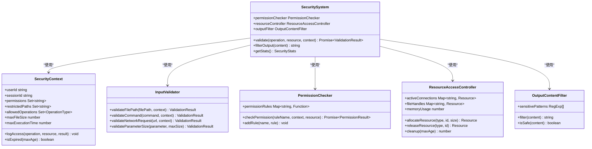
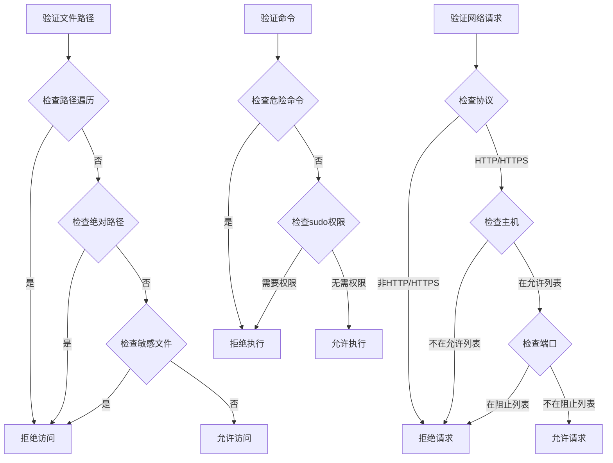
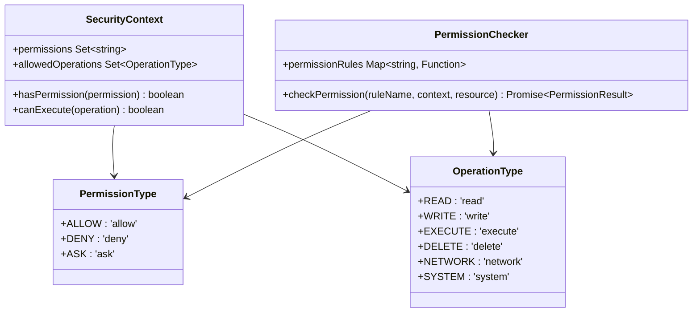
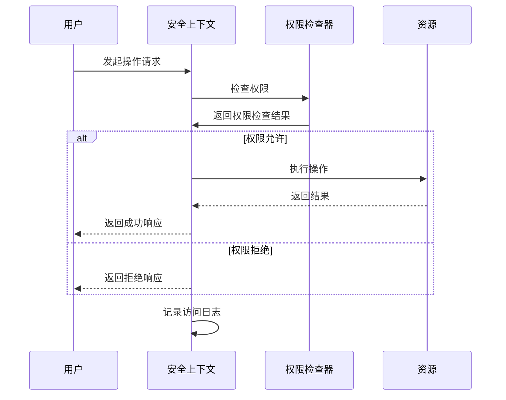
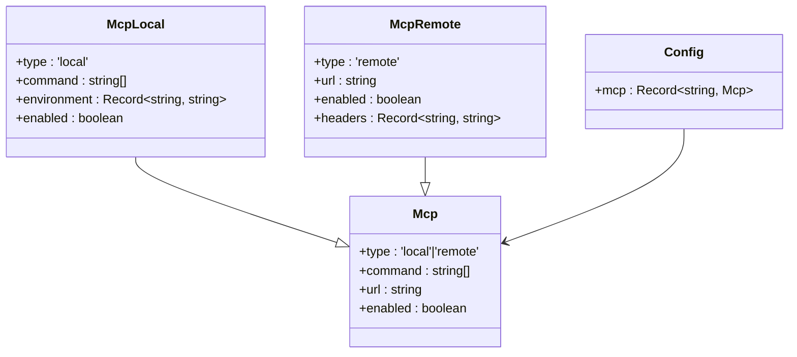
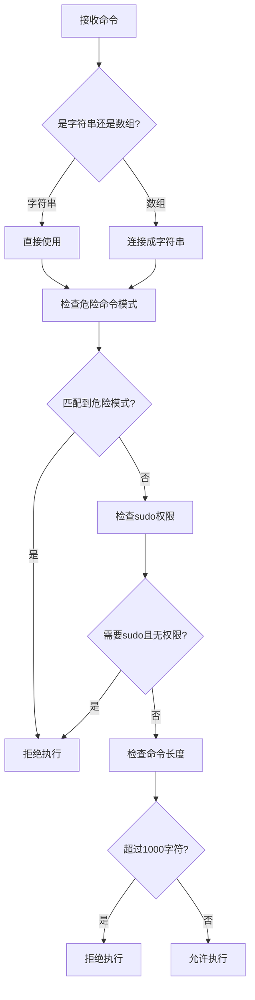
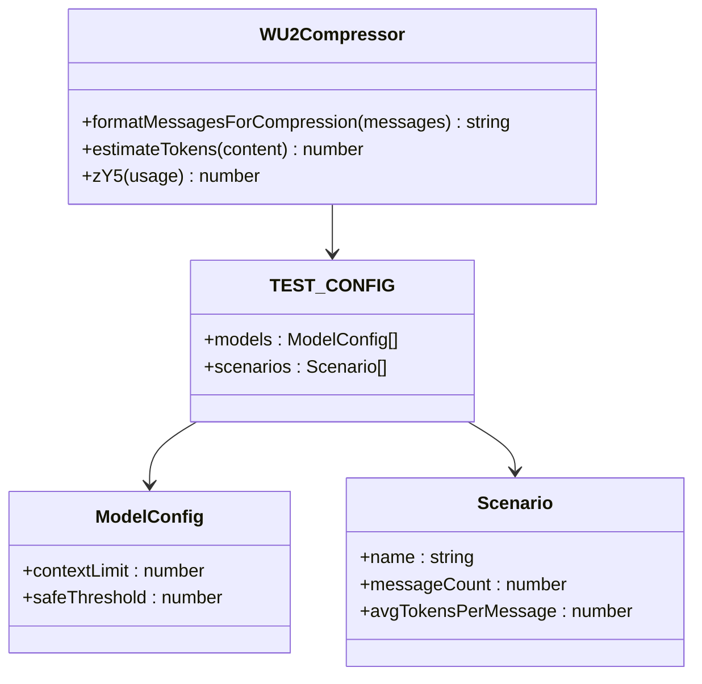
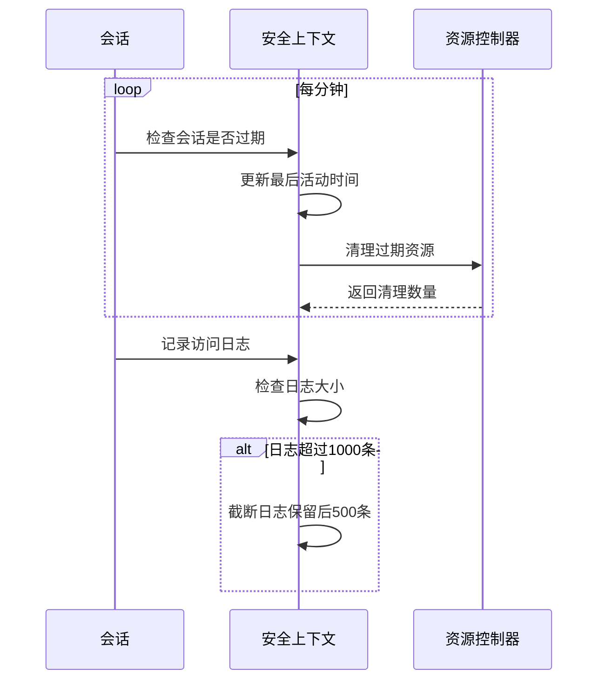
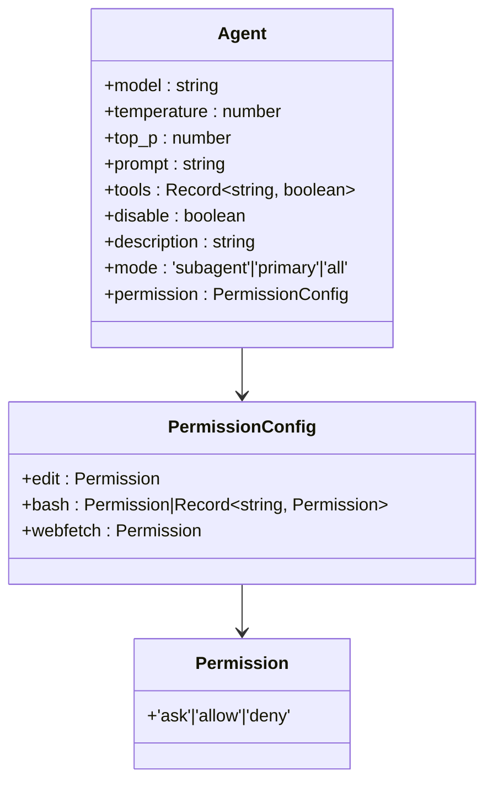
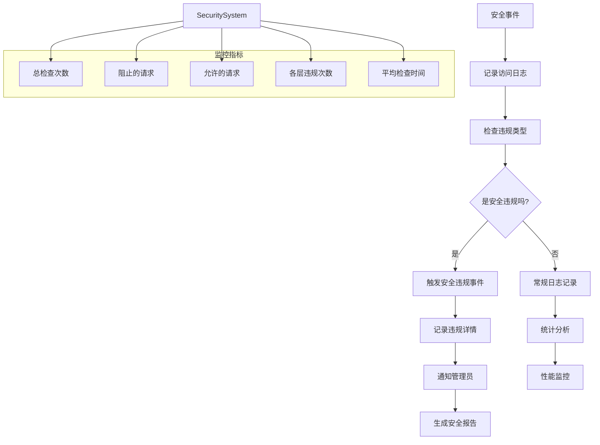

# 安全考虑

<cite>
**本文档中引用的文件**  
- [SecuritySystem.js](file://context-claude-code/src/security/SecuritySystem.js)
- [test-context-protection.js](file://context-claude-code/test-context-protection.js)
- [AGENTS.md](file://AGENTS.md)
- [config.ts](file://packages/opencode/src/config/config.ts)
</cite>

## 目录
1. [简介](#简介)
2. [安全架构概述](#安全架构概述)
3. [核心安全组件分析](#核心安全组件分析)
4. [权限模型与访问控制](#权限模型与访问控制)
5. [MCP工具执行权限配置](#mcp工具执行权限配置)
6. [上下文数据保护机制](#上下文数据保护机制)
7. [安全威胁防范实践](#安全威胁防范实践)
8. [安全审计与日志监控](#安全审计与日志监控)
9. [结论](#结论)

## 简介
本文档全面阐述了AI代理环境下的数据保护与访问控制安全实践。重点分析了六层安全验证系统如何实现敏感信息过滤、输入验证和执行沙箱机制。文档详细说明了基于角色的访问控制（RBAC）和最小权限原则在Agent管理中的应用，以及如何通过配置文件管理MCP工具的执行权限。同时介绍了上下文数据加密存储策略和会话保护机制，提供了防范AI提示注入、上下文泄露和未经授权的文件访问的实践指南。

## 安全架构概述

```mermaid
graph TD
A[用户输入] --> B[UI输入验证]
B --> C[消息路由验证]
C --> D[工具调用验证]
D --> E[参数内容验证]
E --> F[系统资源访问控制]
F --> G[输出内容过滤]
G --> H[安全输出]
subgraph "安全验证层"
B
C
D
E
F
G
end
style A fill:#f9f,stroke:#333
style H fill:#bbf,stroke:#333
style subgraph fill:#f9f9f9,stroke:#ccc
```

**图示来源**  
- [SecuritySystem.js](file://context-claude-code/src/security/SecuritySystem.js#L32-L39)

**本节来源**  
- [SecuritySystem.js](file://context-claude-code/src/security/SecuritySystem.js#L1-L851)

## 核心安全组件分析

### 六层安全验证系统
SecuritySystem.js实现了一个六层安全验证系统，每层负责不同的安全检查：

1. **UI输入验证层**：验证基本输入格式
2. **消息路由验证层**：检查会话状态和操作权限
3. **工具调用验证层**：基于权限规则检查具体操作
4. **参数内容验证层**：验证参数大小和内容
5. **系统资源访问控制层**：管理资源分配和使用
6. **输出内容过滤层**：过滤敏感信息和恶意内容



**图示来源**  
- [SecuritySystem.js](file://context-claude-code/src/security/SecuritySystem.js#L558-L845)
- [SecuritySystem.js](file://context-claude-code/src/security/SecuritySystem.js#L97-L141)
- [SecuritySystem.js](file://context-claude-code/src/security/SecuritySystem.js#L146-L306)
- [SecuritySystem.js](file://context-claude-code/src/security/SecuritySystem.js#L311-L388)

**本节来源**  
- [SecuritySystem.js](file://context-claude-code/src/security/SecuritySystem.js#L1-L851)

### 输入验证机制
输入验证器（InputValidator）负责验证各种输入的安全性，包括文件路径、命令和网络请求。



**图示来源**  
- [SecuritySystem.js](file://context-claude-code/src/security/SecuritySystem.js#L146-L306)

**本节来源**  
- [SecuritySystem.js](file://context-claude-code/src/security/SecuritySystem.js#L146-L306)

## 权限模型与访问控制

### 基于角色的访问控制（RBAC）
系统实现了基于角色的访问控制模型，通过权限检查器（PermissionChecker）管理不同操作的权限。



**图示来源**  
- [SecuritySystem.js](file://context-claude-code/src/security/SecuritySystem.js#L11-L15)
- [SecuritySystem.js](file://context-claude-code/src/security/SecuritySystem.js#L20-L27)
- [SecuritySystem.js](file://context-claude-code/src/security/SecuritySystem.js#L97-L141)
- [SecuritySystem.js](file://context-claude-code/src/security/SecuritySystem.js#L311-L388)

**本节来源**  
- [SecuritySystem.js](file://context-claude-code/src/security/SecuritySystem.js#L1-L851)

### 最小权限原则
系统遵循最小权限原则，为每个安全上下文分配必要的最小权限集。



**图示来源**  
- [SecuritySystem.js](file://context-claude-code/src/security/SecuritySystem.js#L97-L141)
- [SecuritySystem.js](file://context-claude-code/src/security/SecuritySystem.js#L311-L388)

**本节来源**  
- [SecuritySystem.js](file://context-claude-code/src/security/SecuritySystem.js#L1-L851)

## MCP工具执行权限配置

### MCP服务器配置
通过config.ts文件可以配置MCP（Model Context Protocol）服务器的连接方式和权限。



**图示来源**  
- [config.ts](file://packages/opencode/src/config/config.ts#L249-L287)
- [config.ts](file://packages/opencode/src/config/config.ts#L484)

**本节来源**  
- [config.ts](file://packages/opencode/src/config/config.ts#L1-L727)

### 防止恶意命令执行
系统通过多种机制防止恶意命令执行：

1. **危险命令模式检测**：识别rm -rf、dd if=等危险命令
2. **权限提升检查**：限制sudo命令的使用
3. **命令长度限制**：防止超长命令注入
4. **沙箱执行环境**：在隔离环境中执行命令



**图示来源**  
- [SecuritySystem.js](file://context-claude-code/src/security/SecuritySystem.js#L199-L232)

**本节来源**  
- [SecuritySystem.js](file://context-claude-code/src/security/SecuritySystem.js#L146-L306)

## 上下文数据保护机制

### 上下文窗口保护
test-context-protection.js实现了上下文窗口保护机制，防止上下文溢出。



**图示来源**  
- [test-context-protection.js](file://context-claude-code/test-context-protection.js#L1-L270)

**本节来源**  
- [test-context-protection.js](file://context-claude-code/test-context-protection.js#L1-L270)

### 会话保护机制
系统通过多种方式保护会话数据的安全：

1. **会话过期检查**：定期检查会话是否过期
2. **活动记录**：记录所有访问操作
3. **日志截断**：保持日志在合理大小
4. **资源清理**：定期清理过期资源



**图示来源**  
- [SecuritySystem.js](file://context-claude-code/src/security/SecuritySystem.js#L97-L141)
- [SecuritySystem.js](file://context-claude-code/src/security/SecuritySystem.js#L311-L388)

**本节来源**  
- [SecuritySystem.js](file://context-claude-code/src/security/SecuritySystem.js#L1-L851)

## 安全威胁防范实践

### 敏感信息过滤
输出内容过滤器（OutputContentFilter）负责过滤敏感信息和恶意内容。

```mermaid
flowchart TD
A[原始输出内容] --> B{是字符串吗?}
B --> |否| C[直接返回]
B --> |是| D[应用敏感信息模式]
D --> E[密码/令牌/密钥]
D --> F[Base64编码数据]
D --> G[脚本标签]
D --> H[JavaScript协议]
E --> I[替换为[REDACTED]]
F --> I
G --> J[替换为[MALICIOUS_CONTENT_REMOVED]]
H --> J
I --> K[过滤后内容]
J --> K
K --> L[返回安全输出]
```

**图示来源**  
- [SecuritySystem.js](file://context-claude-code/src/security/SecuritySystem.js#L428-L476)

**本节来源**  
- [SecuritySystem.js](file://context-claude-code/src/security/SecuritySystem.js#L428-L476)

### 防范常见安全威胁
系统提供了针对常见AI安全威胁的防范措施：

```mermaid
table
| 威胁类型 | 防范措施 | 实现位置 |
|---------|---------|---------|
| 提示注入 | 输入验证和上下文隔离 | SecuritySystem.js |
| 上下文泄露 | 输出内容过滤和权限控制 | SecuritySystem.js |
| 未经授权的文件访问 | 路径遍历检测和敏感路径检查 | InputValidator.validateFilePath |
| 恶意命令执行 | 危险命令模式检测和权限检查 | InputValidator.validateCommand |
| 网络攻击 | 主机和端口限制 | InputValidator.validateNetworkRequest |
| 资源耗尽 | 内存使用监控和资源清理 | ResourceAccessController |
```

**本节来源**  
- [SecuritySystem.js](file://context-claude-code/src/security/SecuritySystem.js#L1-L851)

## 安全审计与日志监控

### 安全审计配置
根据AGENTS.md中的Agent权限定义，可以配置安全审计策略。



**图示来源**  
- [config.ts](file://packages/opencode/src/config/config.ts#L441-L468)
- [AGENTS.md](file://AGENTS.md#L1-L48)

**本节来源**  
- [config.ts](file://packages/opencode/src/config/config.ts#L1-L727)
- [AGENTS.md](file://AGENTS.md#L1-L48)

### 日志监控建议
实施有效的安全审计和日志监控策略：



**图示来源**  
- [SecuritySystem.js](file://context-claude-code/src/security/SecuritySystem.js#L558-L845)

**本节来源**  
- [SecuritySystem.js](file://context-claude-code/src/security/SecuritySystem.js#L1-L851)

## 结论
本文档详细阐述了AI代理环境下的全面安全实践。通过六层安全验证系统，实现了从输入验证到输出过滤的全方位保护。权限模型结合了基于角色的访问控制和最小权限原则，确保了Agent操作的安全性。MCP工具的执行权限通过配置文件进行精细化管理，有效防止了恶意命令的执行。上下文数据保护机制和会话保护策略确保了敏感信息的安全存储和传输。针对AI提示注入、上下文泄露等常见威胁提供了有效的防范措施。最后，通过安全审计和日志监控，实现了对系统安全状况的持续监控和改进。