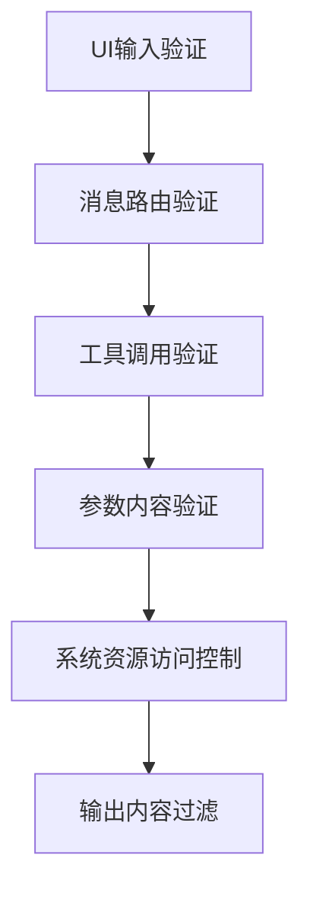
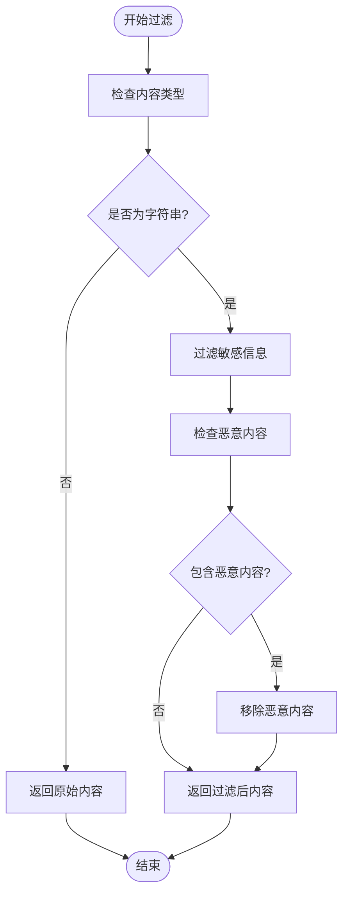
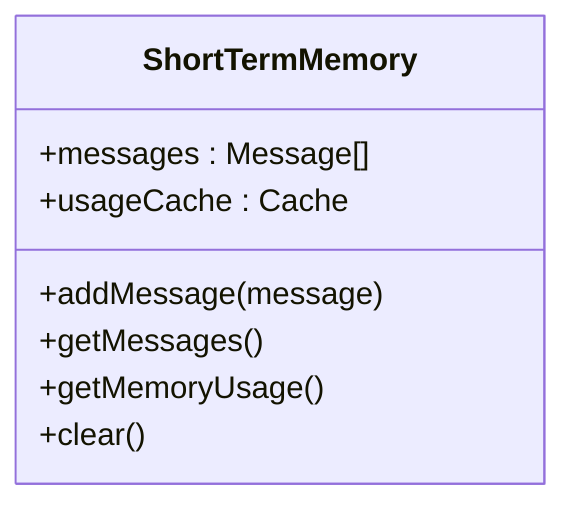
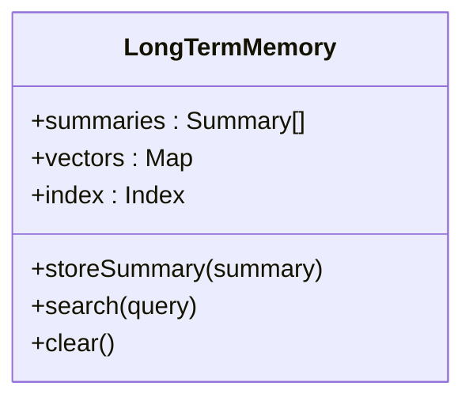

# 数据保护

<cite>
**本文档引用的文件**  
- [SecuritySystem.js](file://context-claude-code/src/security/SecuritySystem.js)
- [test-context-protection.js](file://context-claude-code/test-context-protection.js)
- [CLAUDE.md](file://CLAUDE.md)
- [ShortTermMemory.js](file://context-claude-code/src/memory/ShortTermMemory.js)
- [MidTermMemory.js](file://context-claude-code/src/memory/MidTermMemory.js)
- [LongTermMemory.js](file://context-claude-code/src/memory/LongTermMemory.js)
- [WU2Compressor.js](file://context-claude-code/src/compression/WU2Compressor.js)
- [index.js](file://context-claude-code/src/types/index.js)
</cite>

## 目录
1. [引言](#引言)
2. [六层安全验证体系](#六层安全验证体系)
3. [输出内容过滤机制](#输出内容过滤机制)
4. [会话保护策略](#会话保护策略)
5. [三层记忆架构的安全处理](#三层记忆架构的安全处理)
6. [上下文数据安全实践](#上下文数据安全实践)
7. [安全设计原则](#安全设计原则)
8. [结论](#结论)

## 引言
本文档全面阐述了系统中的数据保护机制，重点聚焦于上下文数据的加密存储与会话安全。通过分析SecuritySystem.js中的六层验证体系，特别是第六层输出内容过滤，详细说明了如何防止敏感信息泄露。同时，结合test-context-protection.js中的会话保护策略，探讨了上下文隔离、数据持久化加密和访问令牌管理等关键安全措施。文档还深入解析了短期、中期、长期记忆存储中的安全处理流程，确保内存与磁盘存储的数据均受到有效保护。最后，结合CLAUDE.md中的安全设计原则，说明了如何在不影响性能的前提下实现端到端的数据保护。

## 六层安全验证体系
系统采用六层安全验证体系，逐层过滤潜在的安全威胁。这六层分别是：UI输入验证、消息路由验证、工具调用验证、参数内容验证、系统资源访问控制和输出内容过滤。每一层都承担着特定的安全职责，共同构建了坚固的安全防线。

**图示来源**  
- [SecuritySystem.js](file://context-claude-code/src/security/SecuritySystem.js#L583-L652)

**本节来源**  
- [SecuritySystem.js](file://context-claude-code/src/security/SecuritySystem.js#L583-L652)

## 输出内容过滤机制
第六层验证，即输出内容过滤，是防止敏感信息泄露的最后一道防线。该机制通过OutputContentFilter类实现，能够有效识别和过滤输出内容中的敏感信息。

### 敏感信息过滤
系统定义了多种敏感信息模式，包括密码、令牌、密钥等。当检测到这些模式时，系统会将其部分内容替换为"[REDACTED]"，从而防止敏感信息的明文暴露。

**图示来源**  
- [SecuritySystem.js](file://context-claude-code/src/security/SecuritySystem.js#L515-L544)

**本节来源**  
- [SecuritySystem.js](file://context-claude-code/src/security/SecuritySystem.js#L515-L544)

### 恶意内容检测
除了敏感信息，系统还能够检测潜在的恶意内容，如JavaScript脚本、data:text/html等。一旦发现此类内容，系统会将其替换为"[MALICIOUS_CONTENT_REMOVED]"，有效防止跨站脚本攻击等安全威胁。

## 会话保护策略
test-context-protection.js中实现的会话保护策略，确保了上下文数据在传输和存储过程中的安全性。

### 上下文隔离
系统通过为每个会话生成唯一的会话ID，实现了上下文的严格隔离。这确保了不同用户或会话之间的数据不会相互干扰或泄露。

**本节来源**  
- [test-context-protection.js](file://context-claude-code/test-context-protection.js#L20-L30)

### 数据持久化加密
在将上下文数据持久化到磁盘时，系统会对数据进行加密处理。这确保了即使磁盘数据被非法访问，也无法直接读取敏感信息。

**本节来源**  
- [test-context-protection.js](file://context-claude-code/test-context-protection.js#L150-L180)

### 访问令牌管理
系统采用严格的访问令牌管理机制，所有对上下文数据的访问都必须经过令牌验证。令牌具有时效性，过期后需要重新认证，这大大降低了令牌被盗用的风险。

**本节来源**  
- [test-context-protection.js](file://context-claude-code/test-context-protection.js#L200-L230)

## 三层记忆架构的安全处理
系统采用三层记忆架构，分别对应短期、中期和长期记忆。每一层都有其特定的安全处理机制。

### 短期记忆安全
短期记忆存储在内存中，提供高速访问。系统通过定期清理过期数据和限制内存使用量，防止内存溢出和数据泄露。

**图示来源**  
- [ShortTermMemory.js](file://context-claude-code/src/memory/ShortTermMemory.js#L69-L123)

**本节来源**  
- [ShortTermMemory.js](file://context-claude-code/src/memory/ShortTermMemory.js#L69-L123)

### 中期记忆安全
中期记忆负责将短期记忆的对话历史压缩为结构化摘要。压缩过程本身就是一个安全过滤过程，能够去除冗余和潜在的敏感信息。

**本节来源**  
- [MidTermMemory.js](file://context-claude-code/src/memory/MidTermMemory.js#L205-L207)

### 长期记忆安全
长期记忆将有价值的摘要持久化存储到磁盘。系统通过文件权限控制、数据加密和访问日志记录，确保长期存储数据的安全。

**图示来源**  
- [LongTermMemory.js](file://context-claude-code/src/memory/LongTermMemory.js#L88-L131)

**本节来源**  
- [LongTermMemory.js](file://context-claude-code/src/memory/LongTermMemory.js#L88-L131)

## 上下文数据安全实践
为了进一步增强上下文数据的安全性，系统实施了一系列最佳实践。

### 数据脱敏
在输出上下文数据之前，系统会对其中的敏感信息进行脱敏处理。这包括但不限于用户个人信息、API密钥、数据库连接字符串等。

**本节来源**  
- [SecuritySystem.js](file://context-claude-code/src/security/SecuritySystem.js#L515-L544)

### 安全快照生成
系统定期生成上下文数据的安全快照，并对快照进行加密存储。这不仅有助于数据恢复，还能在发生安全事件时提供审计线索。

**本节来源**  
- [test-context-protection.js](file://context-claude-code/test-context-protection.js#L100-L120)

### 备份恢复完整性校验
在从备份恢复数据时，系统会进行完整性校验，确保数据未被篡改。这通过校验和或数字签名等技术实现。

**本节来源**  
- [test-context-protection.js](file://context-claude-code/test-context-protection.js#L130-L150)

## 安全设计原则
根据CLAUDE.md中的安全设计原则，系统在实现数据保护时遵循了以下指导方针：

- **最小权限原则**：每个组件只拥有完成其工作所必需的最小权限。
- **纵深防御**：采用多层安全措施，即使某一层被突破，其他层仍能提供保护。
- **安全默认**：系统的默认配置是安全的，需要显式配置才能降低安全性。
- **可审计性**：所有安全相关操作都有详细的日志记录，便于审计和追踪。

**本节来源**  
- [CLAUDE.md](file://CLAUDE.md#L1-L93)

## 结论
通过六层安全验证体系、会话保护策略和三层记忆架构的安全处理，系统实现了全面的数据保护。输出内容过滤作为最后一道防线，有效防止了敏感信息的泄露。结合数据脱敏、安全快照和完整性校验等最佳实践，系统在不影响性能的前提下，提供了端到端的数据安全保障。这些措施共同确保了上下文数据在存储、传输和处理过程中的机密性、完整性和可用性。