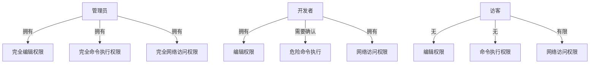
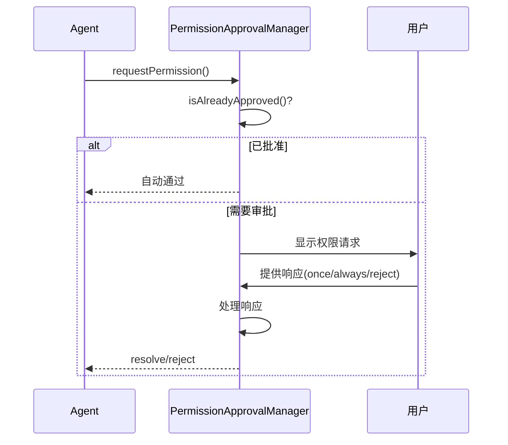

# 基于角色的访问控制

<cite>
**本文档引用文件**  
- [AGENTS.md](file://AGENTS.md)
- [05-permission-control.md](file://doc-agent-context/05-permission-control.md)
- [index.ts](file://packages/opencode/src/permission/index.ts)
- [agent.ts](file://packages/opencode/src/agent/agent.ts)
</cite>

## 目录
1. [引言](#引言)
2. [角色定义与权限分配](#角色定义与权限分配)
3. [权限继承机制](#权限继承机制)
4. [角色与上下文会话绑定](#角色与上下文会话绑定)
5. [动态角色切换实现](#动态角色切换实现)
6. [自定义角色配置示例](#自定义角色配置示例)
7. [多租户环境下的隔离机制](#多租户环境下的隔离机制)
8. [权限边界控制](#权限边界控制)
9. [结论](#结论)

## 引言
基于角色的访问控制（RBAC）在Agent生命周期管理中起着至关重要的作用。该系统通过细粒度的权限控制、审批流程和权限合并机制，确保AI Agent在安全范围内执行操作。本文档详细阐述了RBAC模型在Agent管理中的应用，包括角色定义、权限分配、继承机制以及多租户环境下的隔离策略。

**Section sources**
- [05-permission-control.md](file://doc-agent-context/05-permission-control.md#L1-L50)

## 角色定义与权限分配
系统定义了三种核心权限级别：`allow`（允许）、`ask`（需确认）和`deny`（拒绝）。这些权限应用于不同的操作类型，如编辑文件、执行命令和网络访问。

### 管理员角色
管理员拥有最高权限，可以执行所有操作而无需额外确认。其默认权限配置如下：
- 编辑权限：`allow`
- 命令执行：`allow`（对特定危险命令可设为`ask`或`deny`）
- 网络访问：`allow`

### 开发者角色
开发者具有有限的操作权限，通常需要用户确认才能执行某些敏感操作：
- 编辑权限：`allow`
- 命令执行：`ask`（对于`rm`、`sudo`等命令）
- 网络访问：`allow`

### 访客角色
访客角色权限最为严格，主要用于只读操作：
- 编辑权限：`deny`
- 命令执行：`deny`
- 网络访问：`allow`（仅限白名单域名）



**Diagram sources**
- [05-permission-control.md](file://doc-agent-context/05-permission-control.md#L116-L171)
- [index.ts](file://packages/opencode/src/permission/index.ts#L1-L50)

**Section sources**
- [05-permission-control.md](file://doc-agent-context/05-permission-control.md#L116-L171)
- [index.ts](file://packages/opencode/src/permission/index.ts#L1-L50)

## 权限继承机制
权限系统支持多层级权限配置，通过权限合并算法实现继承机制。当基础权限与覆盖权限同时存在时，系统会进行深度合并。

### 权限合并逻辑
```typescript
function mergeAgentPermissions(basePermission: any, overridePermission: any): Agent.Info["permission"] {
  const merged = mergeDeep(basePermission ?? {}, overridePermission ?? {})
  let mergedBash
  
  if (merged.bash) {
    if (typeof merged.bash === "string") {
      mergedBash = { "*": merged.bash }
    }
    if (typeof merged.bash === "object") {
      mergedBash = mergeDeep({ "*": "ask" }, merged.bash)
    }
  }

  return {
    edit: merged.edit ?? "allow",
    webfetch: merged.webfetch ?? "allow",
    bash: mergedBash ?? { "*": "allow" },
  }
}
```

### 继承示例
假设基础权限配置为允许所有命令执行，但特定Agent需要限制某些命令：
```json
{
  "basePermission": {
    "bash": "allow"
  },
  "overridePermission": {
    "bash": {
      "rm -rf": "ask",
      "sudo": "deny"
    }
  }
}
```
合并后结果为：
```json
{
  "bash": {
    "*": "allow",
    "rm -rf": "ask",
    "sudo": "deny"
  }
}
```

**Section sources**
- [agent.ts](file://packages/opencode/src/agent/agent.ts#L177-L204)
- [05-permission-control.md](file://doc-agent-context/05-permission-control.md#L137-L164)

## 角色与上下文会话绑定
每个Agent实例在其生命周期内与特定的会话上下文绑定，权限状态存储在会话级别的内存中。

### 权限状态管理
系统维护两个主要状态结构：
- `pending`: 存储待处理的权限请求
- `approved`: 存储已批准的权限

```typescript
const state = Instance.state(
  () => {
    const pending: {
      [sessionID: string]: {
        [permissionID: string]: {
          info: Info
          resolve: () => void
          reject: (e: any) => void
        }
      }
    } = {}

    const approved: {
      [sessionID: string]: {
        [permissionID: string]: boolean
      }
    } = {}

    return {
      pending,
      approved,
    }
  }
)
```

### 绑定机制
当Agent发起权限请求时，系统会检查当前会话是否已有相应批准。如果已批准，则自动通过；否则进入审批流程。

**Section sources**
- [index.ts](file://packages/opencode/src/permission/index.ts#L47-L77)
- [05-permission-control.md](file://doc-agent-context/05-permission-control.md#L399-L449)

## 动态角色切换实现
系统支持在运行时动态切换Agent角色，通过权限审批管理器处理角色变更带来的权限调整。

### 切换流程
1. 发起角色切换请求
2. 检查新角色所需的权限
3. 如果需要用户确认，则等待审批
4. 更新会话中的权限状态
5. 通知相关组件权限变更

### 审批机制


**Diagram sources**
- [05-permission-control.md](file://doc-agent-context/05-permission-control.md#L163-L271)
- [index.ts](file://packages/opencode/src/permission/index.ts#L78-L133)

**Section sources**
- [05-permission-control.md](file://doc-agent-context/05-permission-control.md#L163-L271)
- [index.ts](file://packages/opencode/src/permission/index.ts#L78-L133)

## 自定义角色配置示例
可以通过权限策略文件定义自定义角色，实现灵活的权限管理。

### 全局权限配置
```json
{
  "permission": {
    "edit": "ask",
    "bash": "allow",
    "webfetch": "deny"
  }
}
```

### 特定Agent权限配置
```json
{
  "agent": {
    "readonly": {
      "permission": {
        "edit": "deny",
        "bash": "deny",
        "webfetch": "allow"
      }
    },
    "developer": {
      "permission": {
        "edit": "allow",
        "bash": {
          "*": "allow",
          "rm": "ask",
          "sudo": "deny"
        },
        "webfetch": "allow"
      }
    }
  }
}
```

### 命令模式匹配配置
```json
{
  "permission": {
    "bash": {
      "*": "allow",
      "rm -rf": "ask",
      "sudo": "deny",
      "git push": "ask"
    }
  }
}
```

**Section sources**
- [05-permission-control.md](file://doc-agent-context/05-permission-control.md#L500-L550)

## 多租户环境下的隔离机制
在多租户环境中，系统通过会话隔离和权限边界控制确保不同租户之间的数据和操作分离。

### 隔离策略
1. **会话隔离**：每个租户的会话独立存储，互不干扰
2. **资源访问控制**：限制跨租户资源访问
3. **审计日志分离**：每个租户的权限操作记录独立存储

### 审计系统
```typescript
class PermissionAuditor {
  private auditLog: AuditLogEntry[] = []
  
  async auditPermissionAction(action: PermissionAction): Promise<void> {
    const entry: AuditLogEntry = {
      id: generateId(),
      timestamp: Date.now(),
      sessionID: action.sessionID,
      permissionID: action.permissionID,
      type: action.type,
      pattern: action.pattern,
      action: action.action,
      userID: action.userID,
      metadata: action.metadata,
      result: action.result
    }
    
    this.auditLog.push(entry)
    await Storage.write(['audit', 'permissions', entry.id], entry)
  }
}
```

**Section sources**
- [05-permission-control.md](file://doc-agent-context/05-permission-control.md#L276-L363)

## 权限边界控制
系统通过多层次的安全机制确保权限边界不被突破。

### 安全层级
1. **参数验证层**：验证输入参数大小和格式
2. **资源访问控制层**：控制内存、文件句柄等系统资源使用
3. **网络访问控制层**：限制可访问的主机和端口

### 网络限制规则
```typescript
const NETWORK_RESTRICTIONS = {
  allowedHosts: [
    'localhost',
    '127.0.0.1',
    '0.0.0.0',
    '::1'
  ],
  blockedPorts: [
    22, 23, 25, 53, 135, 139, 445, 993, 995
  ],
  maxConcurrentConnections: 10,
  requestTimeoutMs: 30000
}
```

**Section sources**
- [SecuritySystem.js](file://context-claude-code/src/security/SecuritySystem.js#L77-L130)

## 结论
基于角色的访问控制在Agent生命周期管理中提供了强大的安全保障。通过精细的角色定义、灵活的权限继承机制和严格的边界控制，系统能够在保证功能性的同时确保安全性。多租户环境下的隔离机制进一步增强了系统的适用性和可靠性。动态角色切换功能使得权限管理更加灵活，能够适应不断变化的业务需求。