# 权限控制

<cite>
**本文档中引用的文件**  
- [SecuritySystem.js](file://context-claude-code/src/security/SecuritySystem.js)
- [AGENTS.md](file://AGENTS.md)
- [index.ts](file://packages/opencode/src/permission/index.ts)
- [config.ts](file://packages/opencode/src/config/config.ts)
- [bash.ts](file://packages/opencode/src/tool/bash.ts)
- [edit.ts](file://packages/opencode/src/tool/edit.ts)
- [webfetch.ts](file://packages/opencode/src/tool/webfetch.ts)
</cite>

## 目录
1. [引言](#引言)
2. [六层安全验证体系](#六层安全验证体系)
3. [权限检查机制](#权限检查机制)
4. [基于角色的访问控制](#基于角色的访问控制)
5. [权限注册与审计](#权限注册与审计)
6. [配置示例](#配置示例)
7. [权限继承与作用域](#权限继承与作用域)
8. [结论](#结论)

## 引言
本文档详细解析了系统中的权限控制机制，重点介绍SecuritySystem.js中的六层安全验证体系，特别是第3层工具调用验证和第5层系统资源访问控制。文档结合AGENTS.md中定义的Agent权限模型，阐述基于角色的访问控制（RBAC）在Agent生命周期管理中的应用。同时，详细描述了packages/opencode/src/permission/index.ts中实现的权限注册、验证和审计机制。

**Section sources**
- [SecuritySystem.js](file://context-claude-code/src/security/SecuritySystem.js#L1-L50)
- [AGENTS.md](file://AGENTS.md#L1-L10)

## 六层安全验证体系
系统采用六层安全验证体系来确保操作的安全性：

1. **UI输入验证**：验证基本输入格式
2. **消息路由验证**：检查会话状态和操作权限
3. **工具调用验证**：根据操作类型进行权限检查
4. **参数内容验证**：验证参数大小和格式
5. **系统资源访问控制**：检查资源使用率和分配
6. **输出内容过滤**：过滤和限制输出内容

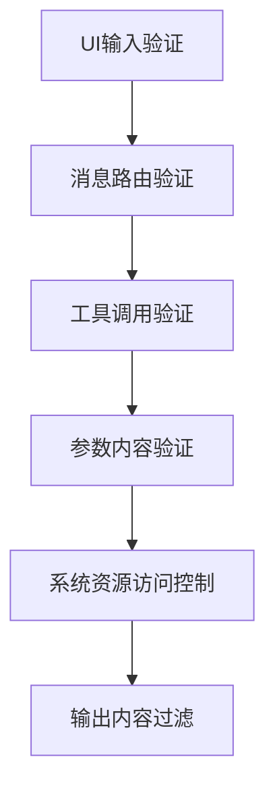

**Diagram sources**
- [SecuritySystem.js](file://context-claude-code/src/security/SecuritySystem.js#L558-L845)

**Section sources**
- [SecuritySystem.js](file://context-claude-code/src/security/SecuritySystem.js#L558-L845)

### 第3层：工具调用验证
第3层工具调用验证根据操作类型执行权限检查：

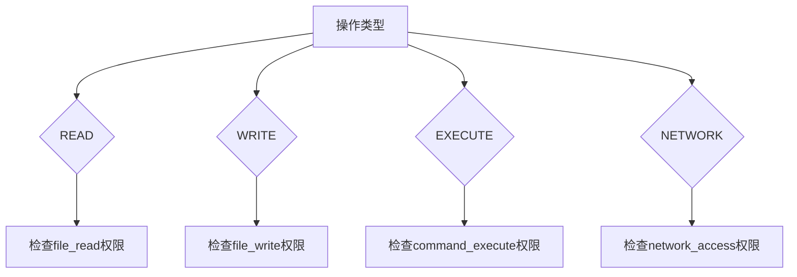

**Diagram sources**
- [SecuritySystem.js](file://context-claude-code/src/security/SecuritySystem.js#L690-L704)

**Section sources**
- [SecuritySystem.js](file://context-claude-code/src/security/SecuritySystem.js#L690-L704)

### 第5层：系统资源访问控制
第5层系统资源访问控制确保系统资源的合理使用：

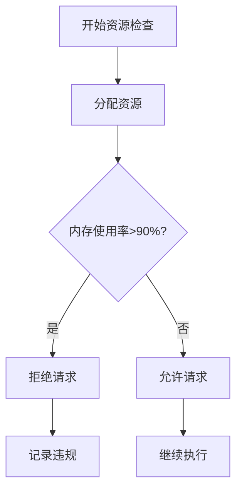

**Diagram sources**
- [SecuritySystem.js](file://context-claude-code/src/security/SecuritySystem.js#L725-L747)

**Section sources**
- [SecuritySystem.js](file://context-claude-code/src/security/SecuritySystem.js#L725-L747)

## 权限检查机制
PermissionChecker基于操作类型执行细粒度权限检查，支持READ、WRITE、EXECUTE、NETWORK四种操作类型。

### 操作类型定义
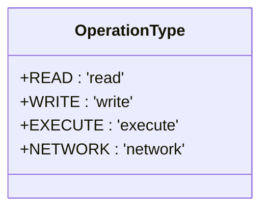

**Diagram sources**
- [SecuritySystem.js](file://context-claude-code/src/security/SecuritySystem.js#L20-L27)

### 权限检查流程
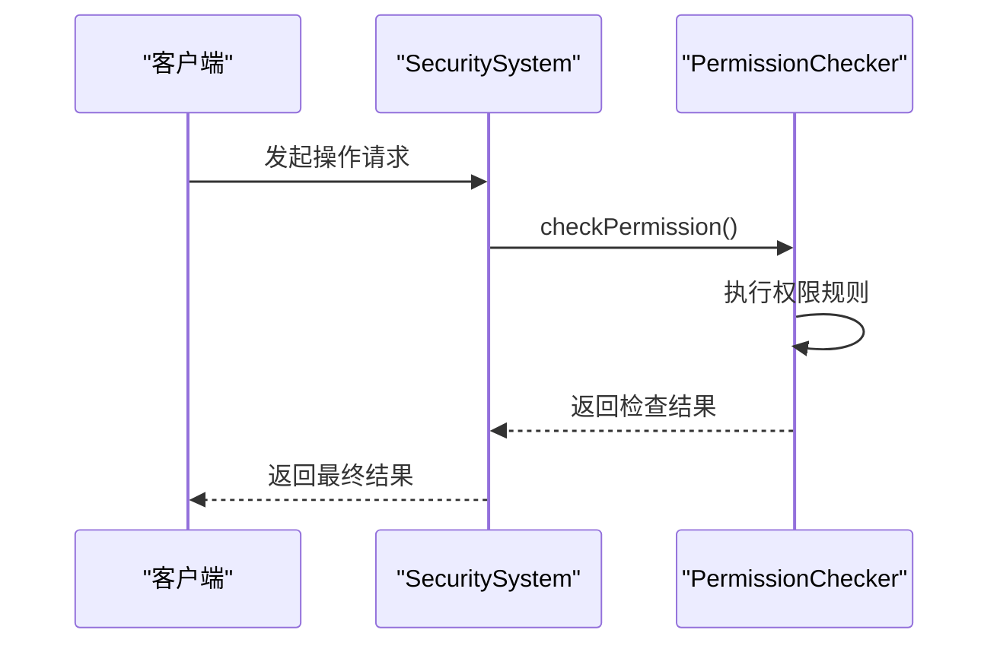

**Diagram sources**
- [SecuritySystem.js](file://context-claude-code/src/security/SecuritySystem.js#L368-L387)

**Section sources**
- [SecuritySystem.js](file://context-claude-code/src/security/SecuritySystem.js#L368-L387)

## 基于角色的访问控制
结合AGENTS.md中定义的Agent权限模型，系统实现了基于角色的访问控制（RBAC）在Agent生命周期管理中的应用。

### Agent权限模型
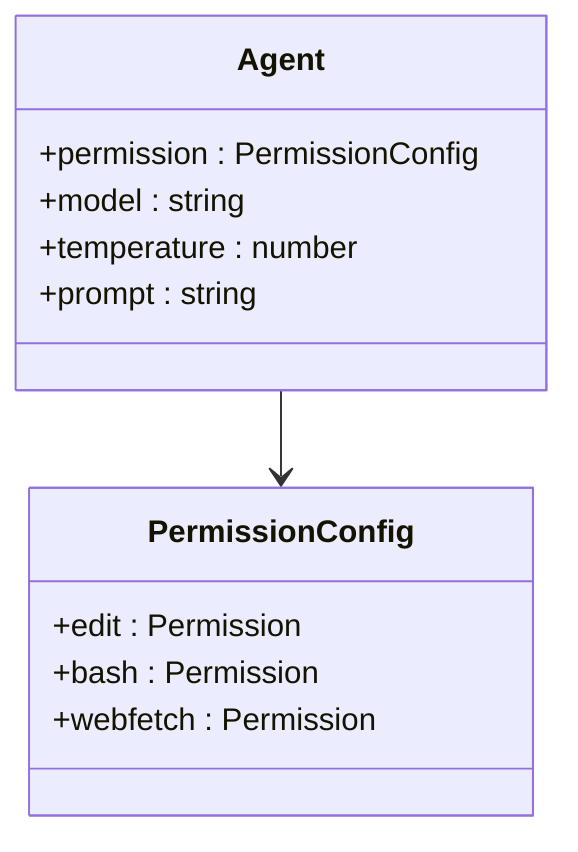

**Diagram sources**
- [AGENTS.md](file://AGENTS.md#L1-L48)
- [config.ts](file://packages/opencode/src/config/config.ts#L1-L727)

**Section sources**
- [AGENTS.md](file://AGENTS.md#L1-L48)
- [config.ts](file://packages/opencode/src/config/config.ts#L1-L727)

## 权限注册与审计
packages/opencode/src/permission/index.ts实现了完整的权限注册、验证和审计机制。

### 权限信息结构
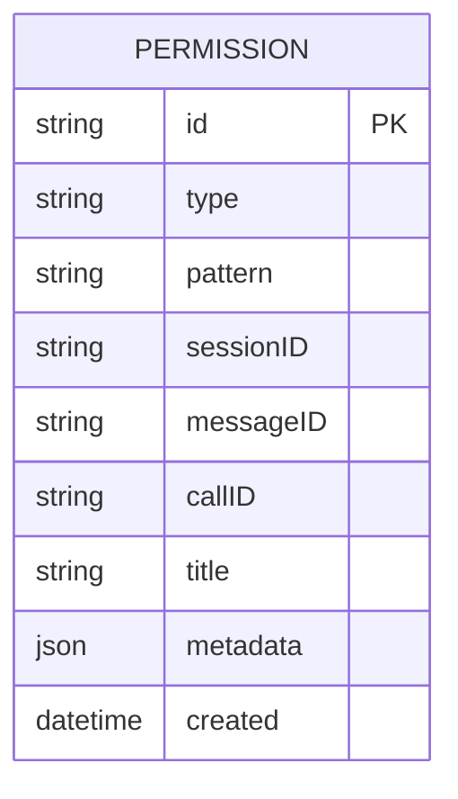

**Diagram sources**
- [index.ts](file://packages/opencode/src/permission/index.ts#L1-L181)

### 权限事件流
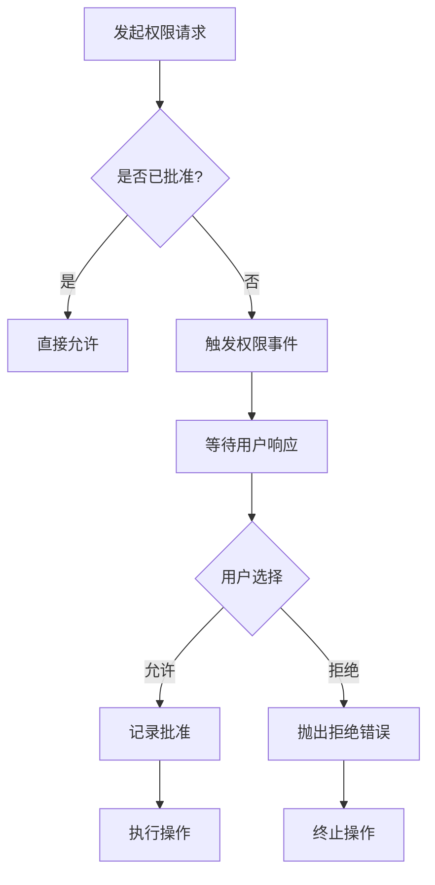

**Diagram sources**
- [index.ts](file://packages/opencode/src/permission/index.ts#L1-L181)

**Section sources**
- [index.ts](file://packages/opencode/src/permission/index.ts#L1-L181)

## 配置示例
通过config.ts可以配置MCP工具的执行权限以防止恶意命令注入。

### MCP权限配置
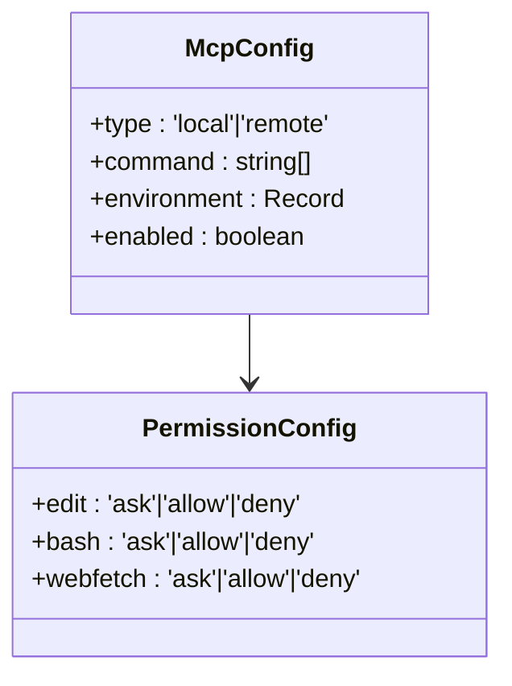

**Diagram sources**
- [config.ts](file://packages/opencode/src/config/config.ts#L1-L727)

### 工具权限配置示例
```typescript
// config.json
{
  "agent": {
    "default": {
      "permission": {
        "edit": "ask",
        "bash": "deny",
        "webfetch": "ask"
      }
    }
  }
}
```

**Section sources**
- [config.ts](file://packages/opencode/src/config/config.ts#L1-L727)

## 权限继承与作用域
系统实现了权限继承和作用域边界控制，遵循最小权限原则。

### 权限继承层次
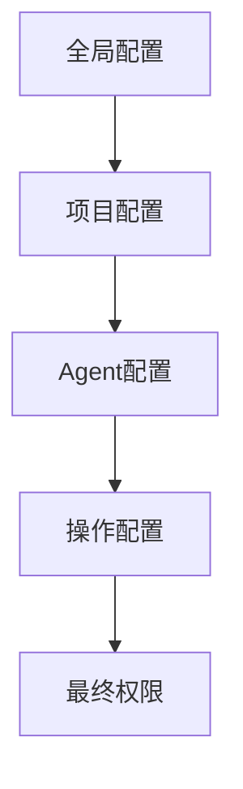

**Diagram sources**
- [config.ts](file://packages/opencode/src/config/config.ts#L1-L727)

### 最小权限原则应用
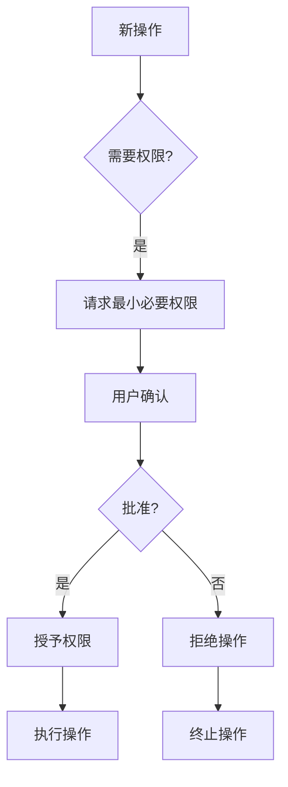

**Diagram sources**
- [index.ts](file://packages/opencode/src/permission/index.ts#L1-L181)

**Section sources**
- [index.ts](file://packages/opencode/src/permission/index.ts#L1-L181)

## 结论
本文档详细解析了系统的权限控制机制，包括六层安全验证体系、权限检查机制、基于角色的访问控制、权限注册与审计、配置示例以及权限继承与作用域。通过这些机制，系统能够有效防止恶意命令注入，确保操作的安全性，同时遵循最小权限原则，保护系统资源。