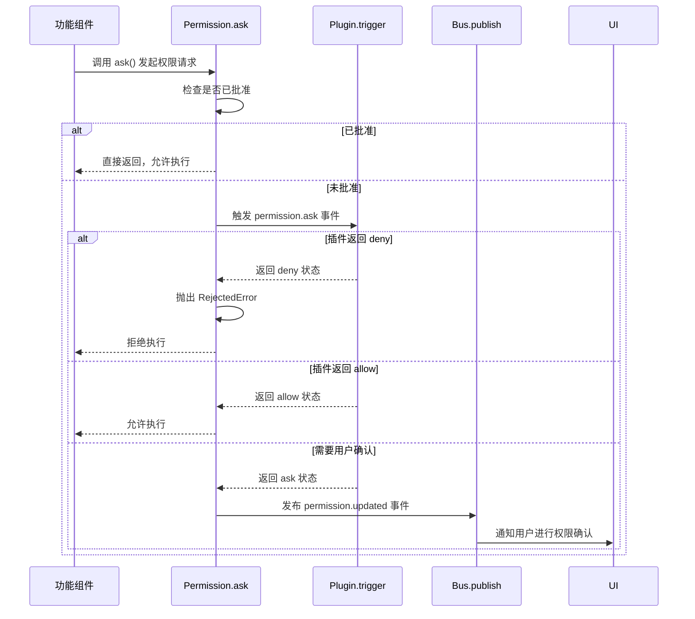
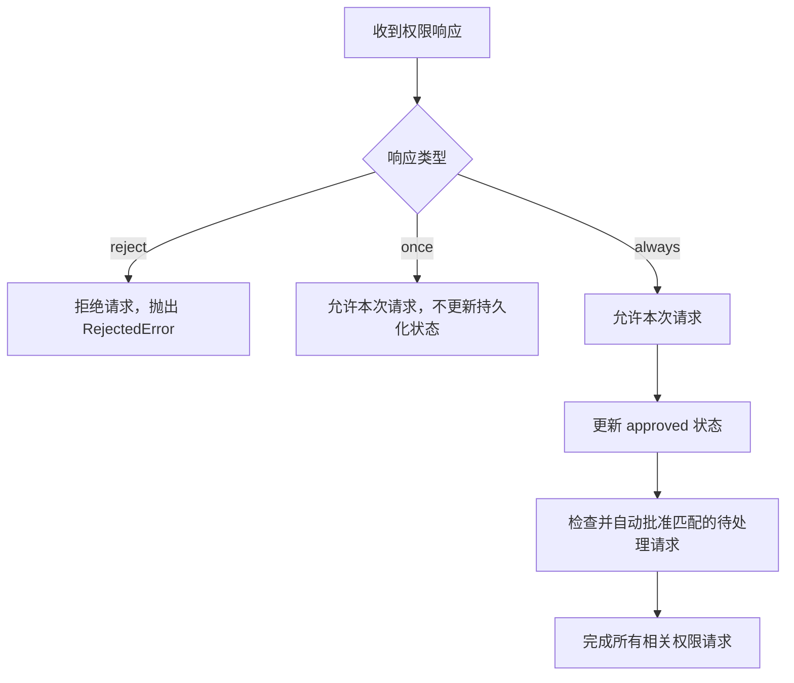
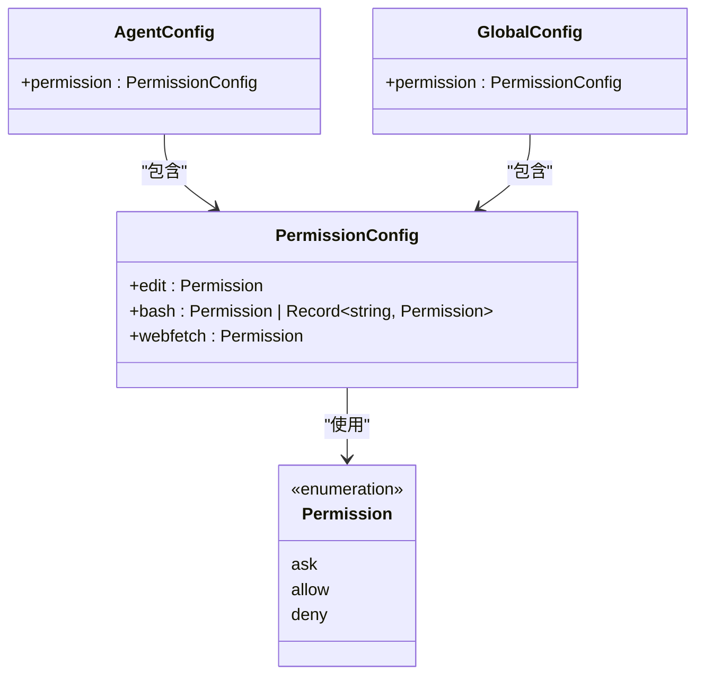
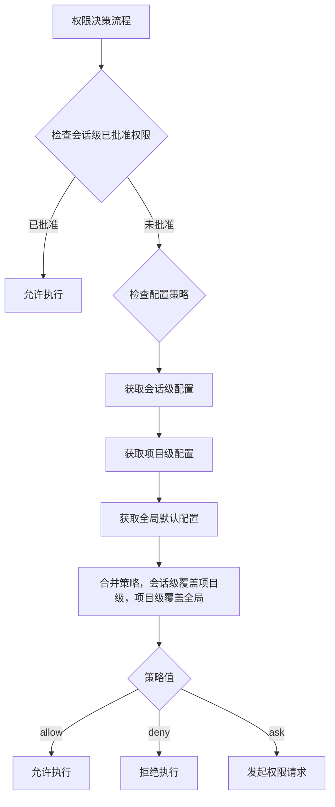
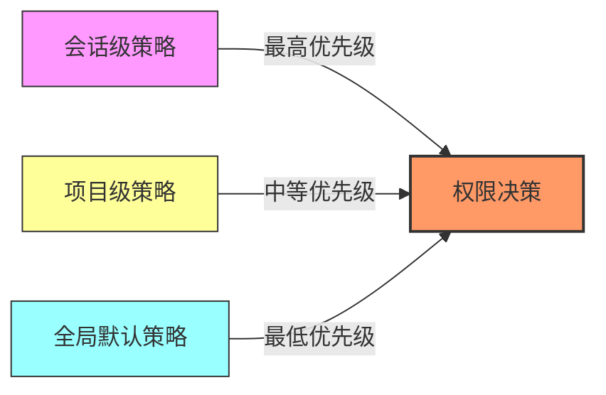
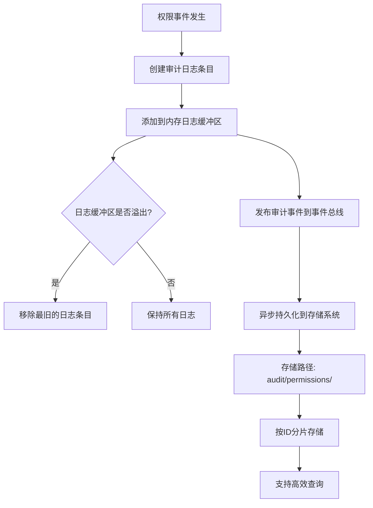
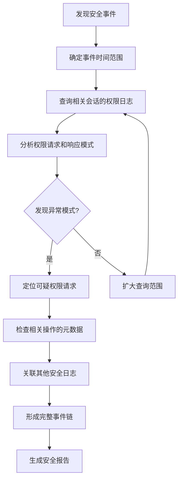

# 权限配置管理

<cite>
**本文档中引用的文件**
- [index.ts](file://packages/opencode/src/permission/index.ts)
- [config.ts](file://packages/opencode/src/config/config.ts)
- [markdown.ts](file://packages/opencode/src/config/markdown.ts)
- [05-permission-control.md](file://doc-agent-context/05-permission-control.md)
</cite>

## 目录
1. [简介](#简介)
2. [权限注册与验证机制](#权限注册与验证机制)
3. [权限策略配置](#权限策略配置)
4. [权限策略层级结构](#权限策略层级结构)
5. [权限审计日志](#权限审计日志)
6. [安全事件追溯](#安全事件追溯)

## 简介
本文档详细描述了 `packages/opencode/src/permission/index.ts` 中实现的权限注册、验证和审计机制。通过 `config.ts` 文件配置，系统能够有效限制 MCP 工具的执行权限，防止恶意命令注入攻击。文档阐述了权限策略的加载、解析和热更新机制，说明了全局默认策略、项目级策略和会话级策略的优先级关系，并介绍了权限审计日志的格式、存储位置和分析方法。

**Section sources**
- [index.ts](file://packages/opencode/src/permission/index.ts#L1-L182)
- [config.ts](file://packages/opencode/src/config/config.ts#L1-L727)

## 权限注册与验证机制

### 权限请求流程
权限系统通过 `ask` 函数实现权限请求机制。当需要执行受保护操作时，系统会创建权限请求并等待用户响应。如果权限已被批准，则直接通过；否则，将请求发布到事件总线等待响应。



**Diagram sources**
- [index.ts](file://packages/opencode/src/permission/index.ts#L75-L120)

### 权限响应处理
用户通过 `respond` 函数对权限请求进行响应，支持三种响应类型：`once`（仅本次允许）、`always`（始终允许）和 `reject`（拒绝）。系统根据响应类型更新权限状态并通知等待中的操作。



**Diagram sources**
- [index.ts](file://packages/opencode/src/permission/index.ts#L122-L168)

**Section sources**
- [index.ts](file://packages/opencode/src/permission/index.ts#L75-L168)

## 权限策略配置

### MCP工具权限限制配置
通过 `config.ts` 文件中的 `permission` 字段，可以配置不同工具的默认权限策略。支持 `edit`、`bash` 和 `webfetch` 三种工具类型，每种类型可设置为 `ask`、`allow` 或 `deny`。



**Diagram sources**
- [config.ts](file://packages/opencode/src/config/config.ts#L140-L158)

### 完整配置示例
以下是一个完整的权限配置示例，展示了如何通过 `config.json` 文件限制 MCP 工具的执行权限：

```json
{
  "$schema": "https://opencode.ai/config.json",
  "permission": {
    "edit": "ask",
    "bash": {
      "ls": "allow",
      "cat": "allow",
      "grep": "ask",
      "*": "deny"
    },
    "webfetch": "ask"
  },
  "agent": {
    "development": {
      "permission": {
        "bash": "allow"
      }
    }
  },
  "mcp": {
    "local-server": {
      "type": "local",
      "command": ["python", "mcp_server.py"],
      "enabled": true
    }
  }
}
```

此配置实现了以下安全策略：
- 全局默认策略：编辑文件需要询问，网络获取需要询问
- Bash 命令精细化控制：`ls` 和 `cat` 命令自动允许，`grep` 命令需要询问，其他所有命令默认拒绝
- 特定代理（development）拥有更高的 Bash 权限，可以无限制执行
- MCP 本地服务器配置启用并指定启动命令

**Section sources**
- [config.ts](file://packages/opencode/src/config/config.ts#L130-L210)

## 权限策略层级结构

### 多层级权限策略体系
系统实现了三层权限策略体系，按照优先级从高到低依次为：会话级策略、项目级策略和全局默认策略。这种分层设计提供了灵活的权限管理能力。



**Diagram sources**
- [index.ts](file://packages/opencode/src/permission/index.ts#L30-L40)
- [config.ts](file://packages/opencode/src/config/config.ts#L80-L110)

### 策略优先级关系
权限策略的优先级遵循以下规则：

1. **会话级策略**：通过用户交互产生的权限决策，具有最高优先级。当用户选择"始终允许"时，该决策会被记录在内存状态中。
2. **项目级策略**：在项目根目录的配置文件中定义的策略，优先级次之。适用于特定项目的权限需求。
3. **全局默认策略**：在用户主目录配置中定义的策略，优先级最低。作为所有项目的默认安全基线。

策略合并时采用覆盖机制，高优先级策略会覆盖低优先级策略中的相同配置项。这种设计既保证了安全性，又提供了足够的灵活性。



**Diagram sources**
- [index.ts](file://packages/opencode/src/permission/index.ts#L10-L25)
- [config.ts](file://packages/opencode/src/config/config.ts#L50-L70)

**Section sources**
- [index.ts](file://packages/opencode/src/permission/index.ts#L1-L182)
- [config.ts](file://packages/opencode/src/config/config.ts#L1-L727)

## 权限审计日志

### 审计日志格式
权限审计日志记录了所有权限相关操作的详细信息，包括权限请求、审批和执行等事件。日志条目包含以下字段：

| 字段名 | 类型 | 描述 |
|--------|------|------|
| id | string | 审计日志唯一标识符 |
| timestamp | number | 事件发生的时间戳（毫秒） |
| sessionID | string | 关联的会话ID |
| permissionID | string | 权限请求的唯一标识符 |
| type | string | 权限类型（如 edit, bash, webfetch） |
| pattern | string \| string[] | 权限模式匹配规则 |
| action | string | 操作类型（requested, approved, rejected, executed） |
| userID | string | 执行操作的用户ID |
| metadata | Record<string, any> | 附加的元数据信息 |
| result | string | 操作结果（success, failure） |

**Section sources**
- [05-permission-control.md](file://doc-agent-context/05-permission-control.md#L276-L363)

### 日志存储与管理
审计日志采用内存存储与持久化存储相结合的方式：



系统维护一个固定大小的内存日志缓冲区（默认10000条），当缓冲区满时自动移除最旧的条目。同时，所有日志条目都会异步持久化到存储系统中，确保数据不会丢失。

**Diagram sources**
- [05-permission-control.md](file://doc-agent-context/05-permission-control.md#L276-L363)

**Section sources**
- [05-permission-control.md](file://doc-agent-context/05-permission-control.md#L276-L363)

## 安全事件追溯

### 日志查询与分析
系统提供了灵活的日志查询接口，支持多种过滤条件组合，便于安全事件的追溯和分析：

```typescript
interface AuditLogFilters {
  sessionID?: string
  type?: string
  startTime?: number
  endTime?: number
  userID?: string
}

async function getAuditLog(filters: AuditLogFilters): Promise<AuditLogEntry[]> {
  // 实现日志过滤和排序逻辑
  // 按时间倒序返回结果
}
```

通过组合不同的过滤条件，可以实现以下安全分析场景：
- **会话级审计**：通过 `sessionID` 过滤，查看特定会话的所有权限操作
- **工具使用分析**：通过 `type` 过滤，分析特定工具（如 bash）的使用模式
- **时间范围分析**：通过 `startTime` 和 `endTime` 过滤，分析特定时间段的安全事件
- **用户行为分析**：通过 `userID` 过滤，追踪特定用户的所有权限操作

### 安全事件追溯流程
当发生安全事件时，可以按照以下流程进行追溯：



通过权限审计日志，可以完整追溯从权限请求到执行的整个过程，识别潜在的安全威胁和异常行为模式，为安全防护提供有力支持。

**Section sources**
- [05-permission-control.md](file://doc-agent-context/05-permission-control.md#L276-L363)