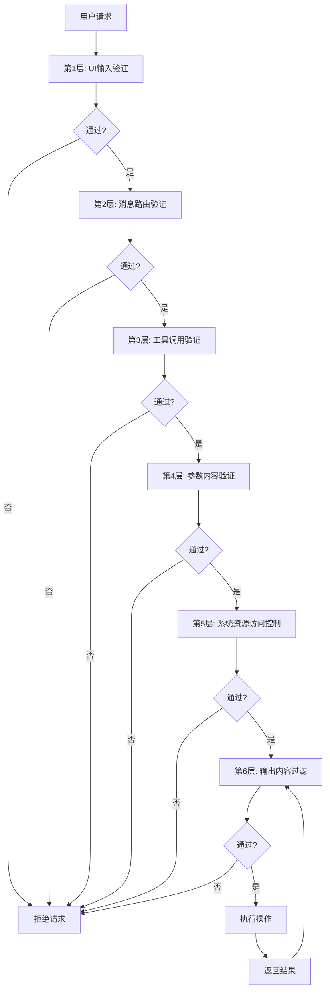
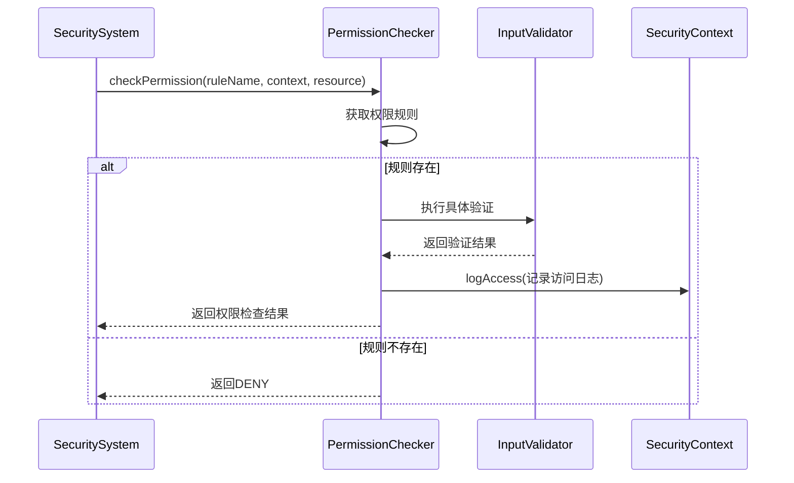
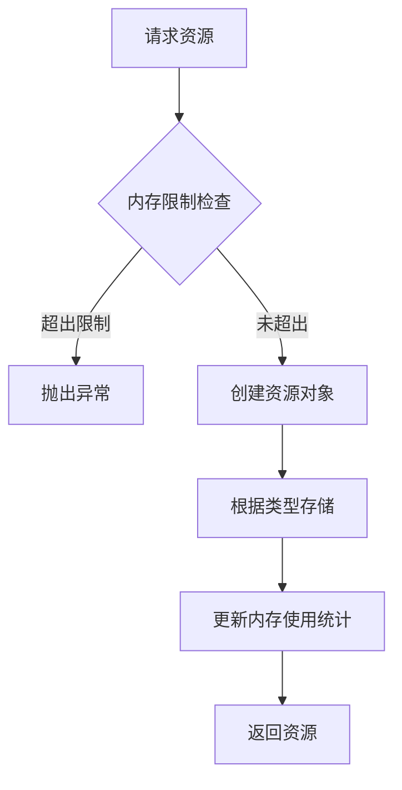
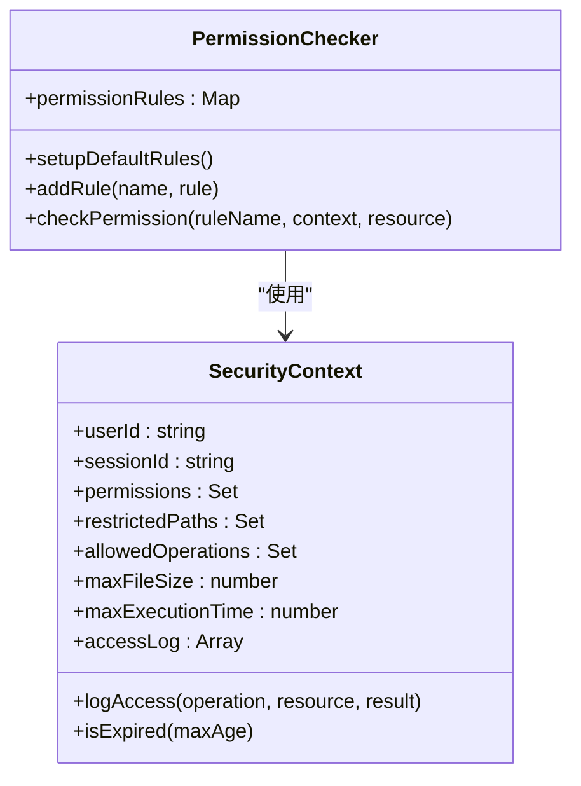
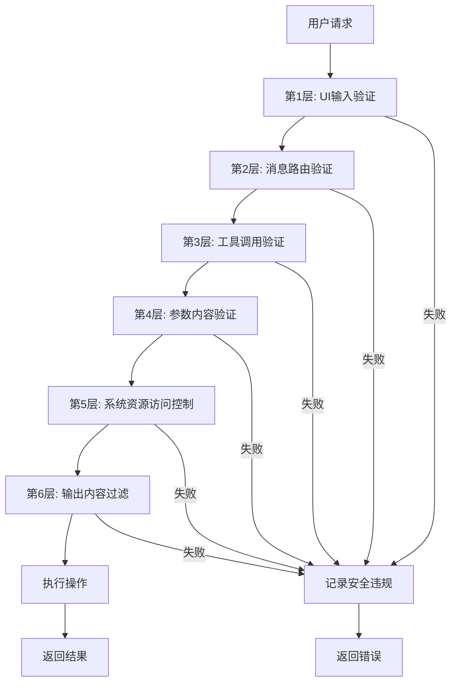
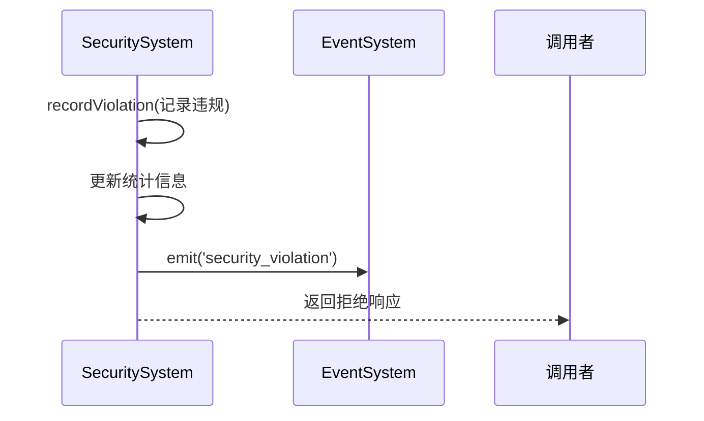
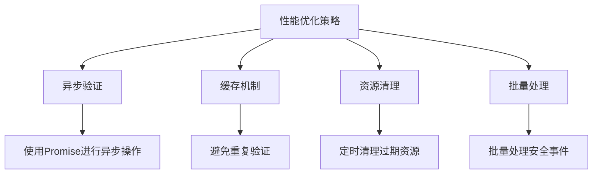

# 权限验证机制

<cite>
**本文档引用的文件**
- [SecuritySystem.js](file://context-claude-code/src/security/SecuritySystem.js)
</cite>

## 目录
1. [引言](#引言)
2. [六层安全验证体系](#六层安全验证体系)
3. [第3层：工具调用验证](#第3层工具调用验证)
4. [第5层：系统资源访问控制](#第5层系统资源访问控制)
5. [权限检查器实现](#权限检查器实现)
6. [权限验证流程](#权限验证流程)
7. [权限验证失败处理](#权限验证失败处理)
8. [性能分析与优化](#性能分析与优化)
9. [结论](#结论)

## 引言
本文档深入解析`SecuritySystem.js`中实现的六层安全验证体系，重点阐述第3层工具调用验证和第5层系统资源访问控制的技术细节。详细说明`PermissionChecker`如何根据操作类型（READ/WRITE/EXECUTE/NETWORK）执行细粒度权限检查，包括权限令牌的生成、传递和验证流程。分析权限验证的性能开销及优化策略，如缓存机制和异步验证。提供实际代码示例，展示在文件读写、网络请求和命令执行场景下的权限验证过程。描述权限验证失败时的处理机制和安全审计日志记录。

**Section sources**
- [SecuritySystem.js](file://context-claude-code/src/security/SecuritySystem.js#L0-L850)

## 六层安全验证体系
`SecuritySystem.js`实现了一个六层安全验证体系，每层负责不同的安全检查：

1. **UI输入验证**：验证输入格式和基本参数
2. **消息路由验证**：检查会话状态和操作权限
3. **工具调用验证**：执行细粒度权限检查
4. **参数内容验证**：验证参数大小和内容
5. **系统资源访问控制**：管理资源分配和使用
6. **输出内容过滤**：过滤敏感信息和恶意内容



**Diagram sources**
- [SecuritySystem.js](file://context-claude-code/src/security/SecuritySystem.js#L583-L652)

**Section sources**
- [SecuritySystem.js](file://context-claude-code/src/security/SecuritySystem.js#L0-L850)

## 第3层：工具调用验证
第3层工具调用验证是权限检查的核心，通过`PermissionChecker`类实现细粒度的权限控制。

### 权限类型
系统定义了三种权限类型：
- **ALLOW**：允许操作
- **DENY**：拒绝操作
- **ASK**：需要用户确认

### 操作类型
支持以下操作类型：
- **READ**：读取操作
- **WRITE**：写入操作
- **EXECUTE**：执行操作
- **DELETE**：删除操作
- **NETWORK**：网络操作
- **SYSTEM**：系统操作

### 验证流程


**Diagram sources**
- [SecuritySystem.js](file://context-claude-code/src/security/SecuritySystem.js#L690-L704)
- [SecuritySystem.js](file://context-claude-code/src/security/SecuritySystem.js#L368-L387)

**Section sources**
- [SecuritySystem.js](file://context-claude-code/src/security/SecuritySystem.js#L690-L704)

## 第5层：系统资源访问控制
第5层系统资源访问控制负责管理系统的资源使用，防止资源耗尽和滥用。

### 资源控制器
`ResourceAccessController`类负责管理：
- **活动连接**：跟踪所有活动的网络连接
- **文件句柄**：管理打开的文件
- **内存使用**：监控内存消耗

### 资源分配


### 资源清理
系统每分钟自动清理过期资源（5分钟未访问的资源），防止资源泄漏。

**Section sources**
- [SecuritySystem.js](file://context-claude-code/src/security/SecuritySystem.js#L725-L747)
- [SecuritySystem.js](file://context-claude-code/src/security/SecuritySystem.js#L404-L431)

## 权限检查器实现
`PermissionChecker`类是权限验证的核心组件，负责执行具体的权限检查。

### 默认权限规则
系统预定义了以下权限规则：
- **文件读取**：验证文件路径安全性
- **文件写入**：验证文件路径安全性
- **命令执行**：验证命令安全性
- **网络访问**：验证URL安全性

### 权限检查方法


**Diagram sources**
- [SecuritySystem.js](file://context-claude-code/src/security/SecuritySystem.js#L311-L388)
- [SecuritySystem.js](file://context-claude-code/src/security/SecuritySystem.js#L97-L141)

**Section sources**
- [SecuritySystem.js](file://context-claude-code/src/security/SecuritySystem.js#L311-L388)

## 权限验证流程
权限验证流程从用户请求开始，经过六层验证，最终决定是否允许操作。

### 完整验证流程


### 权限令牌流程
权限验证过程中，权限令牌通过`SecurityContext`传递，包含：
- 用户ID和会话ID
- 权限列表
- 受限路径
- 允许的操作类型
- 最大文件大小
- 访问日志

**Section sources**
- [SecuritySystem.js](file://context-claude-code/src/security/SecuritySystem.js#L583-L652)

## 权限验证失败处理
当权限验证失败时，系统会执行一系列安全措施。

### 失败处理流程


### 安全审计日志
系统会记录所有权限检查结果，包括：
- 操作类型
- 资源标识
- 检查结果
- 时间戳

日志会自动截断，只保留最近500条记录。

**Section sources**
- [SecuritySystem.js](file://context-claude-code/src/security/SecuritySystem.js#L775-L794)

## 性能分析与优化
系统在设计时考虑了性能优化，确保安全验证不会成为性能瓶颈。

### 性能监控
系统维护以下统计信息：
- 总检查次数
- 被阻止的请求
- 允许的请求
- 各层违规次数
- 平均检查时间

### 优化策略


### 平均检查时间计算
系统使用指数加权移动平均（EWMA）算法计算平均检查时间：
```
平均检查时间 = (旧平均 × 0.9) + (新时间 × 0.1)
```

**Section sources**
- [SecuritySystem.js](file://context-claude-code/src/security/SecuritySystem.js#L800-L805)

## 结论
`SecuritySystem.js`实现了一个全面的六层安全验证体系，有效保护系统免受各种安全威胁。第3层工具调用验证和第5层系统资源访问控制提供了细粒度的权限管理和资源控制。`PermissionChecker`通过预定义的规则和灵活的扩展机制，实现了高效的权限检查。系统还包含了完善的性能监控和优化策略，确保安全验证不会影响系统性能。权限验证失败时的处理机制和安全审计日志为系统安全提供了额外的保障。