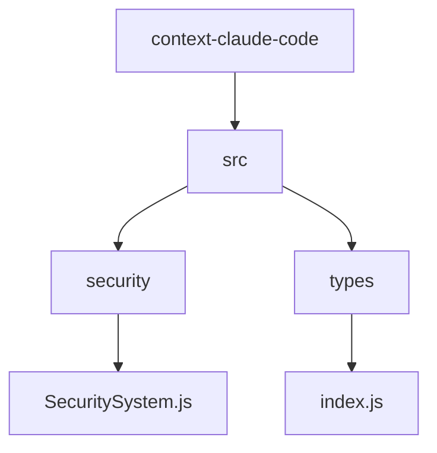
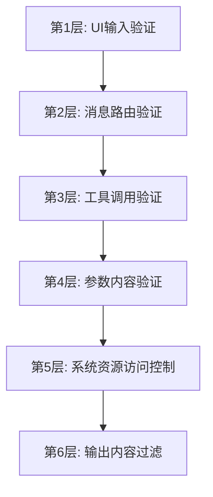
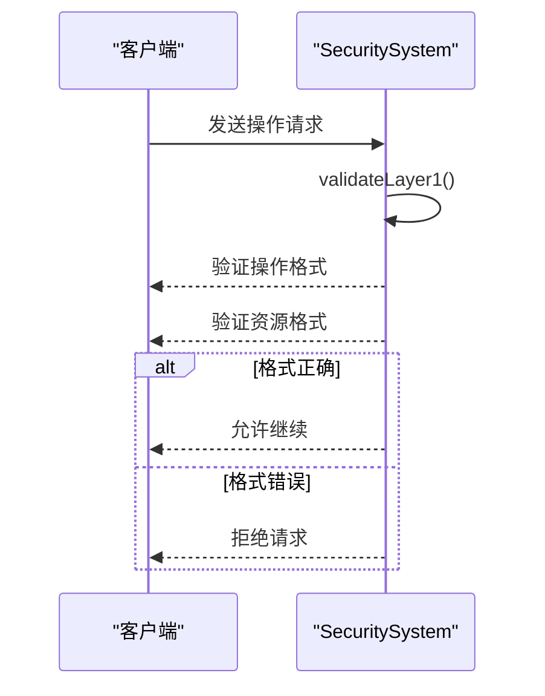
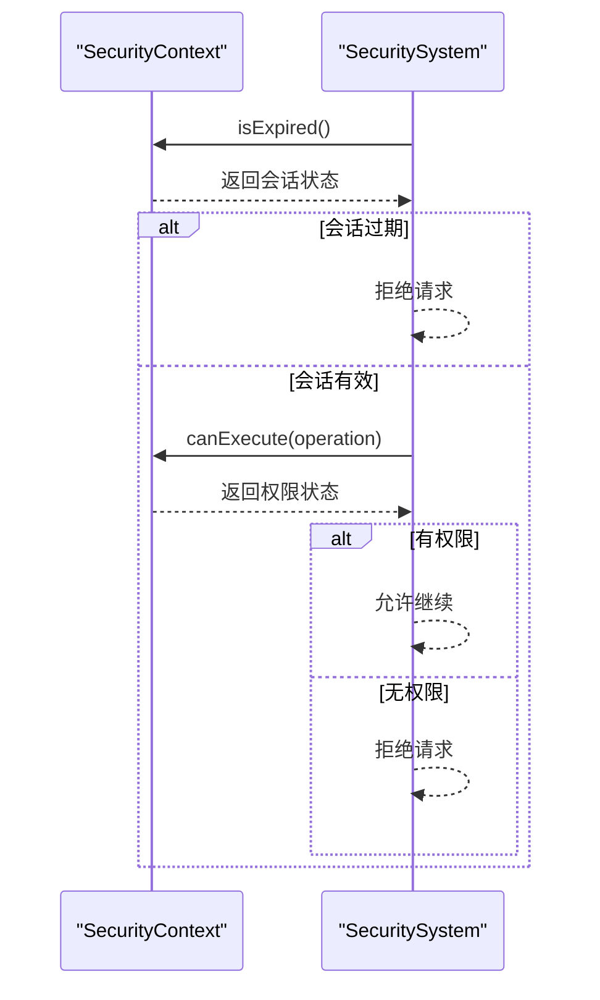
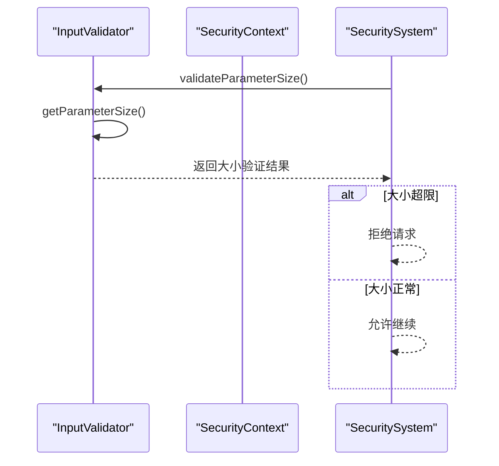
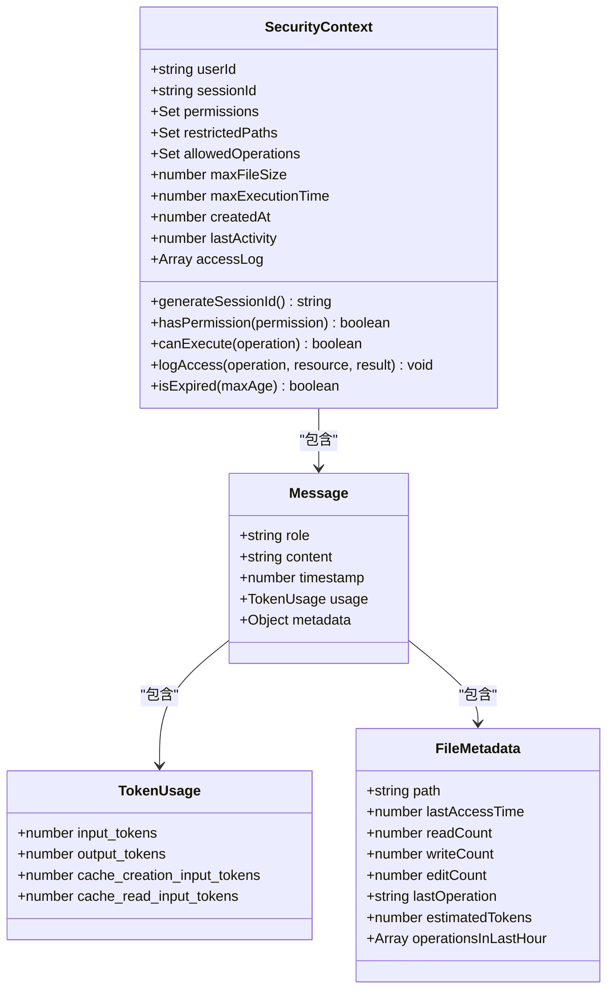
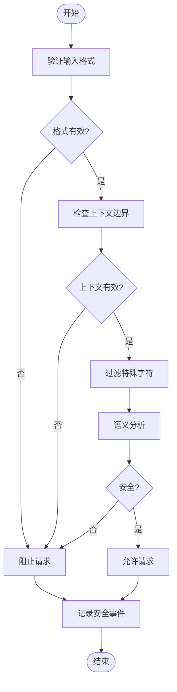
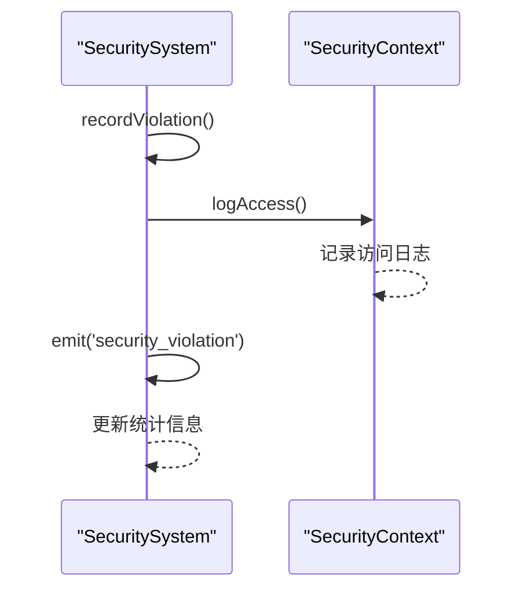

<cite>
**Referenced Files in This Document**   
- [SecuritySystem.js](file://context-claude-code/src/security/SecuritySystem.js)
- [index.js](file://context-claude-code/src/types/index.js)
</cite>

# 输入验证

## Table of Contents
1. [项目结构](#项目结构)
2. [核心组件](#核心组件)
3. [六层安全架构](#六层安全架构)
4. [安全验证与数据契约](#安全验证与数据契约)
5. [AI提示注入攻击防护](#ai提示注入攻击防护)
6. [安全事件日志](#安全事件日志)

## 项目结构

**Diagram sources**
- [SecuritySystem.js](file://context-claude-code/src/security/SecuritySystem.js)
- [index.js](file://context-claude-code/src/types/index.js)

**Section sources**
- [SecuritySystem.js](file://context-claude-code/src/security/SecuritySystem.js)
- [index.js](file://context-claude-code/src/types/index.js)

## 核心组件

**Section sources**
- [SecuritySystem.js](file://context-claude-code/src/security/SecuritySystem.js#L558-L848)
- [SecuritySystem.js](file://context-claude-code/src/security/SecuritySystem.js#L146-L306)
- [SecuritySystem.js](file://context-claude-code/src/security/SecuritySystem.js#L97-L141)
- [SecuritySystem.js](file://context-claude-code/src/security/SecuritySystem.js#L311-L388)

## 六层安全架构

**Diagram sources**
- [SecuritySystem.js](file://context-claude-code/src/security/SecuritySystem.js#L570-L620)

### 第1层：UI输入验证

第1层UI输入验证确保操作和资源参数的基本格式正确性。该层验证主要检查输入数据的类型和基本格式，防止格式错误的请求进入系统。

**Diagram sources**
- [SecuritySystem.js](file://context-claude-code/src/security/SecuritySystem.js#L625-L635)

### 第2层：消息路由验证

第2层消息路由验证检查会话状态和执行权限。该层确保用户会话有效且具有执行特定操作的权限。

**Diagram sources**
- [SecuritySystem.js](file://context-claude-code/src/security/SecuritySystem.js#L637-L647)

### 第4层：参数内容验证

第4层参数内容验证通过InputValidator限制参数大小以防范资源耗尽攻击。该层验证确保参数大小在安全范围内，防止大参数导致系统资源耗尽。

**Diagram sources**
- [SecuritySystem.js](file://context-claude-code/src/security/SecuritySystem.js#L675-L685)

## 安全验证与数据契约

结合context-claude-code/src/types/index.js中的类型定义，安全验证与数据契约之间存在紧密关系。类型定义为安全验证提供了数据契约的基础，确保了数据的一致性和完整性。

**Diagram sources**
- [SecuritySystem.js](file://context-claude-code/src/security/SecuritySystem.js#L97-L141)
- [index.js](file://context-claude-code/src/types/index.js#L50-L145)

**Section sources**
- [SecuritySystem.js](file://context-claude-code/src/security/SecuritySystem.js#L97-L141)
- [index.js](file://context-claude-code/src/types/index.js#L50-L145)

## AI提示注入攻击防护

### 上下文边界检测

系统通过严格的上下文边界检测来防止AI提示注入攻击。每个请求都在独立的安全上下文中处理，确保上下文隔离。

### 特殊字符过滤

系统实现特殊字符过滤机制，识别并处理潜在的恶意字符序列，防止注入攻击。

### 语义分析

通过语义分析技术，系统能够识别异常的请求模式和潜在的提示注入尝试。

**Diagram sources**
- [SecuritySystem.js](file://context-claude-code/src/security/SecuritySystem.js#L558-L848)

## 安全事件日志

系统记录详细的安全事件日志，包括验证失败、权限拒绝和资源清理等事件。

**Diagram sources**
- [SecuritySystem.js](file://context-claude-code/src/security/SecuritySystem.js#L750-L770)
- [SecuritySystem.js](file://context-claude-code/src/security/SecuritySystem.js#L130-L140)

**Section sources**
- [SecuritySystem.js](file://context-claude-code/src/security/SecuritySystem.js#L750-L770)
- [SecuritySystem.js](file://context-claude-code/src/security/SecuritySystem.js#L130-L140)