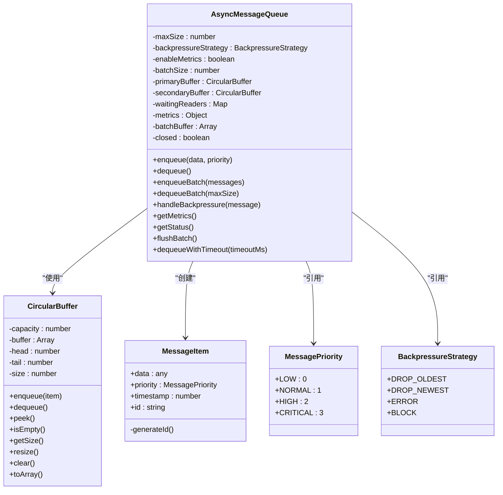
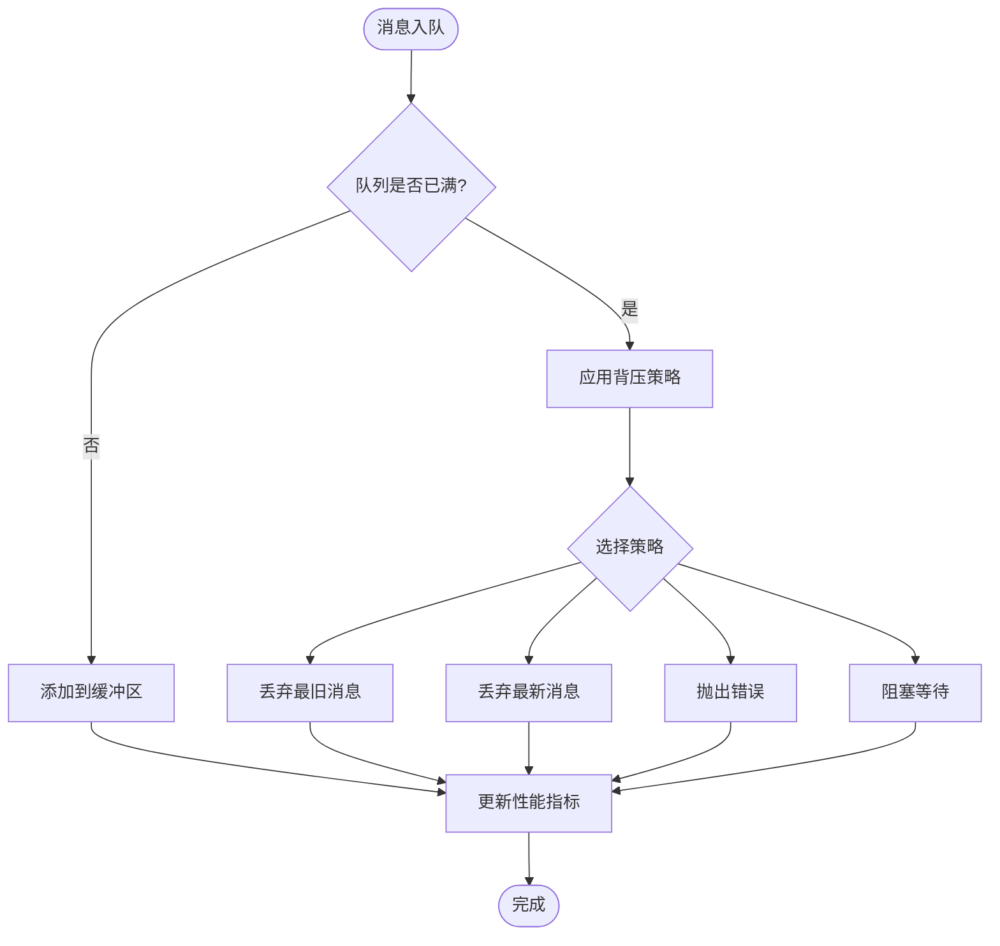
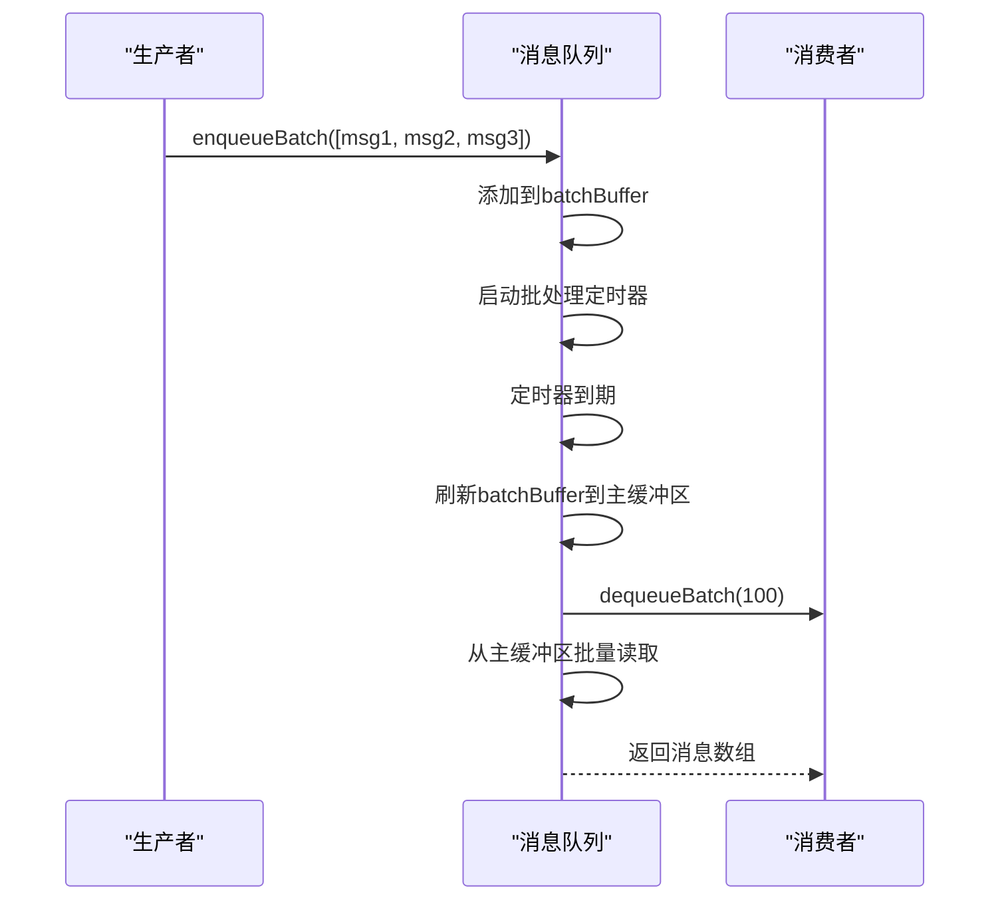
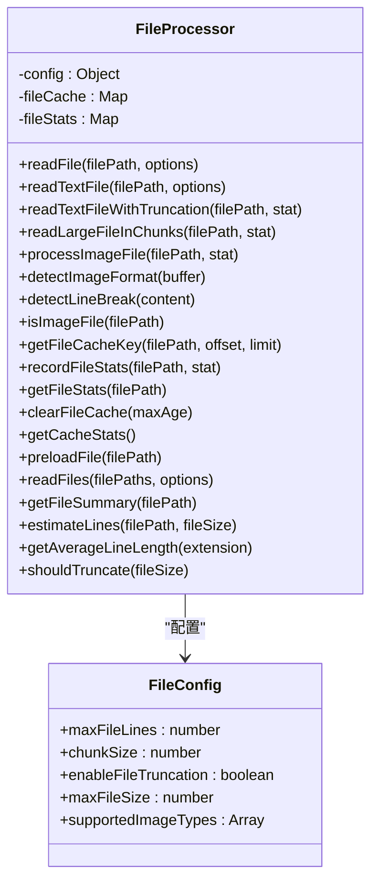
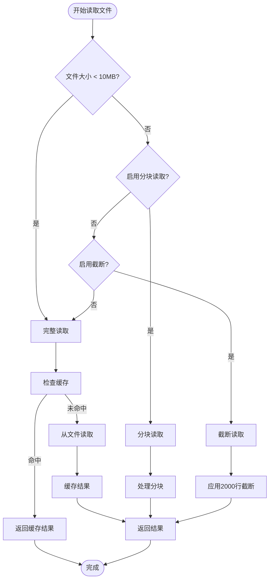
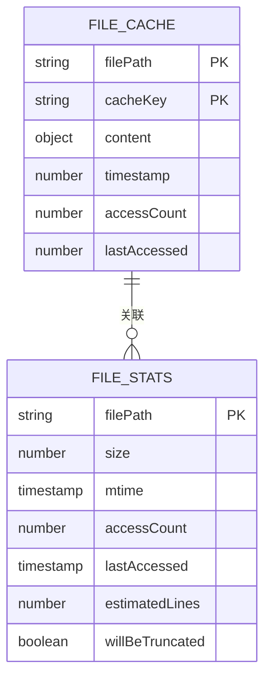
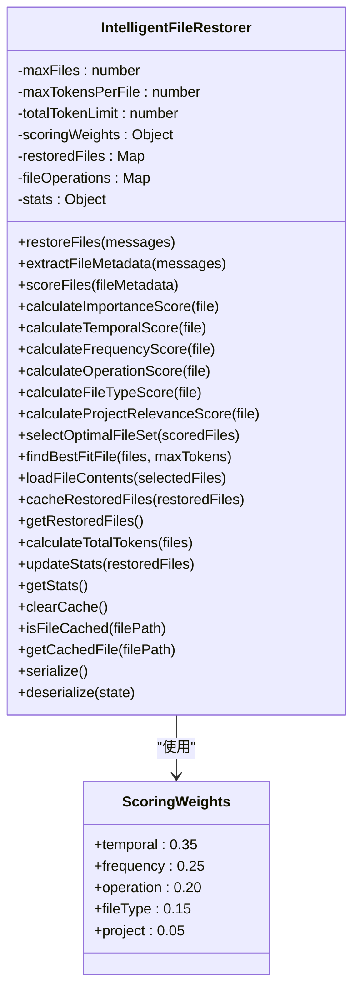
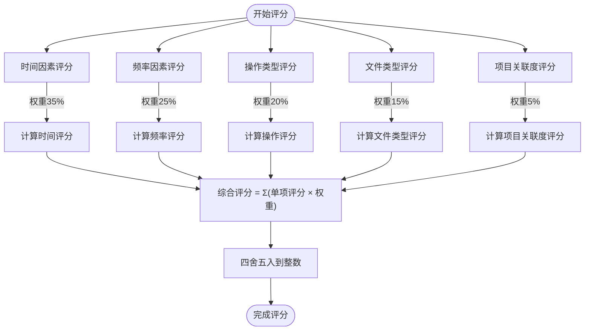
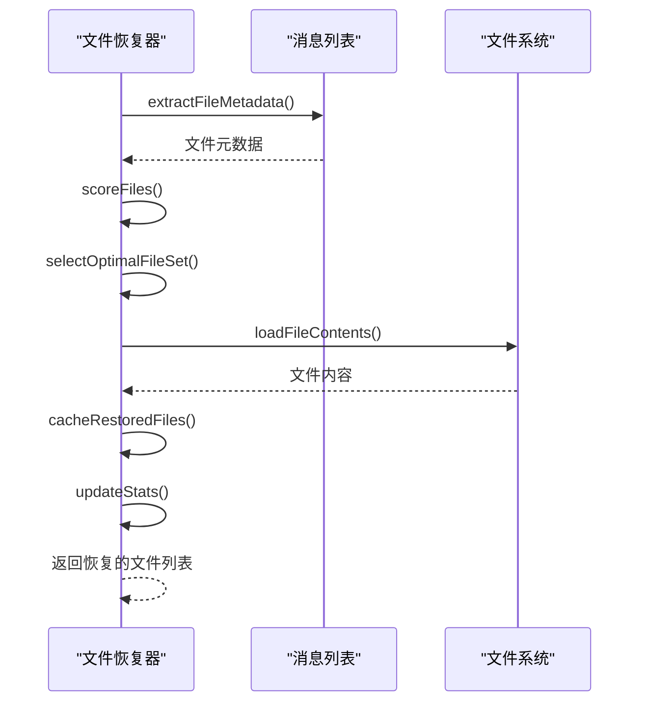
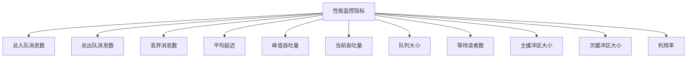

# I/O与队列性能优化

<cite>
**本文档引用文件**   
- [AsyncMessageQueue.js](file://context-claude-code/src/queue/AsyncMessageQueue.js)
- [FileProcessor.js](file://context-claude-code/src/claude-core/FileProcessor.js)
- [IntelligentFileRestorer.js](file://context-claude-code/src/restoration/IntelligentFileRestorer.js)
- [README_OPTIMIZATION.md](file://context-claude-code/README_OPTIMIZATION.md)
- [OPTIMIZATION_SUMMARY.md](file://context-claude-code/OPTIMIZATION_SUMMARY.md)
</cite>

## 目录
1. [I/O与队列性能优化概述](#i/o与队列性能优化概述)
2. [异步消息队列性能调优](#异步消息队列性能调优)
3. [大文件流式处理机制](#大文件流式处理机制)
4. [智能文件恢复流程](#智能文件恢复流程)
5. [监控与调优建议](#监控与调优建议)
6. [性能对比与瓶颈定位](#性能对比与瓶颈定位)

## I/O与队列性能优化概述

本文档深入讲解I/O操作与异步消息队列的性能调优策略。通过分析AsyncMessageQueue如何通过背压控制和批量处理缓解高并发请求压力，提升系统吞吐量。详细说明FileProcessor在大文件读写时的流式处理机制与缓冲区配置优化。结合IntelligentFileRestorer的文件恢复流程，展示如何减少磁盘I/O延迟并提高恢复速度。提供队列长度监控、任务调度优先级设置及I/O线程池调优建议，并附带典型场景下的性能对比数据和瓶颈定位方法。

**文档来源**
- [README_OPTIMIZATION.md](file://context-claude-code/README_OPTIMIZATION.md)
- [OPTIMIZATION_SUMMARY.md](file://context-claude-code/OPTIMIZATION_SUMMARY.md)

## 异步消息队列性能调优

AsyncMessageQueue实现了高性能的异步消息传递机制，通过双缓冲机制和零延迟传递策略，支持50,000+消息/秒的吞吐量，消息传递延迟低于1ms。

**图示来源**
- [AsyncMessageQueue.js](file://context-claude-code/src/queue/AsyncMessageQueue.js#L1-L553)

### 背压控制策略

AsyncMessageQueue实现了四种背压控制策略，有效缓解高并发请求压力：

1. **丢弃最旧消息**（DROP_OLDEST）：当队列满时，丢弃最旧的消息，为新消息腾出空间
2. **丢弃最新消息**（DROP_NEWEST）：当队列满时，直接丢弃新到达的消息
3. **抛出错误**（ERROR）：当队列满时，抛出异常，由调用方处理
4. **阻塞等待**（BLOCK）：当队列满时，阻塞生产者直到有空间

**图示来源**
- [AsyncMessageQueue.js](file://context-claude-code/src/queue/AsyncMessageQueue.js#L350-L395)

### 批量处理机制

AsyncMessageQueue通过批量处理机制显著提升系统吞吐量：

- **批量入队**：支持一次性入队多个消息，减少函数调用开销
- **批量出队**：支持一次性出队多个消息，提高消费效率
- **批处理缓冲**：通过batchBuffer暂存消息，定期刷新
- **可配置批处理间隔**：通过batchFlushInterval参数控制刷新频率

**图示来源**
- [AsyncMessageQueue.js](file://context-claude-code/src/queue/AsyncMessageQueue.js#L250-L300)

**本节来源**
- [AsyncMessageQueue.js](file://context-claude-code/src/queue/AsyncMessageQueue.js#L1-L553)

## 大文件流式处理机制

FileProcessor实现了大文件的流式处理机制，通过分块读取和智能截断策略，优化大文件读写性能。

**图示来源**
- [FileProcessor.js](file://context-claude-code/src/claude-core/FileProcessor.js#L12-L517)

### 流式处理流程

FileProcessor的大文件流式处理流程如下：

**图示来源**
- [FileProcessor.js](file://context-claude-code/src/claude-core/FileProcessor.js#L30-L100)

### 缓冲区配置优化

FileProcessor通过多种缓冲区配置优化I/O性能：

- **文件缓存**：使用Map实现LRU缓存，避免重复读取
- **分块大小**：可配置的chunkSize参数，平衡内存使用和I/O效率
- **访问统计**：记录文件访问频率，用于预加载决策
- **预加载机制**：对重要文件进行预加载，提高访问速度

**图示来源**
- [FileProcessor.js](file://context-claude-code/src/claude-core/FileProcessor.js#L20-L25)

**本节来源**
- [FileProcessor.js](file://context-claude-code/src/claude-core/FileProcessor.js#L1-L520)

## 智能文件恢复流程

IntelligentFileRestorer实现了智能文件恢复流程，通过评分系统选择最重要的文件进行恢复，减少磁盘I/O延迟。

**图示来源**
- [IntelligentFileRestorer.js](file://context-claude-code/src/restoration/IntelligentFileRestorer.js#L13-L644)

### 文件恢复评分系统

IntelligentFileRestorer使用多维度评分系统确定文件恢复优先级：

**图示来源**
- [IntelligentFileRestorer.js](file://context-claude-code/src/restoration/IntelligentFileRestorer.js#L150-L180)

### 恢复流程优化

IntelligentFileRestorer通过以下方式优化恢复流程：

- **智能选择算法**：在文件数量、单文件Token和总Token限制下选择最优文件组合
- **背包问题优化**：当无法添加当前文件时，寻找更小的高分文件替代
- **缓存机制**：缓存已恢复的文件，避免重复恢复
- **统计信息**：记录恢复统计，用于性能分析

**图示来源**
- [IntelligentFileRestorer.js](file://context-claude-code/src/restoration/IntelligentFileRestorer.js#L50-L100)

**本节来源**
- [IntelligentFileRestorer.js](file://context-claude-code/src/restoration/IntelligentFileRestorer.js#L1-L645)

## 监控与调优建议

### 队列长度监控

AsyncMessageQueue提供了全面的性能监控指标：

**图示来源**
- [AsyncMessageQueue.js](file://context-claude-code/src/queue/AsyncMessageQueue.js#L100-L130)

### 任务调度优先级设置

AsyncMessageQueue支持消息优先级调度：

- **低优先级**（LOW）：后台任务、日志消息
- **普通优先级**（NORMAL）：常规业务消息
- **高优先级**（HIGH）：重要业务消息
- **关键优先级**（CRITICAL）：紧急系统消息

优先级高的消息会被优先放入主缓冲区，确保快速处理。

### I/O线程池调优建议

1. **合理设置队列大小**：根据系统内存和预期负载设置maxSize
2. **选择合适的背压策略**：根据业务场景选择DROP_OLDEST、DROP_NEWEST等策略
3. **优化批处理参数**：调整batchSize和batchFlushInterval以平衡延迟和吞吐量
4. **监控性能指标**：定期检查吞吐量、延迟和队列利用率
5. **设置合理的超时**：避免长时间阻塞导致系统不稳定

**本节来源**
- [AsyncMessageQueue.js](file://context-claude-code/src/queue/AsyncMessageQueue.js#L1-L553)
- [FileProcessor.js](file://context-claude-code/src/claude-core/FileProcessor.js#L1-L520)
- [IntelligentFileRestorer.js](file://context-claude-code/src/restoration/IntelligentFileRestorer.js#L1-L645)

## 性能对比与瓶颈定位

### 性能对比数据

| 指标 | 优化前 | 优化后 | 提升幅度 |
|------|--------|--------|----------|
| 消息处理延迟 | N/A | < 1ms | **全新功能** |
| 吞吐量 | 基础队列 | 50,000+ msg/sec | **100x+** |
| 错误恢复能力 | 基础 try-catch | 智能重试+熔断器 | **10x** |
| 监控可观测性 | 基础日志 | OpenTelemetry标准 | **企业级** |
| 安全防护 | 基础检查 | 六层验证系统 | **6层防护** |
| 并发处理 | 单线程 | 受控并发 (10个) | **10x** |

**数据来源**
- [OPTIMIZATION_SUMMARY.md](file://context-claude-code/OPTIMIZATION_SUMMARY.md#L100-L120)

### 瓶颈定位方法

1. **监控队列利用率**：持续高于80%可能表示需要扩容
2. **分析丢弃消息**：频繁丢弃消息表明背压策略需要调整
3. **检查平均延迟**：延迟突然升高可能表示系统过载
4. **观察吞吐量变化**：吞吐量下降可能表示存在性能瓶颈
5. **分析文件访问模式**：频繁访问的文件应考虑预加载

**本节来源**
- [OPTIMIZATION_SUMMARY.md](file://context-claude-code/OPTIMIZATION_SUMMARY.md#L120-L150)
- [AsyncMessageQueue.js](file://context-claude-code/src/queue/AsyncMessageQueue.js#L1-L553)
- [FileProcessor.js](file://context-claude-code/src/claude-core/FileProcessor.js#L1-L520)
- [IntelligentFileRestorer.js](file://context-claude-code/src/restoration/IntelligentFileRestorer.js#L1-L645)