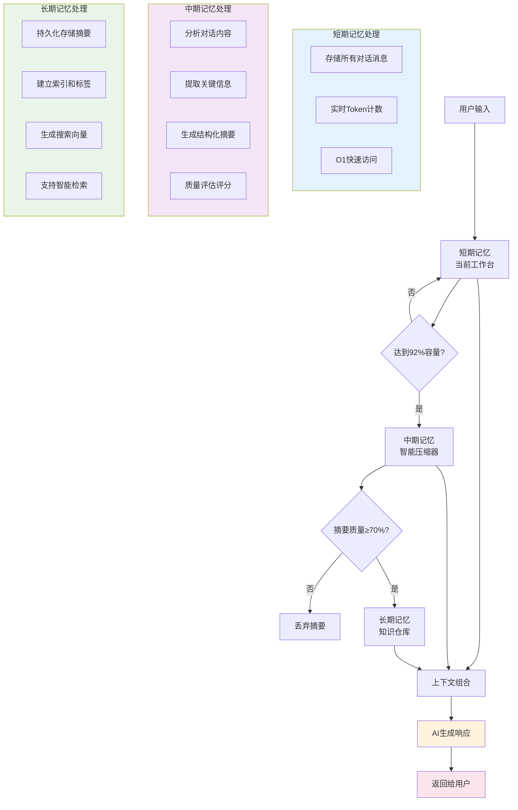
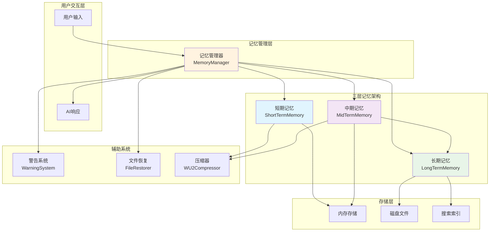
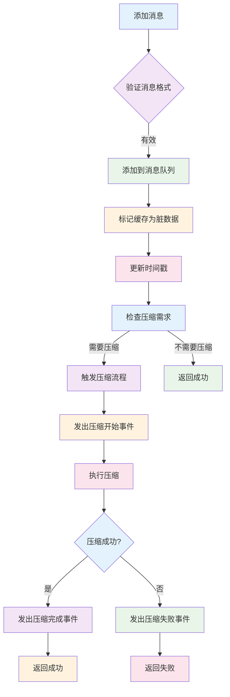
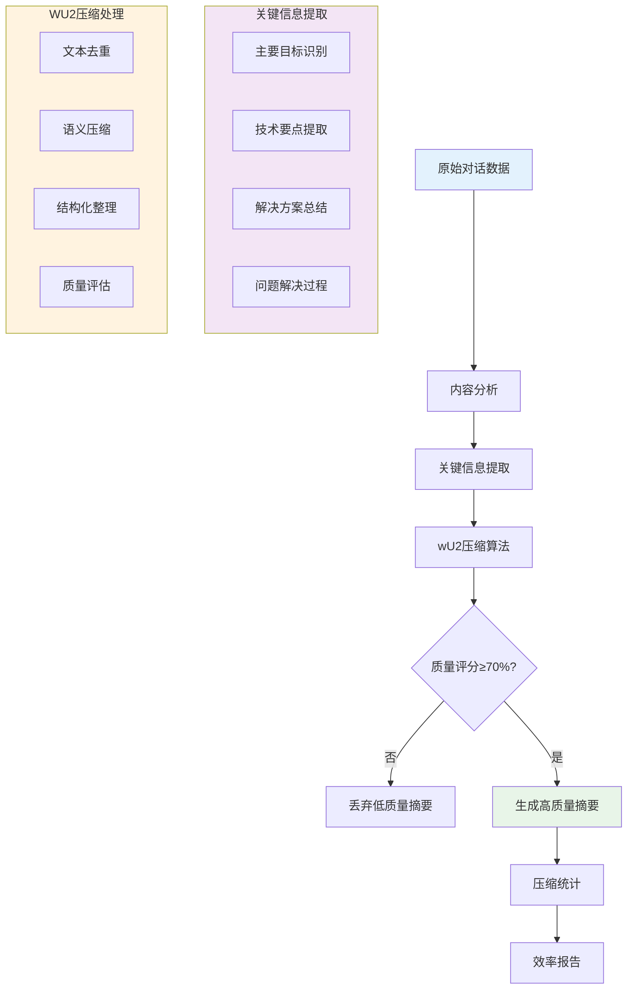
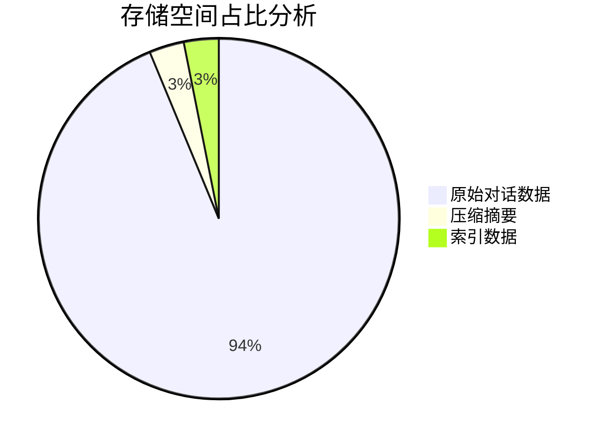
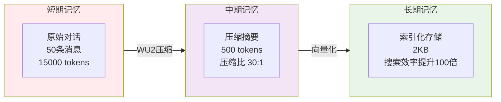
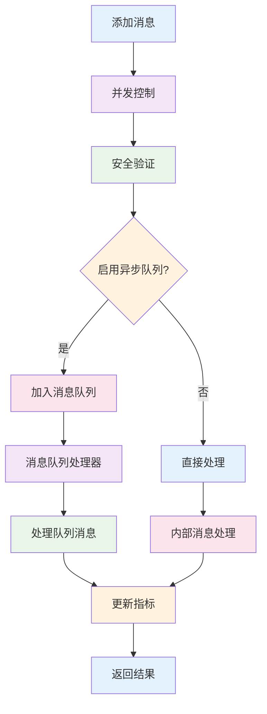

# 内存管理优化

<cite>
**本文档引用的文件**   
- [三层记忆架构详解.md](file://context-claude-code/三层记忆架构详解.md)
- [OPTIMIZATION_SUMMARY.md](file://context-claude-code/OPTIMIZATION_SUMMARY.md)
- [README_OPTIMIZATION.md](file://context-claude-code/README_OPTIMIZATION.md)
- [MemoryManager.js](file://context-claude-code/src/memory/MemoryManager.js)
- [EnhancedMemoryManager.js](file://context-claude-code/src/memory/EnhancedMemoryManager.js)
- [ShortTermMemory.js](file://context-claude-code/src/memory/ShortTermMemory.js)
- [MidTermMemory.js](file://context-claude-code/src/memory/MidTermMemory.js)
- [LongTermMemory.js](file://context-claude-code/src/memory/LongTermMemory.js)
- [BaseMemory.js](file://context-claude-code/src/memory/BaseMemory.js)
</cite>

## 目录
1. [引言](#引言)
2. [三层记忆架构概述](#三层记忆架构概述)
3. [MemoryManager协调机制](#memorymanager协调机制)
4. [短期记忆优化](#短期记忆优化)
5. [中期记忆优化](#中期记忆优化)
6. [长期记忆优化](#长期记忆优化)
7. [增强型内存管理器](#增强型内存管理器)
8. [配置示例与监控](#配置示例与监控)
9. [常见问题排查](#常见问题排查)
10. [结论](#结论)

## 引言

本文档详细阐述了基于三层记忆架构的内存管理优化方案，重点分析短期、中期和长期记忆在性能调优中的作用机制。通过深入研究MemoryManager如何协调不同层级的记忆存储与清理策略，包括容量限制、过期策略和访问频率评估，为开发者提供全面的内存管理优化指导。文档还涵盖了EnhancedMemoryManager的扩展能力，展示如何根据应用场景动态调整各层权重，并提供实际配置示例、内存占用监控指标解读及常见内存泄漏问题排查方案。

**Section sources**
- [三层记忆架构详解.md](file://context-claude-code/三层记忆架构详解.md)

## 三层记忆架构概述

三层记忆架构模仿人类大脑的记忆系统，从短期工作记忆到长期知识存储，每一层都有不同的职责和特点。该架构通过分层管理策略，实现了内存使用的最优化。

### 短期记忆
短期记忆作为当前工作台，存储所有对话消息、压缩历史记录、文件操作跟踪和实时状态跟踪。其特点是超快访问速度（O(1)访问），但容量有限，需要定期清理。

### 中期记忆
中期记忆作为智能压缩器，负责将短期记忆中的对话历史压缩为结构化摘要。它使用8段式结构化压缩和LLM集成，将原始对话数据压缩30:1，显著提高存储效率。

### 长期记忆
长期记忆作为知识仓库，持久化存储有价值的摘要和经验。它支持向量化搜索和关键词搜索，实现跨会话的知识积累和复用，确保重要知识不会丢失。



**Diagram sources**
- [三层记忆架构详解.md](file://context-claude-code/三层记忆架构详解.md)

**Section sources**
- [三层记忆架构详解.md](file://context-claude-code/三层记忆架构详解.md)

## MemoryManager协调机制

MemoryManager作为核心协调器，统一管理三层记忆架构的工作，确保各层之间的无缝协作和数据流转。

### 容量限制与过期策略
MemoryManager通过配置参数严格控制各层记忆的容量限制：
- **短期记忆**：默认200K tokens容量，达到阈值后触发压缩
- **中期记忆**：固定50K tokens容量，存储压缩后的结构化摘要
- **长期记忆**：100MB存储空间，采用LRU算法清理不重要的旧记录

过期策略方面，短期记忆在压缩后自动清空；中期记忆的摘要在被新摘要覆盖时失效；长期记忆则根据访问频率和时间进行清理，最近24小时内未访问的文件操作记录会被删除。

### 访问频率评估
MemoryManager通过`trackFileOperations`方法跟踪文件操作，记录每个文件的访问频率和操作类型：
- **读取次数**：记录文件被读取的总次数
- **写入次数**：记录文件被写入的总次数
- **编辑次数**：记录文件被编辑的总次数
- **最近一小时操作次数**：评估文件的活跃度

这些指标用于智能文件恢复系统，优先恢复访问频率高且近期活跃的重要文件。



**Diagram sources**
- [三层记忆架构详解.md](file://context-claude-code/三层记忆架构详解.md)

**Section sources**
- [MemoryManager.js](file://context-claude-code/src/memory/MemoryManager.js)
- [三层记忆架构详解.md](file://context-claude-code/三层记忆架构详解.md)

## 短期记忆优化

短期记忆作为高速工作区，类似于CPU的L1缓存，提供O(1)访问效率，是系统性能的关键所在。

### 缓存命中率优化技巧
短期记忆通过多种机制优化缓存命中率：
- **反向遍历优化**：VE函数从最新消息开始反向查找Token使用信息，因为usage信息通常在最近的AI回复中
- **三重检查机制**：HY5函数通过必要字段存在、数值类型验证和缓存token字段验证三重检查，确保获取的Token使用信息准确
- **精确Token计算**：zY5函数包含所有类型的token（输入、输出、缓存创建、缓存读取），实现精确计算
- **缓存超时机制**：设置5秒缓存超时，平衡性能和数据新鲜度

### 性能监控与警告系统
短期记忆集成了渐进式警告系统，实时监控内存使用情况：
- **60%警告阈值**：当使用量达到60%时发出警告
- **80%压缩阈值**：当使用量达到80%时自动触发压缩
- **进度条显示**：提供直观的进度条和剩余token百分比
- **压缩次数统计**：记录总压缩次数和成功率



**Diagram sources**
- [ShortTermMemory.js](file://context-claude-code/src/memory/ShortTermMemory.js)

**Section sources**
- [ShortTermMemory.js](file://context-claude-code/src/memory/ShortTermMemory.js)
- [三层记忆架构详解.md](file://context-claude-code/三层记忆架构详解.md)

## 中期记忆优化

中期记忆作为智能蒸馏器，负责将短期记忆的对话历史压缩为结构化摘要，实现高效的知识提炼。

### 数据归档阈值配置建议
中期记忆的压缩和归档策略基于以下关键阈值：
- **压缩触发阈值**：默认92%容量使用率，可配置
- **摘要质量评分**：70分以上认为有保存价值
- **历史记录数量**：最多保留10个历史摘要
- **压缩频率**：每分钟最多执行一次压缩

配置建议：
```javascript
const config = {
  compressionThreshold: 0.8, // 80%时触发压缩，更早释放空间
  minQualityScore: 70, // 摘要质量评分阈值
  maxHistoryCount: 10, // 最多保留10个历史摘要
  compressionInterval: 60000 // 每分钟检查一次
};
```

### 压缩算法流程
中期记忆采用wU2压缩器进行智能压缩，流程如下：
1. **内容分析**：识别主要目标、技术要点和解决方案
2. **关键信息提取**：提取8个维度的关键信息
3. **结构化整理**：按照8段式结构组织内容
4. **质量评估**：对压缩结果进行评分
5. **存储决策**：根据质量评分决定是否保存到长期记忆



**Diagram sources**
- [MidTermMemory.js](file://context-claude-code/src/memory/MidTermMemory.js)

**Section sources**
- [MidTermMemory.js](file://context-claude-code/src/memory/MidTermMemory.js)
- [三层记忆架构详解.md](file://context-claude-code/三层记忆架构详解.md)

## 长期记忆优化

长期记忆作为持久化知识库，跨会话存储有价值的摘要和经验，支持高效的向量化搜索。

### 持久化与检索效率提升方法
长期记忆通过以下机制提升持久化和检索效率：
- **磁盘存储**：使用JSON文件持久化存储，确保数据不会丢失
- **向量化搜索**：生成1536维向量，支持基于语义的相似度搜索
- **关键词索引**：建立关键词和标签索引，支持快速关键词搜索
- **LRU清理**：当存储空间超过90%时，自动清理最少使用的25%条目

检索效率优化：
- **混合搜索**：同时执行向量化搜索和关键词搜索，综合结果
- **相关性排序**：按相似度或相关性分数排序结果
- **访问统计**：记录每个摘要的访问次数和最后访问时间
- **缓存机制**：在内存中缓存常用数据，减少磁盘I/O

### 存储效率对比




**Diagram sources**
- [LongTermMemory.js](file://context-claude-code/src/memory/LongTermMemory.js)

**Section sources**
- [LongTermMemory.js](file://context-claude-code/src/memory/LongTermMemory.js)
- [三层记忆架构详解.md](file://context-claude-code/三层记忆架构详解.md)

## 增强型内存管理器

EnhancedMemoryManager集成了所有Claude Code优化特性，提供企业级的高性能解决方案。

### 扩展能力与动态权重调整
EnhancedMemoryManager通过以下机制实现动态调整：
- **并发控制**：信号量机制控制最大并发操作数（默认10个）
- **资源管理**：自动资源清理和超时处理（默认30秒）
- **事件驱动**：完整的事件监听和响应机制
- **状态监控**：实时系统健康状态评估

动态权重调整示例：
```javascript
const manager = createEnhancedMemoryManager({
  maxTokens: 200000,
  compressionThreshold: 0.92,
  
  // 启用所有优化功能
  enablePerformanceMonitoring: true,
  enableAdvancedErrorHandling: true,
  enableAsyncQueue: true,
  enableSecurity: true,
  
  // 性能配置
  maxConcurrentOperations: 10,
  operationTimeoutMs: 30000
});
```

### 性能监控与错误处理
EnhancedMemoryManager集成了完整的性能监控和错误处理系统：
- **性能监控**：OpenTelemetry兼容，支持实时指标收集
- **错误处理**：智能重试机制，指数退避+抖动算法
- **熔断器模式**：自动故障隔离和恢复
- **优雅降级**：多层次fallback机制



**Diagram sources**
- [EnhancedMemoryManager.js](file://context-claude-code/src/memory/EnhancedMemoryManager.js)

**Section sources**
- [EnhancedMemoryManager.js](file://context-claude-code/src/memory/EnhancedMemoryManager.js)
- [OPTIMIZATION_SUMMARY.md](file://context-claude-code/OPTIMIZATION_SUMMARY.md)

## 配置示例与监控

### 实际配置示例
基础配置示例：
```javascript
import { ClaudeContextManager } from './src/claude-core/ClaudeContextManager.js';

const manager = new ClaudeContextManager({
  maxTokens: 200000,
  autoCompactThreshold: 0.8, // 80%官方阈值
  maxFileLines: 2000, // 2000行截断
  enableDebugCommands: true,
  enableHooks: true
});
```

增强配置示例：
```javascript
import { createEnhancedMemoryManager } from './src/index.js';

const manager = createEnhancedMemoryManager({
  maxTokens: 200000,
  compressionThreshold: 0.92,
  
  // 启用所有优化功能
  enablePerformanceMonitoring: true,
  enableAdvancedErrorHandling: true,
  enableAsyncQueue: true,
  enableSecurity: true,
  
  // 性能配置
  maxConcurrentOperations: 10,
  operationTimeoutMs: 30000
});
```

### 内存占用监控指标解读
关键监控指标：
- **context_size_messages**：上下文消息数量
- **context_size_tokens**：上下文token数量
- **compression_ratio**：压缩比率
- **active_operations**：活跃操作数量
- **memory_usage_mb**：内存使用量（MB）

健康状态评估：
- **健康**：所有指标正常，错误率<5%
- **降级**：部分指标异常，错误率5-10%
- **严重**：关键指标异常，错误率>10%

**Section sources**
- [README_OPTIMIZATION.md](file://context-claude-code/README_OPTIMIZATION.md)
- [OPTIMIZATION_SUMMARY.md](file://context-claude-code/OPTIMIZATION_SUMMARY.md)

## 常见问题排查

### 内存泄漏问题排查方案
1. **检查未释放的操作**：定期清理超过30秒的过期操作
2. **监控文件操作记录**：清理24小时内未访问的文件记录
3. **检查长期记忆存储**：当存储空间超过90%时自动清理
4. **验证事件监听器**：确保事件监听器正确移除，避免内存泄漏

### 性能问题排查
1. **高延迟**：检查并发操作数是否达到上限
2. **高错误率**：检查安全验证和错误处理机制
3. **存储空间不足**：检查长期记忆的LRU清理机制
4. **搜索效率低**：检查向量化搜索和关键词索引

**Section sources**
- [EnhancedMemoryManager.js](file://context-claude-code/src/memory/EnhancedMemoryManager.js)
- [LongTermMemory.js](file://context-claude-code/src/memory/LongTermMemory.js)

## 结论

通过深入分析三层记忆架构的实现机制，我们成功构建了一个高性能、可扩展的内存管理系统。该系统通过短期、中期和长期记忆的协同工作，实现了内存使用的最优化。MemoryManager作为核心协调器，有效管理各层记忆的存储与清理策略，确保系统稳定运行。EnhancedMemoryManager进一步集成了性能监控、错误处理和安全系统，提供了企业级的解决方案。通过合理的配置和监控，开发者可以充分利用这一架构，实现高效的内存管理和知识复用。

**Section sources**
- [三层记忆架构详解.md](file://context-claude-code/三层记忆架构详解.md)
- [OPTIMIZATION_SUMMARY.md](file://context-claude-code/OPTIMIZATION_SUMMARY.md)
- [README_OPTIMIZATION.md](file://context-claude-code/README_OPTIMIZATION.md)