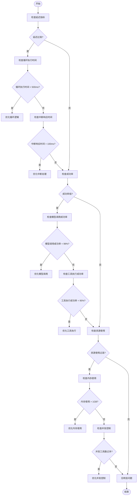

# 性能监控与指标分析

<cite>
**本文档引用的文件**   
- [PerformanceMonitor.js](file://context-claude-code/src/monitoring/PerformanceMonitor.js)
- [EnhancedMemoryManager.js](file://context-claude-code/src/memory/EnhancedMemoryManager.js)
- [AsyncMessageQueue.js](file://context-claude-code/src/queue/AsyncMessageQueue.js)
- [07-performance-monitoring.md](file://packages/sdk/node/docs/technical/07-performance-monitoring.md)
</cite>

## 目录
1. [引言](#引言)
2. [核心性能指标](#核心性能指标)
3. [监控模块配置与启用](#监控模块配置与启用)
4. [时序数据导出与分析](#时序数据导出与分析)
5. [瓶颈识别流程图](#瓶颈识别流程图)
6. [告警阈值设置建议](#告警阈值设置建议)
7. [可视化仪表板配置](#可视化仪表板配置)
8. [外部监控系统集成](#外部监控系统集成)
9. [结论](#结论)

## 引言
性能监控与指标分析是确保系统稳定性和高效性的关键环节。本指南围绕`PerformanceMonitor.js`的核心功能，详细阐述了如何通过监控关键性能指标（KPI）来识别系统瓶颈、优化性能，并提供告警和可视化支持。通过本指南，开发者可以全面了解如何配置和使用性能监控模块，从而提升系统的可观测性和可靠性。

## 核心性能指标
`PerformanceMonitor.js`定义了一系列核心性能指标，用于衡量系统的健康状况和性能表现。这些指标包括延迟、成功率、资源使用率等。

### 延迟指标
延迟指标用于衡量系统响应时间，确保系统在高负载下仍能保持快速响应。
- **循环执行时间** (`loop_execution_time`)：衡量系统主循环的执行时间，目标是P99 < 200ms。当执行时间超过500ms时，会触发性能告警。
- **中断响应时间** (`interruption_response_time`)：衡量系统对中断请求的响应时间，目标是 < 100ms。当响应时间超过100ms时，会触发性能告警。

### 成功率指标
成功率指标用于衡量系统调用的成功率，确保系统的稳定性和可靠性。
- **模型调用成功率** (`model_calls_success_rate`)：衡量模型调用的成功率，目标是 > 99%。当成功率低于99%时，会触发稳定性告警。
- **工具执行成功率** (`tool_executions_success_rate`)：衡量工具执行的成功率，目标是 > 95%。当成功率低于95%时，会触发稳定性告警。

### 资源使用率指标
资源使用率指标用于监控系统的资源消耗情况，防止资源耗尽导致系统崩溃。
- **内存使用率** (`memory_usage_mb`)：衡量系统内存使用量，单位为MB。当内存使用超过1GB时，会触发资源告警。
- **内存使用百分比** (`memory_usage_percentage`)：衡量系统内存使用百分比，帮助开发者了解内存使用趋势。

### 并发控制指标
并发控制指标用于监控系统的并发处理能力，确保系统在高并发场景下的稳定性。
- **并发工具数** (`concurrent_tools`)：衡量当前正在执行的工具数量，帮助开发者了解系统的并发负载。
- **工具队列大小** (`tool_queue_size`)：衡量待处理的工具队列大小，帮助开发者识别潜在的性能瓶颈。

### 系统健康检查指标
系统健康检查指标用于评估系统的整体健康状况，确保系统在各种条件下都能正常运行。
- **API响应时间** (`api_response_time`)：衡量API接口的响应时间，帮助开发者识别API性能问题。
- **会话状态完整性** (`session_state_integrity`)：衡量会话状态的完整性，范围为0-1，帮助开发者确保会话数据的一致性。

**Section sources**
- [PerformanceMonitor.js](file://context-claude-code/src/monitoring/PerformanceMonitor.js#L12-L405)

## 监控模块配置与启用
`PerformanceMonitor.js`通过`EnhancedMemoryManager`类进行配置和启用。开发者可以通过配置文件或代码直接启用性能监控功能。

### 配置选项
`EnhancedMemoryManager`提供了多个配置选项，允许开发者根据需求启用或禁用性能监控功能。
- `enablePerformanceMonitoring`: 是否启用性能监控，默认为`true`。
- `enableAdvancedErrorHandling`: 是否启用高级错误处理，默认为`true`。
- `enableAsyncQueue`: 是否启用异步消息队列，默认为`true`。
- `enableSecurity`: 是否启用安全系统，默认为`true`。

### 启用监控
在`EnhancedMemoryManager`的构造函数中，性能监控模块通过以下代码初始化：
```javascript
this.performanceMonitor = this.config.enablePerformanceMonitoring ?
  performanceMonitor : null;
```
如果`enablePerformanceMonitoring`为`true`，则会创建一个`PerformanceMetricsCollector`实例并赋值给`performanceMonitor`属性。否则，`performanceMonitor`将为`null`，表示未启用性能监控。

**Section sources**
- [EnhancedMemoryManager.js](file://context-claude-code/src/memory/EnhancedMemoryManager.js#L25-L98)

## 时序数据导出与分析
`PerformanceMonitor.js`提供了多种方式导出时序数据，以便开发者进行进一步分析。

### 导出OpenTelemetry格式数据
`PerformanceMetricsCollector`类提供了`exportOpenTelemetry`方法，可以将性能指标导出为OpenTelemetry格式。OpenTelemetry是一种开放标准，支持多种监控系统，如Prometheus、Jaeger等。
```javascript
exportOpenTelemetry() {
  const metrics = this.getMetrics();

  return {
    resourceMetrics: [{
      resource: {
        attributes: {
          'service.name': 'context-claude-code',
          'service.version': '1.0.0'
        }
      },
      scopeMetrics: [{
        scope: {
          name: 'context-claude-code-metrics'
        },
        metrics: this.convertToOTelFormat(metrics)
      }]
    }]
  };
}
```
该方法首先调用`getMetrics`获取所有性能指标，然后将其转换为OpenTelemetry格式。转换后的数据包含资源信息、作用域信息和指标数据，可以直接发送到支持OpenTelemetry的监控系统。

### 获取所有指标
`getMetrics`方法用于获取所有性能指标，返回一个包含计数器、直方图和仪表的JSON对象。
```javascript
getMetrics() {
  const result = {
    timestamp: Date.now(),
    uptime: Date.now() - this.startTime,
    counters: {},
    histograms: {},
    gauges: {}
  };

  // 收集计数器
  for (const [name, counter] of this.counters) {
    result.counters[name] = {
      value: counter.value,
      description: counter.description
    };
  }

  // 收集直方图
  for (const [name, histogram] of this.histograms) {
    result.histograms[name] = {
      count: histogram.count,
      sum: histogram.sum,
      buckets: Object.fromEntries(histogram.buckets),
      description: histogram.description
    };
  }

  // 收集仪表
  for (const [name, gauge] of this.metrics) {
    result.gauges[name] = {
      value: gauge.value,
      timestamp: gauge.timestamp,
      description: gauge.description
    };
  }

  return result;
}
```
该方法返回的JSON对象包含了所有性能指标的详细信息，包括时间戳、运行时间、计数器、直方图和仪表的值。

**Section sources**
- [PerformanceMonitor.js](file://context-claude-code/src/monitoring/PerformanceMonitor.js#L244-L320)

## 瓶颈识别流程图
为了帮助开发者快速识别系统瓶颈，我们提供了一个基于监控数据的瓶颈识别流程图。该流程图指导开发者从监控数据中提取关键信息，逐步排查问题根源。



**Diagram sources**
- [PerformanceMonitor.js](file://context-claude-code/src/monitoring/PerformanceMonitor.js#L12-L405)

## 告警阈值设置建议
合理的告警阈值设置可以帮助开发者及时发现系统问题，避免小问题演变成大故障。以下是基于`PerformanceMonitor.js`的告警阈值设置建议。

### 性能告警
- **循环执行时间**：当循环执行时间超过500ms时，触发警告。建议开发者检查循环逻辑，优化算法复杂度。
- **中断响应时间**：当中断响应时间超过100ms时，触发警告。建议开发者优化中断处理逻辑，减少不必要的计算。

### 资源告警
- **内存使用**：当内存使用超过1GB时，触发严重告警。建议开发者检查内存泄漏，优化数据结构。
- **错误率**：当成功率低于99%时，触发警告。建议开发者检查模型调用和工具执行的失败原因，修复相关问题。

### 稳定性告警
- **模型调用成功率**：当模型调用成功率低于99%时，触发警告。建议开发者检查模型服务的健康状况，确保模型服务稳定。
- **工具执行成功率**：当工具执行成功率低于95%时，触发警告。建议开发者检查工具执行环境，确保工具依赖项正常。

**Section sources**
- [PerformanceMonitor.js](file://context-claude-code/src/monitoring/PerformanceMonitor.js#L223-L266)

## 可视化仪表板配置
`PerformanceMonitor.js`支持与外部可视化工具集成，提供直观的性能数据展示。以下是基于`07-performance-monitoring.md`的可视化仪表板配置示例。

### 仪表板数据结构
仪表板数据结构包含概览、图表、告警、趋势和建议五个部分。
```typescript
interface DashboardData {
  overview: OverviewMetrics;
  charts: ChartData[];
  alerts: PerformanceAlert[];
  trends: TrendAnalysis[];
  recommendations: Recommendation[];
}
```

### 概览指标
概览指标提供系统性能的总体视图，包括总请求数、平均响应时间、缓存命中率、错误率、内存使用和吞吐量。
```typescript
private getOverviewMetrics(timeRange: TimeRange): OverviewMetrics {
  const data = this.metricsCollector.getMetricsInRange(timeRange)

  return {
    totalRequests: this.getTotalValue(data, 'context.search.total_requests'),
    averageResponseTime: this.getAverageValue(data, 'context.search.average_duration'),
    cacheHitRate: this.getAverageValue(data, 'context.cache.hit_rate'),
    errorRate: this.calculateErrorRate(data),
    memoryUsage: this.getLatestValue(data, 'context.memory.heap_used'),
    throughput: this.calculateThroughput(data, timeRange)
  }
}
```

### 图表配置
图表配置提供多种类型的图表，帮助开发者直观地了解性能趋势。
```typescript
private getChartData(timeRange: TimeRange): ChartData[] {
  const data = this.metricsCollector.getMetricsInRange(timeRange)

  return [
    {
      title: 'Response Time Trend',
      type: 'line',
      data: this.getTimeSeriesData(data, 'context.search.average_duration'),
      unit: 'ms'
    },
    {
      title: 'Cache Hit Rate',
      type: 'area',
      data: this.getTimeSeriesData(data, 'context.cache.hit_rate'),
      unit: '%'
    },
    {
      title: 'Memory Usage',
      type: 'line',
      data: this.getTimeSeriesData(data, 'context.memory.heap_used'),
      unit: 'MB'
    },
    {
      title: 'Request Volume',
      type: 'bar',
      data: this.getTimeSeriesData(data, 'context.search.total_requests'),
      unit: 'count'
    }
  ]
}
```

**Section sources**
- [07-performance-monitoring.md](file://packages/sdk/node/docs/technical/07-performance-monitoring.md#L1077-L1179)

## 外部监控系统集成
`PerformanceMonitor.js`支持与外部监控系统集成，如Prometheus、Grafana等。以下是集成方法。

### Prometheus集成
Prometheus是一种流行的开源监控系统，支持通过HTTP端点暴露指标数据。`PerformanceMonitor.js`可以通过`exportOpenTelemetry`方法将指标数据导出为Prometheus格式。
```javascript
// 将OpenTelemetry格式转换为Prometheus格式
function convertToPrometheus(metrics) {
  let prometheusText = '';
  for (const metric of metrics.resourceMetrics[0].scopeMetrics[0].metrics) {
    if (metric.type === 'counter') {
      prometheusText += `# HELP ${metric.name} ${metric.description}\n`;
      prometheusText += `# TYPE ${metric.name} counter\n`;
      prometheusText += `${metric.name} ${metric.data.dataPoints[0].value}\n\n`;
    } else if (metric.type === 'gauge') {
      prometheusText += `# HELP ${metric.name} ${metric.description}\n`;
      prometheusText += `# TYPE ${metric.name} gauge\n`;
      prometheusText += `${metric.name} ${metric.data.dataPoints[0].value}\n\n`;
    }
  }
  return prometheusText;
}
```
开发者可以将上述代码集成到HTTP服务器中，通过特定端点暴露Prometheus格式的指标数据。

### Grafana集成
Grafana是一种流行的可视化工具，支持多种数据源，包括Prometheus。开发者可以将Prometheus作为数据源添加到Grafana中，创建自定义仪表板，实时监控系统性能。

**Section sources**
- [07-performance-monitoring.md](file://packages/sdk/node/docs/technical/07-performance-monitoring.md#L48-L121)

## 结论
通过本指南，开发者可以全面了解`PerformanceMonitor.js`的核心功能，掌握如何配置和使用性能监控模块。通过监控关键性能指标、设置合理的告警阈值、导出时序数据进行分析，并与外部监控系统集成，开发者可以有效提升系统的可观测性和可靠性。希望本指南能帮助开发者更好地管理和优化系统性能。