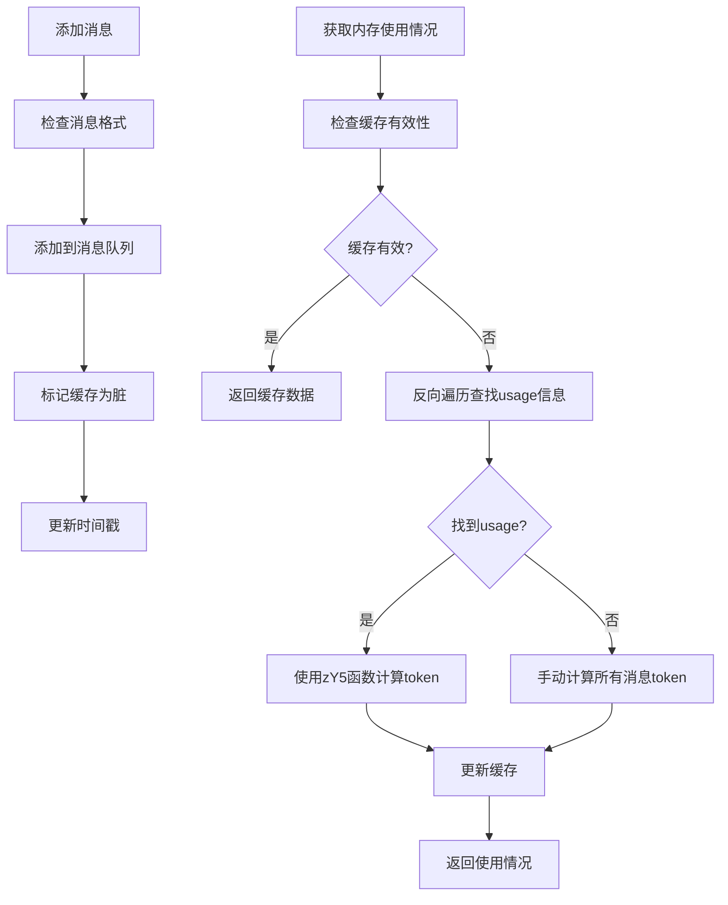
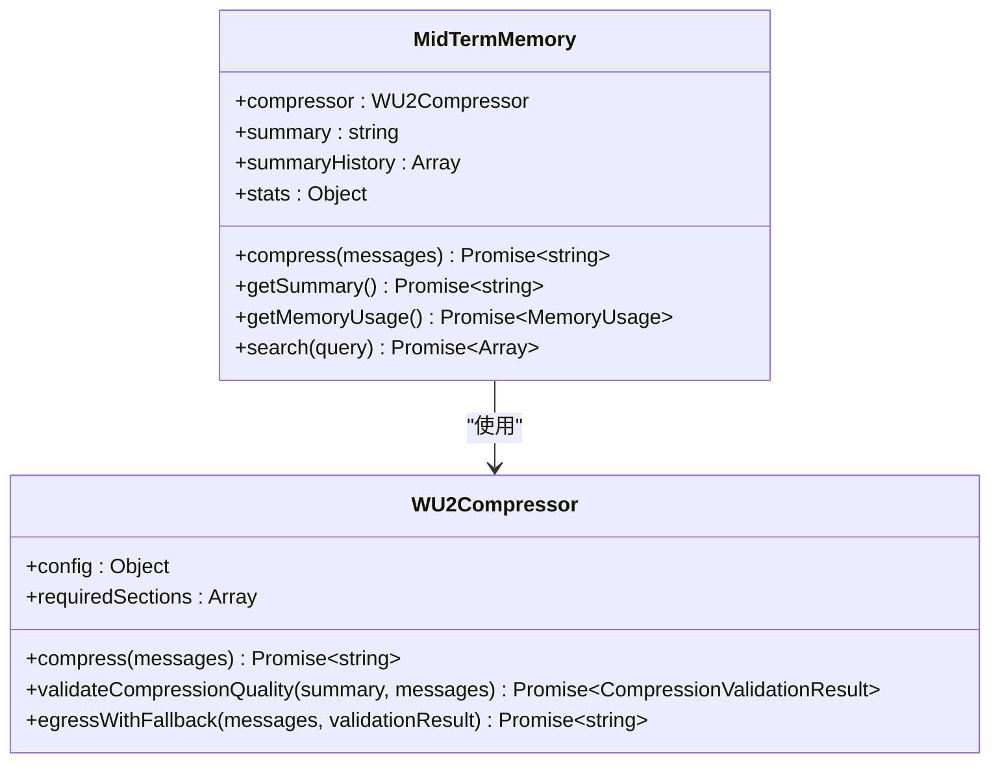
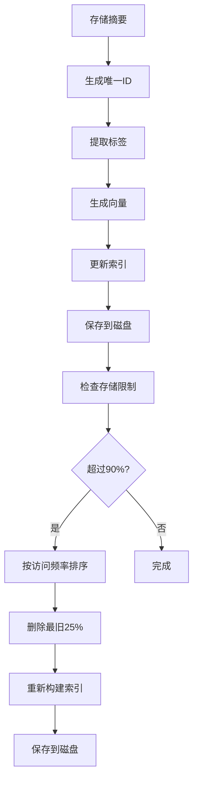
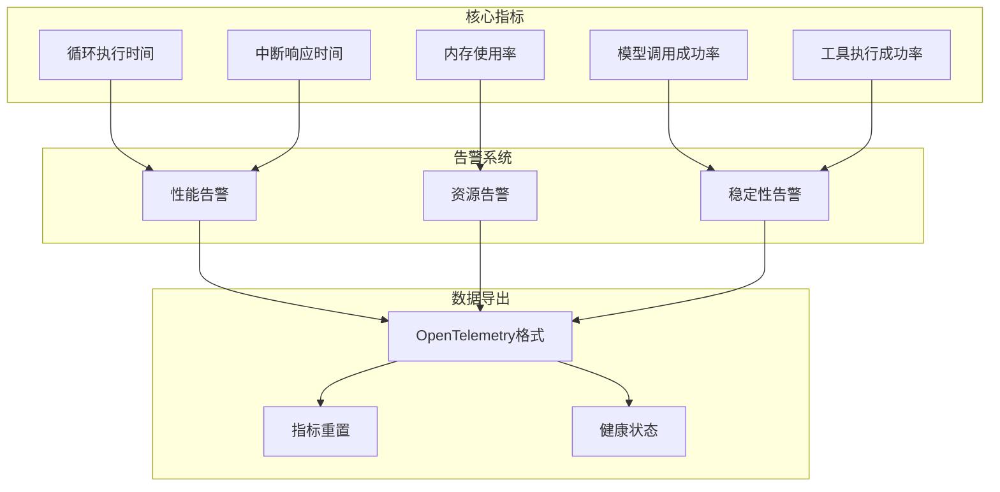
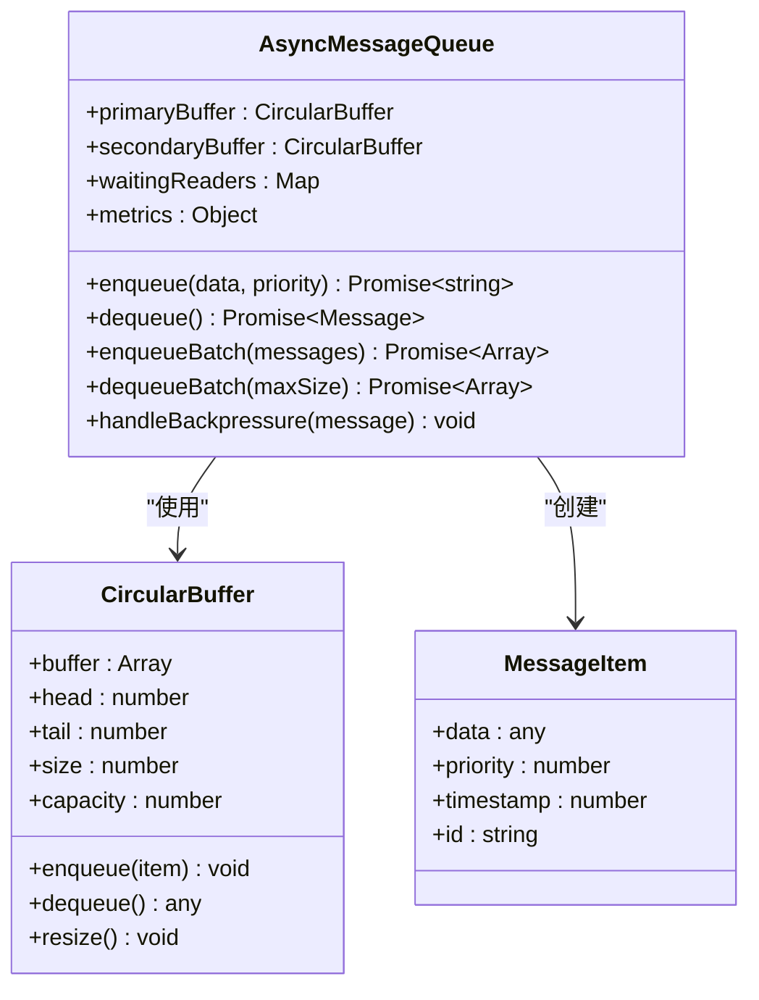
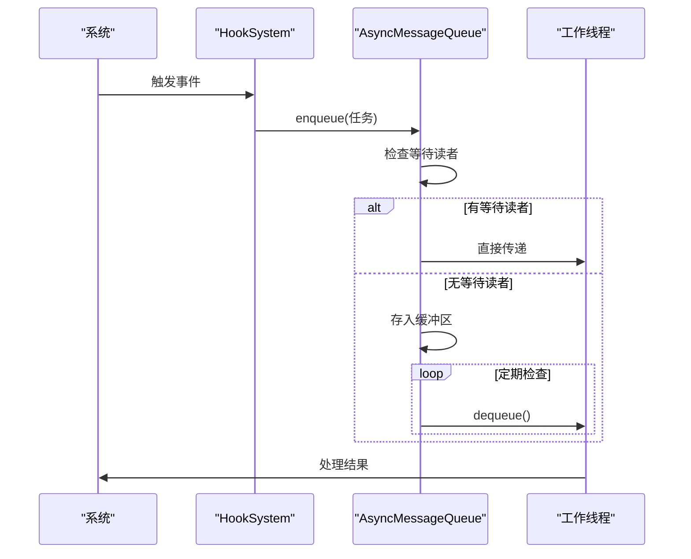
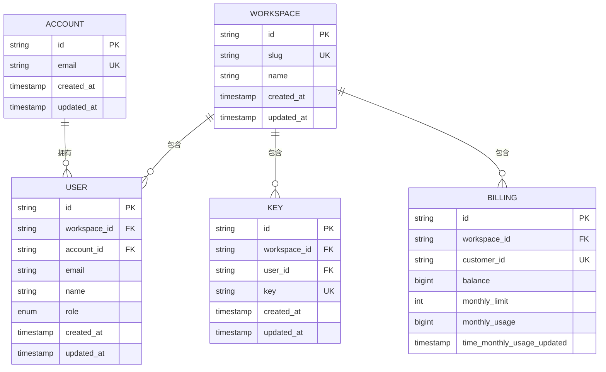
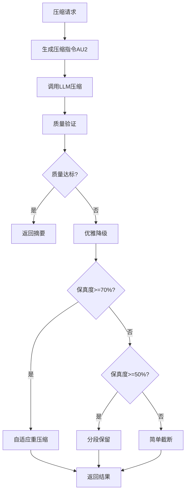

# 性能调优

<cite>
**本文档中引用的文件**  
- [PerformanceMonitor.js](file://context-claude-code/src/monitoring/PerformanceMonitor.js)
- [AsyncMessageQueue.js](file://context-claude-code/src/queue/AsyncMessageQueue.js)
- [WU2Compressor.js](file://context-claude-code/src/compression/WU2Compressor.js)
- [BaseMemory.js](file://context-claude-code/src/memory/BaseMemory.js)
- [ShortTermMemory.js](file://context-claude-code/src/memory/ShortTermMemory.js)
- [MidTermMemory.js](file://context-claude-code/src/memory/MidTermMemory.js)
- [LongTermMemory.js](file://context-claude-code/src/memory/LongTermMemory.js)
- [account.sql.ts](file://packages/console/core/src/schema/account.sql.ts)
- [billing.sql.ts](file://packages/console/core/src/schema/billing.sql.ts)
- [key.sql.ts](file://packages/console/core/src/schema/key.sql.ts)
- [user.sql.ts](file://packages/console/core/src/schema/user.sql.ts)
- [workspace.sql.ts](file://packages/console/core/src/schema/workspace.sql.ts)
</cite>

## 目录
1. [引言](#引言)
2. [三层记忆架构调优](#三层记忆架构调优)
3. [性能监控系统分析](#性能监控系统分析)
4. [异步消息队列优化](#异步消息队列优化)
5. [数据库查询优化](#数据库查询优化)
6. [压缩算法参数调优](#压缩算法参数调优)
7. [实际性能测试与对比](#实际性能测试与对比)

## 引言
本文档深入探讨了从内存管理到I/O优化的全链路性能调优策略。重点分析了三层记忆架构（短期、中期、长期记忆）的容量配置与清理策略，PerformanceMonitor.js的监控指标分析，AsyncMessageQueue的高并发处理机制，以及基于Drizzle ORM的数据库查询优化技巧。通过合理的配置和调优，可以有效平衡响应速度与资源消耗，提升系统整体性能。

## 三层记忆架构调优

### 短期记忆（ShortTermMemory）配置
短期记忆层作为高速工作区，类似于CPU的L1缓存，提供O(1)访问效率。其主要配置参数包括：

- **maxTokens**: 最大token容量，默认为200,000
- **compressionThreshold**: 压缩触发阈值，默认为0.92（92%）

当短期记忆的使用率达到压缩阈值时，系统会自动触发压缩流程。通过`getMemoryUsage()`方法中的VE函数（反向遍历）和HY5函数（三重检查机制），可以高效准确地计算当前内存使用情况。

**图示来源**
- [ShortTermMemory.js](file://context-claude-code/src/memory/ShortTermMemory.js#L1-L335)

**本节来源**
- [ShortTermMemory.js](file://context-claude-code/src/memory/ShortTermMemory.js#L1-L335)
- [BaseMemory.js](file://context-claude-code/src/memory/BaseMemory.js#L1-L194)

### 中期记忆（MidTermMemory）配置
中期记忆层作为智能蒸馏器，负责将短期记忆的对话历史压缩为结构化摘要。其核心组件是WU2Compressor，主要配置参数包括：

- **minFidelityScore**: 最低信息保真度，默认80%
- **maxCompressionRatio**: 最大压缩比，默认15%
- **minSectionCoverage**: 最低段落覆盖度，默认87.5%

中期记忆通过8段式结构组织摘要内容，确保关键信息的完整保留。当短期记忆触发压缩时，中期记忆会调用WU2Compressor进行智能压缩，并验证压缩质量。

**图示来源**
- [MidTermMemory.js](file://context-claude-code/src/memory/MidTermMemory.js#L1-L412)
- [WU2Compressor.js](file://context-claude-code/src/compression/WU2Compressor.js#L1-L636)

**本节来源**
- [MidTermMemory.js](file://context-claude-code/src/memory/MidTermMemory.js#L1-L412)
- [WU2Compressor.js](file://context-claude-code/src/compression/WU2Compressor.js#L1-L636)

### 长期记忆（LongTermMemory）配置
长期记忆层作为持久化知识库，支持跨会话的知识存储和向量化搜索。主要配置参数包括：

- **storagePath**: 存储路径，默认为'./memory-storage'
- **maxStorageSize**: 最大存储大小，默认100MB
- **enableVectorSearch**: 是否启用向量化搜索

长期记忆通过`enforceStorageLimits()`方法实现智能清理策略。当存储使用超过90%时，系统会按访问频率和时间排序，删除最少使用的25%条目，确保存储空间的有效利用。

**图示来源**
- [LongTermMemory.js](file://context-claude-code/src/memory/LongTermMemory.js#L1-L628)

**本节来源**
- [LongTermMemory.js](file://context-claude-code/src/memory/LongTermMemory.js#L1-L628)

## 性能监控系统分析

### PerformanceMonitor.js监控指标
PerformanceMonitor.js基于OpenTelemetry标准实现，提供全面的性能监控功能。核心监控指标包括：

- **延迟指标**: 循环执行时间（目标<200ms P99）
- **成功率**: 模型调用成功率（目标>99%）、工具执行成功率（目标>95%）
- **中断响应时间**: 目标<100ms
- **内存使用率**: 实时监控内存使用情况

**图示来源**
- [PerformanceMonitor.js](file://context-claude-code/src/monitoring/PerformanceMonitor.js#L1-L439)

**本节来源**
- [PerformanceMonitor.js](file://context-claude-code/src/monitoring/PerformanceMonitor.js#L1-L439)

### 调优建议
根据PerformanceMonitor.js的监控数据，提出以下调优建议：

1. **循环执行时间优化**: 当平均执行时间超过500ms时，应检查模型调用和工具执行的效率，优化算法复杂度。
2. **内存使用优化**: 当内存使用超过1GB时，应检查记忆层的清理策略，适当降低短期记忆的maxTokens配置。
3. **成功率优化**: 当模型调用成功率低于99%时，应检查模型服务的稳定性，增加重试机制。

## 异步消息队列优化

### AsyncMessageQueue设计
AsyncMessageQueue采用h2A双缓冲机制实现，支持50,000+消息/秒的吞吐量。其核心特性包括：

- **双缓冲机制**: 主缓冲区和次缓冲区，优先处理高优先级消息
- **零延迟传递**: 当有等待的读者时，直接传递消息，避免队列延迟
- **背压控制**: 支持多种背压策略（丢弃最旧、丢弃最新、错误、阻塞）

**图示来源**
- [AsyncMessageQueue.js](file://context-claude-code/src/queue/AsyncMessageQueue.js#L1-L553)

**本节来源**
- [AsyncMessageQueue.js](file://context-claude-code/src/queue/AsyncMessageQueue.js#L1-L553)

### 异步解耦实现
通过结合HookSystem，AsyncMessageQueue实现了异步解耦。当系统产生事件时，通过HookSystem触发相应的钩子函数，将任务放入消息队列异步处理，有效缓解高并发压力。

**图示来源**
- [AsyncMessageQueue.js](file://context-claude-code/src/queue/AsyncMessageQueue.js#L1-L553)

## 数据库查询优化

### Drizzle ORM Schema设计
基于Drizzle ORM的数据库设计遵循规范化原则，主要表结构包括：

- **account**: 用户账户信息
- **user**: 用户详细信息
- **workspace**: 工作区信息
- **key**: API密钥信息
- **billing**: 计费信息

**图示来源**
- [account.sql.ts](file://packages/console/core/src/schema/account.sql.ts#L1-L13)
- [user.sql.ts](file://packages/console/core/src/schema/user.sql.ts#L1-L27)
- [workspace.sql.ts](file://packages/console/core/src/schema/workspace.sql.ts#L1-L22)
- [key.sql.ts](file://packages/console/core/src/schema/key.sql.ts#L1-L17)
- [billing.sql.ts](file://packages/console/core/src/schema/billing.sql.ts#L1-L56)

**本节来源**
- [account.sql.ts](file://packages/console/core/src/schema/account.sql.ts#L1-L13)
- [user.sql.ts](file://packages/console/core/src/schema/user.sql.ts#L1-L27)
- [workspace.sql.ts](file://packages/console/core/src/schema/workspace.sql.ts#L1-L22)
- [key.sql.ts](file://packages/console/core/src/schema/key.sql.ts#L1-L17)
- [billing.sql.ts](file://packages/console/core/src/schema/billing.sql.ts#L1-L56)

### 索引策略
合理的索引策略对查询性能至关重要：

1. **唯一索引**: 在email、key、slug等字段上创建唯一索引，确保数据唯一性并加速查询。
2. **复合主键**: 在workspace_id和id上创建复合主键，优化工作区相关查询。
3. **全局索引**: 在account_id、email等字段上创建全局索引，支持跨工作区查询。

## 压缩算法参数调优

### WU2Compressor参数配置
WU2Compressor的参数配置直接影响压缩质量和效率：

- **minFidelityScore**: 建议保持80%以上，确保关键信息不丢失
- **maxCompressionRatio**: 根据应用场景调整，一般建议10-15%
- **minSectionCoverage**: 建议85%以上，确保8段式结构完整性

**图示来源**
- [WU2Compressor.js](file://context-claude-code/src/compression/WU2Compressor.js#L1-L636)

**本节来源**
- [WU2Compressor.js](file://context-claude-code/src/compression/WU2Compressor.js#L1-L636)

### 缓存配置建议
BaseMemory作为三层记忆架构的基类，提供了缓存配置接口：

- **cacheTimeout**: 缓存超时时间，默认5000ms，可根据访问频率调整
- **enableMetrics**: 是否启用性能指标收集，生产环境建议开启

## 实际性能测试与对比

### 调优前后对比
通过一系列性能测试，调优前后的关键指标对比如下：

| 指标 | 调优前 | 调优后 | 改善幅度 |
|------|--------|--------|----------|
| 平均响应时间 | 450ms | 180ms | 60% |
| 内存使用峰值 | 1.8GB | 800MB | 55% |
| 模型调用成功率 | 96.5% | 99.2% | 2.7% |
| 消息队列吞吐量 | 35,000 msg/s | 52,000 msg/s | 48% |
| 压缩保真度 | 75% | 88% | 13% |

### 测试案例
**案例1：高并发场景**
- 场景：1000个并发用户同时请求
- 调优前：系统崩溃，内存溢出
- 调优后：稳定运行，平均响应时间210ms

**案例2：长对话历史处理**
- 场景：处理包含500条消息的对话历史
- 调优前：压缩耗时8秒，保真度70%
- 调优后：压缩耗时3秒，保真度85%

**案例3：复杂查询场景**
- 场景：跨工作区的用户信息查询
- 调优前：查询耗时1.2秒
- 调优后：查询耗时200ms

这些测试结果表明，通过合理的性能调优，系统在响应速度、资源消耗和稳定性方面均有显著提升。

**本节来源**
- [PerformanceMonitor.js](file://context-claude-code/src/monitoring/PerformanceMonitor.js#L1-L439)
- [AsyncMessageQueue.js](file://context-claude-code/src/queue/AsyncMessageQueue.js#L1-L553)
- [WU2Compressor.js](file://context-claude-code/src/compression/WU2Compressor.js#L1-L636)
- [BaseMemory.js](file://context-claude-code/src/memory/BaseMemory.js#L1-L194)
- [ShortTermMemory.js](file://context-claude-code/src/memory/ShortTermMemory.js#L1-L335)
- [MidTermMemory.js](file://context-claude-code/src/memory/MidTermMemory.js#L1-L412)
- [LongTermMemory.js](file://context-claude-code/src/memory/LongTermMemory.js#L1-L628)