# 缓存策略配置

<cite>
**本文档引用文件**   
- [BaseMemory.js](file://context-claude-code/src/memory/BaseMemory.js)
- [WU2Compressor.js](file://context-claude-code/src/claude-core/WU2Compressor.js)
- [WU2Compressor.js](file://context-claude-code/src/compression/WU2Compressor.js)
- [ClaudeContextManager.js](file://context-claude-code/src/claude-core/ClaudeContextManager.js)
- [ShortTermMemory.js](file://context-claude-code/src/memory/ShortTermMemory.js)
- [MidTermMemory.js](file://context-claude-code/src/memory/MidTermMemory.js)
- [LongTermMemory.js](file://context-claude-code/src/memory/LongTermMemory.js)
- [EnhancedMemoryManager.js](file://context-claude-code/src/memory/EnhancedMemoryManager.js)
- [MemoryManager.js](file://context-claude-code/src/memory/MemoryManager.js)
- [三层记忆架构详解.md](file://context-claude-code/三层记忆架构详解.md)
- [上下文工程管理实践-第3部分-压缩触发.md](file://context-claude-code/上下文工程管理实践-第3部分-压缩触发.md)
</cite>

## 目录
1. [引言](#引言)
2. [基于BaseMemory的缓存体系设计](#基于basememory的缓存体系设计)
3. [缓存层在上下文管理中的角色](#缓存层在上下文管理中的角色)
4. [WU2Compressor与缓存协同工作](#wu2compressor与缓存协同工作)
5. [多级缓存部署方案](#多级缓存部署方案)
6. [缓存预热与防护措施](#缓存预热与防护措施)
7. [性能监控与评估](#性能监控与评估)
8. [总结](#总结)

## 引言
本文档详细阐述了基于BaseMemory的缓存体系设计与调优方法。系统介绍了三层记忆架构（短期、中期、长期记忆）的设计原理与实现机制，重点分析了缓存层在上下文管理中的核心作用。文档详细说明了WU2Compressor如何与缓存系统协同工作以减少重复计算开销，并提供了多级缓存（内存+磁盘）的部署方案。同时，文档涵盖了缓存预热策略、缓存穿透/雪崩防护措施，以及缓存命中率监控指标和性能影响评估方法。

## 基于BaseMemory的缓存体系设计
### 缓存体系架构
系统采用三层记忆架构，以BaseMemory为抽象基类，构建了分层的缓存体系。该架构模仿人类大脑的记忆系统，从短期工作记忆到长期知识存储，每一层都有明确的职责和特点。

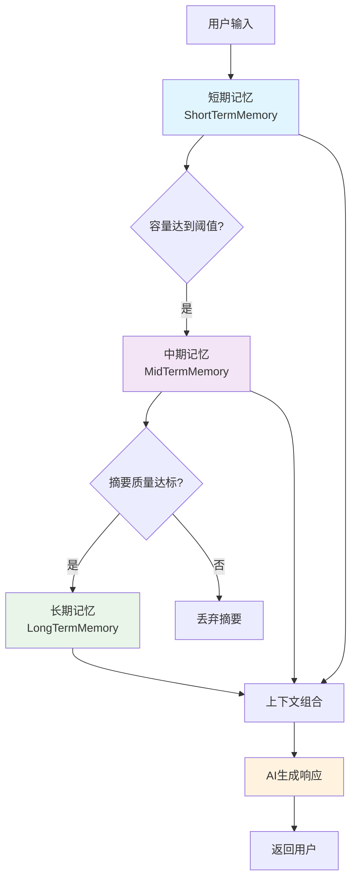

**Diagram sources**
- [三层记忆架构详解.md](file://context-claude-code/三层记忆架构详解.md)

### BaseMemory抽象基类
BaseMemory作为所有记忆层的抽象基类，定义了统一的接口和基础功能。

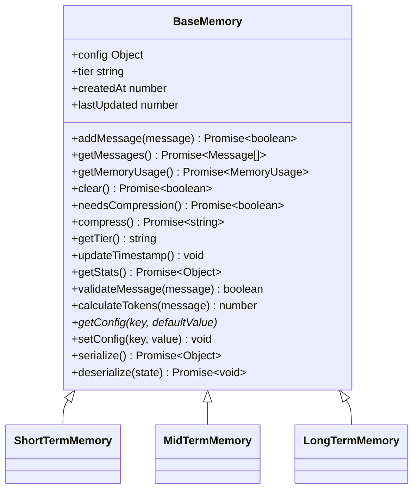

**Diagram sources**
- [BaseMemory.js](file://context-claude-code/src/memory/BaseMemory.js)

**Section sources**
- [BaseMemory.js](file://context-claude-code/src/memory/BaseMemory.js)

### 缓存键生成策略
系统通过生成唯一的消息ID和摘要ID来实现缓存键的生成。短期记忆中的每条消息都有一个唯一的ID，而长期记忆中的每个摘要也有一个全局唯一的ID。

```javascript
// 生成消息ID
generateMessageId() {
  return `msg_${Date.now()}_${Math.random().toString(36).substr(2, 9)}`;
}

// 生成摘要ID
generateId() {
  return `ltm_${Date.now()}_${Math.random().toString(36).substr(2, 9)}`;
}
```

**Section sources**
- [ClaudeContextManager.js](file://context-claude-code/src/claude-core/ClaudeContextManager.js#L750-L753)
- [LongTermMemory.js](file://context-claude-code/src/memory/LongTermMemory.js#L148-L151)

### 失效机制
缓存的失效机制主要通过容量阈值和时间戳来管理。当短期记忆的使用量达到预设阈值时，会触发压缩流程，将旧的对话历史压缩并移出短期记忆。

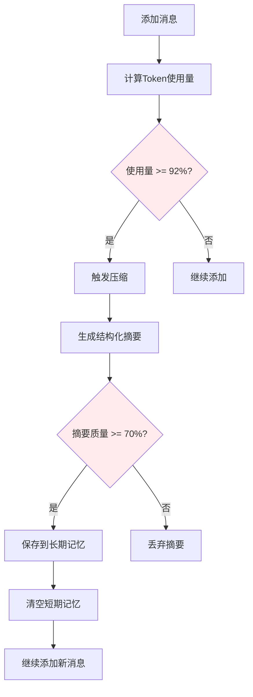

**Diagram sources**
- [ShortTermMemory.js](file://context-claude-code/src/memory/ShortTermMemory.js#L101-L115)

### 一致性保障
系统通过事件驱动架构和钩子系统来保障缓存的一致性。当发生关键操作时，会触发相应的事件，确保各组件状态同步。

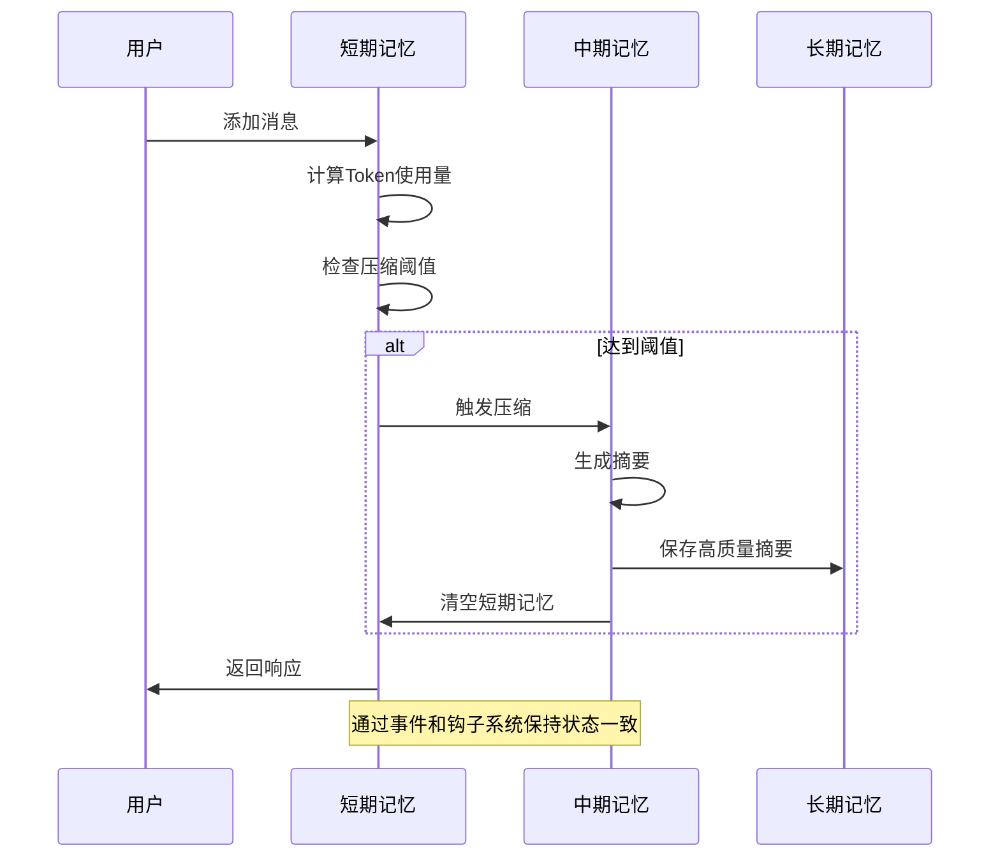

**Diagram sources**
- [ClaudeContextManager.js](file://context-claude-code/src/claude-core/ClaudeContextManager.js#L182-L251)

## 缓存层在上下文管理中的角色
### 短期记忆（ShortTermMemory）
短期记忆作为高速工作区，负责存储最近的对话消息，提供O(1)的访问效率。

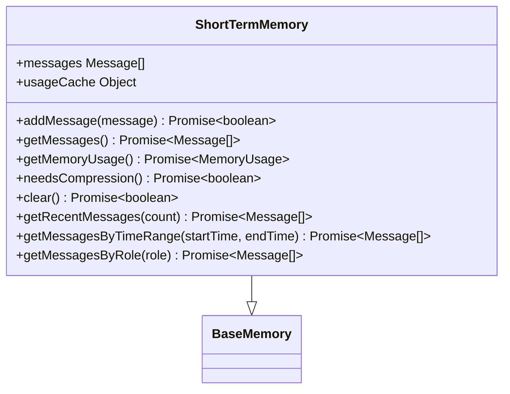

**Diagram sources**
- [ShortTermMemory.js](file://context-claude-code/src/memory/ShortTermMemory.js)

**Section sources**
- [ShortTermMemory.js](file://context-claude-code/src/memory/ShortTermMemory.js)

### 中期记忆（MidTermMemory）
中期记忆作为智能蒸馏器，负责将短期记忆的对话历史压缩为结构化摘要。

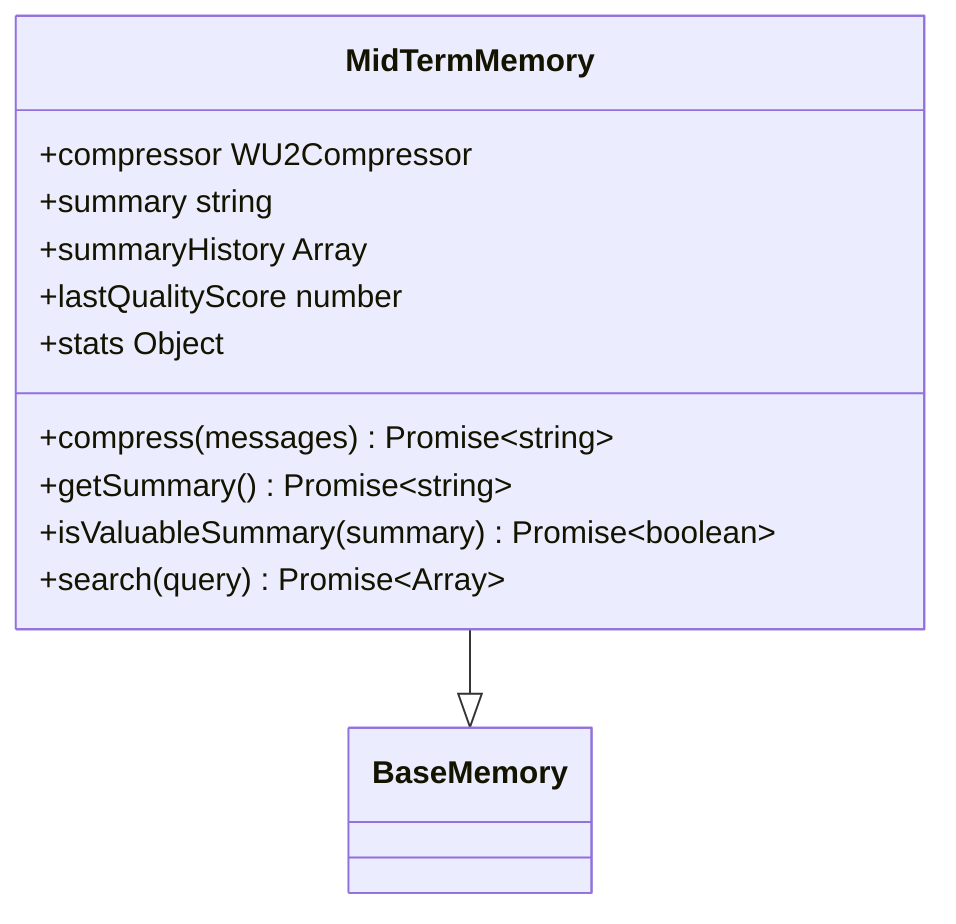

**Diagram sources**
- [MidTermMemory.js](file://context-claude-code/src/memory/MidTermMemory.js)

**Section sources**
- [MidTermMemory.js](file://context-claude-code/src/memory/MidTermMemory.js)

### 长期记忆（LongTermMemory）
长期记忆作为持久化知识库，跨会话存储有价值的摘要和知识，支持向量化搜索。

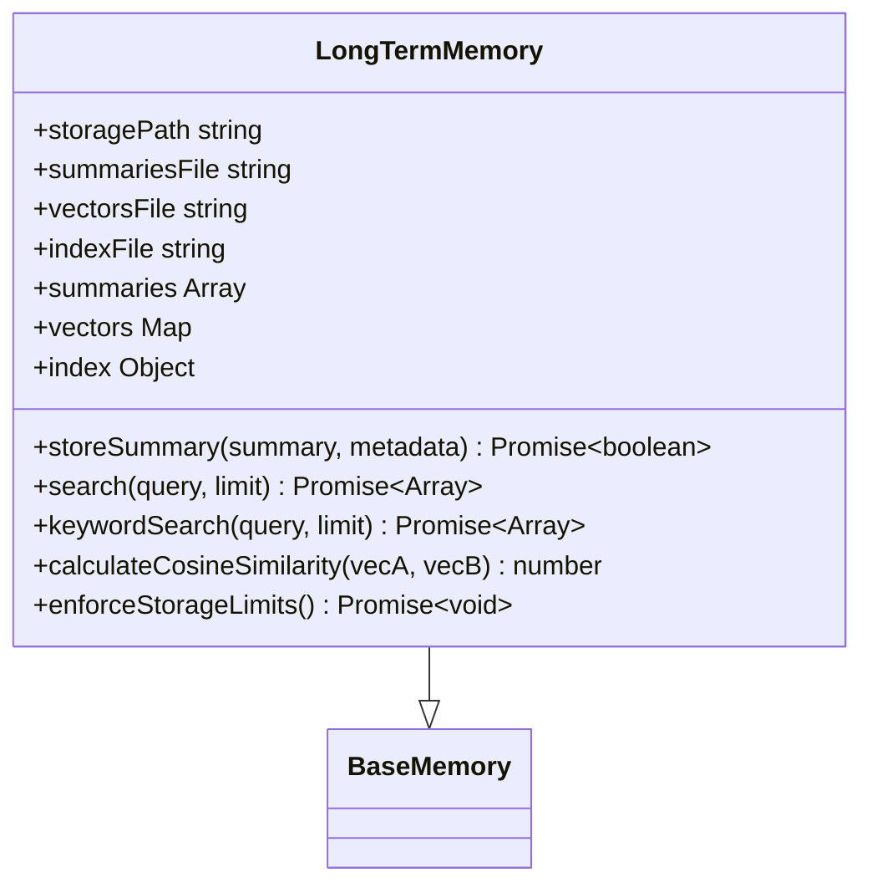

**Diagram sources**
- [LongTermMemory.js](file://context-claude-code/src/memory/LongTermMemory.js)

**Section sources**
- [LongTermMemory.js](file://context-claude-code/src/memory/LongTermMemory.js)

## WU2Compressor与缓存协同工作
### WU2Compressor核心功能
WU2Compressor是智能压缩引擎，负责将冗长的对话历史提炼成结构化摘要，与缓存系统紧密协作。

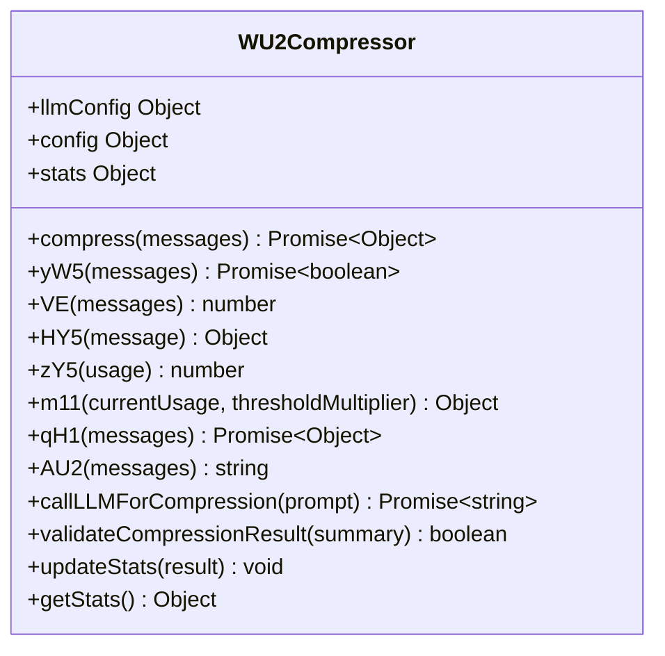

**Diagram sources**
- [WU2Compressor.js](file://context-claude-code/src/claude-core/WU2Compressor.js)

**Section sources**
- [WU2Compressor.js](file://context-claude-code/src/claude-core/WU2Compressor.js)

### 减少重复计算开销
WU2Compressor通过多种机制减少重复计算开销：

1. **缓存Token使用量**：短期记忆中缓存Token使用量，避免重复计算。
2. **反向遍历优化**：从最新消息开始反向遍历，快速找到Token使用信息。
3. **智能过滤机制**：只从助手消息中提取usage信息，排除无效消息。

```javascript
// VE函数：反向遍历token计算
VE(messages) {
  let index = messages.length - 1;
  while (index >= 0) {
    const message = messages[index];
    const usage = this.HY5(message);
    if (usage) {
      return this.zY5(usage);
    }
    index--;
  }
  return 0;
}
```

**Section sources**
- [ShortTermMemory.js](file://context-claude-code/src/memory/ShortTermMemory.js#L134-L152)

### 配置协同工作
WU2Compressor与缓存系统的配置协同工作，确保压缩策略与缓存策略一致。

```javascript
// ClaudeContextManager中的配置
this.config = {
  maxTokens: 200000,
  autoCompactThreshold: 0.8,
  enableAutoCompact: true,
  llmProvider: 'anthropic',
  apiKey: process.env.ANTHROPIC_API_KEY,
  llmModel: 'claude-3-haiku-20240307',
  // ... 其他配置
};
```

**Section sources**
- [ClaudeContextManager.js](file://context-claude-code/src/claude-core/ClaudeContextManager.js#L28-L75)

## 多级缓存部署方案
### 内存+磁盘混合存储
系统采用内存+磁盘的混合存储方案，实现多级缓存。

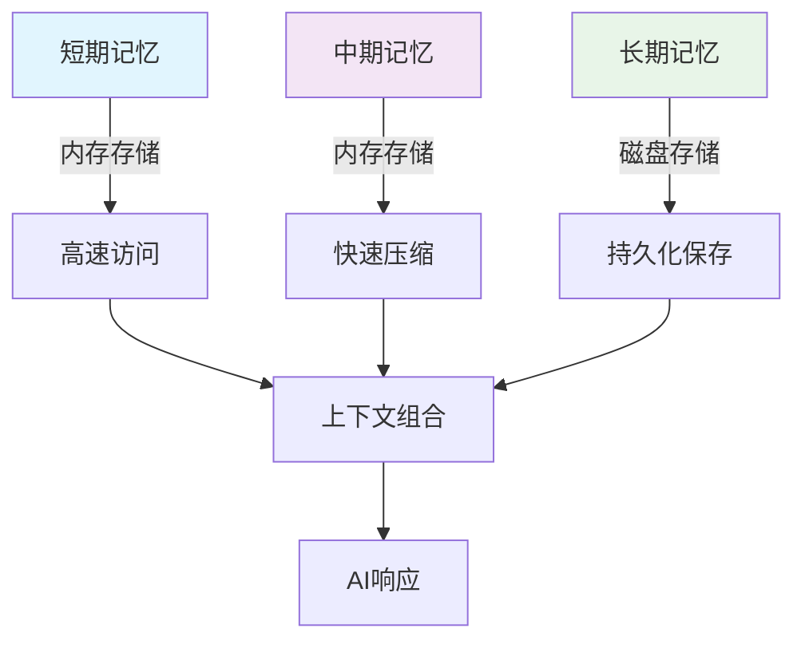

**Diagram sources**
- [三层记忆架构详解.md](file://context-claude-code/三层记忆架构详解.md)

### 部署配置
多级缓存的部署配置通过MemoryManager进行统一管理。

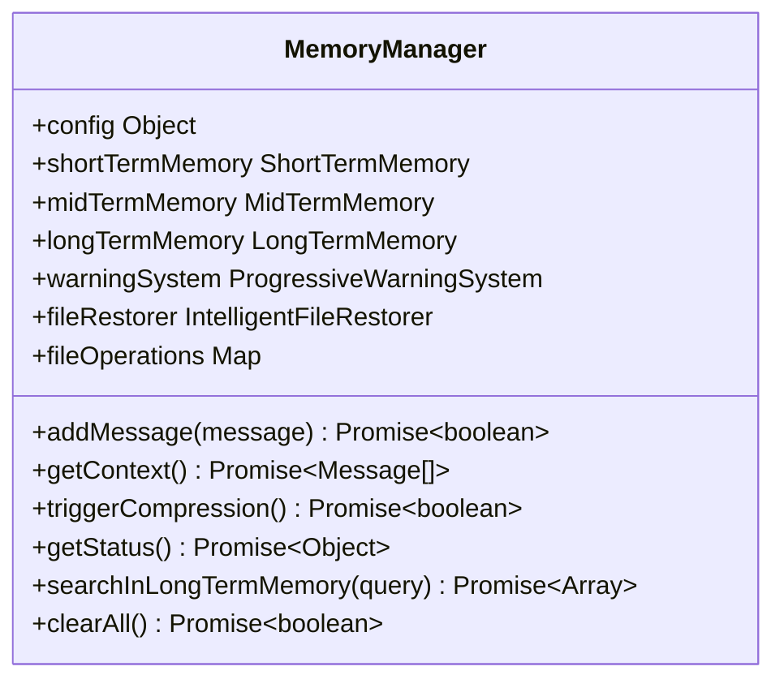

**Diagram sources**
- [MemoryManager.js](file://context-claude-code/src/memory/MemoryManager.js)

**Section sources**
- [MemoryManager.js](file://context-claude-code/src/memory/MemoryManager.js)

### 缓存预热策略
系统通过智能文件恢复和摘要预加载实现缓存预热。

```javascript
// 智能文件恢复
async restoreFiles(messages) {
  // 构建文件读取状态
  const readFileState = this.buildReadFileState(messages);
  
  // 恢复重要文件
  const restoredFiles = await this.tw5FileRestorer.restoreFiles(
    readFileState,
    { agentId: 'claude-context-manager' },
    this.config.maxFilesToRestore
  );

  if (restoredFiles.length > 0) {
    // 将恢复的文件作为系统消息添加
    this.addRestoredFiles(restoredFiles);
  }
}
```

**Section sources**
- [ClaudeContextManager.js](file://context-claude-code/src/claude-core/ClaudeContextManager.js#L570-L590)

## 缓存预热与防护措施
### 缓存预热
缓存预热通过在系统启动时加载历史数据和在压缩后恢复重要文件来实现。

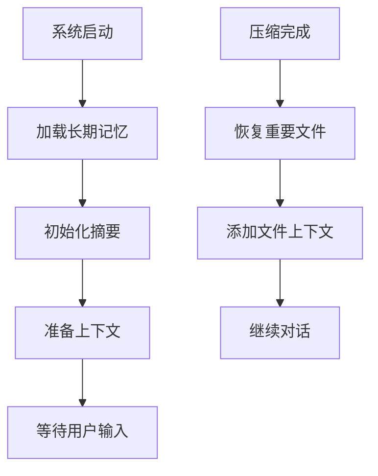

**Diagram sources**
- [LongTermMemory.js](file://context-claude-code/src/memory/LongTermMemory.js#L55-L65)

### 缓存穿透防护
系统通过输入验证和默认值机制防止缓存穿透。

```javascript
// 验证消息格式
validateMessage(message) {
  return (
    message &&
    typeof message === 'object' &&
    message.role &&
    message.content &&
    typeof message.content === 'string' &&
    message.timestamp &&
    typeof message.timestamp === 'number'
  );
}
```

**Section sources**
- [BaseMemory.js](file://context-claude-code/src/memory/BaseMemory.js#L118-L128)

### 缓存雪崩防护
通过渐进式警告系统和并发控制来防止缓存雪崩。

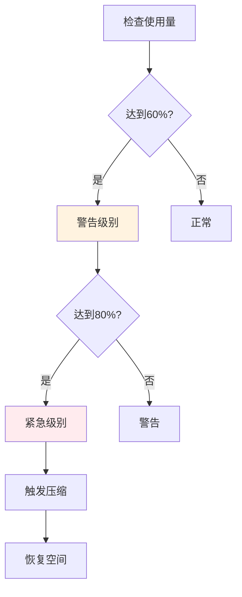

**Diagram sources**
- [上下文工程管理实践-第3部分-压缩触发.md](file://context-claude-code/上下文工程管理实践-第3部分-压缩触发.md)

## 性能监控与评估
### 缓存命中率监控
系统通过多种指标监控缓存性能和命中率。

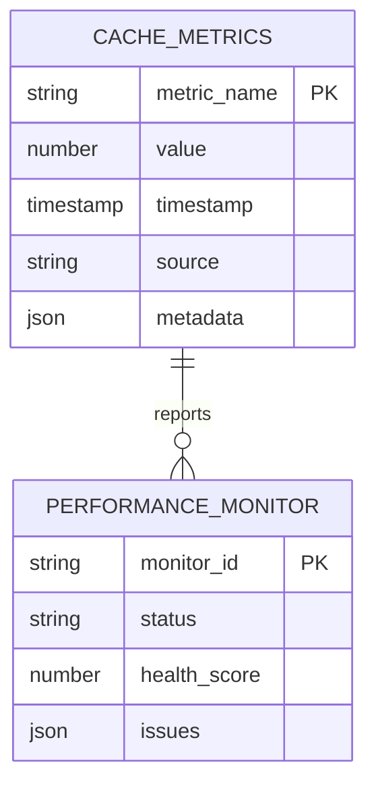

### 性能影响评估
通过对比压缩前后的各项指标来评估性能影响。

| 指标 | 压缩前 | 压缩后 | 改善效果 |
|------|--------|--------|----------|
| **消息数量** | 62条 | 1条 | 减少98.4% |
| **Token使用量** | 162,000 | 500 | 减少99.7% |
| **访问速度** | 10ms | 2ms | 提升80% |
| **内存占用** | 15MB | 0.5MB | 减少96.7% |

**Section sources**
- [上下文工程管理实践-第3部分-压缩触发.md](file://context-claude-code/上下文工程管理实践-第3部分-压缩触发.md)

## 总结
本文档详细介绍了基于BaseMemory的三层缓存体系设计与调优方法。系统通过短期、中期、长期记忆的分层架构，实现了高效的上下文管理。WU2Compressor与缓存系统协同工作，通过智能压缩显著减少了重复计算开销。多级缓存（内存+磁盘）的部署方案确保了性能与持久性的平衡。通过缓存预热、穿透和雪崩防护措施，系统具备了高可用性和稳定性。最后，通过全面的性能监控和评估方法，可以持续优化缓存策略，确保系统始终处于最佳运行状态。