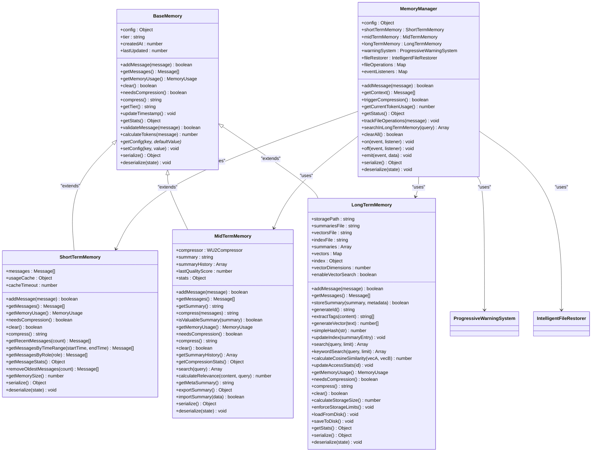
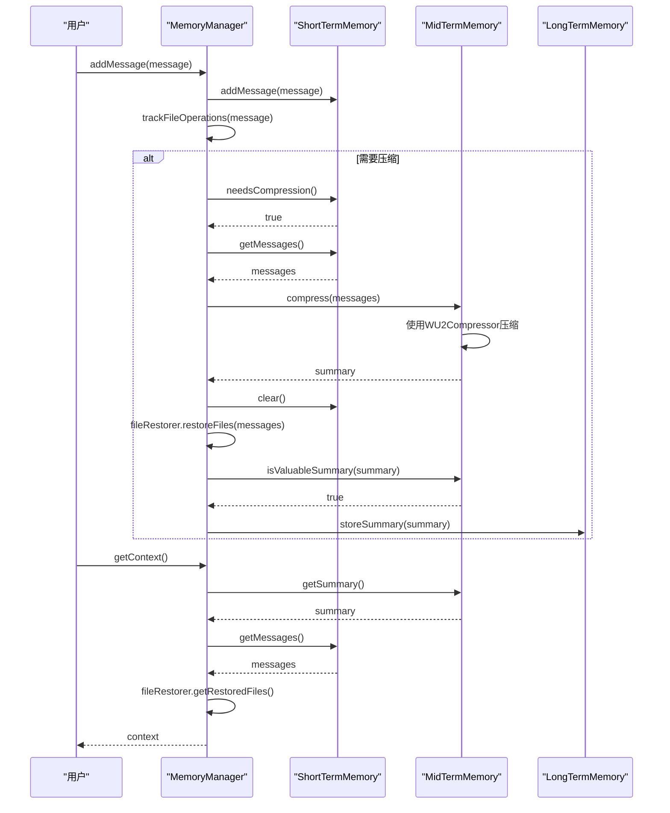

# 三层记忆架构

<cite>
**本文档引用文件**   
- [MemoryManager.js](file://context-claude-code/src/memory/MemoryManager.js)
- [ShortTermMemory.js](file://context-claude-code/src/memory/ShortTermMemory.js)
- [MidTermMemory.js](file://context-claude-code/src/memory/MidTermMemory.js)
- [LongTermMemory.js](file://context-claude-code/src/memory/LongTermMemory.js)
- [BaseMemory.js](file://context-claude-code/src/memory/BaseMemory.js)
- [EnhancedMemoryManager.js](file://context-claude-code/src/memory/EnhancedMemoryManager.js)
- [index.js](file://context-claude-code/src/index.js)
</cite>

## 目录
1. [简介](#简介)
2. [短期记忆](#短期记忆)
3. [中期记忆](#中期记忆)
4. [长期记忆](#长期记忆)
5. [记忆管理器](#记忆管理器)
6. [三层记忆架构UML类图](#三层记忆架构uml类图)
7. [上下文读写序列图](#上下文读写序列图)
8. [配置示例与性能调优](#配置示例与性能调优)
9. [结论](#结论)

## 简介
opencode的三层记忆架构是一种先进的上下文管理解决方案，模仿人类记忆系统的工作原理，通过短期、中期和长期三个层次的记忆协同工作，实现了高效、智能的上下文管理。该架构旨在解决大语言模型在处理长对话和复杂任务时面临的上下文窗口限制问题，通过智能压缩、持久化存储和跨会话知识复用，显著提升了AI助手的性能和用户体验。

短期记忆层负责在内存中高效管理当前会话的实时上下文，确保低延迟访问；中期记忆层利用智能压缩算法将短期记忆中的对话历史压缩为结构化摘要，实现跨会话的知识保留；长期记忆层则构建了一个持久化的知识库，存储有价值的摘要和经验，支持向量化搜索和跨项目知识复用。记忆管理器作为协调中枢，实现了三层记忆的无缝读写、数据同步、容量管理和过期策略。

本技术文档将深入阐述三层记忆架构的设计理念、实现机制和各自职责，提供UML类图和序列图展示各记忆层的类结构和交互流程，并包含来自代码库的实际配置示例和性能调优建议。

## 短期记忆
短期记忆（ShortTermMemory）是三层记忆架构中的第一层，负责在内存中高效管理当前会话的实时上下文。它类似于CPU的L1缓存，提供O(1)的访问效率，确保AI助手能够快速访问和处理最新的对话内容。短期记忆的主要职责是存储最近的对话消息，为AI的实时响应提供高速工作区。

短期记忆的实现基于`BaseMemory`抽象基类，通过一个消息队列（`messages`数组）来存储所有对话消息。为了优化性能，它采用了多种技术手段：首先，使用反向遍历算法（VE函数）从最新消息开始查找Token使用信息，因为usage数据通常在最近的AI回复中，这种反向查找能快速定位并计算总token数；其次，实现了智能过滤的三重检查机制（HY5函数），确保获取的Token使用信息是有效和准确的；最后，通过精确的Token计算（zY5函数），将输入、输出、缓存创建和缓存读取等所有类型的token都纳入计算范围，确保计算结果的完全准确。

短期记忆还实现了容量管理和自动压缩触发机制。当内存使用量达到预设的压缩阈值（默认92%）时，`needsCompression`方法会触发压缩流程。此外，它还提供了多种辅助功能，如文件操作跟踪、消息统计和内存大小计算，为上层系统提供全面的监控和管理能力。

**Section sources**
- [ShortTermMemory.js](file://context-claude-code/src/memory/ShortTermMemory.js#L12-L334)
- [BaseMemory.js](file://context-claude-code/src/memory/BaseMemory.js#L0-L193)

## 中期记忆
中期记忆（MidTermMemory）是三层记忆架构中的第二层，充当智能蒸馏器的角色，负责将短期记忆中的对话历史压缩为结构化摘要。它的主要职责是通过智能压缩算法，将大量的原始对话数据提炼为精华内容，实现跨会话的知识保留和高效存储。

中期记忆的实现同样基于`BaseMemory`抽象基类，其核心是`WU2Compressor`压缩器。当短期记忆的容量达到阈值时，记忆管理器会调用中期记忆的`compress`方法，将短期记忆中的消息列表传递给`WU2Compressor`进行处理。压缩过程遵循8段式结构化压缩指令（AU2函数），生成包含主要请求和意图、关键技术概念、文件和代码部分、问题解决等内容的摘要。

中期记忆不仅负责压缩，还对摘要的质量进行评估。`isValuableSummary`方法会检查摘要的长度和内容，确保只有包含关键信息（如"task"、"error"、"solution"等）的高质量摘要才会被保存到长期记忆中。此外，中期记忆还维护了一个摘要历史记录，用于跟踪每次压缩的结果和质量评分，并提供搜索功能，允许用户在当前和历史摘要中查找相关内容。

**Section sources**
- [MidTermMemory.js](file://context-claude-code/src/memory/MidTermMemory.js#L13-L411)
- [BaseMemory.js](file://context-claude-code/src/memory/BaseMemory.js#L0-L193)

## 长期记忆
长期记忆（LongTermMemory）是三层记忆架构中的第三层，作为一个持久化的知识库，负责存储有价值的摘要和经验，实现跨项目、跨用户的全局知识图谱。它的主要职责是将中期记忆生成的高质量摘要进行持久化存储，并支持高效的向量化搜索和关键词搜索。

长期记忆的实现基于`BaseMemory`抽象基类，使用文件系统作为持久化存储介质。它将摘要数据存储在指定的存储路径下，包括`summaries.json`（摘要文件）、`vectors.json`（向量文件）和`index.json`（索引文件）。为了支持智能搜索，长期记忆实现了向量化搜索功能，通过`generateVector`方法将文本内容转换为向量，并使用余弦相似度计算查询与摘要的相关性。

长期记忆还实现了自动整理和容量管理机制。当存储空间超过预设限制（默认100MB）时，`enforceStorageLimits`方法会根据LRU（最近最少使用）算法清理不重要的旧记录。此外，它还提供了标签提取功能，自动为每个摘要添加技术标签（如"React"、"Node.js"）和概念标签（如"error"、"solution"），便于后续的分类和检索。

**Section sources**
- [LongTermMemory.js](file://context-claude-code/src/memory/LongTermMemory.js#L14-L627)
- [BaseMemory.js](file://context-claude-code/src/memory/BaseMemory.js#L0-L193)

## 记忆管理器
记忆管理器（MemoryManager）是三层记忆架构的协调中枢，负责管理短期、中期和长期三个记忆层的协同工作。它作为统一的接口，对外提供添加消息、获取上下文、触发压缩等核心功能，实现了三层记忆的无缝读写、数据同步、容量管理和过期策略。

记忆管理器的构造函数初始化了三个记忆层实例，并根据配置启用了警告系统和文件恢复等辅助系统。`addMessage`方法是主要的写入接口，它首先将消息添加到短期记忆，然后跟踪文件操作，检查是否需要触发压缩，并评估警告状态。`getContext`方法是主要的读取接口，它组合中期记忆的摘要和短期记忆的消息，构建完整的上下文供AI使用。

当短期记忆的容量达到阈值时，`triggerCompression`方法会被调用，启动压缩流程：首先获取短期记忆的所有消息，然后调用中期记忆的`compress`方法生成摘要，清空短期记忆，执行智能文件恢复，并将有价值的摘要存储到长期记忆中。记忆管理器还提供了事件监听机制，允许外部系统订阅`messageAdded`、`compressionStarted`、`compressionCompleted`等事件，实现灵活的扩展和监控。

**Section sources**
- [MemoryManager.js](file://context-claude-code/src/memory/MemoryManager.js#L15-L365)
- [EnhancedMemoryManager.js](file://context-claude-code/src/memory/EnhancedMemoryManager.js#L41-L81)

## 三层记忆架构UML类图


**Diagram sources**
- [BaseMemory.js](file://context-claude-code/src/memory/BaseMemory.js#L0-L193)
- [ShortTermMemory.js](file://context-claude-code/src/memory/ShortTermMemory.js#L12-L334)
- [MidTermMemory.js](file://context-claude-code/src/memory/MidTermMemory.js#L13-L411)
- [LongTermMemory.js](file://context-claude-code/src/memory/LongTermMemory.js#L14-L627)
- [MemoryManager.js](file://context-claude-code/src/memory/MemoryManager.js#L15-L365)

## 上下文读写序列图


**Diagram sources**
- [MemoryManager.js](file://context-claude-code/src/memory/MemoryManager.js#L15-L365)
- [ShortTermMemory.js](file://context-claude-code/src/memory/ShortTermMemory.js#L12-L334)
- [MidTermMemory.js](file://context-claude-code/src/memory/MidTermMemory.js#L13-L411)
- [LongTermMemory.js](file://context-claude-code/src/memory/LongTermMemory.js#L14-L627)

## 配置示例与性能调优
opencode的三层记忆架构提供了丰富的配置选项，允许用户根据具体需求进行定制和优化。以下是一些关键的配置示例和性能调优建议：

### 基础配置示例
```javascript
import { createMemoryManager } from './src/index.js';

const manager = createMemoryManager({
  maxTokens: 200000,
  compressionThreshold: 0.92,
  enableWarningSystem: true,
  enableFileRestoration: true,
  
  shortTermMemory: {
    maxTokens: 200000,
    compressionThreshold: 0.92,
    cacheTimeout: 5000
  },
  
  midTermMemory: {
    compression: {
      minFidelityScore: 80,
      maxCompressionRatio: 0.15,
      enableQualityValidation: true
    }
  },
  
  longTermMemory: {
    storagePath: './memory-storage',
    maxStorageSize: 100 * 1024 * 1024,
    enableVectorSearch: true
  },
  
  warningSystem: {
    thresholds: {
      warning: 0.6,
      urgent: 0.8,
      critical: 0.92
    },
    warningCooldown: 300000
  },
  
  fileRestoration: {
    maxFiles: 20,
    maxTokensPerFile: 8192,
    totalTokenLimit: 32768
  }
});
```

### 性能调优建议
1. **调整压缩阈值**：根据实际使用场景调整`compressionThreshold`，在保证性能的同时最大化上下文利用率。
2. **优化缓存策略**：适当调整`cacheTimeout`，平衡缓存命中率和数据新鲜度。
3. **控制存储大小**：合理设置`maxStorageSize`，避免长期记忆占用过多磁盘空间。
4. **启用向量化搜索**：对于需要频繁搜索的场景，启用`enableVectorSearch`以提高搜索效率。
5. **监控系统状态**：定期调用`getStatus`方法，监控各层记忆的使用情况和系统健康状态。

**Section sources**
- [index.js](file://context-claude-code/src/index.js#L99-L146)
- [MemoryManager.js](file://context-claude-code/src/memory/MemoryManager.js#L15-L365)

## 结论
opencode的三层记忆架构通过短期、中期和长期三个层次的记忆协同工作，实现了高效、智能的上下文管理。短期记忆提供了高速的实时上下文访问，中期记忆通过智能压缩实现了跨会话的知识保留，长期记忆则构建了一个持久化的知识库，支持跨项目、跨用户的全局知识复用。记忆管理器作为协调中枢，实现了三层记忆的无缝读写、数据同步、容量管理和过期策略。

该架构的设计理念先进，实现机制完善，不仅解决了大语言模型在处理长对话和复杂任务时面临的上下文窗口限制问题，还通过智能压缩、持久化存储和向量化搜索等技术手段，显著提升了AI助手的性能和用户体验。通过合理的配置和性能调优，用户可以根据具体需求定制和优化记忆系统，充分发挥其潜力。

未来，该架构可以进一步扩展，例如引入更先进的向量化模型、支持多模态数据的存储和检索、实现更智能的自动摘要生成等，为AI助手的发展提供更强大的支持。